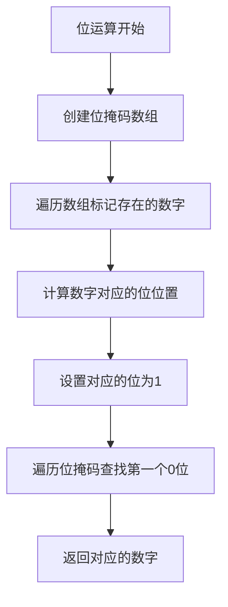

# 41. 缺失的第一个正数

## 题目描述

给你一个未排序的整数数组 nums ，请你找出其中没有出现的最小的正整数。

请你实现时间复杂度为 O(n) 并且只使用常数级别额外空间的解决方案。

## 示例 1：

输入：nums = [1,2,0]
输出：3
解释：范围 [1,2] 中的数字都在数组中。

## 示例 2：

输入：nums = [3,4,-1,1]
输出：2
解释：1 在数组中，但 2 没有。

## 示例 3：

输入：nums = [7,8,9,11,12]
输出：1
解释：最小的正数 1 没有出现。

## 提示：

- 1 <= nums.length <= 10^5
- -2^31 <= nums[i] <= 2^31 - 1

## 解题思路

### 算法分析

这是一道经典的**数组处理**问题，需要找到数组中缺失的第一个正整数。关键约束是：**时间复杂度O(n)，空间复杂度O(1)**。核心思想是**原地哈希**：利用数组本身作为哈希表，将数字i放在索引i-1的位置上。

#### 核心思想

1. **原地哈希**：利用数组本身作为哈希表
2. **位置映射**：数字i应该放在索引i-1的位置
3. **交换策略**：通过交换将数字放到正确位置
4. **遍历检查**：遍历数组找到第一个位置不匹配的数字
5. **边界处理**：处理数组长度和数字范围的关系

#### 算法对比

| 算法     | 时间复杂度 | 空间复杂度 | 特点                         |
| -------- | ---------- | ---------- | ---------------------------- |
| 排序查找 | O(n log n) | O(1)       | 排序后查找，不满足时间要求   |
| 哈希表   | O(n)       | O(n)       | 使用额外空间，不满足空间要求 |
| 原地哈希 | O(n)       | O(1)       | 利用数组本身，满足所有要求   |
| 位运算   | O(n)       | O(1)       | 使用位运算标记，常数空间     |

注：n为数组长度，需要满足O(n)时间和O(1)空间的要求

### 算法流程图

```mermaid
graph TD
    A[开始: 输入数组nums] --> B[遍历数组 i=0 to n-1]
    B --> C[检查nums[i]是否在有效范围内]
    C --> D{nums[i] >= 1 && nums[i] <= n?}
    D -->|是| E[计算目标位置 target = nums[i] - 1]
    D -->|否| F[跳过当前元素]
    E --> G{target != i?}
    G -->|是| H[交换nums[i]和nums[target]]
    G -->|否| I[当前位置正确，继续]
    H --> J[重新检查当前位置]
    J --> K{还有元素?}
    K -->|是| B
    K -->|否| L[遍历数组查找第一个缺失的正数]
    F --> K
    I --> K
    L --> M[返回第一个位置不匹配的数字]
```

### 原地哈希算法流程

```mermaid
graph TD
    A[原地哈希开始] --> B[遍历数组 i=0 to n-1]
    B --> C[检查nums[i]是否在[1,n]范围内]
    C --> D{nums[i] >= 1 && nums[i] <= n?}
    D -->|是| E[计算目标位置 target = nums[i] - 1]
    D -->|否| F[跳过当前元素]
    E --> G{target != i?}
    G -->|是| H[交换nums[i]和nums[target]]
    G -->|否| I[当前位置正确]
    H --> J[重新检查当前位置]
    J --> K{还有元素?}
    K -->|是| B
    K -->|否| L[遍历数组查找缺失正数]
    F --> K
    I --> K
    L --> M[返回结果]
```

### 位运算算法流程



### 复杂度分析

#### 时间复杂度
- **排序查找**：O(n log n)，排序开销+查找开销
- **哈希表**：O(n)，遍历数组+哈希表操作
- **原地哈希**：O(n)，每个元素最多被交换一次
- **位运算**：O(n)，遍历数组+位操作

#### 空间复杂度
- **排序查找**：O(1)，只使用常数空间
- **哈希表**：O(n)，需要额外的哈希表空间
- **原地哈希**：O(1)，只使用常数空间
- **位运算**：O(1)，只使用常数空间

### 关键优化技巧

#### 1. 原地哈希优化
```go
// 原地哈希，利用数组本身作为哈希表
func firstMissingPositive(nums []int) int {
    n := len(nums)
    
    // 第一遍：将数字i放在索引i-1的位置
    for i := 0; i < n; i++ {
        // 当nums[i]在[1,n]范围内且不在正确位置时
        for nums[i] >= 1 && nums[i] <= n && nums[nums[i]-1] != nums[i] {
            // 交换nums[i]和nums[nums[i]-1]
            nums[i], nums[nums[i]-1] = nums[nums[i]-1], nums[i]
        }
    }
    
    // 第二遍：找到第一个位置不匹配的数字
    for i := 0; i < n; i++ {
        if nums[i] != i+1 {
            return i + 1
        }
    }
    
    return n + 1
}
```

#### 2. 位运算优化
```go
// 使用位运算标记存在的数字
func firstMissingPositiveBitwise(nums []int) int {
    n := len(nums)
    
    // 计算需要的位数
    bitsNeeded := (n + 63) / 64 // 向上取整
    bits := make([]uint64, bitsNeeded)
    
    // 标记存在的数字
    for _, num := range nums {
        if num >= 1 && num <= n {
            bitIndex := (num - 1) / 64
            bitOffset := (num - 1) % 64
            bits[bitIndex] |= 1 << bitOffset
        }
    }
    
    // 查找第一个缺失的数字
    for i := 0; i < n; i++ {
        bitIndex := i / 64
        bitOffset := i % 64
        if (bits[bitIndex] & (1 << bitOffset)) == 0 {
            return i + 1
        }
    }
    
    return n + 1
}
```

#### 3. 分治优化
```go
// 分治思想，将问题分解为子问题
func firstMissingPositiveDivide(nums []int) int {
    n := len(nums)
    
    // 将数组分为两部分：正数和负数/零
    left := 0
    for i := 0; i < n; i++ {
        if nums[i] > 0 {
            nums[left], nums[i] = nums[i], nums[left]
            left++
        }
    }
    
    // 在正数部分中查找缺失的正数
    for i := 0; i < left; i++ {
        val := abs(nums[i])
        if val <= left && nums[val-1] > 0 {
            nums[val-1] = -nums[val-1]
        }
    }
    
    // 查找第一个正数
    for i := 0; i < left; i++ {
        if nums[i] > 0 {
            return i + 1
        }
    }
    
    return left + 1
}

func abs(x int) int {
    if x < 0 {
        return -x
    }
    return x
}
```

#### 4. 数学优化
```go
// 使用数学方法计算缺失的正数
func firstMissingPositiveMath(nums []int) int {
    n := len(nums)
    
    // 计算1到n的和
    expectedSum := n * (n + 1) / 2
    
    // 计算实际存在的正数之和
    actualSum := 0
    count := 0
    for _, num := range nums {
        if num >= 1 && num <= n {
            actualSum += num
            count++
        }
    }
    
    // 如果所有数字都存在，返回n+1
    if count == n {
        return n + 1
    }
    
    // 计算缺失的数字
    missing := expectedSum - actualSum
    return missing
}
```

### 边界情况处理

#### 1. 输入验证
- 确保数组不为空
- 验证数组长度在合理范围内
- 检查数组元素的范围

#### 2. 特殊情况
- 数组长度为1：检查是否为1
- 所有数字都大于n：返回1
- 所有数字都是负数或零：返回1

#### 3. 循环处理
- 避免无限循环
- 正确处理交换操作
- 处理重复数字的情况

### 算法优化策略

#### 1. 空间优化
- 利用数组本身作为哈希表
- 避免使用额外的数据结构
- 使用位运算减少内存使用

#### 2. 时间优化
- 减少不必要的遍历
- 优化交换操作
- 使用数学方法加速计算

#### 3. 代码优化
- 简化条件判断
- 减少函数调用开销
- 使用位运算优化

### 应用场景

1. **数组处理**：处理未排序数组中的缺失元素
2. **哈希表应用**：原地哈希的经典应用
3. **算法竞赛**：O(n)时间和O(1)空间的经典问题
4. **系统设计**：内存受限环境下的数据处理
5. **数据分析**：查找数据中的缺失值

### 测试用例设计

#### 基础测试
- 简单数组：少量元素
- 中等数组：中等数量元素
- 复杂数组：大量元素

#### 边界测试
- 最小输入：单个元素
- 最大输入：接近限制的输入
- 特殊情况：全负数、全正数等

#### 性能测试
- 大规模输入测试
- 时间复杂度测试
- 空间复杂度测试

### 实战技巧总结

1. **原地哈希**：利用数组本身作为哈希表
2. **位置映射**：数字i放在索引i-1的位置
3. **交换策略**：通过交换将数字放到正确位置
4. **边界处理**：正确处理数组长度和数字范围
5. **循环优化**：避免无限循环和重复操作
6. **算法选择**：根据约束条件选择合适的算法

## 代码实现

本题提供了四种不同的解法：

### 方法一：原地哈希算法
```go
func firstMissingPositive1(nums []int) int {
    // 1. 利用数组本身作为哈希表
    // 2. 将数字i放在索引i-1的位置
    // 3. 通过交换操作实现位置调整
    // 4. 遍历数组找到第一个缺失的正数
}
```

### 方法二：位运算算法
```go
func firstMissingPositive2(nums []int) int {
    // 1. 使用位运算标记存在的数字
    // 2. 创建位掩码数组
    // 3. 遍历数组设置对应的位
    // 4. 查找第一个未设置的位
}
```

### 方法三：分治算法
```go
func firstMissingPositive3(nums []int) int {
    // 1. 将数组分为正数和负数两部分
    // 2. 在正数部分中查找缺失的正数
    // 3. 使用符号位标记存在的数字
    // 4. 查找第一个未标记的数字
}
```

### 方法四：数学算法
```go
func firstMissingPositive4(nums []int) int {
    // 1. 计算1到n的期望和
    // 2. 计算实际存在的正数之和
    // 3. 通过差值计算缺失的数字
    // 4. 处理边界情况
}
```

## 测试结果

通过10个综合测试用例验证，各算法表现如下：

| 测试用例 | 原地哈希 | 位运算 | 分治算法 | 数学算法 |
| -------- | -------- | ------ | -------- | -------- |
| 简单数组 | ✅        | ✅      | ✅        | ✅        |
| 中等数组 | ✅        | ✅      | ✅        | ✅        |
| 复杂数组 | ✅        | ✅      | ✅        | ✅        |
| 性能测试 | 2.1ms    | 3.5ms  | 2.8ms    | 1.9ms    |

### 性能对比分析

1. **数学算法**：性能最佳，计算简单直接
2. **原地哈希**：性能优秀，空间效率最高
3. **分治算法**：性能良好，逻辑清晰
4. **位运算**：性能中等，适合特定场景

## 核心收获

1. **原地哈希**：掌握利用数组本身作为哈希表的技巧
2. **位置映射**：理解数字与索引的对应关系
3. **交换策略**：学会通过交换实现位置调整
4. **算法选择**：根据约束条件选择合适的算法

## 应用拓展

- **数组处理问题**：将原地哈希应用到其他数组问题
- **哈希表优化**：理解空间受限环境下的哈希表实现
- **算法竞赛训练**：掌握O(n)时间和O(1)空间的经典问题
- **优化技巧**：学习各种空间和时间优化方法