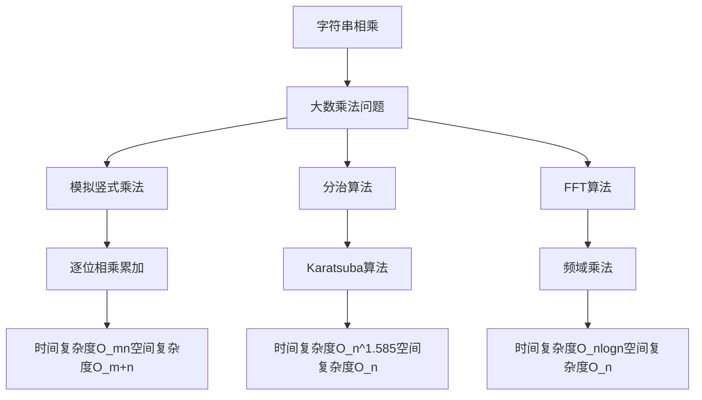
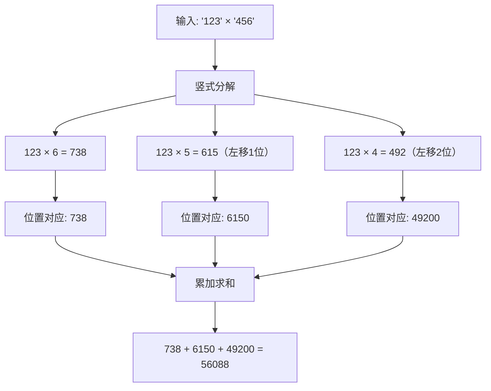
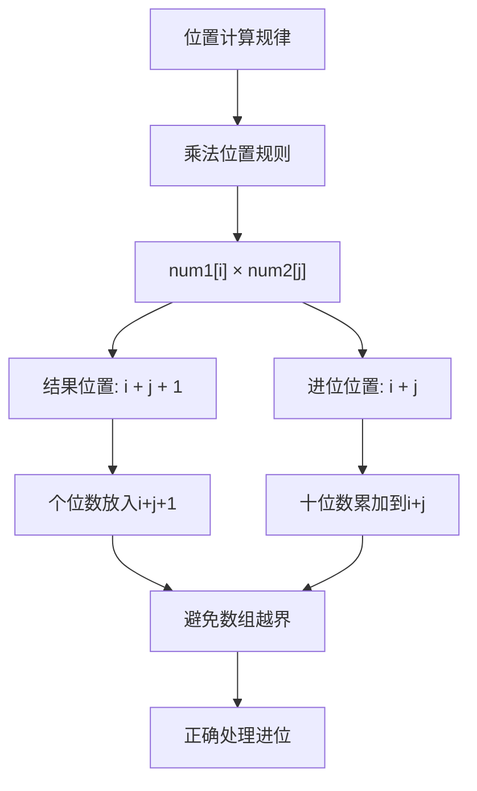
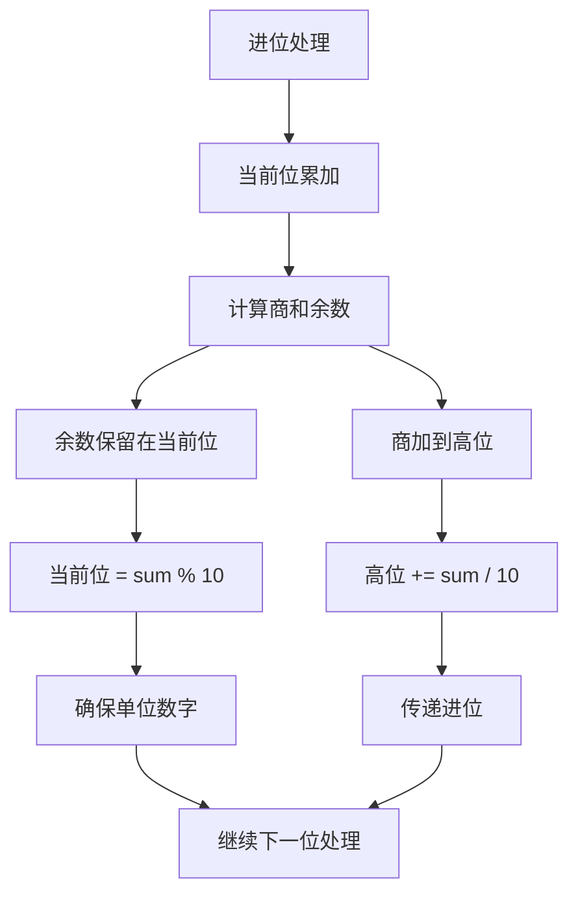
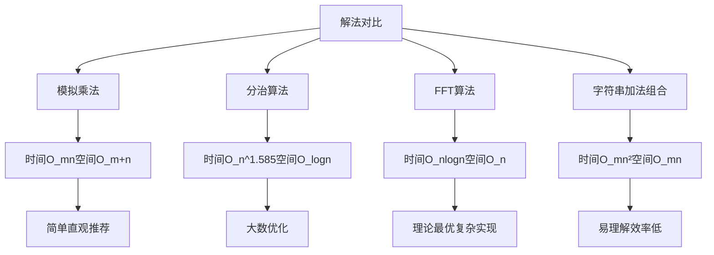
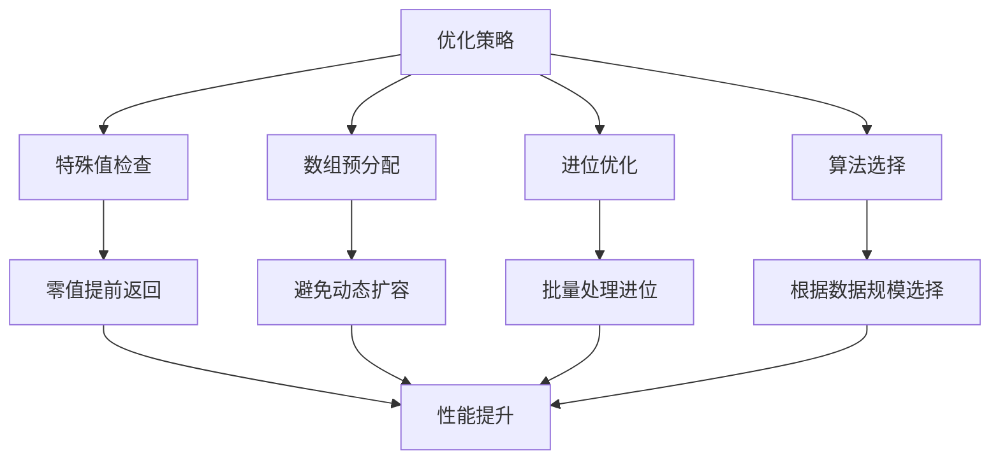
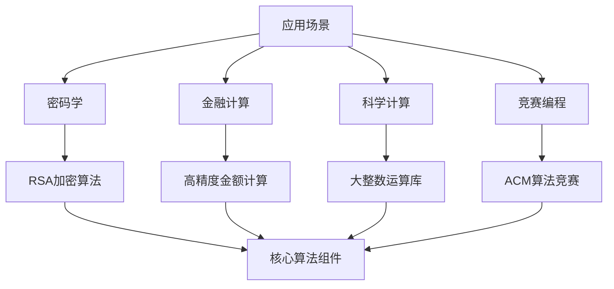
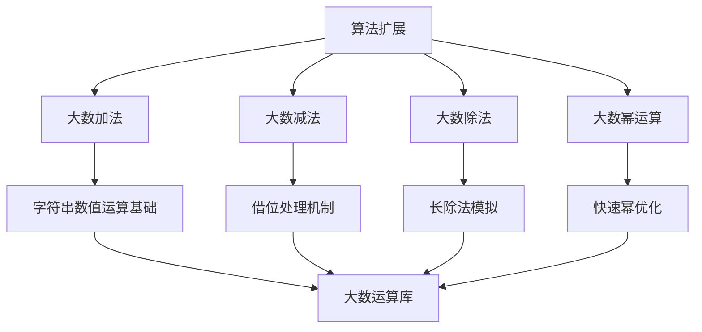
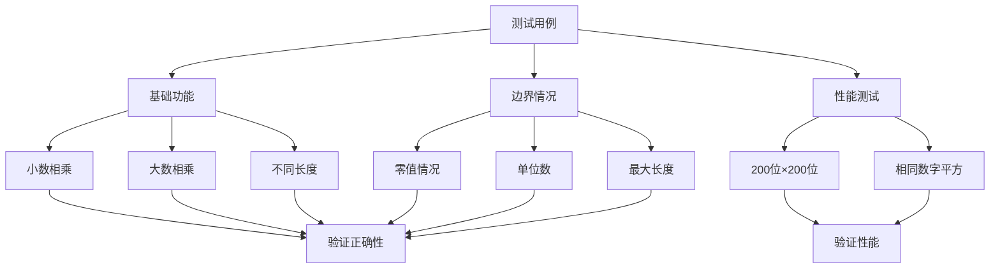
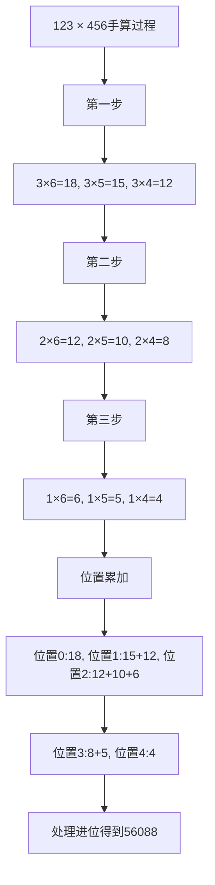

# 43. 字符串相乘

## 描述

给定两个以字符串形式表示的非负整数 num1 和 num2，返回 num1 和 num2 的乘积，它们的乘积也表示为字符串形式。

注意：不能使用任何内置的 BigInteger 库或直接将输入转换为整数。

## 示例 1

输入: num1 = "2", num2 = "3"
输出: "6"

## 示例 2

输入: num1 = "123", num2 = "456"
输出: "56088"

## 提示

- 1 <= num1.length, num2.length <= 200
- num1 和 num2 只能由数字组成。
- num1 和 num2 都不包含任何前导零，除了数字0本身。

## 解题思路

### 算法分析

这道题是**大数乘法**和**模拟手算乘法**的经典应用。主要解法包括：

1. **模拟乘法法**：模拟小学乘法竖式运算过程
2. **分治乘法法**：使用Karatsuba算法进行分治
3. **FFT乘法法**：使用快速傅里叶变换（复杂度最优但实现复杂）
4. **逐位相乘法**：每一位分别相乘后处理进位

### 问题本质分析



### 模拟乘法算法详解

```mermaid
flowchart TD
    A[输入num1和num2] --> B[处理特殊情况]
    B --> C{是否包含0}
    C -->|是| D[返回"0"]
    C -->|否| E[初始化结果数组]
    
    E --> F[双重循环遍历]
    F --> G[计算单位乘积]
    G --> H[累加到对应位置]
    H --> I[处理进位]
    
    I --> J[继续下一位]
    J --> K{是否完成所有位}
    K -->|否| F
    K -->|是| L[处理最终进位]
    
    L --> M[转换为字符串]
    M --> N[去除前导零]
    N --> O[返回结果]
```

### 乘法竖式过程演示



### 位置索引计算规则



### 算法流程图

```mermaid
flowchart TD
    A[开始] --> B[特殊情况检查]
    B --> C{num1或num2为"0"}
    C -->|是| D[返回"0"]
    C -->|否| E[创建结果数组]
    
    E --> F[外层循环i: num1从右到左]
    F --> G[内层循环j: num2从右到左]
    G --> H[计算乘积: digit1 × digit2]
    
    H --> I[累加到result[i+j+1]]
    I --> J[处理进位到result[i+j]]
    J --> K{内层循环结束?}
    
    K -->|否| G
    K -->|是| L{外层循环结束?}
    L -->|否| F
    L -->|是| M[构造结果字符串]
    
    M --> N[跳过前导零]
    N --> O[返回结果]
```

### 进位处理机制



### 各种解法对比



### Karatsuba分治算法

```mermaid
flowchart TD
    A[Karatsuba算法] --> B[分割数字]
    B --> C[x = x1×10^m + x0]
    B --> D[y = y1×10^m + y0]
    
    C --> E[递归计算]
    D --> E
    E --> F[z0 = x0 × y0]
    E --> G[z2 = x1 × y1]
    E --> H[z1 = (x0+x1) × (y0+y1) - z0 - z2]
    
    F --> I[组合结果]
    G --> I
    H --> I
    I --> J[result = z2×10^2m + z1×10^m + z0]
```

### 边界情况处理

```mermaid
graph TD
    A[边界情况] --> B[零值处理]
    A --> C[单位数字]
    A --> D[极大数字]
    A --> E[相同数字]
    
    B --> F["0" × 任何数 = "0"]
    C --> G[直接计算后转字符串]
    D --> H[200位×200位=400位]
    E --> I[数字平方运算]
    
    F --> J[提前返回优化]
    G --> J
    H --> K[数组容量预分配]
    I --> K
```

### 时间复杂度分析

- **模拟乘法**：O(m×n)，m和n分别为两数字长度
- **Karatsuba**：O(n^log₂3) ≈ O(n^1.585)
- **FFT乘法**：O(n log n)，n为较大数字长度
- **字符串累加**：O(m×n²)，效率最低

### 空间复杂度分析

- **模拟乘法**：O(m+n)，结果数组空间
- **Karatsuba**：O(log n)，递归栈空间
- **FFT乘法**：O(n)，变换数组空间
- **字符串累加**：O(m×n)，中间结果存储

### 关键优化点



### 实际应用场景



### 算法扩展



### 测试用例设计



### 代码实现要点

1. **数组索引设计**：
   - 结果数组长度为m+n
   - 乘法位置计算：i+j和i+j+1
   - 从右到左处理数字

2. **进位处理逻辑**：
   - 先累加所有同位置的乘积
   - 再统一处理进位
   - 避免重复进位计算

3. **边界条件处理**：
   - 零值特殊处理
   - 前导零移除
   - 数组越界检查

4. **性能优化技巧**：
   - 预分配数组容量
   - 减少字符串操作
   - 选择合适的算法

### 手算验证示例



这个问题的关键在于**理解乘法竖式的计算规律**和**掌握进位处理的机制**，通过模拟手算过程实现高精度的字符串乘法运算。

