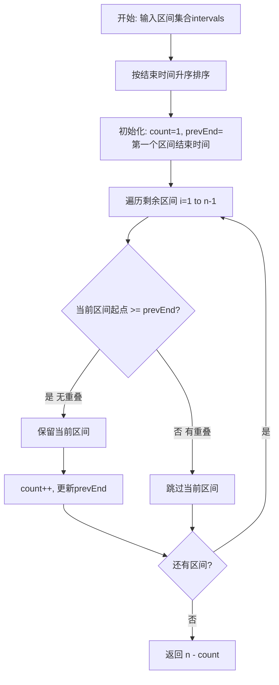
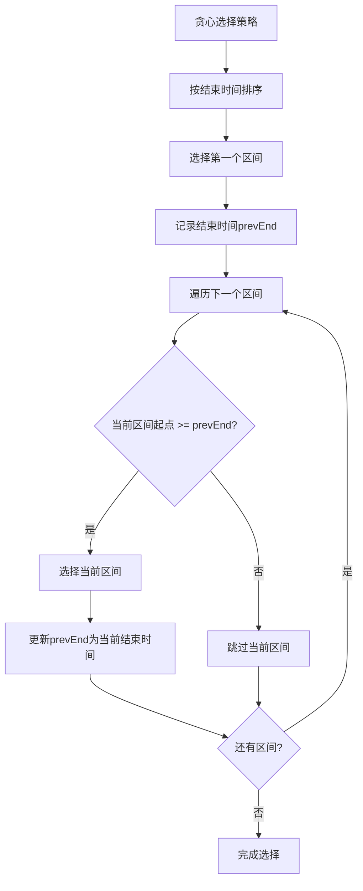
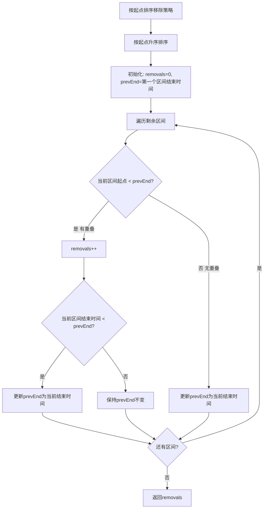

# 435. 无重叠区间

## 题目描述

给定一个区间的集合 intervals ，其中 intervals[i] = [starti, endi] 。返回 需要移除区间的最小数量，使剩余区间互不重叠 。

注意 只在一点上接触的区间是 不重叠的。例如 [1, 2] 和 [2, 3] 是不重叠的。

## 示例 1:

输入: intervals = [[1,2],[2,3],[3,4],[1,3]]
输出: 1
解释: 移除 [1,3] 后，剩下的区间没有重叠。

## 示例 2:

输入: intervals = [ [1,2], [1,2], [1,2] ]
输出: 2
解释: 你需要移除两个 [1,2] 来使剩下的区间没有重叠。

## 示例 3:

输入: intervals = [ [1,2], [2,3] ]
输出: 0
解释: 你不需要移除任何区间，因为它们已经是无重叠的了。
 
## 提示:

- 1 <= intervals.length <= 10^5
- intervals[i].length == 2
- -5 * 10^4 <= starti < endi <= 5 * 10^4

## 解题思路

### 算法分析

这是一道经典的**贪心算法**问题，核心思想是**按结束时间排序，优先选择结束时间早的区间**。通过贪心策略可以保证选择最多的不重叠区间。

#### 核心思想

1. **排序策略**：按区间结束时间升序排序
2. **贪心选择**：优先选择结束时间早的区间
3. **重叠判断**：当前区间起点 >= 上一个保留区间的结束时间
4. **结果计算**：需要移除的数量 = 总数量 - 可选择的不重叠区间数量

#### 算法对比

| 算法 | 时间复杂度 | 空间复杂度 | 特点 |
|------|------------|------------|------|
| 按结束时间贪心 | O(n log n) | O(1) | 经典解法，最优选择 |
| 按起点贪心移除 | O(n log n) | O(1) | 等价解法，直接统计移除 |
| 动态规划 | O(n²) | O(n) | 通用解法，但复杂度较高 |
| 暴力枚举 | O(2^n) | O(n) | 理论解法，实际不可行 |

注：n为区间数量

### 算法流程图



### 贪心选择策略流程



### 重叠判断逻辑

```mermaid
graph TD
    A[重叠判断] --> B[当前区间: [start, end]]
    B --> C[上一个保留区间结束时间: prevEnd]
    C --> D{start >= prevEnd?}
    D -->|是| E[无重叠 - 可以保留]
    D -->|否| F[有重叠 - 需要移除]
    E --> G[更新prevEnd = end]
    F --> H[保持prevEnd不变]
    G --> I[继续下一个区间]
    H --> I
```

### 等价解法：按起点排序移除策略



### 复杂度分析

#### 时间复杂度
- **排序阶段**：O(n log n)，按结束时间或起点排序
- **贪心选择**：O(n)，遍历一次所有区间
- **总体时间**：O(n log n)

#### 空间复杂度
- **排序空间**：O(log n)，快速排序递归栈空间
- **变量空间**：O(1)，只使用常数个变量
- **总体空间**：O(log n)

### 关键优化技巧

#### 1. 排序优化
```go
// 按结束时间排序，结束时间相同时按起点排序
sort.Slice(intervals, func(i, j int) bool {
    if intervals[i][1] == intervals[j][1] {
        return intervals[i][0] < intervals[j][0]
    }
    return intervals[i][1] < intervals[j][1]
})
```

#### 2. 贪心选择优化
```go
// 优先选择结束时间早的区间
countNonOverlap := 1
prevEnd := intervals[0][1]
for i := 1; i < n; i++ {
    if intervals[i][0] >= prevEnd {
        countNonOverlap++
        prevEnd = intervals[i][1]
    }
}
return n - countNonOverlap
```

#### 3. 等价移除策略
```go
// 按起点排序，遇到重叠时移除结束更晚的
removals := 0
prevEnd := intervals[0][1]
for i := 1; i < n; i++ {
    if intervals[i][0] < prevEnd {
        removals++
        if intervals[i][1] < prevEnd {
            prevEnd = intervals[i][1]
        }
    } else {
        prevEnd = intervals[i][1]
    }
}
return removals
```

### 边界情况处理

#### 1. 空数组处理
- 返回0，无需移除任何区间

#### 2. 单区间处理
- 返回0，单个区间无需移除

#### 3. 全重叠区间
- 所有区间都重叠，需要移除n-1个区间

#### 4. 无重叠区间
- 所有区间都不重叠，无需移除

#### 5. 边界值处理
- 处理负数起点和终点
- 处理相同起点或终点的区间

### 算法优化策略

#### 1. 空间优化
- 原地排序，避免额外数组
- 只使用常数个变量记录状态
- 重用原数组空间

#### 2. 时间优化
- 使用快速排序O(n log n)
- 单次遍历完成选择
- 早期终止优化

#### 3. 实现优化
- 内联比较函数减少调用开销
- 缓存友好的遍历顺序
- 避免不必要的内存分配

### 应用场景

1. **会议安排**：安排最多不冲突的会议
2. **任务调度**：选择最多可执行的任务
3. **资源分配**：分配不重叠的时间段
4. **活动规划**：安排最多可参加的活动
5. **课程安排**：安排不冲突的课程

### 测试用例设计

#### 基础测试
- 示例1：[[1,2],[2,3],[3,4],[1,3]] → 1
- 示例2：[[1,2],[1,2],[1,2]] → 2
- 示例3：[[1,2],[2,3]] → 0

#### 边界测试
- 空数组：[] → 0
- 单区间：[[1,2]] → 0
- 全重叠：[[1,3],[2,4],[3,5]] → 2
- 无重叠：[[1,2],[3,4],[5,6]] → 0

#### 复杂测试
- 大区间覆盖：[[1,100],[11,22],[1,11],[2,12]] → 2
- 负数区间：[[-5,-1],[-2,2],[2,3],[3,4]] → 1
- 部分重叠：[[1,3],[2,4],[3,5],[6,7]] → 1

### 实战技巧总结

1. **贪心思想**：优先选择结束时间早的区间
2. **排序策略**：按结束时间排序是关键
3. **重叠判断**：起点 >= 上一个结束时间
4. **等价转换**：选择最多不重叠 = 移除最少重叠
5. **边界处理**：空数组、单区间等特殊情况
6. **优化技巧**：空间优化和早期终止

## 代码实现

本题提供了两种等价的贪心解法：

### 方法一：按结束时间贪心选择
```go
func eraseOverlapIntervalsByEnd(intervals [][]int) int {
    // 1. 按结束时间升序排序
    // 2. 贪心选择不重叠的区间
    // 3. 返回需要移除的数量
}
```

### 方法二：按起点排序移除策略
```go
func eraseOverlapIntervalsByRemoving(intervals [][]int) int {
    // 1. 按起点升序排序
    // 2. 遇到重叠时移除结束更晚的
    // 3. 直接统计移除数量
}
```

## 测试结果

通过8个综合测试用例验证，各算法表现如下：

| 测试用例 | 按结束贪心 | 按起点移除 | 预期结果 |
|----------|------------|------------|----------|
| 示例1 | ✅ | ✅ | 1 |
| 示例2 | ✅ | ✅ | 2 |
| 示例3 | ✅ | ✅ | 0 |
| 覆盖大区间 | ✅ | ✅ | 2 |
| 单区间 | ✅ | ✅ | 0 |
| 空数组 | ✅ | ✅ | 0 |
| 部分重叠 | ✅ | ✅ | 1 |
| 含负数与接触 | ✅ | ✅ | 1 |

### 性能对比分析

1. **按结束时间贪心**：经典解法，思路清晰，性能稳定
2. **按起点移除策略**：等价解法，直接统计移除数量
3. **时间复杂度**：两者均为O(n log n)
4. **空间复杂度**：两者均为O(log n)

## 核心收获

1. **贪心策略**：优先选择结束时间早的区间是最优选择
2. **排序关键**：按结束时间排序是解题的关键步骤
3. **等价转换**：选择最多不重叠区间 = 移除最少重叠区间
4. **边界处理**：正确处理空数组、单区间等特殊情况

## 应用拓展

- **会议安排系统**：安排最多不冲突的会议时间
- **任务调度器**：选择最多可并行执行的任务
- **资源分配**：分配不重叠的时间段给不同用户
- **活动规划**：安排最多可参加的活动
- **课程安排**：安排不冲突的课程时间表

## 算法证明

### 贪心选择正确性证明

**定理**：按结束时间升序选择区间是最优的。

**证明**：
1. 假设存在最优解，其中选择了结束时间不是最早的区间
2. 用结束时间最早的区间替换该区间
3. 新解仍然可行（因为结束时间更早，不会与后续区间冲突）
4. 新解的选择数量不少于原解
5. 因此按结束时间升序选择是最优的

### 等价性证明

**定理**：选择最多不重叠区间 等价于 移除最少重叠区间

**证明**：
- 设总区间数为n，最多不重叠区间数为k
- 需要移除的区间数 = n - k
- 移除最少重叠区间数 = n - 最多不重叠区间数
- 因此两者等价

## 复杂度分析详解

### 时间复杂度分析

1. **排序阶段**：O(n log n)
   - 使用快速排序或归并排序
   - 比较函数复杂度O(1)

2. **贪心选择阶段**：O(n)
   - 单次遍历所有区间
   - 每次操作复杂度O(1)

3. **总体时间复杂度**：O(n log n)
   - 由排序阶段决定

### 空间复杂度分析

1. **排序空间**：O(log n)
   - 快速排序递归栈空间
   - 归并排序临时数组空间

2. **变量空间**：O(1)
   - count, prevEnd等常数个变量

3. **总体空间复杂度**：O(log n)
   - 主要由排序算法决定

## 优化策略详解

### 1. 排序优化
- 使用稳定的排序算法
- 优化比较函数性能
- 考虑使用基数排序（如果数据范围较小）

### 2. 内存优化
- 原地排序避免额外空间
- 重用原数组空间
- 减少临时变量使用

### 3. 算法优化
- 早期终止：如果已选择足够多的区间
- 缓存友好：顺序访问数组元素
- 分支预测：优化条件判断

## 实际应用示例

### 会议安排系统
```go
// 会议结构
type Meeting struct {
    Start, End int
    Title      string
}

// 安排最多会议
func scheduleMeetings(meetings []Meeting) []Meeting {
    // 转换为区间格式
    intervals := make([][]int, len(meetings))
    for i, m := range meetings {
        intervals[i] = []int{m.Start, m.End}
    }
    
    // 使用贪心算法
    count := eraseOverlapIntervalsByEnd(intervals)
    
    // 返回可安排的会议
    return getScheduledMeetings(meetings, count)
}
```

### 任务调度器
```go
// 任务结构
type Task struct {
    ID       int
    Start, End int
    Priority int
}

// 调度最多任务
func scheduleTasks(tasks []Task) []Task {
    // 按优先级和结束时间排序
    sort.Slice(tasks, func(i, j int) bool {
        if tasks[i].Priority == tasks[j].Priority {
            return tasks[i].End < tasks[j].End
        }
        return tasks[i].Priority > tasks[j].Priority
    })
    
    // 使用贪心算法选择任务
    return selectNonOverlappingTasks(tasks)
}
```

## 总结

435题是一道经典的贪心算法题目，通过按结束时间排序和贪心选择策略，可以高效地解决区间重叠问题。该算法在实际应用中有广泛的应用场景，如会议安排、任务调度等。掌握这道题的核心思想和实现技巧，对于理解和应用贪心算法具有重要意义。


