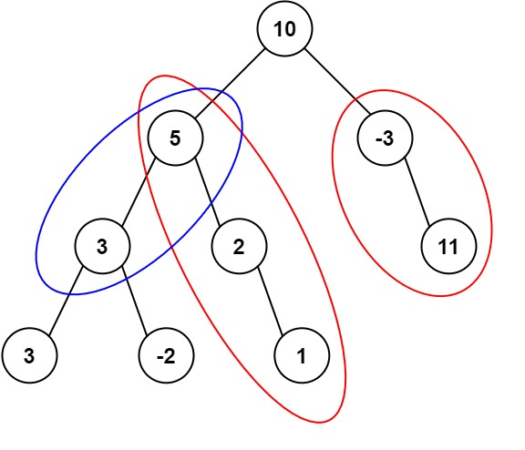
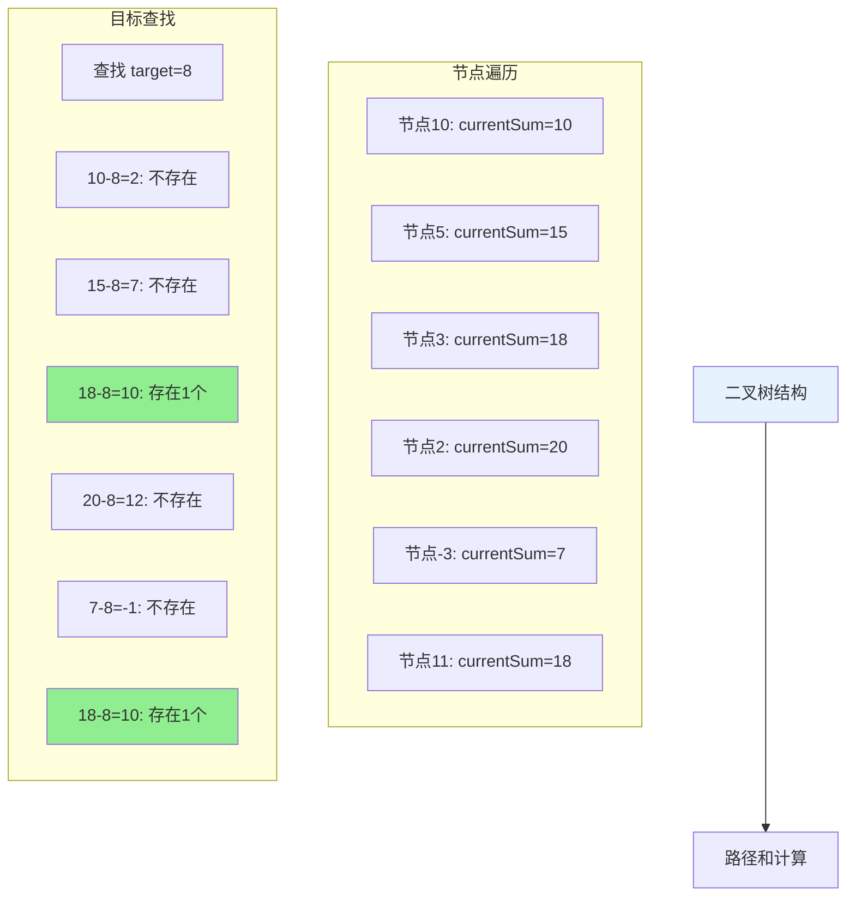
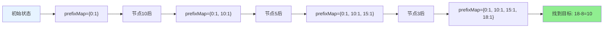

# 437. 路径总和 III

## 描述

给定一个二叉树的根节点 root ，和一个整数 targetSum ，求该二叉树里节点值之和等于 targetSum 的 路径 的数目。

路径 不需要从根节点开始，也不需要在叶子节点结束，但是路径方向必须是向下的（只能从父节点到子节点）。

## 示例 1



输入：root = [10,5,-3,3,2,null,11,3,-2,null,1], targetSum = 8
输出：3
解释：和等于 8 的路径有 3 条，如图所示。

## 示例 2

输入：root = [5,4,8,11,null,13,4,7,2,null,null,5,1], targetSum = 22
输出：3

## 示例 3

输入：root = [1,-2,-3,1,3,-2,null,-1], targetSum = -1
输出：4

## 提示

- 二叉树的节点个数的范围是 [0,1000]
- -10^9 <= Node.val <= 10^9 
- -1000 <= targetSum <= 1000 

## 解题思路

### 方法一：前缀和 + 哈希表（推荐）

```mermaid
graph TD
    A[开始: root=[10,5,-3,3,2,null,11,3,-2,null,1], targetSum=8] --> B[初始化: prefixMap={0:1}]
    B --> C[DFS遍历: 节点10]
    C --> D[currentSum=10, 查找 10-8=2, 不存在]
    D --> E[prefixMap[10]++]
    E --> F[DFS左子树: 节点5]
    F --> G[currentSum=15, 查找 15-8=7, 不存在]
    G --> H[prefixMap[15]++]
    H --> I[DFS左子树: 节点3]
    I --> J[currentSum=18, 查找 18-8=10, 存在1个]
    J --> K[count++]
    K --> L[prefixMap[18]++]
    L --> M[继续遍历...]
    M --> N[返回总count]
    
    style N fill:#90EE90
    style A fill:#E6F3FF
    style B fill:#FFF2CC
```

### 二叉树路径和计算



### 前缀和哈希表状态



**核心思想**：
- 使用前缀和记录从根节点到当前节点的路径和
- 利用哈希表记录每个前缀和出现的次数
- 对于当前节点，查找前缀和为 `currentSum - targetSum` 的个数

**算法步骤**：
1. 使用DFS遍历二叉树
2. 维护从根节点到当前节点的前缀和
3. 对于每个节点，查找哈希表中 `currentSum - targetSum` 的个数
4. 将当前前缀和加入哈希表，递归处理子节点
5. 回溯时从哈希表中移除当前前缀和

**时间复杂度**：O(n)，其中n是节点个数
**空间复杂度**：O(h)，其中h是树的高度

### 方法二：双重DFS

**核心思想**：
- 对每个节点，以该节点为起点进行DFS
- 统计所有以该节点为起点的路径和等于targetSum的个数

**算法步骤**：
1. 外层DFS遍历所有节点
2. 内层DFS以当前节点为起点，统计路径和
3. 当路径和等于targetSum时，计数器加1

**时间复杂度**：O(n²)，最坏情况下
**空间复杂度**：O(h)

### 方法三：递归回溯

**核心思想**：
- 使用递归遍历所有可能的路径
- 维护当前路径的和，当等于targetSum时计数

**时间复杂度**：O(n²)
**空间复杂度**：O(h)

## 代码实现

```go
// 前缀和 + 哈希表解法
func pathSum(root *TreeNode, targetSum int) int {
    prefixMap := make(map[int]int)
    prefixMap[0] = 1 // 初始化，空路径的前缀和为0
    return dfs(root, 0, targetSum, prefixMap)
}

func dfs(node *TreeNode, currentSum, targetSum int, prefixMap map[int]int) int {
    if node == nil {
        return 0
    }
    
    currentSum += node.Val
    count := prefixMap[currentSum-targetSum] // 查找目标前缀和的个数
    
    prefixMap[currentSum]++ // 将当前前缀和加入哈希表
    
    // 递归处理左右子树
    count += dfs(node.Left, currentSum, targetSum, prefixMap)
    count += dfs(node.Right, currentSum, targetSum, prefixMap)
    
    prefixMap[currentSum]-- // 回溯，移除当前前缀和
    
    return count
}
```

## 复杂度分析

| 方法          | 时间复杂度 | 空间复杂度 | 适用场景     |
| ------------- | ---------- | ---------- | ------------ |
| 前缀和+哈希表 | O(n)       | O(h)       | 推荐，最优解 |
| 双重DFS       | O(n²)      | O(h)       | 简单理解     |
| 递归回溯      | O(n²)      | O(h)       | 基础解法     |

## 算法图解

```
示例1: root = [10,5,-3,3,2,null,11,3,-2,null,1], targetSum = 8

路径和计算过程:
节点10: currentSum=10, 查找10-8=2, 不存在
节点5:  currentSum=15, 查找15-8=7, 不存在  
节点3:  currentSum=18, 查找18-8=10, 存在1个
节点2:  currentSum=20, 查找20-8=12, 不存在
节点-3: currentSum=7,  查找7-8=-1, 不存在
节点11: currentSum=18, 查找18-8=10, 存在1个

结果: 3
```

## 测试用例

```go
func main() {
    // 测试用例1
    root1 := buildTree([]interface{}{10,5,-3,3,2,nil,11,3,-2,nil,1})
    targetSum1 := 8
    fmt.Printf("测试用例1: targetSum=%d, 结果=%d\n", targetSum1, pathSum(root1, targetSum1))
    
    // 测试用例2
    root2 := buildTree([]interface{}{5,4,8,11,nil,13,4,7,2,nil,nil,5,1})
    targetSum2 := 22
    fmt.Printf("测试用例2: targetSum=%d, 结果=%d\n", targetSum2, pathSum(root2, targetSum2))
    
    // 边界测试
    root3 := buildTree([]interface{}{1})
    targetSum3 := 1
    fmt.Printf("边界测试1: targetSum=%d, 结果=%d\n", targetSum3, pathSum(root3, targetSum3))
}
```
