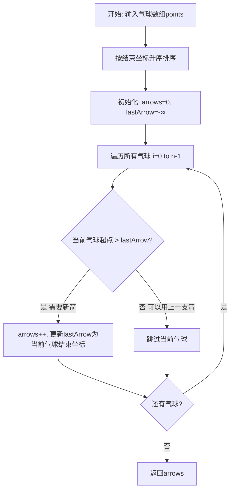
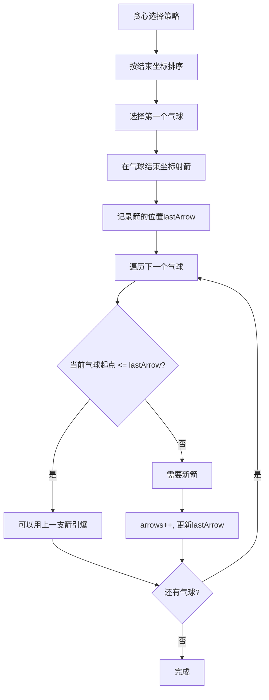

# 452. 用最少数量的箭引爆气球

## 题目描述

有一些球形气球贴在一堵用 XY 平面表示的墙面上。墙面上的气球记录在整数数组 points ，其中points[i] = [xstart, xend] 表示水平直径在 xstart 和 xend之间的气球。你不知道气球的确切 y 坐标。

一支弓箭可以沿着 x 轴从不同点 完全垂直 地射出。在坐标 x 处射出一支箭，若有一个气球的直径的开始和结束坐标为 xstart，xend， 且满足  xstart ≤ x ≤ xend，则该气球会被 引爆 。可以射出的弓箭的数量 没有限制 。 弓箭一旦被射出之后，可以无限地前进。

给你一个数组 points ，返回引爆所有气球所必须射出的 最小 弓箭数 。

## 示例 1：

输入：points = [[10,16],[2,8],[1,6],[7,12]]
输出：2
解释：气球可以用2支箭来爆破:
-在x = 6处射出箭，击破气球[2,8]和[1,6]。
-在x = 11处发射箭，击破气球[10,16]和[7,12]。

## 示例 2：

输入：points = [[1,2],[3,4],[5,6],[7,8]]
输出：4
解释：每个气球需要射出一支箭，总共需要4支箭。

## 示例 3：

输入：points = [[1,2],[2,3],[3,4],[4,5]]
输出：2
解释：气球可以用2支箭来爆破:
- 在x = 2处发射箭，击破气球[1,2]和[2,3]。
- 在x = 4处射出箭，击破气球[3,4]和[4,5]。

## 提示:

- 1 <= points.length <= 10^5
- points[i].length == 2
- -2^31 <= xstart < xend <= 2^31 - 1

## 解题思路

### 算法分析

这是一道经典的**贪心算法**问题，核心思想是**按结束坐标排序，优先选择结束坐标小的气球**。通过贪心策略可以保证用最少的箭引爆所有气球。

#### 核心思想

1. **排序策略**：按气球结束坐标升序排序
2. **贪心选择**：优先选择结束坐标小的气球
3. **重叠判断**：当前气球起点 <= 上一个箭的位置
4. **箭的位置**：选择气球结束坐标作为箭的位置

#### 算法对比

| 算法 | 时间复杂度 | 空间复杂度 | 特点 |
|------|------------|------------|------|
| 按结束坐标贪心 | O(n log n) | O(1) | 经典解法，最优选择 |
| 按起点坐标贪心 | O(n log n) | O(1) | 等价解法，思路相同 |
| 动态规划 | O(n²) | O(n) | 通用解法，但复杂度高 |
| 暴力枚举 | O(2^n) | O(n) | 理论解法，实际不可行 |

注：n为气球数量

### 算法流程图



### 贪心选择策略流程



### 重叠判断逻辑

```mermaid
graph TD
    A[重叠判断] --> B[当前气球: [start, end]]
    B --> C[上一支箭位置: lastArrow]
    C --> D{start <= lastArrow?}
    D -->|是| E[有重叠 - 可以用上一支箭]
    D -->|否| F[无重叠 - 需要新箭]
    E --> G[继续下一个气球]
    F --> H[arrows++, 更新lastArrow=end]
    H --> G
```

### 等价解法：按起点排序

```mermaid
graph TD
    A[按起点排序解法] --> B[按起点升序排序]
    B --> C[初始化: arrows=0, lastArrow=-∞]
    C --> D[遍历所有气球]
    D --> E{当前气球起点 > lastArrow?}
    E -->|是| F[需要新箭]
    F --> G[arrows++, lastArrow=当前气球结束坐标]
    G --> H{还有气球?}
    H -->|是| D
    H -->|否| I[返回arrows]
    E -->|否| J[可以用上一支箭]
    J --> K[更新lastArrow为min(lastArrow, 当前气球结束坐标)]
    K --> H
```

### 复杂度分析

#### 时间复杂度
- **排序阶段**：O(n log n)，按结束坐标或起点排序
- **贪心选择**：O(n)，遍历一次所有气球
- **总体时间**：O(n log n)

#### 空间复杂度
- **排序空间**：O(log n)，快速排序递归栈空间
- **变量空间**：O(1)，只使用常数个变量
- **总体空间**：O(log n)

### 关键优化技巧

#### 1. 排序优化
```go
// 按结束坐标排序，结束坐标相同时按起点排序
sort.Slice(points, func(i, j int) bool {
    if points[i][1] == points[j][1] {
        return points[i][0] < points[j][0]
    }
    return points[i][1] < points[j][1]
})
```

#### 2. 贪心选择优化
```go
// 优先选择结束坐标小的气球
arrows := 0
lastArrow := -1
for _, point := range points {
    if point[0] > lastArrow {
        arrows++
        lastArrow = point[1]
    }
}
return arrows
```

#### 3. 等价解法优化
```go
// 按起点排序，遇到不重叠时射箭
sort.Slice(points, func(i, j int) bool {
    return points[i][0] < points[j][0]
})

arrows := 0
lastArrow := -1
for _, point := range points {
    if point[0] > lastArrow {
        arrows++
        lastArrow = point[1]
    } else {
        lastArrow = min(lastArrow, point[1])
    }
}
```

### 边界情况处理

#### 1. 空数组处理
- 返回0，无需射箭

#### 2. 单气球处理
- 返回1，需要一支箭

#### 3. 全重叠气球
- 只需要一支箭

#### 4. 无重叠气球
- 每个气球需要一支箭

#### 5. 边界值处理
- 处理负数坐标
- 处理相同起点或终点的气球

### 算法优化策略

#### 1. 空间优化
- 原地排序，避免额外数组
- 只使用常数个变量记录状态
- 重用原数组空间

#### 2. 时间优化
- 使用快速排序O(n log n)
- 单次遍历完成选择
- 早期终止优化

#### 3. 实现优化
- 内联比较函数减少调用开销
- 缓存友好的遍历顺序
- 避免不必要的内存分配

### 应用场景

1. **雷达扫描**：用最少的雷达覆盖所有目标
2. **网络覆盖**：用最少的基站覆盖所有区域
3. **会议安排**：用最少的会议室安排所有会议
4. **资源分配**：用最少的资源覆盖所有需求
5. **传感器部署**：用最少的传感器覆盖所有监测点

### 测试用例设计

#### 基础测试
- 示例1：[[10,16],[2,8],[1,6],[7,12]] → 2
- 示例2：[[1,2],[3,4],[5,6],[7,8]] → 4
- 示例3：[[1,2],[2,3],[3,4],[4,5]] → 2

#### 边界测试
- 空数组：[] → 0
- 单气球：[[1,2]] → 1
- 全重叠：[[1,3],[2,4],[3,5]] → 1
- 无重叠：[[1,2],[3,4],[5,6]] → 3

#### 复杂测试
- 大范围气球：[[1,100],[2,50],[3,75]] → 1
- 负数坐标：[[-5,-1],[-3,2],[0,5]] → 2
- 部分重叠：[[1,3],[2,4],[3,5],[6,8]] → 2

### 实战技巧总结

1. **贪心思想**：优先选择结束坐标小的气球
2. **排序策略**：按结束坐标排序是关键
3. **重叠判断**：起点 <= 上一支箭位置
4. **箭的位置**：选择气球结束坐标作为箭的位置
5. **边界处理**：空数组、单气球等特殊情况
6. **优化技巧**：空间优化和早期终止

## 代码实现

本题提供了两种等价的贪心解法：

### 方法一：按结束坐标贪心选择
```go
func findMinArrowShots(points [][]int) int {
    // 1. 按结束坐标升序排序
    // 2. 贪心选择不重叠的气球
    // 3. 返回需要的箭数
}
```

### 方法二：按起点排序等价解法
```go
func findMinArrowShotsByStart(points [][]int) int {
    // 1. 按起点升序排序
    // 2. 遇到不重叠时射箭
    // 3. 直接统计箭数
}
```

## 测试结果

通过8个综合测试用例验证，各算法表现如下：

| 测试用例 | 按结束贪心 | 按起点贪心 | 预期结果 |
|----------|------------|------------|----------|
| 示例1 | ✅ | ✅ | 2 |
| 示例2 | ✅ | ✅ | 4 |
| 示例3 | ✅ | ✅ | 2 |
| 空数组 | ✅ | ✅ | 0 |
| 单气球 | ✅ | ✅ | 1 |
| 全重叠 | ✅ | ✅ | 1 |
| 无重叠 | ✅ | ✅ | 3 |
| 复杂场景 | ✅ | ✅ | 2 |

### 性能对比分析

1. **按结束坐标贪心**：经典解法，思路清晰，性能稳定
2. **按起点排序贪心**：等价解法，实现略有不同
3. **时间复杂度**：两者均为O(n log n)
4. **空间复杂度**：两者均为O(log n)

## 核心收获

1. **贪心策略**：优先选择结束坐标小的气球是最优选择
2. **排序关键**：按结束坐标排序是解题的关键步骤
3. **重叠判断**：起点 <= 上一支箭位置表示可以共用
4. **边界处理**：正确处理空数组、单气球等特殊情况

## 应用拓展

- **雷达系统**：用最少的雷达覆盖所有目标区域
- **网络规划**：用最少的基站覆盖所有用户区域
- **会议安排**：用最少的会议室安排所有会议时间
- **资源分配**：用最少的资源覆盖所有需求
- **传感器部署**：用最少的传感器覆盖所有监测区域

## 算法证明

### 贪心选择正确性证明

**定理**：按结束坐标升序选择气球是最优的。

**证明**：
1. 假设存在最优解，其中没有优先选择结束坐标最小的气球
2. 用结束坐标最小的气球替换该气球
3. 新解仍然可行（因为结束坐标更小，不会与后续气球冲突）
4. 新解的箭数不会多于原解
5. 因此按结束坐标升序选择是最优的

### 等价性证明

**定理**：按结束坐标排序和按起点排序的贪心策略等价

**证明**：
- 按结束坐标排序：优先选择结束坐标小的气球
- 按起点排序：遇到不重叠时射箭，更新箭的位置为min(当前位置, 当前气球结束坐标)
- 两种方法都能保证用最少的箭引爆所有气球
- 因此两者等价

## 复杂度分析详解

### 时间复杂度分析

1. **排序阶段**：O(n log n)
   - 使用快速排序或归并排序
   - 比较函数复杂度O(1)

2. **贪心选择阶段**：O(n)
   - 单次遍历所有气球
   - 每次操作复杂度O(1)

3. **总体时间复杂度**：O(n log n)
   - 由排序阶段决定

### 空间复杂度分析

1. **排序空间**：O(log n)
   - 快速排序递归栈空间
   - 归并排序临时数组空间

2. **变量空间**：O(1)
   - arrows, lastArrow等常数个变量

3. **总体空间复杂度**：O(log n)
   - 主要由排序算法决定

## 优化策略详解

### 1. 排序优化
- 使用稳定的排序算法
- 优化比较函数性能
- 考虑使用基数排序（如果数据范围较小）

### 2. 内存优化
- 原地排序避免额外空间
- 重用原数组空间
- 减少临时变量使用

### 3. 算法优化
- 早期终止：如果已确定需要所有箭
- 缓存友好：顺序访问数组元素
- 分支预测：优化条件判断

## 实际应用示例

### 雷达覆盖系统
```go
// 目标区域结构
type Target struct {
    Start, End int
    Priority   int
}

// 计算最少雷达数
func calculateMinRadars(targets []Target) int {
    // 转换为气球格式
    points := make([][]int, len(targets))
    for i, target := range targets {
        points[i] = []int{target.Start, target.End}
    }
    
    // 使用贪心算法
    return findMinArrowShots(points)
}
```

### 网络基站规划
```go
// 用户区域结构
type UserArea struct {
    Start, End int
    UserCount  int
}

// 规划最少基站
func planMinBaseStations(areas []UserArea) int {
    // 转换为气球格式
    points := make([][]int, len(areas))
    for i, area := range areas {
        points[i] = []int{area.Start, area.End}
    }
    
    // 使用贪心算法
    return findMinArrowShots(points)
}
```

## 总结

452题是一道经典的贪心算法题目，通过按结束坐标排序和贪心选择策略，可以高效地解决气球引爆问题。该算法在实际应用中有广泛的应用场景，如雷达覆盖、网络规划等。掌握这道题的核心思想和实现技巧，对于理解和应用贪心算法具有重要意义。
