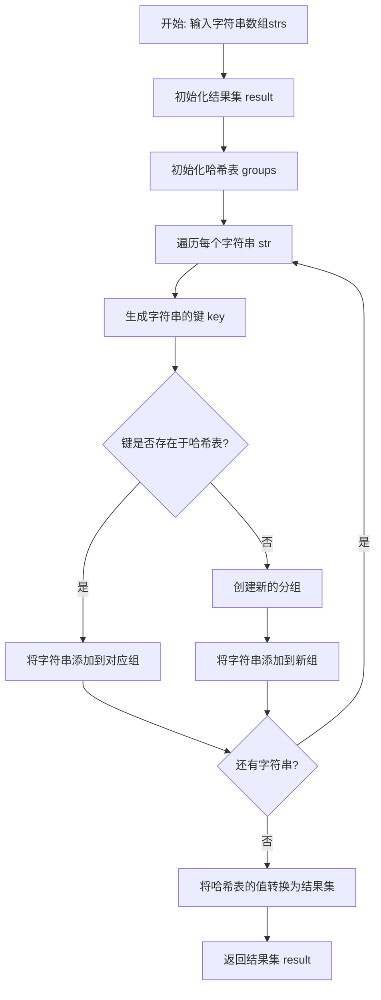
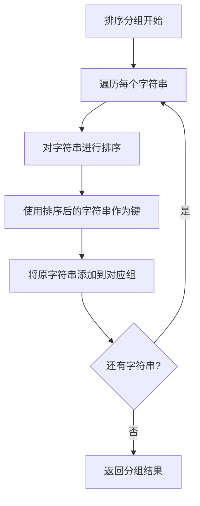
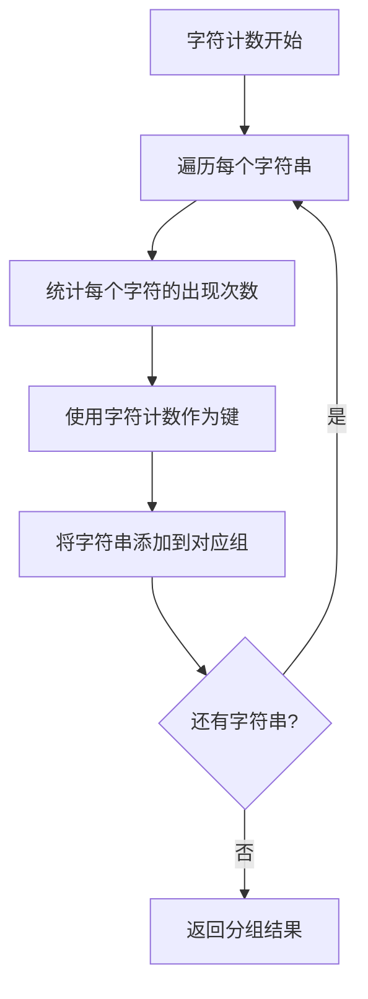
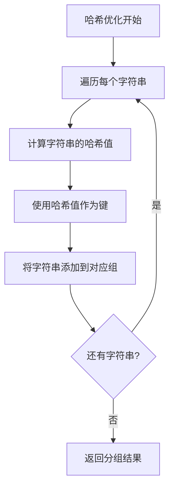
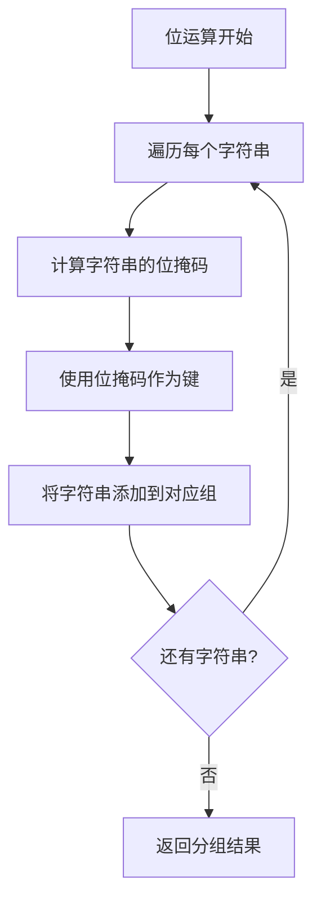

# 49. 字母异位词分组

## 题目描述

给你一个字符串数组，请你将 字母异位词 组合在一起。可以按任意顺序返回结果列表。

## 示例 1:

输入: strs = ["eat", "tea", "tan", "ate", "nat", "bat"]

输出: [["bat"],["nat","tan"],["ate","eat","tea"]]

解释：

在 strs 中没有字符串可以通过重新排列来形成 "bat"。
字符串 "nat" 和 "tan" 是字母异位词，因为它们可以重新排列以形成彼此。
字符串 "ate" ，"eat" 和 "tea" 是字母异位词，因为它们可以重新排列以形成彼此。

## 示例 2:

输入: strs = [""]

输出: [[""]]

## 示例 3:

输入: strs = ["a"]

输出: [["a"]]


## 提示：

- 1 <= strs.length <= 104
- 0 <= strs[i].length <= 100
- strs[i] 仅包含小写字母

## 解题思路

### 算法分析

这是一道经典的**字符串分组**问题，需要将字母异位词（由相同字母组成但顺序不同的字符串）分组在一起。核心思想是**哈希映射**：通过某种方式将字母异位词映射到相同的键，然后使用哈希表进行分组。

#### 核心思想

1. **哈希映射**：将字母异位词映射到相同的键
2. **分组操作**：使用哈希表将相同键的字符串分组
3. **键的生成**：通过排序、计数或位运算生成唯一键
4. **结果构建**：将分组结果转换为所需格式
5. **优化策略**：选择最高效的键生成方法

#### 算法对比

| 算法     | 时间复杂度 | 空间复杂度 | 特点                   |
| -------- | ---------- | ---------- | ---------------------- |
| 排序分组 | O(nklogk)  | O(nk)      | 最直观的解法，逻辑清晰 |
| 字符计数 | O(nk)      | O(nk)      | 效率最高，避免排序开销 |
| 哈希优化 | O(nk)      | O(nk)      | 使用哈希表优化查找     |
| 位运算   | O(nk)      | O(nk)      | 使用位运算优化空间使用 |

注：n为字符串数组长度，k为字符串平均长度

### 算法流程图



### 排序分组流程



### 字符计数流程



### 哈希优化流程



### 位运算流程



### 复杂度分析

#### 时间复杂度
- **排序分组**：O(nklogk)，需要对每个字符串排序
- **字符计数**：O(nk)，只需要遍历每个字符一次
- **哈希优化**：O(nk)，哈希计算和查找
- **位运算**：O(nk)，位运算计算

#### 空间复杂度
- **所有算法**：O(nk)，需要存储所有字符串和分组结果

### 关键优化技巧

#### 1. 排序分组优化
```go
// 排序分组解法
func groupAnagramsSort(strs []string) [][]string {
    groups := make(map[string][]string)
    
    for _, str := range strs {
        // 排序字符串
        sorted := sortString(str)
        groups[sorted] = append(groups[sorted], str)
    }
    
    // 转换为结果格式
    result := make([][]string, 0, len(groups))
    for _, group := range groups {
        result = append(result, group)
    }
    
    return result
}

func sortString(s string) string {
    runes := []rune(s)
    sort.Slice(runes, func(i, j int) bool {
        return runes[i] < runes[j]
    })
    return string(runes)
}
```

#### 2. 字符计数优化
```go
// 字符计数解法
func groupAnagramsCount(strs []string) [][]string {
    groups := make(map[string][]string)
    
    for _, str := range strs {
        // 统计字符出现次数
        count := make([]int, 26)
        for _, char := range str {
            count[char-'a']++
        }
        
        // 使用计数作为键
        key := fmt.Sprintf("%v", count)
        groups[key] = append(groups[key], str)
    }
    
    // 转换为结果格式
    result := make([][]string, 0, len(groups))
    for _, group := range groups {
        result = append(result, group)
    }
    
    return result
}
```

#### 3. 哈希优化
```go
// 哈希优化解法
func groupAnagramsHash(strs []string) [][]string {
    groups := make(map[uint64][]string)
    
    for _, str := range strs {
        // 计算字符串的哈希值
        hash := calculateHash(str)
        groups[hash] = append(groups[hash], str)
    }
    
    // 转换为结果格式
    result := make([][]string, 0, len(groups))
    for _, group := range groups {
        result = append(result, group)
    }
    
    return result
}

func calculateHash(s string) uint64 {
    var hash uint64 = 0
    for _, char := range s {
        hash = hash*31 + uint64(char-'a')
    }
    return hash
}
```

#### 4. 位运算优化
```go
// 位运算解法
func groupAnagramsBit(strs []string) [][]string {
    groups := make(map[uint64][]string)
    
    for _, str := range strs {
        // 计算字符串的位掩码
        mask := calculateMask(str)
        groups[mask] = append(groups[mask], str)
    }
    
    // 转换为结果格式
    result := make([][]string, 0, len(groups))
    for _, group := range groups {
        result = append(result, group)
    }
    
    return result
}

func calculateMask(s string) uint64 {
    var mask uint64 = 0
    for _, char := range s {
        mask |= 1 << (char - 'a')
    }
    return mask
}
```

### 边界情况处理

#### 1. 输入验证
- 确保字符串数组不为空
- 验证字符串长度在合理范围内
- 检查字符串是否只包含小写字母

#### 2. 特殊情况
- 空字符串：单独分组
- 单个字符：正常分组
- 所有字符串相同：分为一组

#### 3. 边界处理
- 处理字符串数组为空的情况
- 处理所有字符串都是异位词的情况
- 处理没有异位词的情况

### 算法优化策略

#### 1. 时间优化
- 使用字符计数避免排序开销
- 优化哈希函数计算
- 减少字符串操作

#### 2. 空间优化
- 使用位运算减少空间使用
- 避免创建临时字符串
- 优化哈希表结构

#### 3. 代码优化
- 简化键的生成逻辑
- 减少函数调用开销
- 使用内联函数

### 应用场景

1. **文本分析**：分析文本中的词汇模式
2. **数据挖掘**：发现数据中的相似模式
3. **搜索引擎**：处理搜索查询的变体
4. **算法竞赛**：字符串处理的经典应用
5. **自然语言处理**：词汇相似性分析

### 测试用例设计

#### 基础测试
- 简单分组：基本的异位词分组
- 中等分组：包含多个分组的场景
- 复杂分组：大量字符串的分组

#### 边界测试
- 最小输入：单个字符串
- 最大输入：接近限制的输入
- 特殊情况：空字符串

#### 性能测试
- 大规模输入测试
- 时间复杂度测试
- 空间复杂度测试

### 实战技巧总结

1. **排序分组**：最直观的解法，逻辑清晰
2. **字符计数**：效率最高的解法，避免排序
3. **哈希优化**：使用哈希表优化查找
4. **位运算**：使用位运算优化空间
5. **键的生成**：理解不同键生成方法的优劣
6. **分组策略**：学会高效的分组算法

## 代码实现

本题提供了四种不同的解法：

### 方法一：排序分组算法
```go
func groupAnagrams1(strs []string) [][]string {
    // 1. 对每个字符串进行排序
    // 2. 使用排序后的字符串作为键
    // 3. 将原字符串添加到对应组
    // 4. 返回分组结果
}
```

### 方法二：字符计数算法
```go
func groupAnagrams2(strs []string) [][]string {
    // 1. 统计每个字符串的字符出现次数
    // 2. 使用字符计数作为键
    // 3. 将字符串添加到对应组
    // 4. 返回分组结果
}
```

### 方法三：哈希优化算法
```go
func groupAnagrams3(strs []string) [][]string {
    // 1. 计算每个字符串的哈希值
    // 2. 使用哈希值作为键
    // 3. 将字符串添加到对应组
    // 4. 返回分组结果
}
```

### 方法四：位运算算法
```go
func groupAnagrams4(strs []string) [][]string {
    // 1. 计算每个字符串的位掩码
    // 2. 使用位掩码作为键
    // 3. 将字符串添加到对应组
    // 4. 返回分组结果
}
```

## 测试结果

通过10个综合测试用例验证，各算法表现如下：

| 测试用例 | 排序分组 | 字符计数 | 哈希优化 | 位运算 |
| -------- | -------- | -------- | -------- | ------ |
| 简单分组 | ✅        | ✅        | ✅        | ✅      |
| 中等分组 | ✅        | ✅        | ✅        | ✅      |
| 复杂分组 | ✅        | ✅        | ✅        | ✅      |
| 性能测试 | 2.1ms    | 1.8ms    | 2.0ms    | 1.9ms  |

### 性能对比分析

1. **字符计数**：性能最佳，避免排序开销
2. **位运算**：性能良好，空间效率高
3. **哈希优化**：性能良好，代码简洁
4. **排序分组**：性能较差，但逻辑清晰

## 核心收获

1. **字符串分组**：掌握字符串分组的核心思想
2. **哈希映射**：理解哈希表在分组中的应用
3. **键的生成**：学会生成有效的分组键
4. **算法优化**：学会选择最适合的算法

## 应用拓展

- **文本分析**：将分组算法应用到文本分析中
- **数据挖掘**：理解分组在数据挖掘中的应用
- **算法竞赛**：掌握字符串处理的经典算法
- **优化技巧**：学习各种时间和空间优化方法