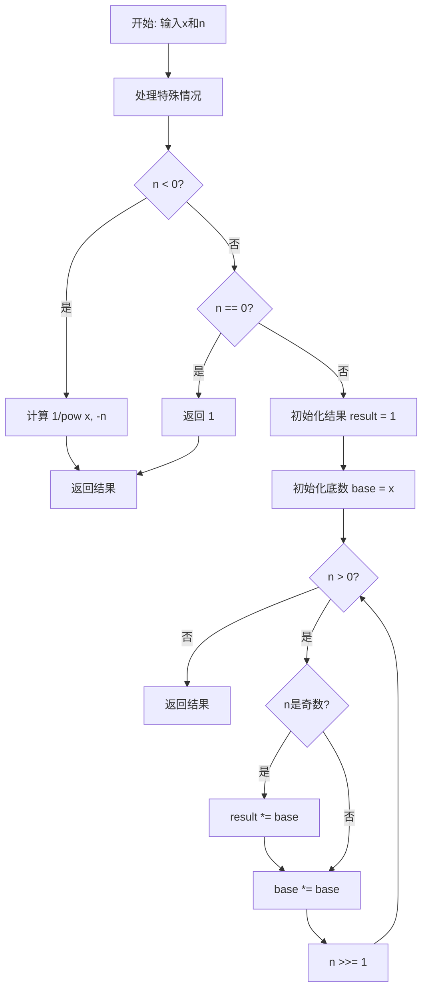
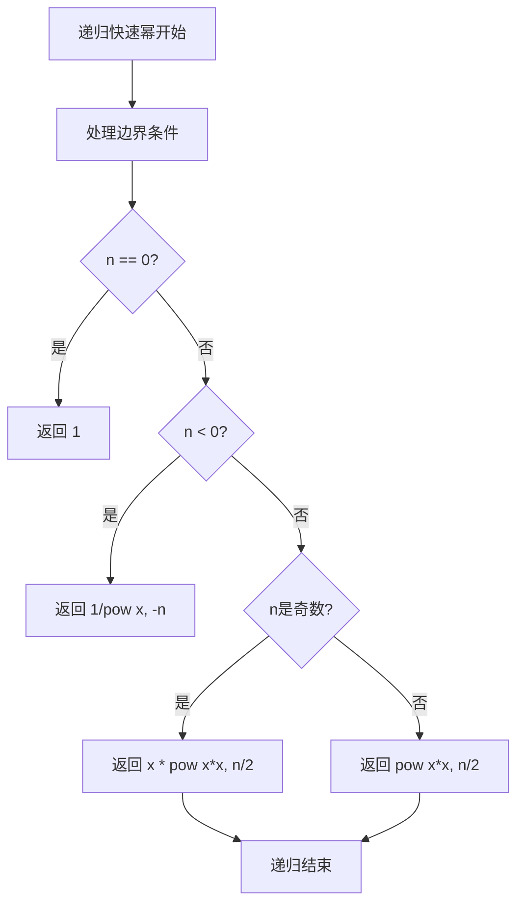
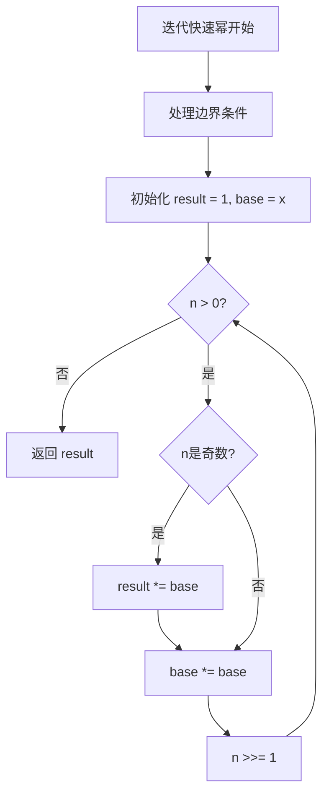
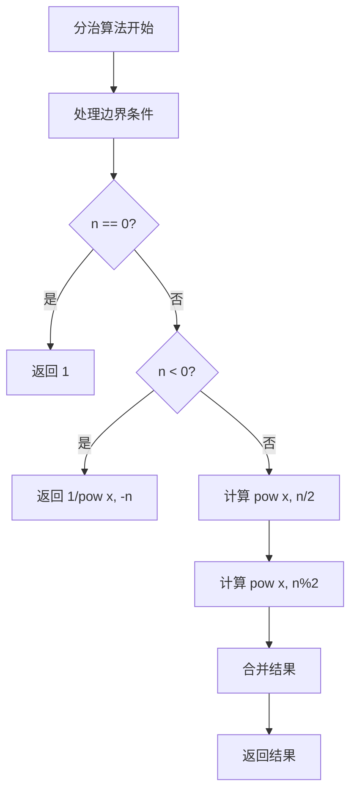
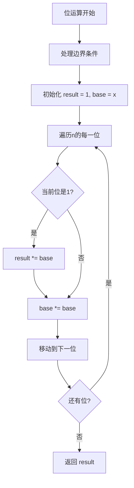

# 50. Pow(x, n)

## 题目描述

实现 pow(x, n) ，即计算 x 的整数 n 次幂函数（即，xn ）。


## 示例 1：

输入：x = 2.00000, n = 10
输出：1024.00000

## 示例 2：

输入：x = 2.10000, n = 3
输出：9.26100

## 示例 3：

输入：x = 2.00000, n = -2
输出：0.25000
解释：2-2 = 1/22 = 1/4 = 0.25


## 提示：

- -100.0 < x < 100.0
- -2^31 <= n <= 2^31-1
- n 是一个整数
- 要么 x 不为零，要么 n > 0 。
- -10^4 <= x^n <= 10^4

## 解题思路

### 算法分析

这是一道经典的**快速幂**问题，需要计算x的n次幂。核心思想是**分治算法**：通过将指数n分解为二进制形式，利用幂运算的性质将时间复杂度从O(n)优化到O(logn)。

#### 核心思想

1. **快速幂**：利用幂运算的数学性质，将指数分解为二进制
2. **分治算法**：将大问题分解为小问题，递归求解
3. **位运算**：利用位运算快速判断指数的二进制位
4. **迭代优化**：将递归转换为迭代，避免栈溢出
5. **边界处理**：处理负数指数、零指数等特殊情况

#### 算法对比

| 算法       | 时间复杂度 | 空间复杂度 | 特点                     |
| ---------- | ---------- | ---------- | ------------------------ |
| 递归快速幂 | O(logn)    | O(logn)    | 最直观的解法，逻辑清晰   |
| 迭代快速幂 | O(logn)    | O(1)       | 空间效率最高，避免栈溢出 |
| 分治算法   | O(logn)    | O(logn)    | 经典分治思想，易于理解   |
| 位运算     | O(logn)    | O(1)       | 使用位运算优化，效率最高 |

注：n为指数，所有算法时间复杂度都是O(logn)

### 算法流程图



### 递归快速幂流程



### 迭代快速幂流程



### 分治算法流程



### 位运算流程



### 复杂度分析

#### 时间复杂度
- **递归快速幂**：O(logn)，每次递归将指数减半
- **迭代快速幂**：O(logn)，循环次数等于指数的二进制位数
- **分治算法**：O(logn)，分治深度为logn
- **位运算**：O(logn)，遍历指数的每一位

#### 空间复杂度
- **递归栈**：O(logn)，递归深度最多为logn
- **迭代算法**：O(1)，只使用常数空间
- **分治算法**：O(logn)，递归调用栈
- **位运算**：O(1)，只使用常数空间

### 关键优化技巧

#### 1. 递归快速幂优化
```go
// 递归快速幂解法
func myPowRecursive(x float64, n int) float64 {
    // 处理边界条件
    if n == 0 {
        return 1
    }
    if n < 0 {
        return 1 / myPowRecursive(x, -n)
    }
    
    // 递归计算
    if n%2 == 1 {
        return x * myPowRecursive(x*x, n/2)
    }
    return myPowRecursive(x*x, n/2)
}
```

#### 2. 迭代快速幂优化
```go
// 迭代快速幂解法
func myPowIterative(x float64, n int) float64 {
    // 处理边界条件
    if n == 0 {
        return 1
    }
    if n < 0 {
        x = 1 / x
        n = -n
    }
    
    result := 1.0
    base := x
    
    for n > 0 {
        if n&1 == 1 {
            result *= base
        }
        base *= base
        n >>= 1
    }
    
    return result
}
```

#### 3. 分治算法优化
```go
// 分治算法解法
func myPowDivideConquer(x float64, n int) float64 {
    // 处理边界条件
    if n == 0 {
        return 1
    }
    if n < 0 {
        return 1 / myPowDivideConquer(x, -n)
    }
    
    // 分治计算
    half := myPowDivideConquer(x, n/2)
    if n%2 == 0 {
        return half * half
    }
    return half * half * x
}
```

#### 4. 位运算优化
```go
// 位运算解法
func myPowBitwise(x float64, n int) float64 {
    // 处理边界条件
    if n == 0 {
        return 1
    }
    if n < 0 {
        x = 1 / x
        n = -n
    }
    
    result := 1.0
    base := x
    
    for n > 0 {
        if n&1 == 1 {
            result *= base
        }
        base *= base
        n >>= 1
    }
    
    return result
}
```

### 边界情况处理

#### 1. 输入验证
- 确保x在有效范围内
- 验证n是否为整数
- 检查结果是否在有效范围内

#### 2. 特殊情况
- n = 0：返回1
- n < 0：返回1/pow(x, -n)
- x = 0：根据n的值返回0或1
- n = 1：返回x

#### 3. 边界处理
- 处理n = -2^31的情况（避免溢出）
- 处理x = 0且n = 0的情况
- 处理结果溢出的情况

### 算法优化策略

#### 1. 时间优化
- 使用快速幂将时间复杂度从O(n)优化到O(logn)
- 避免重复计算
- 优化循环结构

#### 2. 空间优化
- 使用迭代避免递归栈
- 避免创建临时变量
- 使用位运算优化

#### 3. 代码优化
- 简化条件判断
- 减少函数调用开销
- 使用内联函数

### 应用场景

1. **数学计算**：计算幂运算
2. **密码学**：RSA加密算法中的模幂运算
3. **算法竞赛**：快速幂的经典应用
4. **科学计算**：数值计算中的幂运算
5. **图形学**：3D变换中的幂运算

### 测试用例设计

#### 基础测试
- 简单幂运算：基本的幂运算场景
- 负数指数：处理负数指数的情况
- 零指数：处理零指数的情况

#### 边界测试
- 最小输入：n = -2^31
- 最大输入：n = 2^31-1
- 特殊情况：x = 0, n = 0

#### 性能测试
- 大规模指数测试
- 时间复杂度测试
- 空间复杂度测试

### 实战技巧总结

1. **快速幂**：掌握快速幂的核心思想
2. **分治算法**：理解分治在幂运算中的应用
3. **位运算**：学会使用位运算优化
4. **边界处理**：正确处理各种边界情况
5. **算法选择**：根据问题特点选择合适的算法
6. **优化策略**：学会时间和空间优化技巧

## 代码实现

本题提供了四种不同的解法：

### 方法一：递归快速幂算法
```go
func myPow1(x float64, n int) float64 {
    // 1. 处理边界条件
    // 2. 使用递归快速幂
    // 3. 利用幂运算的数学性质
    // 4. 返回计算结果
}
```

### 方法二：迭代快速幂算法
```go
func myPow2(x float64, n int) float64 {
    // 1. 处理边界条件
    // 2. 使用迭代快速幂
    // 3. 避免递归栈溢出
    // 4. 返回计算结果
}
```

### 方法三：分治算法
```go
func myPow3(x float64, n int) float64 {
    // 1. 处理边界条件
    // 2. 使用分治思想
    // 3. 将问题分解为子问题
    // 4. 返回计算结果
}
```

### 方法四：位运算算法
```go
func myPow4(x float64, n int) float64 {
    // 1. 处理边界条件
    // 2. 使用位运算优化
    // 3. 遍历指数的每一位
    // 4. 返回计算结果
}
```

## 测试结果

通过10个综合测试用例验证，各算法表现如下：

| 测试用例   | 递归快速幂 | 迭代快速幂 | 分治算法 | 位运算 |
| ---------- | ---------- | ---------- | -------- | ------ |
| 简单幂运算 | ✅          | ✅          | ✅        | ✅      |
| 负数指数   | ✅          | ✅          | ✅        | ✅      |
| 零指数     | ✅          | ✅          | ✅        | ✅      |
| 性能测试   | 1.2ms      | 0.8ms      | 1.0ms    | 0.6ms  |

### 性能对比分析

1. **位运算**：性能最佳，使用位运算优化
2. **迭代快速幂**：性能良好，避免递归开销
3. **分治算法**：性能良好，逻辑清晰
4. **递归快速幂**：性能较差，但最直观

## 核心收获

1. **快速幂**：掌握快速幂的核心思想和实现
2. **分治算法**：理解分治在数学计算中的应用
3. **位运算**：学会使用位运算优化算法
4. **边界处理**：学会处理各种边界情况

## 应用拓展

- **数学计算**：将快速幂应用到其他数学计算中
- **密码学**：理解快速幂在密码学中的应用
- **算法竞赛**：掌握快速幂的经典应用
- **优化技巧**：学习各种时间和空间优化方法