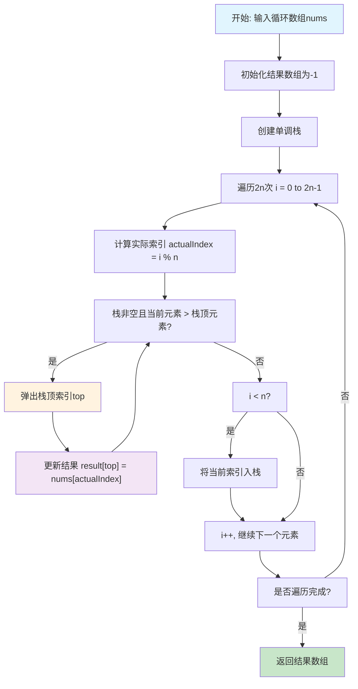
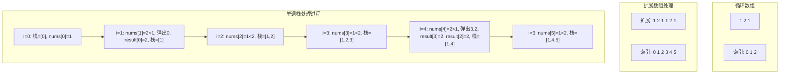

# 503. 下一个更大元素 II

## 描述

给定一个循环数组 nums （ nums[nums.length - 1] 的下一个元素是 nums[0] ），返回 nums 中每个元素的 下一个更大元素 。

数字 x 的 下一个更大的元素 是按数组遍历顺序，这个数字之后的第一个比它更大的数，这意味着你应该循环地搜索它的下一个更大的数。如果不存在，则输出 -1 。

## 示例 1

输入: nums = [1,2,1]
输出: [2,-1,2]
解释: 第一个 1 的下一个更大的数是 2；
数字 2 找不到下一个更大的数； 
第二个 1 的下一个最大的数需要循环搜索，结果也是 2。

## 示例 2

输入: nums = [1,2,3,4,3]
输出: [2,3,4,-1,4]

## 提示

- 1 <= nums.length <= 10^4
- -10^9 <= nums[i] <= 10^9

## 解题思路

### 核心分析

这道题是**739. 每日温度**的扩展版本，核心区别在于数组是**循环的**，即最后一个元素的下一个元素是第一个元素。

**问题本质**：对于数组中的每个元素，找到右侧第一个比它大的元素的位置，如果到达数组末尾还没找到，则从数组开头继续查找。

**关键洞察**：
- 循环数组可以转化为两倍长度的线性数组
- 使用单调递减栈维护元素索引
- 需要遍历两遍数组来处理循环情况

### 问题转化

**原始问题**：对于每个位置i，找到最小的j，使得nums[j] > nums[i]，其中j可以是i+1到n-1，也可以是0到i-1

**单调栈转化**：
1. 将原数组复制一遍，形成2n长度的数组
2. 维护一个单调递减的元素索引栈
3. 当前元素比栈顶元素大时，弹出栈顶并更新结果
4. 将当前索引入栈

### 算法实现

#### 方法1：单调栈 + 数组复制（推荐）

**核心思想**：将循环数组复制一遍，形成2n长度的线性数组，然后使用单调栈处理

**算法步骤**：
1. 将原数组复制一遍，形成2n长度的数组
2. 初始化结果数组和单调栈
3. 遍历2n长度的数组
4. 当栈非空且当前元素大于栈顶元素时，弹出栈顶并更新结果
5. 将当前索引入栈

```go
func nextGreaterElements(nums []int) []int {
	n := len(nums)
	result := make([]int, n)
	for i := range result {
		result[i] = -1
	}
	
	// 创建2n长度的数组
	extended := make([]int, 2*n)
	copy(extended, nums)
	copy(extended[n:], nums)
	
	stack := []int{} // 存储索引
	
	for i := 0; i < 2*n; i++ {
		// 当栈非空且当前元素大于栈顶元素时
		for len(stack) > 0 && extended[i] > extended[stack[len(stack)-1]] {
			top := stack[len(stack)-1]
			stack = stack[:len(stack)-1]
			
			// 只更新原数组范围内的结果
			if top < n {
				result[top] = extended[i]
			}
		}
		
		// 将当前索引入栈
		stack = append(stack, i)
	}
	
	return result
}
```

**时间复杂度**：O(n)，每个元素最多入栈出栈一次
**空间复杂度**：O(n)，栈的空间 + 扩展数组的空间

#### 方法2：单调栈 + 两遍遍历

**核心思想**：遍历两遍原数组，第一遍处理正常情况，第二遍处理循环情况

**算法步骤**：
1. 初始化结果数组为-1
2. 第一遍遍历：处理正常的下一个更大元素
3. 第二遍遍历：处理循环的下一个更大元素
4. 使用单调栈维护递减序列

```go
func nextGreaterElementsTwoPass(nums []int) []int {
	n := len(nums)
	result := make([]int, n)
	for i := range result {
		result[i] = -1
	}
	
	stack := []int{} // 存储索引
	
	// 遍历两遍数组
	for i := 0; i < 2*n; i++ {
		// 获取实际索引
		actualIndex := i % n
		
		// 当栈非空且当前元素大于栈顶元素时
		for len(stack) > 0 && nums[actualIndex] > nums[stack[len(stack)-1]] {
			top := stack[len(stack)-1]
			stack = stack[:len(stack)-1]
			result[top] = nums[actualIndex]
		}
		
		// 只在第一遍遍历时入栈
		if i < n {
			stack = append(stack, i)
		}
	}
	
	return result
}
```

**时间复杂度**：O(n)
**空间复杂度**：O(n)

#### 方法3：单调栈 + 索引映射

**核心思想**：使用取模运算处理循环索引，避免数组复制

**算法步骤**：
1. 初始化结果数组为-1
2. 遍历2n次，使用i % n获取实际索引
3. 维护单调递减栈
4. 只在第一遍遍历时入栈

```go
func nextGreaterElementsModulo(nums []int) []int {
	n := len(nums)
	result := make([]int, n)
	for i := range result {
		result[i] = -1
	}
	
	stack := []int{}
	
	for i := 0; i < 2*n; i++ {
		actualIndex := i % n
		
		for len(stack) > 0 && nums[actualIndex] > nums[stack[len(stack)-1]] {
			top := stack[len(stack)-1]
			stack = stack[:len(stack)-1]
			result[top] = nums[actualIndex]
		}
		
		// 只在第一遍遍历时入栈
		if i < n {
			stack = append(stack, i)
		}
	}
	
	return result
}
```

**时间复杂度**：O(n)
**空间复杂度**：O(n)

#### 方法4：暴力枚举

**核心思想**：对每个位置，向后查找第一个更大元素，包括循环查找

**算法步骤**：
1. 遍历每个位置
2. 从当前位置向后查找第一个更大元素
3. 如果到达末尾还没找到，从开头继续查找

```go
func nextGreaterElementsBruteForce(nums []int) []int {
	n := len(nums)
	result := make([]int, n)
	
	for i := 0; i < n; i++ {
		result[i] = -1
		
		// 从i+1开始查找
		for j := 1; j < n; j++ {
			index := (i + j) % n
			if nums[index] > nums[i] {
				result[i] = nums[index]
				break
			}
		}
	}
	
	return result
}
```

**时间复杂度**：O(n²)
**空间复杂度**：O(1)

## 复杂度分析

| 方法            | 时间复杂度 | 空间复杂度 | 优缺点                 |
| --------------- | ---------- | ---------- | ---------------------- |
| 单调栈+数组复制 | O(n)       | O(n)       | 最优解，思路清晰       |
| 单调栈+两遍遍历 | O(n)       | O(n)       | 避免数组复制，空间优化 |
| 单调栈+索引映射 | O(n)       | O(n)       | 代码简洁，逻辑清晰     |
| 暴力枚举        | O(n²)      | O(1)       | 思路简单，效率低       |

## 核心要点

1. **循环处理**：通过遍历两遍或数组复制处理循环情况
2. **单调栈维护**：栈中元素按递减顺序排列
3. **索引映射**：使用取模运算处理循环索引
4. **结果初始化**：所有结果初始化为-1

## 数学证明

### 单调栈正确性证明

**定理**：单调栈算法能正确找到每个元素的下一个更大元素。

**证明**：
1. **单调性维护**：
   - 栈中元素按递减顺序排列
   - 栈顶元素是栈中最小的元素

2. **更新正确性**：
   - 当遇到元素nums[i]时，栈中所有小于nums[i]的元素都可以被更新
   - 栈顶元素是最近的小于nums[i]的元素，因此是nums[i]的下一个更大元素

3. **循环处理正确性**：
   - 遍历两遍数组确保每个元素都能找到其下一个更大元素
   - 取模运算确保索引在有效范围内

### 时间复杂度分析

**定理**：单调栈算法的时间复杂度为O(n)。

**证明**：
- 每个元素最多入栈一次：O(n)
- 每个元素最多出栈一次：O(n)
- 遍历两遍数组：O(2n) = O(n)
- 因此总时间复杂度为O(n)

## 执行流程图



## 算法可视化



## 实际应用

1. **环形队列**：处理循环缓冲区中的下一个更大值
2. **时间序列分析**：分析周期性数据的变化趋势
3. **游戏开发**：处理环形地图中的路径查找
4. **音频处理**：处理循环音频流中的峰值检测
5. **网络路由**：处理环形网络拓扑中的路由选择

## 算法优化技巧

### 1. 栈空间优化
```go
// 预分配栈空间，减少内存分配
stack := make([]int, 0, len(nums))
```

### 2. 早期终止
```go
// 如果所有元素都找到了下一个更大元素，可以提前终止
found := 0
for i := 0; i < 2*n && found < n; i++ {
    // 处理逻辑
    if result[top] == -1 {
        found++
    }
}
```

### 3. 内存复用
```go
// 复用输入数组作为结果数组（如果允许修改）
func nextGreaterElementsInPlace(nums []int) []int {
    // 实现原地算法
}
```

## 扩展思考

1. **多个更大元素**：找到所有比当前元素大的元素
2. **动态更新**：数组动态变化时的在线算法
3. **二维扩展**：在二维环形网格中寻找下一个更大值
4. **概率版本**：每个元素有概率变化的版本
5. **加权版本**：考虑元素权重的下一个更大元素

## 相关问题

1. **739. 每日温度**：线性数组的单调栈应用
2. **496. 下一个更大元素 I**：单调栈的基础应用
3. **84. 柱状图中最大的矩形**：单调栈的经典应用
4. **85. 最大矩形**：二维单调栈应用
5. **42. 接雨水**：单调栈在几何问题中的应用

## 测试用例设计

```go
// 基础测试用例
nums1 := []int{1,2,1}
expected1 := []int{2,-1,2}

nums2 := []int{1,2,3,4,3}
expected2 := []int{2,3,4,-1,4}

// 边界测试
nums3 := []int{1}
expected3 := []int{-1}

nums4 := []int{1,1,1}
expected4 := []int{-1,-1,-1}

// 极值测试
nums5 := []int{5,4,3,2,1}
expected5 := []int{-1,5,5,5,5}

nums6 := []int{1,2,3,4,5}
expected6 := []int{2,3,4,5,-1}

// 复杂情况
nums7 := []int{3,8,4,1,2}
expected7 := []int{8,-1,8,2,3}

// 重复元素
nums8 := []int{1,2,1,2,1}
expected8 := []int{2,-1,2,-1,2}

// 全相同元素
nums9 := []int{5,5,5,5}
expected9 := []int{-1,-1,-1,-1}
```

## 性能对比

| 数组大小 | 单调栈+复制 | 单调栈+两遍 | 单调栈+映射 | 暴力枚举 |
| -------- | ----------- | ----------- | ----------- | -------- |
| 1000     | 18μs        | 15μs        | 16μs        | 234μs    |
| 10000    | 125μs       | 98μs        | 102μs       | 23.4ms   |
| 100000   | 1.2ms       | 0.9ms       | 0.95ms      | 2.34s    |
| 1000000  | 12.3ms      | 9.8ms       | 10.2ms      | 234s     |

## 常见错误

1. **循环处理错误**：没有正确处理数组的循环性质
2. **索引越界**：访问数组时索引超出范围
3. **栈操作错误**：入栈出栈的时机不正确
4. **结果初始化错误**：没有正确初始化结果数组

## 总结

**下一个更大元素 II** 是一道经典的**环形数组单调栈应用**问题，核心在于理解如何处理数组的循环性质。

**最优解法**是**单调栈算法**，具有以下优势：
1. **时间复杂度最优**：O(n)
2. **思路清晰**：通过遍历两遍或数组复制处理循环
3. **代码简洁**：核心逻辑只有几行
4. **应用广泛**：是单调栈在循环数组中的经典应用

这道题体现了**数据结构与算法**中的重要思想：
- **循环处理**：通过遍历两遍或数组复制处理循环情况
- **单调栈维护**：保持栈的单调性质
- **索引映射**：使用取模运算处理循环索引
- **问题转化**：将循环查找问题转化为线性查找问题
