# 509. 斐波那契数

## 描述

斐波那契数 （通常用 F(n) 表示）形成的序列称为 斐波那契数列 。该数列由 0 和 1 开始，后面的每一项数字都是前面两项数字的和。也就是：

F(0) = 0，F(1) = 1
F(n) = F(n - 1) + F(n - 2)，其中 n > 1
给定 n ，请计算 F(n) 。

## 示例 1

输入：n = 2
输出：1
解释：F(2) = F(1) + F(0) = 1 + 0 = 1

## 示例 2

输入：n = 3
输出：2
解释：F(3) = F(2) + F(1) = 1 + 1 = 2

## 示例 3

输入：n = 4
输出：3
解释：F(4) = F(3) + F(2) = 2 + 1 = 3

## 提示

- 0 <= n <= 30

## 解题思路

### 算法分析

这道题是**经典的斐波那契数列问题**，涉及多种优化思路。主要包括：

1. **递归解法**：直接按定义递归，但效率低下
2. **备忘录递归**：记忆化递归，避免重复计算
3. **动态规划**：自底向上构建解
4. **空间优化**：只保存必要的前两项
5. **矩阵快速幂**：O对数级时间复杂度

### 问题本质分析

```mermaid
graph TD
    A[斐波那契数列问题] --> B[递归关系]
    B --> C[递推公式：F_n = F_n-1 + F_n-2]
    B --> D[边界条件：F_0=0, F_1=1]
    
    C --> E[重复子问题]
    E --> F[记忆化优化]
    E --> G[动态规划优化]
    
    F --> H[备忘录递归]
    G --> I[自底向上构建]
    I --> J[空间优化]
```

### 递归问题分析

### 备忘录递归详解

### 备忘录优化原理

### 动态规划解法

### 各种解法对比

### 代码实现思路

1. **朴素递归法**：
   - 直接按定义实现
   - 存在大量重复计算
   - 时间复杂度指数级

2. **备忘录递归法**：
   - 使用哈希表或数组存储已计算结果
   - 递归时先检查备忘录
   - 时间复杂度降为O(n)

3. **动态规划法**：
   - 自底向上计算
   - 避免递归栈开销
   - 思路清晰易懂

4. **空间优化法**：
   - 只保存前两个状态
   - 空间复杂度O(1)
   - 实际应用推荐

### 时间复杂度分析

- **朴素递归**：O指数级，每个节点分裂成两个子问题
- **备忘录递归**：O线性，每个子问题只计算一次
- **动态规划**：O线性，线性遍历
- **空间优化DP**：O线性，线性遍历
- **矩阵快速幂**：O对数级，快速幂算法

### 空间复杂度分析

- **朴素递归**：O线性，递归栈深度
- **备忘录递归**：O线性，递归栈加备忘录表
- **动态规划**：O线性，DP数组
- **空间优化DP**：O常数，只存储常数个变量
- **矩阵快速幂**：O常数，常数空间

### 备忘录实现细节

### 递归树对比

### 实际应用场景

1. **算法竞赛**：经典递推数列问题
2. **系统设计**：缓存策略的典型应用
3. **数学建模**：增长模型和数列计算
4. **性能优化**：记忆化技术的入门案例

### 扩展问题

### 优化技巧总结

### 测试用例设计

这个问题的关键在于**理解备忘录的优化原理**和**选择合适的实现方式**，通过避免重复计算大幅提升算法效率，是学习动态规划和记忆化技术的绝佳案例。
