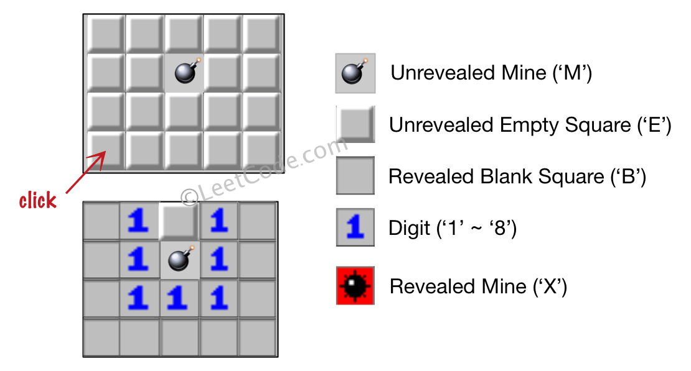
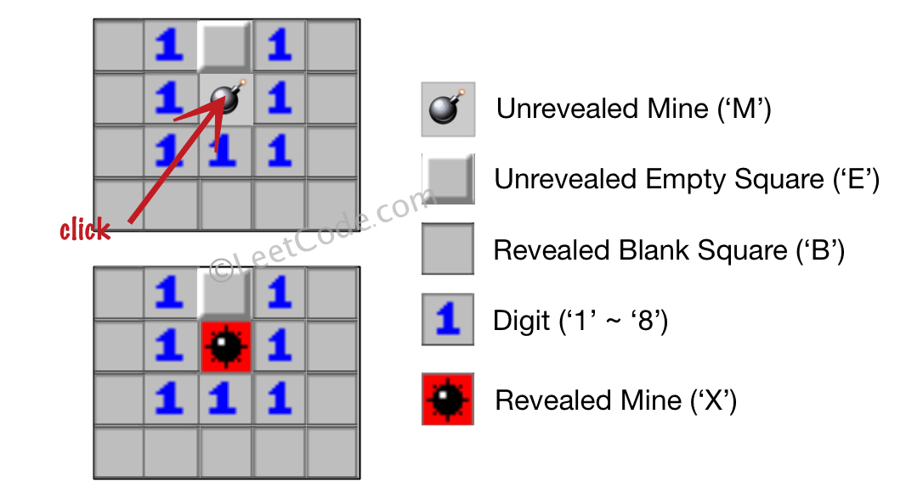
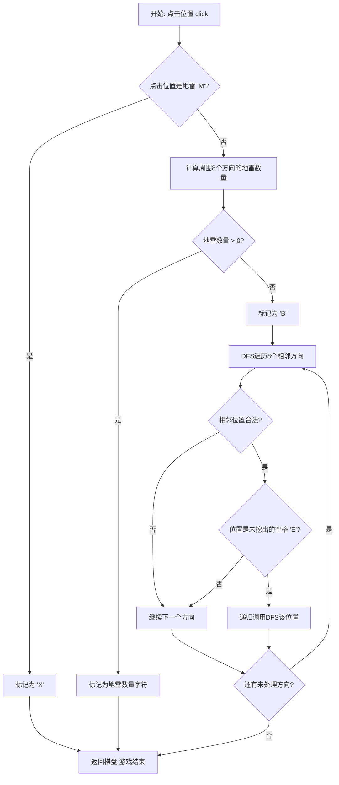
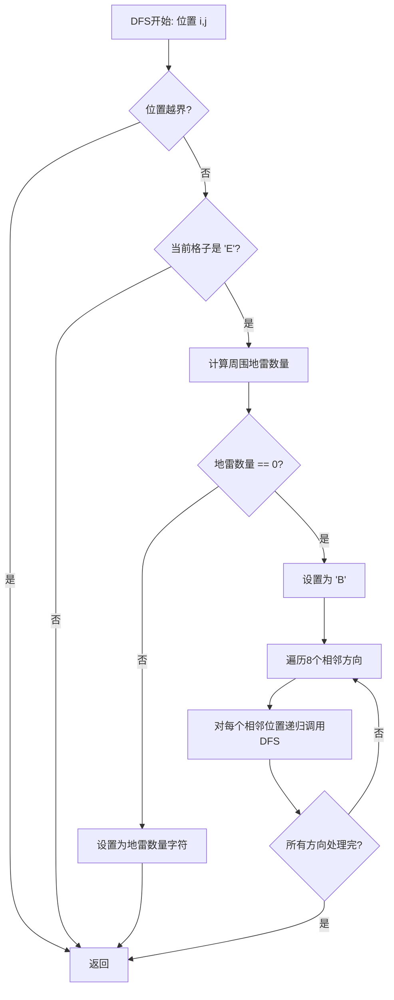
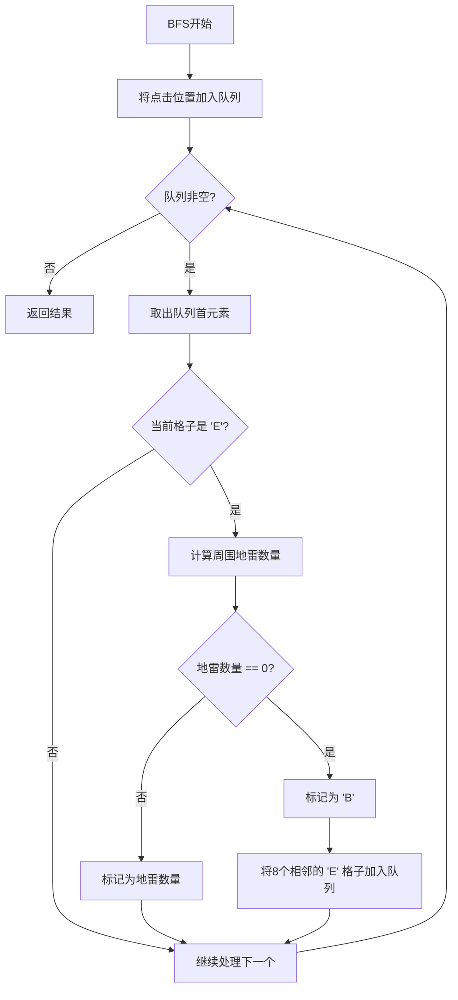
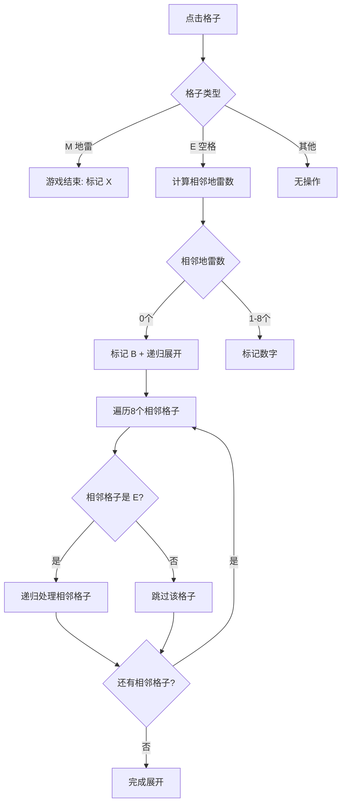

# 529. 扫雷游戏

## 题目描述

让我们一起来玩扫雷游戏！

给你一个大小为 m x n 二维字符矩阵 board ，表示扫雷游戏的盘面，其中：

'M' 代表一个 未挖出的 地雷，
'E' 代表一个 未挖出的 空方块，
'B' 代表没有相邻（上，下，左，右，和所有4个对角线）地雷的 已挖出的 空白方块，
数字（'1' 到 '8'）表示有多少地雷与这块 已挖出的 方块相邻，
'X' 则表示一个 已挖出的 地雷。
给你一个整数数组 click ，其中 click = [clickr, clickc] 表示在所有 未挖出的 方块（'M' 或者 'E'）中的下一个点击位置（clickr 是行下标，clickc 是列下标）。

根据以下规则，返回相应位置被点击后对应的盘面：

1. 如果一个地雷（'M'）被挖出，游戏就结束了- 把它改为 'X' 。
2. 如果一个 没有相邻地雷 的空方块（'E'）被挖出，修改它为（'B'），并且所有和其相邻的 未挖出 方块都应该被递归地揭露。
3. 如果一个 至少与一个地雷相邻 的空方块（'E'）被挖出，修改它为数字（'1' 到 '8' ），表示相邻地雷的数量。
4. 如果在此次点击中，若无更多方块可被揭露，则返回盘面。
 

## 示例 1：



输入：board = [["E","E","E","E","E"],["E","E","M","E","E"],["E","E","E","E","E"],["E","E","E","E","E"]], click = [3,0]
输出：[["B","1","E","1","B"],["B","1","M","1","B"],["B","1","1","1","B"],["B","B","B","B","B"]]

## 示例 2：



输入：board = [["B","1","E","1","B"],["B","1","M","1","B"],["B","1","1","1","B"],["B","B","B","B","B"]], click = [1,2]
输出：[["B","1","E","1","B"],["B","1","X","1","B"],["B","1","1","1","B"],["B","B","B","B","B"]]
 

## 提示：

- m == board.length
- n == board[i].length
- 1 <= m, n <= 50
- board[i][j] 为 'M'、'E'、'B' 或数字 '1' 到 '8' 中的一个
- click.length == 2
- 0 <= clickr < m
- 0 <= clickc < n
- board[clickr][clickc] 为 'M' 或 'E'

## 解题思路

### 算法分析

这是一道经典的**图遍历**问题，模拟扫雷游戏的点击逻辑。核心在于根据不同情况进行相应的处理和递归展开。

#### 核心思想

1. **点击地雷**：直接标记为'X'，游戏结束
2. **点击空格**：计算周围地雷数量
   - 如果周围没有地雷：标记为'B'，递归展开所有相邻未挖出的格子
   - 如果周围有地雷：标记为地雷数量('1'-'8')，停止展开
3. **递归展开**：使用DFS或BFS遍历相邻的未挖出格子

#### 算法对比

| 算法 | 时间复杂度 | 空间复杂度 | 特点 |
|------|------------|------------|------|
| DFS递归 | O(m×n) | O(m×n) | 简洁直观，可能栈溢出 |
| DFS迭代 | O(m×n) | O(m×n) | 避免栈溢出，手动管理栈 |
| BFS | O(m×n) | O(m×n) | 层次遍历，适合可视化 |
| 优化DFS | O(m×n) | O(m×n) | 减少重复计算 |

注：m、n为棋盘的行数和列数

### 算法流程图



### DFS递归实现流程



### BFS实现流程



### 扫雷规则决策树



### 复杂度分析

#### 时间复杂度
- **最好情况**：O(1) - 点击地雷或有相邻地雷的格子
- **最坏情况**：O(m×n) - 展开整个无地雷区域
- **平均情况**：取决于地雷分布和点击位置

#### 空间复杂度
- **DFS递归**：O(m×n) - 递归栈深度
- **DFS迭代**：O(m×n) - 手动栈空间
- **BFS**：O(m×n) - 队列空间

### 实现技巧

#### 1. 八方向遍历优化
```go
// 定义8个方向的偏移量
directions := [][]int{
    {-1, -1}, {-1, 0}, {-1, 1},
    {0, -1},           {0, 1},
    {1, -1},  {1, 0},  {1, 1},
}
```

#### 2. 边界检查优化
```go
func inBounds(i, j, m, n int) bool {
    return i >= 0 && i < m && j >= 0 && j < n
}
```

#### 3. 地雷计数优化
```go
func countMines(board [][]byte, i, j int) int {
    count := 0
    for _, dir := range directions {
        ni, nj := i+dir[0], j+dir[1]
        if inBounds(ni, nj, len(board), len(board[0])) && board[ni][nj] == 'M' {
            count++
        }
    }
    return count
}
```

### 算法优化策略

#### 1. 减少重复计算
- 预计算每个位置的相邻地雷数
- 使用记忆化避免重复访问

#### 2. 早期终止
- 遇到地雷立即返回
- 遇到已挖出格子立即跳过

#### 3. 迭代优化
- 使用栈替代递归避免栈溢出
- 批量处理相同类型的格子

### 扫雷游戏特点

#### 1. 状态转换
- 'M' → 'X'：地雷被挖出
- 'E' → 'B'：无相邻地雷的空格
- 'E' → '1'-'8'：有相邻地雷的空格

#### 2. 连锁反应
- 空白区域会自动展开
- 直到遇到有地雷的边界

#### 3. 游戏规则
- 只能点击未挖出的格子('M'或'E')
- 点击地雷游戏结束
- 自动展开无地雷区域

### 应用场景

1. **游戏开发**：扫雷游戏实现
2. **图算法**：连通区域搜索
3. **模拟系统**：规则引擎设计
4. **教学案例**：DFS/BFS经典应用
5. **交互界面**：点击响应处理

### 测试用例设计

#### 基础测试
- 点击地雷：直接游戏结束
- 点击空白：自动展开区域
- 点击数字边界：显示相邻地雷数

#### 边界测试
- 角落位置点击
- 边缘位置点击
- 全是地雷的棋盘
- 全是空格的棋盘

#### 性能测试
- 大规模棋盘(50×50)
- 稠密地雷分布
- 稀疏地雷分布

### 实战技巧总结

1. **方向数组**：预定义8个方向简化遍历
2. **边界检查**：统一的边界检查函数
3. **状态管理**：明确每种状态的转换规则
4. **递归控制**：合理选择DFS或BFS
5. **优化策略**：根据数据特点选择最优算法
