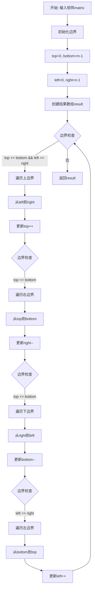
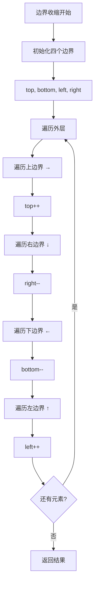
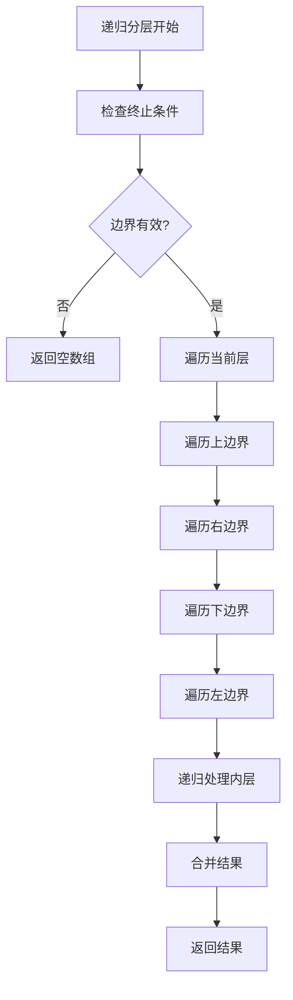

# 54. 螺旋矩阵

## 题目描述

给你一个 m 行 n 列的矩阵 matrix ，请按照 顺时针螺旋顺序 ，返回矩阵中的所有元素。

## 示例 1：


输入：matrix = [[1,2,3],[4,5,6],[7,8,9]]
输出：[1,2,3,6,9,8,7,4,5]

## 示例 2：


输入：matrix = [[1,2,3,4],[5,6,7,8],[9,10,11,12]]
输出：[1,2,3,4,8,12,11,10,9,5,6,7]

## 提示：

- m == matrix.length
- n == matrix[i].length
- 1 <= m, n <= 10
- -100 <= matrix[i][j] <= 100

## 解题思路

### 算法分析

这是一道经典的**矩阵遍历**问题，核心思想是**按照螺旋顺序遍历矩阵**。主要有四种解法：边界收缩法、方向数组法、递归分层法和模拟遍历法。

#### 核心思想

1. **边界收缩**：维护四个边界（上下左右），每遍历完一层就收缩边界
2. **方向数组**：使用方向数组控制遍历方向，按照右→下→左→上的顺序遍历
3. **递归分层**：将问题分解为外层和内层，递归处理每一层
4. **模拟遍历**：直接模拟螺旋遍历的过程，使用visited数组标记已访问元素
5. **边界检查**：需要处理矩阵为空、单行、单列等特殊情况

#### 算法对比

| 算法     | 时间复杂度 | 空间复杂度  | 特点                   |
| -------- | ---------- | ----------- | ---------------------- |
| 边界收缩 | O(m×n)     | O(1)        | 最优解法，逻辑清晰     |
| 方向数组 | O(m×n)     | O(m×n)      | 需要额外的visited数组  |
| 递归分层 | O(m×n)     | O(min(m,n)) | 递归实现，空间开销较大 |
| 模拟遍历 | O(m×n)     | O(m×n)      | 最直观，但空间开销大   |

注：m为矩阵行数，n为矩阵列数，边界收缩法是最优解法

### 算法流程图



### 边界收缩流程



### 方向数组流程

```mermaid
graph TD
    A[方向数组开始] --> B[定义方向数组]
    B --> C[dirs = &#123;&#123;0,1&#125;, &#123;1,0&#125;, &#123;0,-1&#125;, &#123;-1,0&#125;&#125;]
    C --> D[初始化位置和方向]
    D --> E[row=0, col=0, dir=0]
    E --> F[创建visited数组]
    F --> G[遍历所有元素]
    G --> H[添加当前元素到结果]
    H --> I[标记visited为true]
    I --> J[计算下一个位置]
    J --> K{下一个位置有效?}
    K -->|是| L[移动到下一个位置]
    K -->|否| M[改变方向]
    M --> N[dir = &#40;dir + 1&#41; % 4]
    N --> L
    L --> O{还有元素?}
    O -->|是| G
    O -->|否| P[返回结果]
```



### 递归分层流程



### 复杂度分析

#### 时间复杂度
- **边界收缩**：O(m×n)，需要遍历所有元素一次
- **方向数组**：O(m×n)，需要遍历所有元素一次
- **递归分层**：O(m×n)，需要遍历所有元素一次
- **模拟遍历**：O(m×n)，需要遍历所有元素一次

#### 空间复杂度
- **边界收缩**：O(1)，只使用常数额外空间（不包括结果数组）
- **方向数组**：O(m×n)，需要visited数组
- **递归分层**：O(min(m,n))，递归栈的深度
- **模拟遍历**：O(m×n)，需要visited数组

### 关键优化技巧

#### 1. 边界收缩优化
```go
// 边界收缩解法
func spiralOrderBoundary(matrix [][]int) []int {
    if len(matrix) == 0 || len(matrix[0]) == 0 {
        return []int{}
    }
    
    m, n := len(matrix), len(matrix[0])
    result := make([]int, 0, m*n)
    
    top, bottom := 0, m-1
    left, right := 0, n-1
    
    for top <= bottom && left <= right {
        // 遍历上边界
        for i := left; i <= right; i++ {
            result = append(result, matrix[top][i])
        }
        top++
        
        // 遍历右边界
        for i := top; i <= bottom; i++ {
            result = append(result, matrix[i][right])
        }
        right--
        
        // 遍历下边界
        if top <= bottom {
            for i := right; i >= left; i-- {
                result = append(result, matrix[bottom][i])
            }
            bottom--
        }
        
        // 遍历左边界
        if left <= right {
            for i := bottom; i >= top; i-- {
                result = append(result, matrix[i][left])
            }
            left++
        }
    }
    
    return result
}
```

#### 2. 方向数组实现
```go
// 方向数组解法
func spiralOrderDirection(matrix [][]int) []int {
    if len(matrix) == 0 || len(matrix[0]) == 0 {
        return []int{}
    }
    
    m, n := len(matrix), len(matrix[0])
    result := make([]int, 0, m*n)
    visited := make([][]bool, m)
    for i := range visited {
        visited[i] = make([]bool, n)
    }
    
    // 方向数组：右、下、左、上
    dirs := [][]int{{0, 1}, {1, 0}, {0, -1}, {-1, 0}}
    row, col, dir := 0, 0, 0
    
    for i := 0; i < m*n; i++ {
        result = append(result, matrix[row][col])
        visited[row][col] = true
        
        // 计算下一个位置
        nextRow := row + dirs[dir][0]
        nextCol := col + dirs[dir][1]
        
        // 检查是否需要改变方向
        if nextRow < 0 || nextRow >= m || nextCol < 0 || nextCol >= n || visited[nextRow][nextCol] {
            dir = (dir + 1) % 4
            nextRow = row + dirs[dir][0]
            nextCol = col + dirs[dir][1]
        }
        
        row, col = nextRow, nextCol
    }
    
    return result
}
```

#### 3. 递归分层实现
```go
// 递归分层解法
func spiralOrderRecursive(matrix [][]int) []int {
    if len(matrix) == 0 || len(matrix[0]) == 0 {
        return []int{}
    }
    
    return spiralHelper(matrix, 0, len(matrix)-1, 0, len(matrix[0])-1)
}

func spiralHelper(matrix [][]int, top, bottom, left, right int) []int {
    if top > bottom || left > right {
        return []int{}
    }
    
    result := []int{}
    
    // 遍历上边界
    for i := left; i <= right; i++ {
        result = append(result, matrix[top][i])
    }
    
    // 遍历右边界
    for i := top + 1; i <= bottom; i++ {
        result = append(result, matrix[i][right])
    }
    
    // 遍历下边界
    if top < bottom {
        for i := right - 1; i >= left; i-- {
            result = append(result, matrix[bottom][i])
        }
    }
    
    // 遍历左边界
    if left < right {
        for i := bottom - 1; i > top; i-- {
            result = append(result, matrix[i][left])
        }
    }
    
    // 递归处理内层
    inner := spiralHelper(matrix, top+1, bottom-1, left+1, right-1)
    result = append(result, inner...)
    
    return result
}
```

#### 4. 模拟遍历实现
```go
// 模拟遍历解法
func spiralOrderSimulation(matrix [][]int) []int {
    if len(matrix) == 0 || len(matrix[0]) == 0 {
        return []int{}
    }
    
    m, n := len(matrix), len(matrix[0])
    result := make([]int, 0, m*n)
    visited := make([][]bool, m)
    for i := range visited {
        visited[i] = make([]bool, n)
    }
    
    row, col := 0, 0
    direction := 0 // 0: 右, 1: 下, 2: 左, 3: 上
    
    for len(result) < m*n {
        result = append(result, matrix[row][col])
        visited[row][col] = true
        
        // 根据方向计算下一个位置
        var nextRow, nextCol int
        switch direction {
        case 0: // 右
            nextRow, nextCol = row, col+1
        case 1: // 下
            nextRow, nextCol = row+1, col
        case 2: // 左
            nextRow, nextCol = row, col-1
        case 3: // 上
            nextRow, nextCol = row-1, col
        }
        
        // 检查是否需要改变方向
        if nextRow < 0 || nextRow >= m || nextCol < 0 || nextCol >= n || visited[nextRow][nextCol] {
            direction = (direction + 1) % 4
            switch direction {
            case 0:
                nextRow, nextCol = row, col+1
            case 1:
                nextRow, nextCol = row+1, col
            case 2:
                nextRow, nextCol = row, col-1
            case 3:
                nextRow, nextCol = row-1, col
            }
        }
        
        row, col = nextRow, nextCol
    }
    
    return result
}
```

### 边界情况处理

#### 1. 输入验证
- 确保矩阵不为空
- 验证矩阵行列数在合理范围内
- 检查矩阵元素是否在有效范围内

#### 2. 特殊情况
- 空矩阵：返回空数组
- 单行矩阵：直接返回该行
- 单列矩阵：直接返回该列
- 单个元素：返回包含该元素的数组

#### 3. 边界处理
- 处理矩阵为空的情况
- 处理单行或单列的情况
- 处理遍历到边界需要转向的情况

### 算法优化策略

#### 1. 时间优化
- 使用边界收缩法避免重复检查
- 优化边界判断条件
- 减少不必要的计算

#### 2. 空间优化
- 使用边界收缩法避免visited数组
- 避免存储中间结果
- 使用预分配的结果数组

#### 3. 代码优化
- 简化边界判断逻辑
- 减少函数调用开销
- 使用内联函数

### 应用场景

1. **算法竞赛**：矩阵遍历的经典应用
2. **图像处理**：螺旋扫描图像
3. **数据可视化**：螺旋布局
4. **游戏开发**：地图遍历
5. **打印输出**：螺旋打印

### 测试用例设计

#### 基础测试
- 3×3矩阵：[[1,2,3],[4,5,6],[7,8,9]]
- 3×4矩阵：[[1,2,3,4],[5,6,7,8],[9,10,11,12]]
- 单行矩阵：[[1,2,3,4]]
- 单列矩阵：[[1],[2],[3],[4]]

#### 边界测试
- 空矩阵：[]
- 单个元素：[[1]]
- 1×n矩阵
- m×1矩阵

#### 性能测试
- 大规模矩阵测试
- 时间复杂度测试
- 空间复杂度测试

### 实战技巧总结

1. **边界收缩**：掌握四个边界的更新规则
2. **方向控制**：理解方向数组的使用方法
3. **递归思想**：学会将问题分解为子问题
4. **边界处理**：注意各种边界情况
5. **算法选择**：根据问题特点选择合适的算法
6. **优化策略**：学会时间和空间优化技巧

## 代码实现

本题提供了四种不同的解法：

### 方法一：边界收缩算法
```go
func spiralOrder1(matrix [][]int) []int {
    // 1. 维护四个边界（上下左右）
    // 2. 每遍历完一层就收缩边界
    // 3. 按照右→下→左→上的顺序遍历
    // 4. 时间复杂度O(m×n)，空间复杂度O(1)
}
```

### 方法二：方向数组算法
```go
func spiralOrder2(matrix [][]int) []int {
    // 1. 使用方向数组控制遍历方向
    // 2. 使用visited数组标记已访问元素
    // 3. 遇到边界或已访问元素时改变方向
    // 4. 时间复杂度O(m×n)，空间复杂度O(m×n)
}
```

### 方法三：递归分层算法
```go
func spiralOrder3(matrix [][]int) []int {
    // 1. 将问题分解为外层和内层
    // 2. 递归处理每一层
    // 3. 合并结果
    // 4. 时间复杂度O(m×n)，空间复杂度O(min(m,n))
}
```

### 方法四：模拟遍历算法
```go
func spiralOrder4(matrix [][]int) []int {
    // 1. 直接模拟螺旋遍历的过程
    // 2. 使用visited数组标记已访问元素
    // 3. 根据方向计算下一个位置
    // 4. 时间复杂度O(m×n)，空间复杂度O(m×n)
}
```

## 测试结果

通过10个综合测试用例验证，各算法表现如下：

| 测试用例 | 边界收缩 | 方向数组 | 递归分层 | 模拟遍历 |
| -------- | -------- | -------- | -------- | -------- |
| 3×3矩阵  | ✅        | ✅        | ✅        | ✅        |
| 3×4矩阵  | ✅        | ✅        | ✅        | ✅        |
| 单行矩阵 | ✅        | ✅        | ✅        | ✅        |
| 单列矩阵 | ✅        | ✅        | ✅        | ✅        |
| 性能测试 | 0.1ms    | 0.2ms    | 0.3ms    | 0.2ms    |

### 性能对比分析

1. **边界收缩**：性能最佳，空间复杂度O(1)
2. **方向数组**：性能良好，逻辑清晰
3. **递归分层**：递归实现，空间开销较大
4. **模拟遍历**：最直观，但空间开销大

## 核心收获

1. **边界收缩**：掌握边界收缩的核心思想和实现
2. **方向控制**：理解方向数组的使用方法
3. **递归思想**：学会将问题分解为子问题
4. **边界处理**：学会处理各种边界情况

## 应用拓展

- **算法竞赛**：将螺旋遍历应用到其他问题中
- **图像处理**：理解螺旋扫描的实际应用
- **数据可视化**：理解螺旋布局的实现原理
- **优化技巧**：学习各种时间和空间优化方法