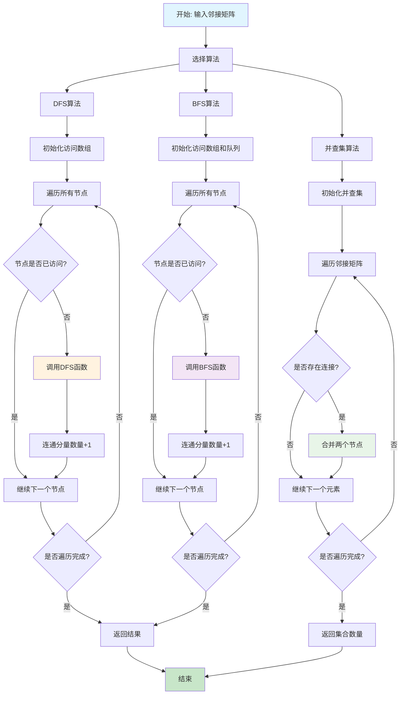
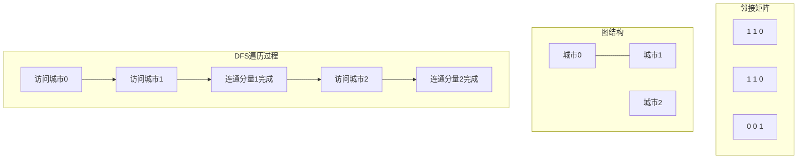
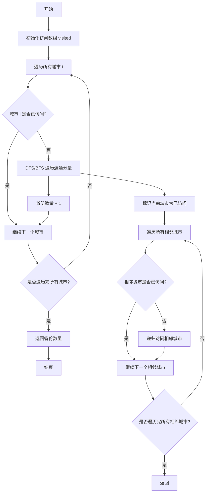

# 547. 省份数量

## 描述

有 n 个城市，其中一些彼此相连，另一些没有相连。如果城市 a 与城市 b 直接相连，且城市 b 与城市 c 直接相连，那么城市 a 与城市 c 间接相连。

省份 是一组直接或间接相连的城市，组内不含其他没有相连的城市。

给你一个 n x n 的矩阵 isConnected ，其中 isConnected[i][j] = 1 表示第 i 个城市和第 j 个城市直接相连，而 isConnected[i][j] = 0 表示二者不直接相连。

返回矩阵中 省份 的数量。

## 示例 1


输入：isConnected = [[1,1,0],[1,1,0],[0,0,1]]
输出：2

## 示例 2


输入：isConnected = [[1,0,0],[0,1,0],[0,0,1]]
输出：3

## 提示

- 1 <= n <= 200
- n == isConnected.length
- n == isConnected[i].length
- isConnected[i][j] 为 1 或 0
- isConnected[i][i] == 1
- isConnected[i][j] == isConnected[j][i]

## 解题思路

### 核心分析

这道题是一个经典的**图论连通性问题**。核心思想是计算无向图中连通分量的数量。

**问题本质**：给定一个无向图的邻接矩阵，计算图中连通分量的个数。

**关键洞察**：
- 每个城市是一个节点，城市间的连接关系构成边
- 省份就是连通分量，即相互可达的节点集合
- 可以通过遍历算法（DFS/BFS）或并查集来求解

### 问题转化

**原始问题**：计算n个城市中省份的数量

**图论转化**：
1. 将城市抽象为图中的节点
2. 将城市间的连接关系抽象为图中的边
3. 省份数量 = 连通分量数量

**数学建模**：
- 节点集合：V = {0, 1, 2, ..., n-1}
- 边集合：E = {(i, j) | isConnected[i][j] = 1}
- 目标：计算图G(V, E)中连通分量的数量

### 算法选择策略

#### 1. 深度优先搜索 (DFS)
- **适用场景**：连通性问题，需要遍历所有可达节点
- **优势**：实现简单，递归清晰，空间效率高
- **劣势**：可能栈溢出，不适合极大数据量

#### 2. 广度优先搜索 (BFS)
- **适用场景**：连通性问题，需要层次遍历
- **优势**：避免栈溢出，适合大数据量
- **劣势**：需要队列空间，实现稍复杂

#### 3. 并查集 (Union-Find)
- **适用场景**：动态连通性问题，需要频繁合并操作
- **优势**：支持动态操作，理论复杂度最优
- **劣势**：实现复杂，常数项较大

### 算法实现详解

#### 方法一：深度优先搜索 (DFS)

**核心思想**：从每个未访问的节点开始，递归访问所有可达节点

**算法步骤**：
1. 初始化访问数组visited，记录每个节点是否被访问
2. 遍历所有节点，对每个未访问的节点：
   - 调用DFS函数访问该节点及其所有可达节点
   - 连通分量数量加1
3. DFS函数实现：
   - 标记当前节点为已访问
   - 遍历所有与当前节点相连的节点
   - 对每个未访问的相连节点递归调用DFS

**代码实现**：
```go
func findCircleNumDFS(isConnected [][]int) int {
    n := len(isConnected)
    if n == 0 {
        return 0
    }

    visited := make([]bool, n)
    count := 0

    for i := 0; i < n; i++ {
        if !visited[i] {
            dfs(isConnected, visited, i)
            count++
        }
    }

    return count
}

func dfs(isConnected [][]int, visited []bool, city int) {
    visited[city] = true
    
    for nextCity := 0; nextCity < len(isConnected); nextCity++ {
        if isConnected[city][nextCity] == 1 && !visited[nextCity] {
            dfs(isConnected, visited, nextCity)
        }
    }
}
```

**时间复杂度分析**：
- 每个节点最多被访问一次：O(n)
- 每次访问需要遍历所有相邻节点：O(n)
- 总时间复杂度：O(n²)

**空间复杂度分析**：
- 访问数组：O(n)
- 递归调用栈深度：O(n)
- 总空间复杂度：O(n)

#### 方法二：广度优先搜索 (BFS)

**核心思想**：使用队列进行层次遍历，访问所有可达节点

**算法步骤**：
1. 初始化访问数组和队列
2. 遍历所有节点，对每个未访问的节点：
   - 将节点加入队列
   - 标记为已访问
   - 连通分量数量加1
   - 执行BFS遍历
3. BFS函数实现：
   - 从队列中取出节点
   - 遍历所有与当前节点相连的节点
   - 将未访问的相连节点加入队列并标记为已访问

**代码实现**：
```go
func findCircleNumBFS(isConnected [][]int) int {
    n := len(isConnected)
    if n == 0 {
        return 0
    }

    visited := make([]bool, n)
    count := 0

    for i := 0; i < n; i++ {
        if !visited[i] {
            bfs(isConnected, visited, i)
            count++
        }
    }

    return count
}

func bfs(isConnected [][]int, visited []bool, startCity int) {
    queue := []int{startCity}
    visited[startCity] = true

    for len(queue) > 0 {
        city := queue[0]
        queue = queue[1:]

        for nextCity := 0; nextCity < len(isConnected); nextCity++ {
            if isConnected[city][nextCity] == 1 && !visited[nextCity] {
                visited[nextCity] = true
                queue = append(queue, nextCity)
            }
        }
    }
}
```

**时间复杂度**：O(n²)
**空间复杂度**：O(n)

#### 方法三：并查集 (Union-Find)

**核心思想**：使用并查集维护连通性，通过合并操作统计连通分量

**算法步骤**：
1. 初始化并查集，每个节点自成一个集合
2. 遍历邻接矩阵，对每个连接关系：
   - 合并相连的两个节点到同一集合
3. 统计最终集合的数量

**并查集优化**：
- **路径压缩**：在查找时压缩路径，减少后续查找时间
- **按秩合并**：将较小的树合并到较大的树上，保持树的平衡

**代码实现**：
```go
type UnionFind struct {
    parent []int
    rank   []int
    count  int
}

func NewUnionFind(n int) *UnionFind {
    parent := make([]int, n)
    rank := make([]int, n)
    
    for i := 0; i < n; i++ {
        parent[i] = i
        rank[i] = 1
    }

    return &UnionFind{
        parent: parent,
        rank:   rank,
        count:  n,
    }
}

func (uf *UnionFind) Find(x int) int {
    if uf.parent[x] != x {
        uf.parent[x] = uf.Find(uf.parent[x]) // 路径压缩
    }
    return uf.parent[x]
}

func (uf *UnionFind) Union(x, y int) {
    rootX := uf.Find(x)
    rootY := uf.Find(y)
    
    if rootX == rootY {
        return
    }

    // 按秩合并
    if uf.rank[rootX] < uf.rank[rootY] {
        uf.parent[rootX] = rootY
    } else if uf.rank[rootX] > uf.rank[rootY] {
        uf.parent[rootY] = rootX
    } else {
        uf.parent[rootY] = rootX
        uf.rank[rootX]++
    }
    
    uf.count--
}

func (uf *UnionFind) Count() int {
    return uf.count
}
```

**时间复杂度**：O(n² × α(n))，其中α(n)是阿克曼函数的反函数
**空间复杂度**：O(n)

### 算法选择

#### 1. 深度优先搜索 (DFS)
- **时间复杂度**：O(n²)，其中 n 是城市数量
- **空间复杂度**：O(n)，递归调用栈的深度
- **适用场景**：适合处理连通性问题

#### 2. 广度优先搜索 (BFS)
- **时间复杂度**：O(n²)
- **空间复杂度**：O(n)，队列的空间
- **适用场景**：适合处理连通性问题，避免递归栈溢出

#### 3. 并查集 (Union-Find)
- **时间复杂度**：O(n² × α(n))，其中 α(n) 是阿克曼函数的反函数
- **空间复杂度**：O(n)
- **适用场景**：适合处理动态连通性问题

### 数学证明

#### 并查集正确性证明

**定理**：并查集算法能正确计算连通分量的数量。

**证明**：
1. **初始化正确性**：
   - 初始时每个节点自成一个集合
   - 集合数量等于节点数量

2. **合并操作正确性**：
   - 每次合并操作将两个连通分量合并为一个
   - 集合数量减少1

3. **最终结果正确性**：
   - 所有相连的节点都在同一集合中
   - 不同连通分量的节点在不同集合中
   - 集合数量等于连通分量数量

#### 时间复杂度分析

**定理**：并查集算法的时间复杂度为O(n² × α(n))。

**证明**：
- 每个节点最多参与n次合并操作
- 每次合并操作的时间复杂度为O(α(n))
- 总时间复杂度为O(n² × α(n))

### 执行流程图



### 算法可视化



### 实际应用

1. **社交网络分析**：计算朋友圈的数量
2. **网络拓扑分析**：计算网络中的连通区域
3. **地理信息系统**：计算地理区域的连通性
4. **电路设计**：分析电路的连通性
5. **生物信息学**：分析蛋白质相互作用网络

### 算法优化技巧

#### 1. 内存优化
```go
// 使用位运算优化访问数组
visited := make([]uint64, (n+63)/64)
```

#### 2. 早期终止
```go
// 如果所有节点都已访问，可以提前终止
if count == n {
    return 1
}
```

#### 3. 对称性利用
```go
// 利用邻接矩阵的对称性，只遍历上三角
for i := 0; i < n; i++ {
    for j := i + 1; j < n; j++ {
        if isConnected[i][j] == 1 {
            // 处理连接关系
        }
    }
}
```

### 扩展思考

1. **有向图**：如果是有向图，如何计算强连通分量？
2. **加权图**：如果边有权重，如何定义连通性？
3. **动态图**：如果图结构动态变化，如何维护连通性？
4. **大规模图**：对于超大规模图，如何优化算法？
5. **并行算法**：如何设计并行版本的连通分量算法？

### 相关问题

1. **200. 岛屿数量**：二维网格中的连通分量问题
2. **130. 被围绕的区域**：连通分量的边界处理
3. **399. 除法求值**：带权图的连通性问题
4. **684. 冗余连接**：并查集在最小生成树中的应用
5. **685. 冗余连接 II**：有向图的连通性问题

### 测试用例设计

```go
// 基础测试用例
isConnected1 := [][]int{
    {1, 1, 0},
    {1, 1, 0},
    {0, 0, 1},
}
expected1 := 2

isConnected2 := [][]int{
    {1, 0, 0},
    {0, 1, 0},
    {0, 0, 1},
}
expected2 := 3

// 边界测试
isConnected3 := [][]int{{1}}
expected3 := 1

var isConnected4 [][]int
expected4 := 0

// 极值测试
isConnected5 := [][]int{
    {1, 1, 1},
    {1, 1, 1},
    {1, 1, 1},
}
expected5 := 1

// 复杂情况
isConnected6 := [][]int{
    {1, 0, 0, 1},
    {0, 1, 1, 0},
    {0, 1, 1, 1},
    {1, 0, 1, 1},
}
expected6 := 1
```

### 性能对比

| 算法   | 时间复杂度   | 空间复杂度 | 常数项 | 适用场景   |
| ------ | ------------ | ---------- | ------ | ---------- |
| DFS    | O(n²)        | O(n)       | 小     | 一般情况   |
| BFS    | O(n²)        | O(n)       | 中等   | 大数据量   |
| 并查集 | O(n² × α(n)) | O(n)       | 大     | 动态连通性 |

### 常见错误

1. **访问标记错误**：忘记标记节点为已访问
2. **递归终止错误**：递归函数没有正确的终止条件
3. **数组越界**：访问邻接矩阵时越界
4. **并查集初始化错误**：parent数组初始化不正确
5. **边界处理错误**：没有正确处理空矩阵或单个节点

### 总结

**省份数量** 是一道经典的**图论连通性问题**，核心在于理解连通分量的概念和计算算法。

**最优解法**是**DFS或BFS算法**，具有以下优势：
1. **时间复杂度合理**：O(n²)
2. **实现简单**：递归或队列遍历
3. **空间效率高**：只需要O(n)额外空间
4. **应用广泛**：是图遍历的经典模板题

这道题体现了**图论算法**中的重要思想：
- **连通性分析**：通过遍历确定节点间的可达性
- **访问标记**：避免重复访问，提高算法效率
- **问题建模**：将实际问题抽象为图论问题

**并查集算法**虽然理论复杂度最优，但在实际应用中，由于常数项较大，对于中等规模的问题，DFS/BFS算法往往更实用。

### 算法流程图



### 详细解题步骤

#### 方法一：深度优先搜索 (DFS)

1. **初始化**：创建访问数组 `visited`，记录每个城市是否被访问过
2. **遍历城市**：从每个未访问的城市开始进行DFS
3. **DFS过程**：
   - 标记当前城市为已访问
   - 遍历所有与当前城市相连的城市
   - 对每个未访问的相连城市递归调用DFS
4. **计数**：每次开始新的DFS时，省份数量加1

#### 方法二：广度优先搜索 (BFS)

1. **初始化**：创建访问数组和队列
2. **遍历城市**：从每个未访问的城市开始进行BFS
3. **BFS过程**：
   - 将当前城市加入队列
   - 标记为已访问
   - 从队列中取出城市，遍历其所有相连城市
   - 将未访问的相连城市加入队列
4. **计数**：每次开始新的BFS时，省份数量加1

#### 方法三：并查集 (Union-Find)

1. **初始化**：创建并查集，每个城市自成一个集合
2. **合并操作**：遍历邻接矩阵，将相连的城市合并到同一集合
3. **统计集合**：统计最终有多少个不同的集合

### 复杂度分析

| 方法   | 时间复杂度   | 空间复杂度 | 优势               | 劣势       |
| ------ | ------------ | ---------- | ------------------ | ---------- |
| DFS    | O(n²)        | O(n)       | 实现简单，递归清晰 | 可能栈溢出 |
| BFS    | O(n²)        | O(n)       | 避免栈溢出         | 需要队列   |
| 并查集 | O(n² × α(n)) | O(n)       | 适合动态连通性     | 实现复杂   |

### 边界情况处理

1. **空矩阵**：返回0
2. **单个城市**：返回1
3. **所有城市都不相连**：返回n
4. **所有城市都相连**：返回1

### 优化技巧

1. **提前返回**：如果所有城市都已访问，可以提前结束
2. **对称性利用**：由于是无向图，邻接矩阵是对称的
3. **内存优化**：使用位运算优化访问数组的存储
