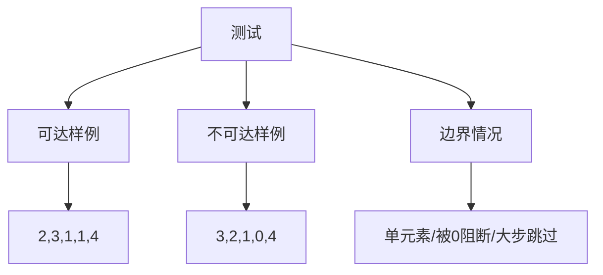

# 55. 跳跃游戏

## 题目描述

给你一个非负整数数组 nums ，你最初位于数组的 第一个下标 。数组中的每个元素代表你在该位置可以跳跃的最大长度。

判断你是否能够到达最后一个下标，如果可以，返回 true ；否则，返回 false 。

## 示例 1：

输入：nums = [2,3,1,1,4]
输出：true
解释：可以先跳 1 步，从下标 0 到达下标 1, 然后再从下标 1 跳 3 步到达最后一个下标。

## 示例 2：

输入：nums = [3,2,1,0,4]
输出：false
解释：无论怎样，总会到达下标为 3 的位置。但该下标的最大跳跃长度是 0 ， 所以永远不可能到达最后一个下标。

## 提示：

- 1 <= nums.length <= 10^4
- 0 <= nums[i] <= 10^5

## 解题思路

### 一、问题本质与建模

将每个位置 `i` 看作一“跳板”，可直接把你送到区间 `[i+1, i+nums[i]]` 中的任意位置（含边界）。问题转化为：从起点 `0` 出发，是否存在一条“跳板链”使得你可以覆盖到 `n-1`。这天然是一个“可达性”问题。

直觉上，只要我们始终维护“从已访问过的所有位置出发，能到达的最远下标”，就能判断是否触达终点。这便是贪心策略的核心：每前进一步，就尽力扩展我们能到达的“最远边界”。

### 二、方法总览与选择

```mermaid
graph TD
    A[跳跃游戏 方法选择] --> B[贪心: 维护最远可达]
    A --> C[反向贪心: 收缩 lastGood]
    A --> D[DP: 从后往前可达性]
    B --> E[O(n)时间 O(1)空间 最优]
    C --> F[O(n)时间 O(1)空间 等价视角]
    D --> G[O(n^2)时间 O(n)空间 仅教学]
```

- 贪心（正向）：迭代 `i` 并维护 `farthest = max(farthest, i + nums[i])`
- 反向贪心：维护“必须到达”的最右位置 `lastGood`，若 `i + nums[i] >= lastGood` 则 `lastGood = i`
- DP：`dp[i] = OR(dp[j])` for `j in (i, i+nums[i]]`，直观但最坏 O(n²)

### 三、贪心算法的正确性（直观解释 + 循环不变式）

1) 直观解释（区间扩展模型）
- 在第 `i` 步之前，我们已经保证所有 `<= i` 的点都“被访问过”（即可达）。
- 访问 `i` 时，`i` 能贡献的新可达区间为 `[i+1, i+nums[i]]`，因此最远可达位置应被更新为 `max(farthest, i+nums[i])`。
- 一旦 `farthest >= n-1`，说明终点被区间覆盖，立即返回 `true`。

2) 循环不变式（关键性质）
- 不变式：在进入第 `i` 次循环时，`[0, i]` 中所有点均可达，且 `farthest` 是这些点能共同“覆盖”的最远下标。
- 维持：若 `i <= farthest`，则 `i` 可达；更新 `farthest = max(farthest, i+nums[i])` 后，不变式对 `i+1` 继续成立。
- 违例检测：若出现 `i > farthest`，说明 `i` 不可达，不变式被打破，也就不可能再扩展任何区间，直接返回 `false`。

3) 最优性与“局部最优 -> 全局最优”
- 我们在每一步都“尽可能把可达区间向右扩展”，这是天然的局部最优。
- 对于可达性问题，是否能到达终点仅依赖“区间最右端”。局部最优的持续累积，直接决定全局可达性，因此贪心是最优解。

### 四、反向贪心：等价但有启发的视角

从右向左设定 `lastGood = n-1`，若 `i + nums[i] >= lastGood`，则从 `i` 出发可以到达 `lastGood`，因此把“必须到达”的点收缩为更靠左的 `i`。最后若 `lastGood == 0`，说明起点可达。这与正向贪心等价，但从“目标回溯”的角度更易让人信服。

### 五、与动态规划的对比与误区澄清

- DP 的状态非常自然，但转移需要枚举可跳范围，导致最坏 O(n²)。在 `n=10^4` 的上限下会超时或性能很差。
- 有同学会尝试 BFS/最短路，但本题不问“最少步数”，只问“能否到达”，贪心一次扫描即可。
- 另一些做法会“实际模拟每一次跳跃”，容易漏掉“从更靠后的位置起跳能跳得更远”的可能性；贪心用区间端点统一管理，避免了这种陷阱。

### 六、过程可视化（示例一）

以 `nums = [2,3,1,1,4]` 为例：

| i | nums[i] | farthest(更新前) | 能覆盖的新右端 | farthest(更新后) | 结论 |
|---|---------|------------------|---------------|------------------|------|
| 0 | 2       | 0                | 0+2=2         | 2                | 可达 |
| 1 | 3       | 2                | 1+3=4         | 4                | 可达，已>=4 返回true |

在 `i=1` 时即可确定答案，早停是工程实现的重要优化点。

### 七、边界与坑点汇总

- `n=1`（单元素）：必定 `true`
- 出现长串 `0`：只要 `0` 左边的某个位置能一次“跨越”它们即可；否则在 `i > farthest` 时返回 `false`
- 大数值：无需担心溢出，`i + nums[i]` 在 `int` 范围内，且只与数组长度比较
- 早停：一旦 `farthest >= n-1`，即可直接返回 `true`

### 八、复杂度与工程实践

- 时间复杂度：O(n)。每个位置只访问一次，且仅进行 O(1) 更新
- 空间复杂度：O(1)。只维护少量标量变量
- 工程建议：
  - 使用早停减少不必要的循环
  - 保持变量语义清晰（如 `farthest`、`lastGood`），利于代码可读性与维护

### 九、相关变体与延伸

- Jump Game II（最少跳跃次数）：层次 BFS/贪心分层更新可解，注意与本题“可达性判断”的区别
- Jump Game III（含负数与图可达性）：需要访问标记避免重复，更多是图搜索问题
- 带代价/概率的跳跃：演化为最短路/期望优化等问题

### 十、常见面试追问（简答）

- 为什么贪心正确？因为“能否到达”只与区间最右端相关，持续取最大右端的策略能完整保留一切潜在可达路径的信息（循环不变式保证）。
- 为什么不用 DP？DP 的最坏时间 O(n²)，本题可用 O(n) 解法，工程上应优先选贪心。
- 有反例吗？对于“只问可达性”的版本，贪心没有反例；但若问“最少步数”，需要不同策略（分层贪心/ BFS）。

## 代码实现

完整可运行代码见 `main.go`，包含三种方法（贪心、反向贪心、DP）和测试/小型性能对比。

示例片段（贪心）：

```go
func canJumpGreedy(nums []int) bool {
    farthest := 0
    for i := 0; i < len(nums); i++ {
        if i > farthest {
            return false
        }
        if i+nums[i] > farthest {
            farthest = i + nums[i]
        }
        if farthest >= len(nums)-1 {
            return true
        }
    }
    return true
}
```

## 测试用例设计



建议覆盖：
- 基础示例（题目给定）
- 被 0 阻断导致不可达
- 单元素 0、全 1、首位一次大跳

## 小结

- 本质是“区间可达性”问题，维护“最远可达端点”即可一次扫描判定
- 贪心与反向贪心等价，前者便于实现，后者便于论证
- DP 直观但性能差，保留为思路对比和单元测试的参照
