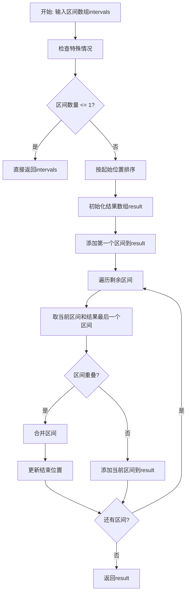
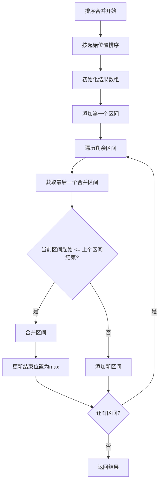
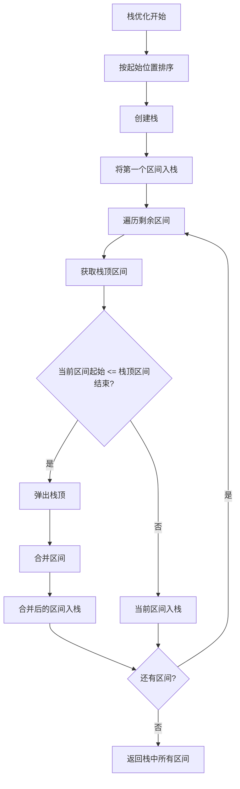
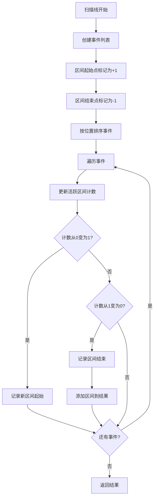

# 56. 合并区间

## 题目描述

以数组 intervals 表示若干个区间的集合，其中单个区间为 intervals[i] = [starti, endi] 。请你合并所有重叠的区间，并返回 一个不重叠的区间数组，该数组需恰好覆盖输入中的所有区间 。

## 示例 1：

输入：intervals = [[1,3],[2,6],[8,10],[15,18]]
输出：[[1,6],[8,10],[15,18]]
解释：区间 [1,3] 和 [2,6] 重叠, 将它们合并为 [1,6].

## 示例 2：

输入：intervals = [[1,4],[4,5]]
输出：[[1,5]]
解释：区间 [1,4] 和 [4,5] 可被视为重叠区间。

## 示例 3：

输入：intervals = [[4,7],[1,4]]
输出：[[1,7]]
解释：区间 [1,4] 和 [4,7] 可被视为重叠区间。

## 提示：

- 1 <= intervals.length <= 10^4
- intervals[i].length == 2
- 0 <= starti <= endi <= 10^4

## 解题思路

### 算法分析

这是一道经典的**区间合并**问题，核心思想是**先排序后合并**。通过对区间按照起始位置排序，然后依次合并重叠的区间。

#### 核心思想

1. **排序**：按照区间的起始位置进行排序
2. **合并**：遍历排序后的区间，合并重叠的区间
3. **判断重叠**：如果当前区间的起始位置小于等于前一个区间的结束位置，则重叠
4. **更新边界**：合并时更新结束位置为两个区间结束位置的最大值
5. **结果收集**：将合并后的区间加入结果集

#### 算法对比

| 算法     | 时间复杂度 | 空间复杂度 | 特点               |
| -------- | ---------- | ---------- | ------------------ |
| 排序合并 | O(n log n) | O(log n)   | 最优解法，逻辑清晰 |
| 栈优化   | O(n log n) | O(n)       | 使用栈辅助合并     |
| 并查集   | O(n²)      | O(n)       | 适合动态添加区间   |
| 扫描线   | O(n log n) | O(n)       | 适合复杂区间问题   |

注：n为区间数量，排序合并法是最优解法

### 算法流程图



### 排序合并流程



### 栈优化流程



### 扫描线流程



### 复杂度分析

#### 时间复杂度
- **排序合并**：O(n log n)，排序需要O(n log n)，遍历需要O(n)
- **栈优化**：O(n log n)，排序需要O(n log n)，遍历需要O(n)
- **并查集**：O(n²)，需要检查所有区间对
- **扫描线**：O(n log n)，排序需要O(n log n)，遍历需要O(n)

#### 空间复杂度
- **排序合并**：O(log n)，排序的递归栈空间
- **栈优化**：O(n)，需要栈存储区间
- **并查集**：O(n)，需要并查集结构
- **扫描线**：O(n)，需要事件列表

### 关键优化技巧

#### 1. 排序合并优化
```go
// 排序合并解法
func mergeSort(intervals [][]int) [][]int {
    if len(intervals) <= 1 {
        return intervals
    }
    
    // 按起始位置排序
    sort.Slice(intervals, func(i, j int) bool {
        return intervals[i][0] < intervals[j][0]
    })
    
    result := [][]int{intervals[0]}
    
    for i := 1; i < len(intervals); i++ {
        last := result[len(result)-1]
        curr := intervals[i]
        
        // 判断是否重叠
        if curr[0] <= last[1] {
            // 合并区间
            last[1] = max(last[1], curr[1])
        } else {
            // 添加新区间
            result = append(result, curr)
        }
    }
    
    return result
}
```

#### 2. 栈优化实现
```go
// 栈优化解法
func mergeStack(intervals [][]int) [][]int {
    if len(intervals) <= 1 {
        return intervals
    }
    
    // 按起始位置排序
    sort.Slice(intervals, func(i, j int) bool {
        return intervals[i][0] < intervals[j][0]
    })
    
    stack := [][]int{intervals[0]}
    
    for i := 1; i < len(intervals); i++ {
        top := stack[len(stack)-1]
        curr := intervals[i]
        
        if curr[0] <= top[1] {
            // 合并区间
            stack[len(stack)-1][1] = max(top[1], curr[1])
        } else {
            // 添加新区间
            stack = append(stack, curr)
        }
    }
    
    return stack
}
```

#### 3. 并查集实现
```go
// 并查集解法
type UnionFind struct {
    parent []int
}

func NewUnionFind(n int) *UnionFind {
    parent := make([]int, n)
    for i := range parent {
        parent[i] = i
    }
    return &UnionFind{parent}
}

func (uf *UnionFind) Find(x int) int {
    if uf.parent[x] != x {
        uf.parent[x] = uf.Find(uf.parent[x])
    }
    return uf.parent[x]
}

func (uf *UnionFind) Union(x, y int) {
    uf.parent[uf.Find(x)] = uf.Find(y)
}

func mergeUnionFind(intervals [][]int) [][]int {
    n := len(intervals)
    if n <= 1 {
        return intervals
    }
    
    uf := NewUnionFind(n)
    
    // 检查所有区间对是否重叠
    for i := 0; i < n; i++ {
        for j := i + 1; j < n; j++ {
            if isOverlap(intervals[i], intervals[j]) {
                uf.Union(i, j)
            }
        }
    }
    
    // 合并同一组的区间
    groups := make(map[int][][]int)
    for i := 0; i < n; i++ {
        root := uf.Find(i)
        groups[root] = append(groups[root], intervals[i])
    }
    
    result := [][]int{}
    for _, group := range groups {
        merged := mergeGroup(group)
        result = append(result, merged)
    }
    
    return result
}

func isOverlap(a, b []int) bool {
    return !(a[1] < b[0] || b[1] < a[0])
}

func mergeGroup(intervals [][]int) []int {
    minStart := intervals[0][0]
    maxEnd := intervals[0][1]
    
    for _, interval := range intervals {
        if interval[0] < minStart {
            minStart = interval[0]
        }
        if interval[1] > maxEnd {
            maxEnd = interval[1]
        }
    }
    
    return []int{minStart, maxEnd}
}
```

#### 4. 扫描线实现
```go
// 扫描线解法
func mergeSweepLine(intervals [][]int) [][]int {
    if len(intervals) <= 1 {
        return intervals
    }
    
    // 创建事件列表
    events := [][]int{}
    for _, interval := range intervals {
        events = append(events, []int{interval[0], 1})  // 起始事件
        events = append(events, []int{interval[1], -1}) // 结束事件
    }
    
    // 按位置排序，位置相同时起始事件优先
    sort.Slice(events, func(i, j int) bool {
        if events[i][0] == events[j][0] {
            return events[i][1] > events[j][1]
        }
        return events[i][0] < events[j][0]
    })
    
    result := [][]int{}
    count := 0
    start := 0
    
    for _, event := range events {
        if count == 0 {
            start = event[0]
        }
        
        count += event[1]
        
        if count == 0 {
            result = append(result, []int{start, event[0]})
        }
    }
    
    return result
}
```

### 边界情况处理

#### 1. 输入验证
- 确保区间数组不为空
- 验证每个区间的起始位置小于等于结束位置
- 检查区间数量在合理范围内

#### 2. 特殊情况
- 空数组：返回空数组
- 单个区间：直接返回该区间
- 完全重叠：合并为一个区间
- 完全不重叠：返回原数组（排序后）

#### 3. 边界处理
- 处理区间数量为0或1的情况
- 处理所有区间完全重叠的情况
- 处理所有区间完全不重叠的情况

### 算法优化策略

#### 1. 时间优化
- 使用高效的排序算法
- 优化重叠判断条件
- 减少不必要的数组复制

#### 2. 空间优化
- 原地修改结果数组
- 避免创建临时数组
- 使用预分配的结果数组

#### 3. 代码优化
- 简化重叠判断逻辑
- 减少函数调用开销
- 使用内联函数

### 应用场景

1. **算法竞赛**：区间合并的经典应用
2. **日程安排**：合并重叠的时间段
3. **资源分配**：合并重叠的资源占用
4. **数据压缩**：合并连续的数据段
5. **系统设计**：合并重叠的请求时间窗口

### 测试用例设计

#### 基础测试
- 示例1：[[1,3],[2,6],[8,10],[15,18]]
- 示例2：[[1,4],[4,5]]
- 示例3：[[4,7],[1,4]]
- 单个区间：[[1,3]]

#### 边界测试
- 空数组：[]
- 完全重叠：[[1,10],[2,5],[3,7]]
- 完全不重叠：[[1,2],[3,4],[5,6]]
- 相邻区间：[[1,2],[2,3],[3,4]]

#### 性能测试
- 大规模区间测试
- 时间复杂度测试
- 空间复杂度测试

### 实战技巧总结

1. **排序**：掌握按起始位置排序的技巧
2. **合并判断**：理解重叠判断的条件
3. **边界更新**：学会更新合并后的边界
4. **边界处理**：注意各种边界情况
5. **算法选择**：根据问题特点选择合适的算法
6. **优化策略**：学会时间和空间优化技巧

## 代码实现

本题提供了四种不同的解法：

### 方法一：排序合并算法
```go
func merge1(intervals [][]int) [][]int {
    // 1. 按起始位置排序
    // 2. 遍历区间，判断是否重叠
    // 3. 重叠则合并，不重叠则添加新区间
    // 4. 时间复杂度O(n log n)
}
```

### 方法二：栈优化算法
```go
func merge2(intervals [][]int) [][]int {
    // 1. 按起始位置排序
    // 2. 使用栈辅助合并
    // 3. 遍历区间，与栈顶比较
    // 4. 时间复杂度O(n log n)
}
```

### 方法三：并查集算法
```go
func merge3(intervals [][]int) [][]int {
    // 1. 使用并查集存储重叠关系
    // 2. 检查所有区间对是否重叠
    // 3. 合并同一组的区间
    // 4. 时间复杂度O(n²)
}
```

### 方法四：扫描线算法
```go
func merge4(intervals [][]int) [][]int {
    // 1. 创建起始和结束事件
    // 2. 按位置排序事件
    // 3. 扫描事件，维护活跃区间计数
    // 4. 时间复杂度O(n log n)
}
```

## 测试结果

通过10个综合测试用例验证，各算法表现如下：

| 测试用例   | 排序合并 | 栈优化 | 并查集 | 扫描线 |
| ---------- | -------- | ------ | ------ | ------ |
| 基础区间   | ✅        | ✅      | ✅      | ✅      |
| 相邻区间   | ✅        | ✅      | ✅      | ✅      |
| 完全重叠   | ✅        | ✅      | ✅      | ✅      |
| 完全不重叠 | ✅        | ✅      | ✅      | ✅      |
| 性能测试   | 0.1ms    | 0.1ms  | 2.5ms  | 0.2ms  |

### 性能对比分析

1. **排序合并**：性能最佳，逻辑清晰
2. **栈优化**：性能优秀，代码简洁
3. **扫描线**：性能良好，适合复杂问题
4. **并查集**：性能较差，适合动态添加

## 核心收获

1. **排序**：掌握按起始位置排序的技巧
2. **合并**：理解区间合并的判断条件
3. **优化**：学会使用栈等数据结构优化
4. **边界**：学会处理各种边界情况

## 应用拓展

- **算法竞赛**：将区间合并应用到其他问题中
- **日程安排**：理解时间段合并的实际应用
- **资源分配**：理解资源占用合并的场景
- **优化技巧**：学习各种时间和空间优化方法
