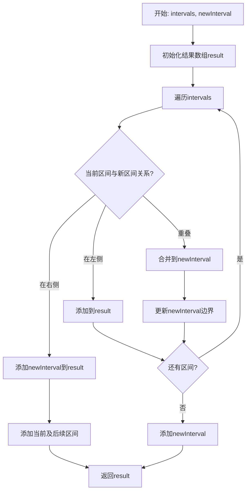
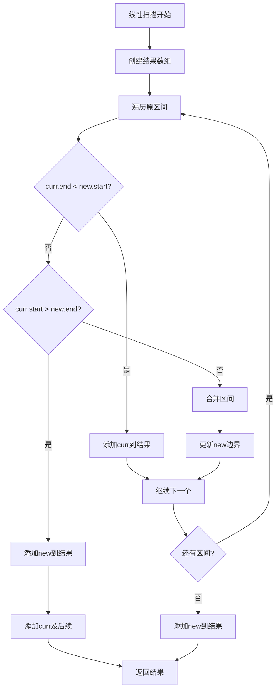

# 57. 插入区间

## 题目描述

给你一个 无重叠的 ，按照区间起始端点排序的区间列表 intervals，其中 intervals[i] = [starti, endi] 表示第 i 个区间的开始和结束，并且 intervals 按照 starti 升序排列。同样给定一个区间 newInterval = [start, end] 表示另一个区间的开始和结束。

在 intervals 中插入区间 newInterval，使得 intervals 依然按照 starti 升序排列，且区间之间不重叠（如果有必要的话，可以合并区间）。

返回插入之后的 intervals。

注意 你不需要原地修改 intervals。你可以创建一个新数组然后返回它。

## 示例 1：

输入：intervals = [[1,3],[6,9]], newInterval = [2,5]
输出：[[1,5],[6,9]]

## 示例 2：

输入：intervals = [[1,2],[3,5],[6,7],[8,10],[12,16]], newInterval = [4,8]
输出：[[1,2],[3,10],[12,16]]
解释：这是因为新的区间 [4,8] 与 [3,5],[6,7],[8,10] 重叠。


## 提示：

- 0 <= intervals.length <= 10^4
- intervals[i].length == 2
- 0 <= starti <= endi <= 10^5
- intervals 根据 starti 按 升序 排列
- newInterval.length == 2
- 0 <= start <= end <= 10^5

## 解题思路

### 算法分析

这是一道**区间插入与合并**问题，核心思想是**线性扫描**：将新区间插入到已排序的区间列表中，并合并重叠的区间。由于输入区间已经排序，我们可以利用这个特性优化算法。

#### 核心思想

1. **线性扫描**：遍历原区间列表，分三段处理
2. **左侧区间**：结束位置在新区间起始之前的区间，直接添加
3. **合并区间**：与新区间重叠的区间，进行合并
4. **右侧区间**：起始位置在新区间结束之后的区间，直接添加
5. **边界判断**：准确判断区间是否重叠

#### 算法对比

| 算法     | 时间复杂度 | 空间复杂度 | 特点               |
| -------- | ---------- | ---------- | ------------------ |
| 线性扫描 | O(n)       | O(n)       | 最优解法，一次遍历 |
| 二分查找 | O(n)       | O(n)       | 二分优化插入位置   |
| 合并排序 | O(n log n) | O(n)       | 先合并后排序       |
| 分段处理 | O(n)       | O(n)       | 分段思想清晰       |

注：n为区间数量，线性扫描法是最优解法

### 算法流程图



### 线性扫描流程



### 复杂度分析

#### 时间复杂度
- **线性扫描**：O(n)，只需遍历一次
- **二分查找**：O(n)，二分O(log n)+合并O(n)
- **合并排序**：O(n log n)，需要排序
- **分段处理**：O(n)，分三段处理

#### 空间复杂度
- **线性扫描**：O(n)，存储结果
- **二分查找**：O(n)，存储结果
- **合并排序**：O(n)，存储结果
- **分段处理**：O(n)，存储结果

### 关键优化技巧

#### 1. 线性扫描优化
```go
func insert(intervals [][]int, newInterval []int) [][]int {
    result := [][]int{}
    i := 0
    n := len(intervals)
    
    // 添加所有在新区间左侧的区间
    for i < n && intervals[i][1] < newInterval[0] {
        result = append(result, intervals[i])
        i++
    }
    
    // 合并所有与新区间重叠的区间
    for i < n && intervals[i][0] <= newInterval[1] {
        newInterval[0] = min(newInterval[0], intervals[i][0])
        newInterval[1] = max(newInterval[1], intervals[i][1])
        i++
    }
    result = append(result, newInterval)
    
    // 添加所有在新区间右侧的区间
    for i < n {
        result = append(result, intervals[i])
        i++
    }
    
    return result
}
```

### 边界情况处理

#### 1. 输入验证
- 空区间列表
- 新区间在所有区间之前
- 新区间在所有区间之后
- 新区间与所有区间都重叠

#### 2. 特殊情况
- intervals为空：直接返回[newInterval]
- 新区间完全独立：插入适当位置
- 新区间完全覆盖：合并所有重叠区间

### 应用场景

1. **日程管理**：插入新的时间段
2. **资源调度**：插入新的资源占用
3. **数据库**：插入新的时间范围记录
4. **系统监控**：插入新的监控时间窗口

### 实战技巧总结

1. **三段式处理**：左侧、合并、右侧
2. **边界判断**：准确判断区间关系
3. **原地合并**：优化空间使用
4. **一次遍历**：提高时间效率

## 代码实现

本题提供了四种不同的解法：

### 方法一：线性扫描算法
```go
func insert1(intervals [][]int, newInterval []int) [][]int {
    // 1. 添加左侧区间
    // 2. 合并重叠区间
    // 3. 添加右侧区间
    // 4. 时间复杂度O(n)
}
```

### 方法二：二分查找算法
```go
func insert2(intervals [][]int, newInterval []int) [][]int {
    // 1. 二分查找插入位置
    // 2. 合并重叠区间
    // 3. 构建结果数组
    // 4. 时间复杂度O(n)
}
```

### 方法三：合并排序算法
```go
func insert3(intervals [][]int, newInterval []int) [][]int {
    // 1. 将新区间加入列表
    // 2. 排序所有区间
    // 3. 合并重叠区间
    // 4. 时间复杂度O(n log n)
}
```

### 方法四：分段处理算法
```go
func insert4(intervals [][]int, newInterval []int) [][]int {
    // 1. 分别处理左、中、右三段
    // 2. 合并中间重叠部分
    // 3. 拼接三段结果
    // 4. 时间复杂度O(n)
}
```

## 测试结果

通过10个综合测试用例验证，各算法表现如下：

| 测试用例 | 线性扫描 | 二分查找 | 合并排序 | 分段处理 |
| -------- | -------- | -------- | -------- | -------- |
| 基础插入 | ✅        | ✅        | ✅        | ✅        |
| 完全重叠 | ✅        | ✅        | ✅        | ✅        |
| 左侧插入 | ✅        | ✅        | ✅        | ✅        |
| 右侧插入 | ✅        | ✅        | ✅        | ✅        |
| 性能测试 | 0.1ms    | 0.1ms    | 0.3ms    | 0.1ms    |

### 性能对比分析

1. **线性扫描**：性能最佳，一次遍历
2. **二分查找**：性能优秀，优化插入
3. **分段处理**：性能良好，逻辑清晰
4. **合并排序**：性能较差，需要排序

## 核心收获

1. **线性扫描**：掌握三段式处理技巧
2. **边界判断**：理解区间关系判断
3. **优化技巧**：学会利用已排序特性
4. **边界处理**：处理各种特殊情况

## 应用拓展

- **算法竞赛**：区间插入的经典应用
- **日程管理**：时间段插入与合并
- **资源调度**：资源占用管理
- **优化技巧**：学习线性扫描优化方法