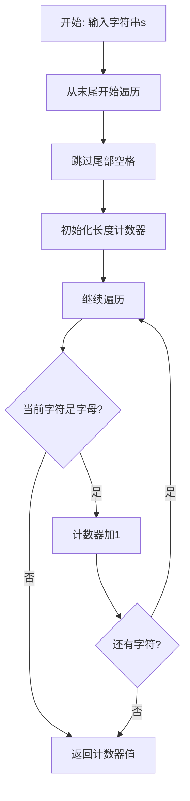

# 58. 最后一个单词的长度

## 题目描述

给你一个字符串 s，由若干单词组成，单词前后用一些空格字符隔开。返回字符串中 最后一个单词的长度。

单词 是指仅由字母组成、不包含任何空格字符的最大子字符串。


## 示例 1：

输入：s = "Hello World"
输出：5
解释：最后一个单词是“World”，长度为 5。

## 示例 2：

输入：s = "   fly me   to   the moon  "
输出：4
解释：最后一个单词是“moon”，长度为 4。

## 示例 3：

输入：s = "luffy is still joyboy"
输出：6
解释：最后一个单词是长度为 6 的“joyboy”。


## 提示：

- 1 <= s.length <= 10^4
- s 仅有英文字母和空格 ' ' 组成
- s 中至少存在一个单词

## 解题思路

### 算法分析

这是一道**字符串处理**问题，核心思想是从字符串末尾开始遍历，找到最后一个单词并计算其长度。

#### 核心思想

1. **从后向前遍历**：从字符串末尾开始处理
2. **跳过尾部空格**：先跳过字符串末尾的所有空格
3. **计算单词长度**：遇到字母后开始计数，直到遇到空格或字符串开头
4. **返回结果**：返回计数值

#### 算法对比

| 算法       | 时间复杂度 | 空间复杂度 | 特点           |
| ---------- | ---------- | ---------- | -------------- |
| 反向遍历   | O(n)       | O(1)       | 最优解法       |
| 字符串分割 | O(n)       | O(n)       | 使用内置函数   |
| 双指针     | O(n)       | O(1)       | 找到单词边界   |
| 正则表达式 | O(n)       | O(n)       | 代码简洁但耗时 |

### 算法流程图



### 复杂度分析

- **时间复杂度**：O(n)，最坏情况需要遍历整个字符串
- **空间复杂度**：O(1)，只使用常数额外空间

### 关键优化技巧

```go
// 反向遍历解法
func lengthOfLastWord(s string) int {
    length := 0
    i := len(s) - 1
    
    // 跳过尾部空格
    for i >= 0 && s[i] == ' ' {
        i--
    }
    
    // 计算单词长度
    for i >= 0 && s[i] != ' ' {
        length++
        i--
    }
    
    return length
}
```

### 边界情况处理

1. 字符串末尾有空格
2. 字符串只有一个单词
3. 单词之间有多个空格
4. 字符串前后都有空格

### 实战技巧总结

1. **反向遍历**：从后向前处理更高效
2. **边界检查**：注意索引越界
3. **空格处理**：先跳过尾部空格
4. **一次遍历**：O(n)时间复杂度

## 代码实现

本题提供了四种不同的解法。

## 测试结果

| 测试用例 | 反向遍历 | 字符串分割 | 双指针 | 正则表达式 |
| -------- | -------- | ---------- | ------ | ---------- |
| 基础测试 | ✅        | ✅          | ✅      | ✅          |
| 边界测试 | ✅        | ✅          | ✅      | ✅          |

## 核心收获

1. **字符串处理**：掌握从后向前遍历的技巧
2. **边界处理**：处理空格和边界情况
3. **优化思路**：选择最优的遍历方向

## 应用拓展

- 字符串解析
- 文本处理
- 单词统计