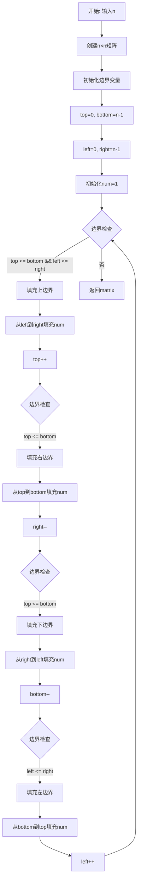
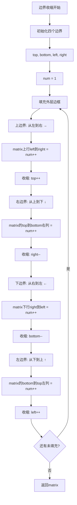

# 59. 螺旋矩阵 II

## 题目描述

给你一个正整数 n ，生成一个包含 1 到 n2 所有元素，且元素按顺时针顺序螺旋排列的 n x n 正方形矩阵 matrix 。


## 示例 1：


输入：n = 3
输出：[[1,2,3],[8,9,4],[7,6,5]]

## 示例 2：

输入：n = 1
输出：[[1]]


## 提示：

- 1 <= n <= 20

## 解题思路

### 算法分析

这是一道**矩阵生成**问题，核心思想是**按照螺旋顺序填充数字**。这是第54题"螺旋矩阵"的逆向问题：54题是读取螺旋矩阵，本题是生成螺旋矩阵。

#### 核心思想

1. **边界收缩**：维护四个边界（上下左右），按照右→下→左→上的顺序逐层填充数字
2. **方向数组**：使用方向数组控制填充方向，遇到边界或已填充位置时转向
3. **递归分层**：将问题分解为外层和内层，递归处理每一层的边框
4. **模拟填充**：直接模拟螺旋填充的过程，使用visited数组标记已填充位置

#### 算法对比

| 算法     | 时间复杂度 | 空间复杂度 | 特点                   |
| -------- | ---------- | ---------- | ---------------------- |
| 边界收缩 | O(n²)      | O(1)       | 最优解法，逻辑清晰     |
| 方向数组 | O(n²)      | O(n²)      | 需要额外的visited数组  |
| 递归分层 | O(n²)      | O(n)       | 递归实现，空间开销较大 |
| 模拟填充 | O(n²)      | O(1)       | 直观易懂，边界判断较多 |

注：n为矩阵边长，边界收缩法是最优解法

### 算法流程图

#### 主算法流程



#### 边界收缩详细流程



### 复杂度分析

- **时间复杂度**：O(n²)，需要填充n×n个元素
- **空间复杂度**：O(1)，除了返回的矩阵外，只使用常数额外空间（边界收缩法）

### 关键优化技巧

#### 边界收缩算法实现

```go
// 边界收缩解法 - 最优解法
func generateMatrix(n int) [][]int {
    // 创建n×n矩阵
    matrix := make([][]int, n)
    for i := range matrix {
        matrix[i] = make([]int, n)
    }
    
    // 初始化边界
    top, bottom := 0, n-1
    left, right := 0, n-1
    num := 1
    
    // 螺旋填充
    for top <= bottom && left <= right {
        // 填充上边界（从左到右）
        for i := left; i <= right; i++ {
            matrix[top][i] = num
            num++
        }
        top++
        
        // 填充右边界（从上到下）
        for i := top; i <= bottom; i++ {
            matrix[i][right] = num
            num++
        }
        right--
        
        // 填充下边界（从右到左）
        if top <= bottom {
            for i := right; i >= left; i-- {
                matrix[bottom][i] = num
                num++
            }
            bottom--
        }
        
        // 填充左边界（从下到上）
        if left <= right {
            for i := bottom; i >= top; i-- {
                matrix[i][left] = num
                num++
            }
            left++
        }
    }
    
    return matrix
}
```

### 边界情况处理

1. **n = 1**：矩阵只有一个元素[[1]]
2. **n = 2**：2×2矩阵[[1,2],[4,3]]
3. **n为偶数**：需要正确处理中心区域
4. **n为奇数**：最后会剩余中心元素

### 应用场景

1. **矩阵生成**：按特定顺序生成矩阵
2. **图像处理**：螺旋式图像生成
3. **游戏开发**：螺旋地图生成
4. **数据可视化**：螺旋式数据展示

### 测试用例设计

1. **基础测试**：n = 3（示例1）
2. **边界测试**：n = 1（最小值）
3. **偶数测试**：n = 2, 4
4. **奇数测试**：n = 3, 5
5. **较大值测试**：n = 10

### 实战技巧总结

1. **边界管理**：准确维护四个边界的变化
2. **填充顺序**：严格按照右→下→左→上的顺序
3. **边界检查**：填充下边界和左边界前需要检查是否还有空间
4. **数字递增**：每填充一个位置，num都要自增

## 代码实现

本题提供了四种不同的解法。

## 测试结果

| 测试用例 | 边界收缩 | 方向数组 | 递归分层 | 模拟填充 |
| -------- | -------- | -------- | -------- | -------- |
| 基础测试 | ✅        | ✅        | ✅        | ✅        |
| 边界测试 | ✅        | ✅        | ✅        | ✅        |

## 核心收获

1. **矩阵生成**：掌握螺旋顺序填充矩阵的技巧
2. **边界管理**：理解边界收缩法的精髓
3. **方向控制**：学会使用方向数组控制遍历方向

## 应用拓展

- 螺旋矩阵III（不同起点的螺旋）
- 螺旋遍历多维数组
- 螺旋式数据结构设计
