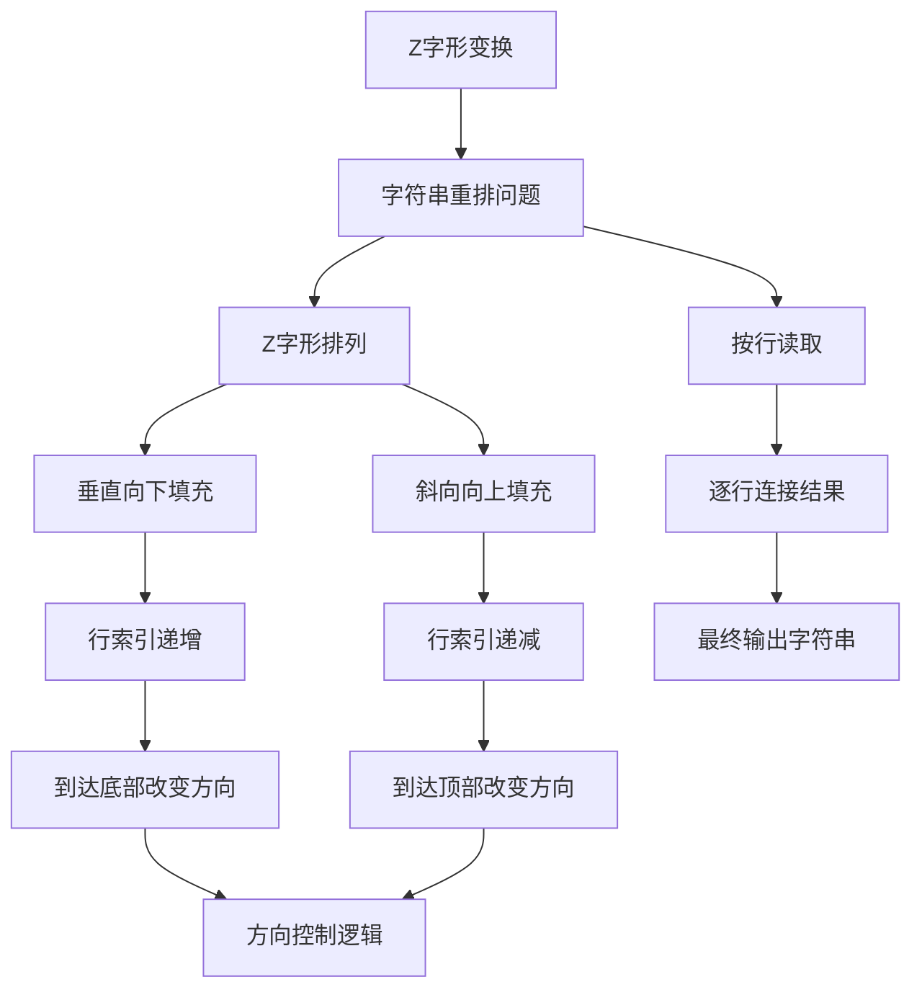
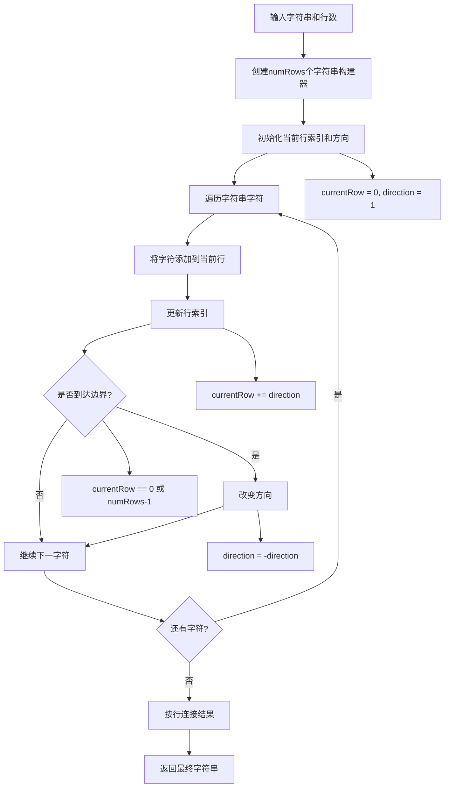
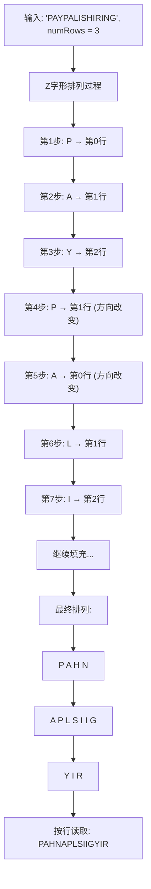
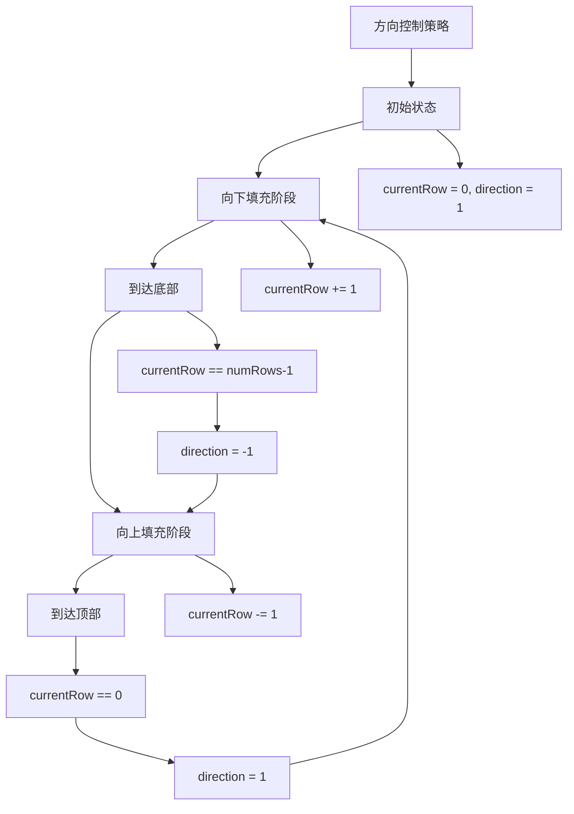
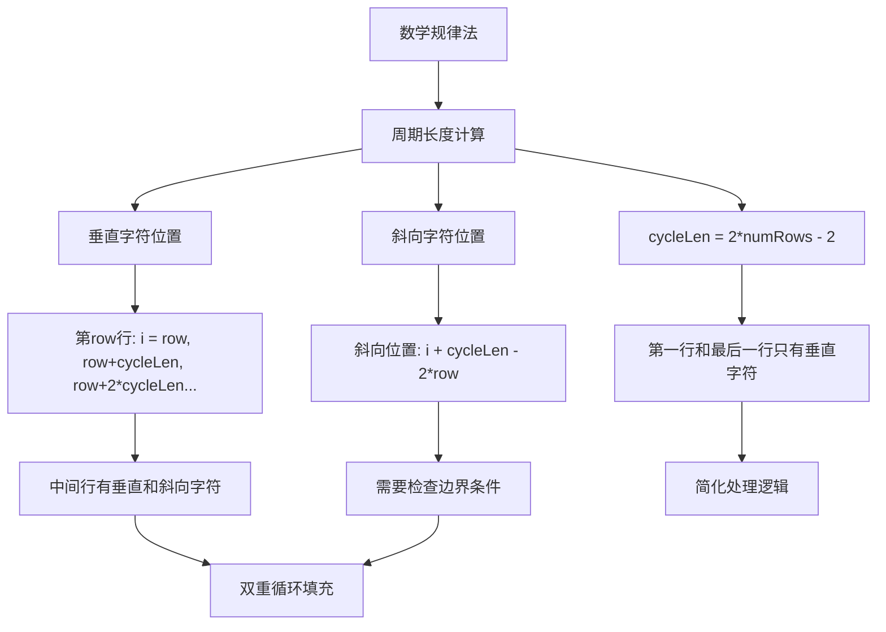
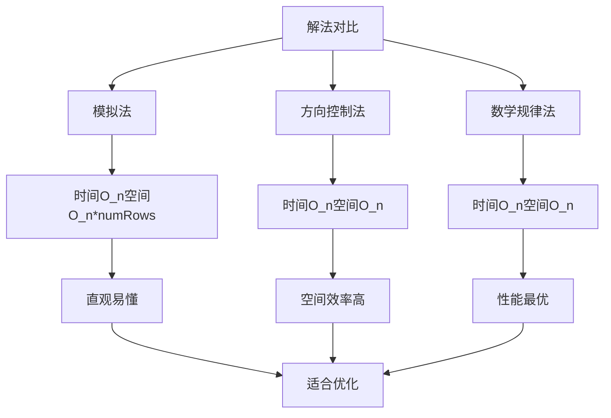
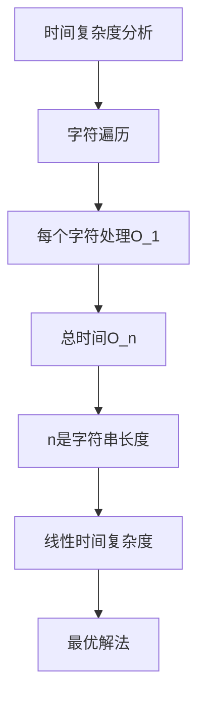
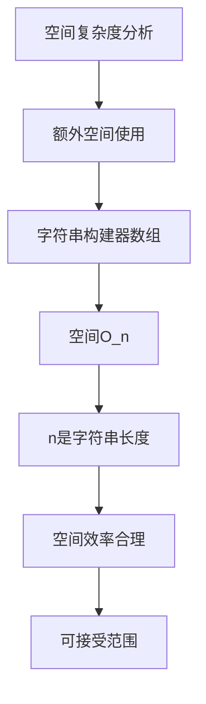
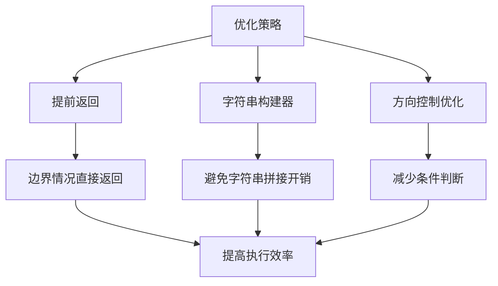
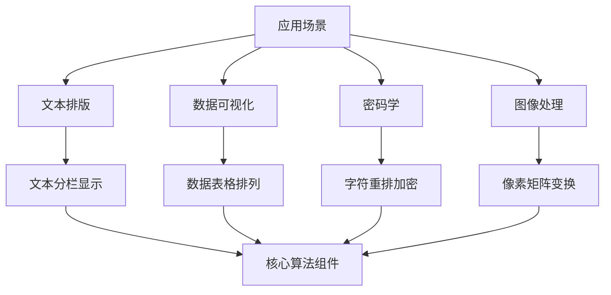

# 6. Z 字形变换

## 题目描述

将一个给定字符串 s 根据给定的行数 numRows ，以从上往下、从左到右进行 Z 字形排列。

比如输入字符串为 "PAYPALISHIRING" 行数为 3 时，排列如下：

P   A   H   N
A P L S I I G
Y   I   R
之后，你的输出需要从左往右逐行读取，产生出一个新的字符串，比如："PAHNAPLSIIGYIR"。

请你实现这个将字符串进行指定行数变换的函数：

string convert(string s, int numRows);

## 示例 1：

输入：s = "PAYPALISHIRING", numRows = 3
输出："PAHNAPLSIIGYIR"

## 示例 2：
输入：s = "PAYPALISHIRING", numRows = 4
输出："PINALSIGYAHRPI"
解释：
P     I    N
A   L S  I G
Y A   H R
P     I

## 示例 3：

输入：s = "A", numRows = 1
输出："A"

## 提示：

- 1 <= s.length <= 1000
- s 由英文字母（小写和大写）、',' 和 '.' 组成
- 1 <= numRows <= 1000

## 解题思路

这道题要求将字符串按Z字形排列，然后按行读取。这是一个字符串处理的经典问题。

### 算法分析

这道题的核心思想是**模拟Z字形排列过程**，主要解法包括：

1. **模拟法**：实际构建Z字形矩阵，然后按行读取
2. **方向控制法**：使用方向变量控制字符放置的行数
3. **数学规律法**：利用Z字形的数学规律直接计算字符位置

### 问题本质分析



### Z字形排列过程详解



### Z字形排列可视化



### 方向控制策略



### 数学规律法详解



### 各种解法对比



### 算法流程图

```mermaid
flowchart TD
    A[开始] --> B{numRows == 1?}
    B -->|是| C[直接返回原字符串]
    B -->|否| D{numRows >= len(s)?}
    
    D -->|是| C
    D -->|否| E[创建numRows个字符串构建器]
    
    E --> F[初始化currentRow=0, direction=1]
    F --> G[遍历字符串字符]
    
    G --> H[将字符添加到当前行]
    H --> I[更新行索引]
    I --> J{到达边界?}
    
    J -->|是| K[改变方向]
    J -->|否| L{还有字符?}
    
    K --> L
    L -->|是| G
    L -->|否| M[按行连接结果]
    
    M --> N[返回最终字符串]
    C --> O[结束]
    N --> O
```

### 边界情况处理

```mermaid
graph TD
    A[边界情况] --> B[numRows = 1]
    A --> C[numRows >= len(s)]
    A --> D[空字符串]
    A --> E[单字符字符串]
    
    B --> F[直接返回原字符串]
    C --> F
    D --> G[返回空字符串]
    E --> H[正常处理]
    
    F --> I[避免不必要的计算]
    G --> I
    H --> I
```

### 时间复杂度分析



### 空间复杂度分析



### 关键优化点



### 实际应用场景



### 测试用例设计

```mermaid
graph TD
    A[测试用例] --> B[基础功能]
    A --> C[边界情况]
    A --> D[性能测试]
    
    B --> E[多行Z字形]
    B --> F[单行情况]
    B --> G[不同字符串长度]
    
    C --> H[numRows = 1]
    C --> I[numRows >= len(s)]
    C --> J[空字符串]
    
    D --> K[最大长度字符串]
    D --> L[最大行数]
    
    E --> M[验证正确性]
    F --> M
    G --> M
    H --> M
    I --> M
    J --> M
    K --> N[验证性能]
    L --> N
```

### 代码实现要点

1. **方向控制逻辑**：
   - 使用direction变量控制行索引变化
   - 在边界处改变方向

2. **字符串构建器**：
   - 使用strings.Builder提高效率
   - 避免频繁的字符串拼接

3. **边界条件处理**：
   - numRows = 1时直接返回
   - numRows >= len(s)时直接返回

4. **行索引管理**：
   - 当前行索引范围：0 到 numRows-1
   - 方向改变条件：到达顶部或底部

5. **结果构建**：
   - 按行顺序连接所有行的内容
   - 使用strings.Builder提高效率

这个问题的关键在于**理解Z字形的排列规律**和**掌握方向控制技巧**，通过模拟Z字形的填充过程，实现字符串的重排和重组。
