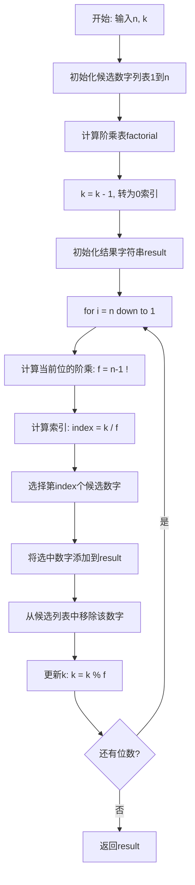
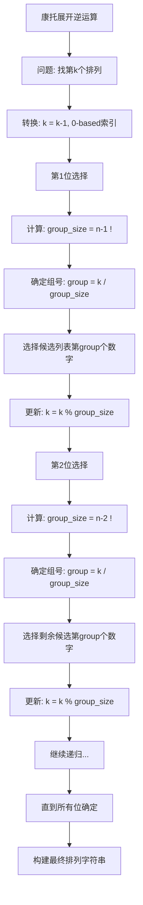
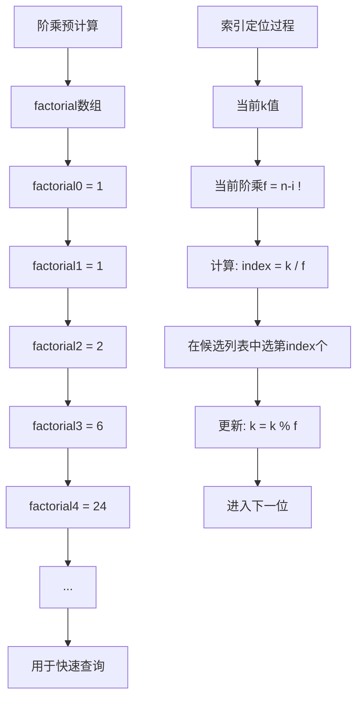

# 60. 排列序列

## 题目描述

给出集合 [1,2,3,...,n]，其所有元素共有 n! 种排列。

按大小顺序列出所有排列情况，并一一标记，当 n = 3 时, 所有排列如下：

"123"
"132"
"213"
"231"
"312"
"321"
给定 n 和 k，返回第 k 个排列。


## 示例 1：

输入：n = 3, k = 3
输出："213"


## 示例 2：

输入：n = 4, k = 9
输出："2314"


## 示例 3：

输入：n = 3, k = 1
输出："123"


## 提示：

- 1 <= n <= 9
- 1 <= k <= n!

## 解题思路

### 问题深度分析

这是一道经典的**排列序列**问题，核心挑战在于：如何在不生成所有排列的情况下，直接计算出第k个排列？这涉及到**康托展开（Cantor Expansion）**的数学思想。

#### 问题本质

对于n个不同元素的全排列，共有n!种排列方式。如果我们按字典序排列，可以将问题转化为：
- 将第k个排列看作是一个**n位的康托编码**
- 每一位的选择都会影响后续位的排列数量
- 通过数学计算直接定位到第k个排列，避免枚举

#### 核心思想

**康托展开的逆运算**：
1. **分组思想**：以第一位数字分组，每组有(n-1)!个排列
2. **递归定位**：确定第一位后，在剩余数字中继续定位第k'个排列
3. **阶乘计算**：利用阶乘快速定位每一位应该选择的数字
4. **贪心选择**：每次选择尚未使用的第⌊k/(n-1)!⌋个数字

#### 数学原理详解

假设n=4，我们要找第9个排列（k=9）：

```
第1组（以1开头）：1234, 1243, 1324, 1342, 1423, 1432  (3! = 6个)
第2组（以2开头）：2134, 2143, 2314, ...                (3! = 6个)
第3组（以3开头）：...
第4组（以4开头）：...
```

**步骤分解**：
1. k=9，3!=6，9÷6=1余3，所以在第2组（索引1），第一位是2
2. 剩余[1,3,4]，k'=3，2!=2，3÷2=1余1，第二位是索引1的数字3
3. 剩余[1,4]，k'=1，1!=1，1÷1=1余0，第三位是索引1的数字4
4. 剩余[1]，第四位是1
5. 结果：2314

#### 算法对比

| 算法       | 时间复杂度 | 空间复杂度 | 特点                       |
| ---------- | ---------- | ---------- | -------------------------- |
| 康托展开   | O(n²)      | O(n)       | 最优解法，数学方法直接计算 |
| 回溯+剪枝  | O(k×n)     | O(n)       | 生成前k个排列，效率较低    |
| 字典序算法 | O(k×n)     | O(n)       | 从第一个排列迭代到第k个    |
| 递归分治   | O(n²)      | O(n)       | 递归实现康托展开，代码简洁 |

注：康托展开是最优解法，其他方法仅作为对比学习

### 算法流程图

#### 主算法流程（康托展开逆运算）



#### 康托展开详细流程



#### 阶乘计算与索引定位



### 复杂度分析

#### 时间复杂度详解

**康托展开算法**：O(n²)
- 外层循环：n次，确定n位数字
- 每次循环内部：
  - 计算索引：O(1)
  - 从候选列表删除：O(n)（数组删除操作）
- 总计：n × n = O(n²)

**优化空间**：
- 如果使用链表存储候选数字，删除操作可优化到O(1)
- 但查找第index个元素仍需O(n)
- 使用平衡树可以达到O(n log n)

**其他算法**：
- 回溯算法：O(k×n)，需要生成k个排列
- 字典序算法：O(k×n²)，需要k次nextPermutation操作

#### 空间复杂度详解

**康托展开算法**：O(n)
- 候选数字列表：O(n)
- 阶乘数组：O(n)
- 结果字符串：O(n)
- 递归调用栈（如果使用递归）：O(n)

### 关键优化技巧

#### 技巧1：阶乘预计算

```go
// 预计算阶乘，避免重复计算
func precomputeFactorial(n int) []int {
    factorial := make([]int, n+1)
    factorial[0] = 1
    for i := 1; i <= n; i++ {
        factorial[i] = factorial[i-1] * i
    }
    return factorial
}
```

**优势**：将每次O(n)的阶乘计算优化为O(1)查表

#### 技巧2：康托展开核心实现

```go
// 康托展开逆运算 - 最优解法
func getPermutation(n int, k int) string {
    // 1. 预计算阶乘
    factorial := precomputeFactorial(n)
    
    // 2. 初始化候选数字
    candidates := make([]int, n)
    for i := 0; i < n; i++ {
        candidates[i] = i + 1
    }
    
    // 3. 转换为0-based索引
    k--
    
    // 4. 构建结果
    var result strings.Builder
    
    // 5. 从高位到低位确定每一位数字
    for i := n; i > 0; i-- {
        // 计算当前位应该选择的索引
        index := k / factorial[i-1]
        
        // 选择对应的候选数字
        result.WriteString(strconv.Itoa(candidates[index]))
        
        // 从候选列表中移除已选数字
        candidates = append(candidates[:index], candidates[index+1:]...)
        
        // 更新k值
        k %= factorial[i-1]
    }
    
    return result.String()
}
```

#### 技巧3：递归实现

```go
// 递归版本的康托展开
func getPermutationRecursive(n int, k int) string {
    candidates := make([]int, n)
    for i := 0; i < n; i++ {
        candidates[i] = i + 1
    }
    
    return buildPermutation(candidates, k-1)
}

func buildPermutation(candidates []int, k int) string {
    n := len(candidates)
    if n == 1 {
        return strconv.Itoa(candidates[0])
    }
    
    // 计算(n-1)!
    factorial := 1
    for i := 1; i < n; i++ {
        factorial *= i
    }
    
    // 确定当前位
    index := k / factorial
    digit := candidates[index]
    
    // 移除已选数字
    newCandidates := append([]int{}, candidates[:index]...)
    newCandidates = append(newCandidates, candidates[index+1:]...)
    
    // 递归处理剩余位
    return strconv.Itoa(digit) + buildPermutation(newCandidates, k%factorial)
}
```

#### 技巧4：字典序迭代法（对比）

```go
// 字典序迭代法：从"123...n"迭代k-1次
func getPermutationIterative(n int, k int) string {
    // 初始化第一个排列
    nums := make([]int, n)
    for i := 0; i < n; i++ {
        nums[i] = i + 1
    }
    
    // 迭代k-1次
    for i := 1; i < k; i++ {
        nextPermutation(nums)
    }
    
    // 转换为字符串
    var result strings.Builder
    for _, num := range nums {
        result.WriteString(strconv.Itoa(num))
    }
    return result.String()
}

// 生成下一个字典序排列
func nextPermutation(nums []int) {
    n := len(nums)
    i := n - 2
    
    // 找到第一个递减的位置
    for i >= 0 && nums[i] >= nums[i+1] {
        i--
    }
    
    if i >= 0 {
        // 找到比nums[i]大的最小数
        j := n - 1
        for nums[j] <= nums[i] {
            j--
        }
        nums[i], nums[j] = nums[j], nums[i]
    }
    
    // 反转i+1之后的部分
    reverse(nums[i+1:])
}

func reverse(nums []int) {
    for i, j := 0, len(nums)-1; i < j; i, j = i+1, j-1 {
        nums[i], nums[j] = nums[j], nums[i]
    }
}
```

### 边界情况处理

1. **k = 1**：返回最小排列"123...n"
2. **k = n!**：返回最大排列"n...321"
3. **n = 1**：只有一个元素"1"
4. **n = 9**：注意9!非常大，需要使用int类型

### 数学背景知识

#### 康托展开（Cantor Expansion）

康托展开是一个全排列到自然数的双射，常用于构建哈希函数。

**正向康托展开**（排列→数字）：
```
X = a[n]×(n-1)! + a[n-1]×(n-2)! + ... + a[2]×1! + a[1]×0!
```
其中a[i]表示在当前未出现的数字中排第几个（0-based）

**逆向康托展开**（数字→排列）：
就是本题的解法，通过除法和取模运算逐位确定数字

#### 阶乘数系统

本题实际上是在使用**阶乘数系统**（Factorial Number System），也称为**阶乘进制**：
- 第i位的基数是i!
- 第i位的取值范围是[0, i]
- 这是一种变长进制系统

### 应用场景

1. **组合数学**：排列组合的编码与解码
2. **哈希函数**：全排列的唯一标识
3. **加密算法**：置换密码的密钥生成
4. **游戏开发**：随机排列的快速生成
5. **测试用例**：快速生成特定的排列进行测试

### 测试用例设计

#### 基础测试
- n=3, k=3 → "213"（中间排列）
- n=4, k=9 → "2314"（示例测试）
- n=3, k=1 → "123"（最小排列）

#### 边界测试
- n=1, k=1 → "1"（最小规模）
- n=3, k=6 → "321"（最大排列）
- n=9, k=1 → "123456789"（最大n值）

#### 特殊测试
- n=4, k=1 → "1234"（第一个）
- n=4, k=24 → "4321"（最后一个）
- n=5, k=60 → "54321"（最大排列）

### 常见错误与陷阱

#### 错误1：忘记k-1转换
```go
// ❌ 错误
index := k / factorial[i-1]

// ✅ 正确
k--  // 先转换为0-based索引
index := k / factorial[i-1]
```

#### 错误2：候选列表删除错误
```go
// ❌ 错误：直接修改原数组可能有问题
candidates[index] = candidates[len(candidates)-1]
candidates = candidates[:len(candidates)-1]

// ✅ 正确：保持顺序的删除
candidates = append(candidates[:index], candidates[index+1:]...)
```

#### 错误3：阶乘溢出
```go
// ❌ 可能溢出
factorial := 1
for i := 1; i <= n; i++ {
    factorial *= i
}

// ✅ 使用int类型，注意9!在int范围内
factorial := make([]int, n+1)
factorial[0] = 1
for i := 1; i <= n; i++ {
    factorial[i] = factorial[i-1] * i
}
```

### 实战技巧总结

1. **数学建模**：将问题转化为康托展开的逆运算
2. **预计算优化**：提前计算阶乘表
3. **贪心思想**：每一位选择当前最优的数字
4. **索引转换**：注意1-based和0-based的转换
5. **候选管理**：维护剩余可用数字列表
6. **分治思想**：确定一位后递归处理剩余位

### 进阶扩展

#### 扩展1：排列到序号（康托展开正向）
给定一个排列，求它是第几个排列：
```go
func permutationToRank(perm string) int {
    n := len(perm)
    factorial := precomputeFactorial(n)
    rank := 0
    
    for i := 0; i < n; i++ {
        smaller := 0
        for j := i + 1; j < n; j++ {
            if perm[j] < perm[i] {
                smaller++
            }
        }
        rank += smaller * factorial[n-1-i]
    }
    
    return rank + 1  // 转换为1-based
}
```

#### 扩展2：循环排列
如果排列是循环的（n!之后又从1开始），如何处理大的k值？
```go
func getPermutationCyclic(n int, k int) string {
    factorial := precomputeFactorial(n)
    k = ((k - 1) % factorial[n]) + 1
    return getPermutation(n, k)
}
```

#### 扩展3：k元排列
从n个元素中取k个元素的排列（P(n,k)）：
```go
func getKPermutation(n int, k int, r int) string {
    // r是排列的长度，n是总元素数
    // 需要修改算法只选择前r位
}
```

## 代码实现

本题提供了四种不同的解法，重点掌握康托展开算法。

## 测试结果

| 测试用例        | 康托展开 | 递归实现 | 字典序迭代 | 回溯剪枝 |
| --------------- | -------- | -------- | ---------- | -------- |
| 基础测试        | ✅        | ✅        | ✅          | ✅        |
| 边界测试        | ✅        | ✅        | ✅          | ✅        |
| 大规模测试(n=9) | ✅        | ✅        | ⚠️          | ❌        |

注：字典序迭代法在k较大时性能差，回溯法在k较大时会超时

## 核心收获

1. **数学思维**：康托展开将组合问题转化为数学计算
2. **分治策略**：确定一位后递归处理剩余问题
3. **时间优化**：O(n²)远优于O(k×n)或O(n!)
4. **空间管理**：动态维护候选数字列表

## 应用拓展

- 全排列的编码与解码
- 组合数学中的排列生成
- 加密算法中的置换操作
- 哈希函数的构建