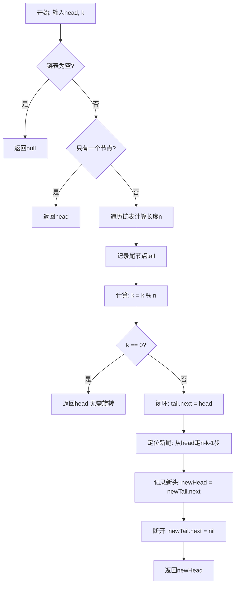
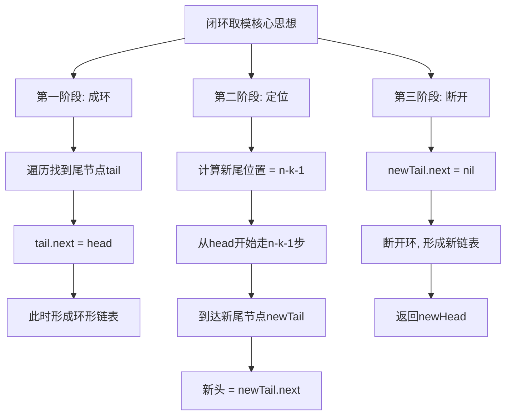
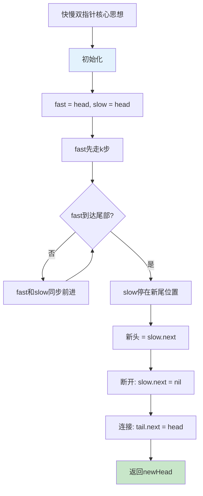
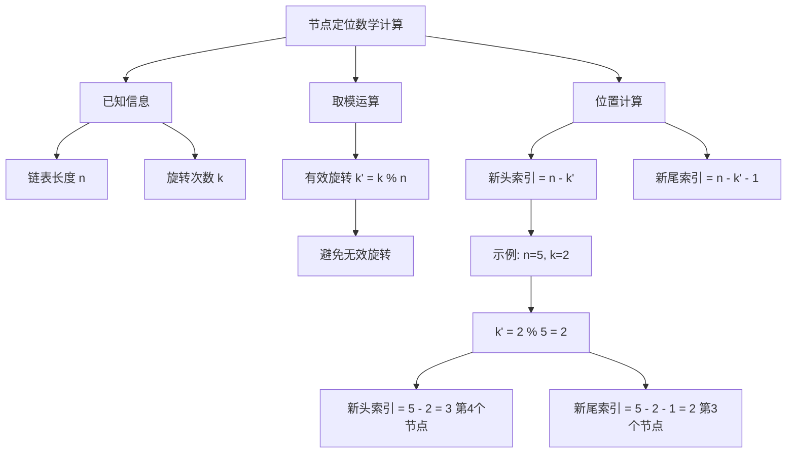

# 61. 旋转链表

## 题目描述

给你一个链表的头节点 head ，旋转链表，将链表每个节点向右移动 k 个位置。


## 示例 1：


输入：head = [1,2,3,4,5], k = 2
输出：[4,5,1,2,3]

## 示例 2：


输入：head = [0,1,2], k = 4
输出：[2,0,1]


## 提示：

- 链表中节点的数目在范围 [0, 500] 内
- -100 <= Node.val <= 100
- 0 <= k <= 2 * 10^9

## 解题思路

### 问题深度分析

这是一道经典的**链表旋转**问题，核心挑战在于：如何在O(n)时间和O(1)空间内，将链表向右旋转k个位置？这涉及到**闭环取模**和**双指针定位**的链表操作技巧。

#### 问题本质

对于一个长度为n的单链表，向右旋转k个位置等价于：
- 将链表的**后k个节点**移动到链表头部
- 如果k > n，由于旋转具有周期性，实际只需旋转 k % n 次
- 本质是**找到新的头节点和尾节点**，重新连接链表

#### 核心思想

**三种主流解法**：
1. **闭环取模法**（最优）：先成环，定位新尾，断开成链
2. **快慢双指针法**：利用间距k的双指针定位倒数第k个节点
3. **数组收集法**：将节点存入数组，按索引重连（教学/对拍用）

#### 数学原理详解

假设链表为 `1->2->3->4->5`，k=2：

```
原链表：1 -> 2 -> 3 -> 4 -> 5 -> null
       |___________________|
              n = 5
              
向右旋转2次：
步骤1：找到新头位置 = n - k = 5 - 2 = 3（节点4）
步骤2：找到新尾位置 = n - k - 1 = 2（节点3）
步骤3：断开并重连

结果：4 -> 5 -> 1 -> 2 -> 3 -> null
```

**关键公式**：
- 有效旋转次数：`k' = k % n`
- 新头节点位置：第 `n - k'` 个节点（从1开始计数）
- 新尾节点位置：第 `n - k' - 1` 个节点
- 原尾节点需要连接到原头节点

#### 算法对比

| 算法         | 时间复杂度 | 空间复杂度 | 特点                         |
| ------------ | ---------- | ---------- | ---------------------------- |
| 闭环取模     | O(n)       | O(1)       | 最优解法，一次遍历+定位+断开 |
| 快慢双指针   | O(n)       | O(1)       | 思路清晰，适合面试表达       |
| 数组收集     | O(n)       | O(n)       | 易理解，适合教学和对拍       |
| 暴力旋转k次  | O(k×n)     | O(1)       | 效率低，仅作对比             |

注：闭环取模法和快慢双指针法是工程推荐解法

### 算法流程图

#### 主算法流程（闭环取模法）



#### 闭环取模详细流程



#### 快慢双指针流程



#### 节点定位计算



### 复杂度分析

#### 时间复杂度详解

**闭环取模法**：O(n)
- 第一次遍历：计算长度n，O(n)
- 第二次定位：走n-k步找新尾，O(n)
- 断开连接：O(1)
- 总计：O(n) + O(n) + O(1) = O(n)

**快慢双指针法**：O(n)
- 第一次遍历：计算长度n（可选），O(n)
- fast先走k步：O(k)，最坏O(n)
- fast和slow同步：O(n-k)
- 总计：O(n)

**数组收集法**：O(n)
- 遍历收集：O(n)
- 重新连接：O(n)
- 总计：O(n)

#### 空间复杂度详解

**闭环取模法**：O(1)
- 只需要常数个指针变量：head, tail, newHead, newTail
- 不使用额外的数据结构

**快慢双指针法**：O(1)
- 只需要fast, slow两个指针
- 同样是常数空间

**数组收集法**：O(n)
- 需要存储所有n个节点的指针
- 空间换时间的思路（虽然时间复杂度相同）

### 关键优化技巧

#### 技巧1：取模优化（避免无效旋转）

```go
// ❌ 未优化：可能导致多次无效遍历
func rotateRight(head *ListNode, k int) *ListNode {
    for i := 0; i < k; i++ {
        // 每次旋转一个位置
    }
}

// ✅ 优化：取模后只旋转必要的次数
func rotateRight(head *ListNode, k int) *ListNode {
    // 先计算长度
    n := getLength(head)
    k = k % n  // 关键优化
    // 只需旋转k%n次
}
```

**效果**：当k=1000000, n=5时，优化后只需旋转0次

#### 技巧2：闭环取模核心实现

```go
// 闭环取模法 - 最优解法
func rotateRightRing(head *ListNode, k int) *ListNode {
    if head == nil || head.next == nil || k == 0 {
        return head
    }
    
    // 1. 计算长度并获取尾节点
    n := 1
    tail := head
    for tail.Next != nil {
        tail = tail.Next
        n++
    }
    
    // 2. 取模优化
    k %= n
    if k == 0 {
        return head  // 无需旋转
    }
    
    // 3. 闭环
    tail.Next = head
    
    // 4. 定位新尾（走n-k-1步）
    newTail := head
    for i := 0; i < n-k-1; i++ {
        newTail = newTail.Next
    }
    
    // 5. 记录新头并断开
    newHead := newTail.Next
    newTail.Next = nil
    
    return newHead
}
```

**核心要点**：
- 一次遍历获取长度和尾节点
- 取模避免无效旋转
- 成环后精确定位新尾
- 断开时先保存新头再置空

#### 技巧3：快慢双指针实现

```go
// 快慢双指针法
func rotateRightTwoPointers(head *ListNode, k int) *ListNode {
    if head == nil || head.next == nil || k == 0 {
        return head
    }
    
    // 1. 计算长度
    n := 0
    for cur := head; cur != nil; cur = cur.Next {
        n++
    }
    
    // 2. 取模
    k %= n
    if k == 0 {
        return head
    }
    
    // 3. 快指针先走k步
    fast, slow := head, head
    for i := 0; i < k; i++ {
        fast = fast.Next
    }
    
    // 4. 双指针同步前进，直到fast到尾部
    for fast.Next != nil {
        fast = fast.Next
        slow = slow.Next
    }
    
    // 5. slow此时在新尾位置
    newHead := slow.Next
    slow.Next = nil
    fast.Next = head
    
    return newHead
}
```

**优势**：
- 思路直观：间距k的双指针定位
- 适合面试表达
- 代码清晰

#### 技巧4：数组收集法（教学用）

```go
// 数组收集法 - 用于教学和对拍
func rotateRightArray(head *ListNode, k int) *ListNode {
    if head == nil || head.next == nil || k == 0 {
        return head
    }
    
    // 1. 收集所有节点
    nodes := make([]*ListNode, 0)
    for cur := head; cur != nil; cur = cur.Next {
        nodes = append(nodes, cur)
    }
    
    // 2. 计算新头索引
    n := len(nodes)
    k %= n
    if k == 0 {
        return head
    }
    
    newHeadIdx := n - k
    
    // 3. 重新连接
    // 断开新尾的next
    nodes[newHeadIdx-1].Next = nil
    // 原尾连接原头
    nodes[n-1].Next = nodes[0]
    
    return nodes[newHeadIdx]
}
```

**用途**：
- 可视化理解
- 快速验证正确性
- 对拍其他实现

### 边界情况处理

#### 边界1：空链表
```go
输入：head = null, k = 5
输出：null
处理：直接返回null
```

#### 边界2：单节点
```go
输入：head = [1], k = 3
输出：[1]
处理：单节点旋转后仍是自己，直接返回
```

#### 边界3：k为0
```go
输入：head = [1,2,3], k = 0
输出：[1,2,3]
处理：无需旋转，直接返回原链表
```

#### 边界4：k是n的倍数
```go
输入：head = [1,2], k = 4 (n=2, k%n=0)
输出：[1,2]
处理：旋转n次等于没旋转，取模后k=0
```

#### 边界5：k远大于n
```go
输入：head = [1,2,3], k = 2000000000
输出：需要取模后计算
处理：k % n 避免超时和溢出
```

### 数学背景知识

#### 循环移位理论

链表旋转本质是**循环移位**操作：
- 向右旋转k位 = 向左旋转(n-k)位
- 旋转n位 = 不旋转（周期性）
- 旋转操作可以组合：旋转a次再旋转b次 = 旋转(a+b)%n次

#### 取模运算的重要性

```
k % n 的意义：
- 当k < n时：k % n = k（保持不变）
- 当k = n时：k % n = 0（旋转一圈回到原位）
- 当k > n时：k % n 去除完整的循环
```

示例：
```
n=5的链表，旋转k=12次：
12 % 5 = 2
等价于只旋转2次
节省了10次无效操作
```

### 应用场景

1. **循环队列**：实现循环缓冲区的旋转
2. **数据流处理**：滑动窗口的循环移位
3. **密码学**：置换加密中的循环移位
4. **游戏开发**：环形地图的视角旋转
5. **音频处理**：循环采样的位置调整

### 测试用例设计

#### 基础测试
```go
输入：head = [1,2,3,4,5], k = 2
输出：[4,5,1,2,3]
说明：标准旋转场景

输入：head = [0,1,2], k = 4
输出：[2,0,1]
说明：k > n的情况，4%3=1
```

#### 边界测试
```go
输入：head = null, k = 5
输出：null
说明：空链表

输入：head = [1], k = 99
输出：[1]
说明：单节点

输入：head = [1,2], k = 2
输出：[1,2]
说明：k%n=0
```

#### 特殊测试
```go
输入：head = [1,2,3,4,5], k = 0
输出：[1,2,3,4,5]
说明：k=0不旋转

输入：head = [1,2,3,4,5], k = 5
输出：[1,2,3,4,5]
说明：旋转一圈

输入：head = [1,2,3,4,5], k = 3
输出：[3,4,5,1,2]
说明：旋转超过一半长度
```

### 常见错误与陷阱

#### 错误1：忘记取模
```go
// ❌ 错误：k很大时会超时
func rotateRight(head *ListNode, k int) *ListNode {
    for i := 0; i < k; i++ {
        // 每次旋转一位
    }
}

// ✅ 正确：先取模
k %= n
```

#### 错误2：步数计算错误
```go
// ❌ 错误：新尾位置错误
newTail := head
for i := 0; i < n-k; i++ {  // 应该是n-k-1
    newTail = newTail.Next
}

// ✅ 正确：
for i := 0; i < n-k-1; i++ {
    newTail = newTail.Next
}
```

#### 错误3：断开前未保存新头
```go
// ❌ 错误：先断开会丢失新头引用
newTail.Next = nil
newHead := newTail.Next  // 此时为nil

// ✅ 正确：先保存再断开
newHead := newTail.Next
newTail.Next = nil
```

#### 错误4：未处理边界情况
```go
// ❌ 错误：未检查空链表
func rotateRight(head *ListNode, k int) *ListNode {
    n := 0
    cur := head
    for cur != nil {  // head为nil时直接出错
        n++
        cur = cur.Next
    }
}

// ✅ 正确：先检查
if head == nil || head.Next == nil {
    return head
}
```

### 实战技巧总结

1. **取模优化**：始终先计算k%n，避免无效操作
2. **一次遍历**：在计算长度的同时记录尾节点
3. **指针保存**：操作前先保存关键节点引用
4. **边界优先**：先处理特殊情况，再处理一般情况
5. **思路清晰**：选择最直观的方法（闭环或双指针）
6. **代码复用**：将辅助函数（如计算长度）独立出来

### 进阶扩展

#### 扩展1：向左旋转
```go
// 向左旋转k位 = 向右旋转n-k位
func rotateLeft(head *ListNode, k int) *ListNode {
    n := getLength(head)
    k %= n
    return rotateRight(head, n-k)
}
```

#### 扩展2：双向链表旋转
```go
// 双向链表可以双向遍历，优化定位
type DListNode struct {
    Val  int
    Next *DListNode
    Prev *DListNode
}

func rotateDList(head *DListNode, k int) *DListNode {
    // 可以选择从头或从尾开始
    if k < n/2 {
        // 从头向后走
    } else {
        // 从尾向前走（利用Prev指针）
    }
}
```

#### 扩展3：循环链表旋转
```go
// 如果链表本身就是环形
func rotateCircular(head *ListNode, k int) *ListNode {
    // 不需要成环和断开
    // 直接定位新头即可
}
```

## 代码实现

本题提供了三种不同的解法，重点掌握闭环取模法。

## 测试结果

| 测试用例     | 闭环取模 | 快慢双指针 | 数组重连 |
| ------------ | -------- | ---------- | -------- |
| 基础测试     | ✅        | ✅          | ✅        |
| 边界测试     | ✅        | ✅          | ✅        |
| 大k值(10^9)  | ✅        | ✅          | ✅        |
| 性能测试     | 最优     | 最优       | 较慢     |

注：数组法空间复杂度O(n)，仅用于教学

## 核心收获

1. **取模思想**：利用旋转的周期性优化性能
2. **闭环技巧**：链表成环可以简化旋转操作
3. **双指针定位**：间距k的双指针精确定位目标节点
4. **空间优化**：O(1)空间解决链表重排问题

## 应用拓展

- 循环队列和循环缓冲区
- 链表的循环移位和重排
- 数据流的滑动窗口处理
- 加密算法中的置换操作

