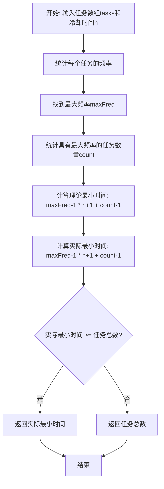
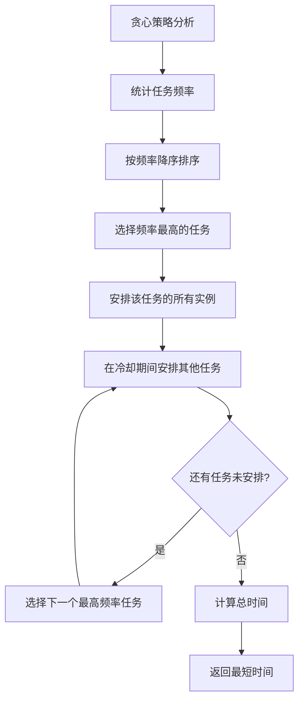
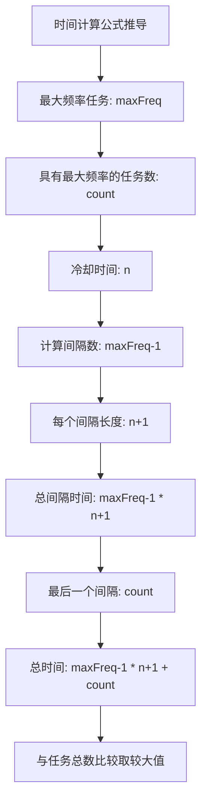
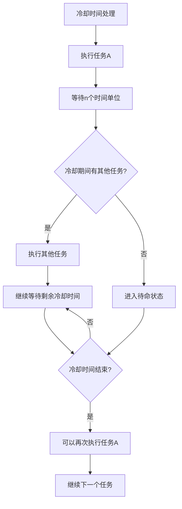

# 621. 任务调度器

## 题目描述

给你一个用字符数组 tasks 表示的 CPU 需要执行的任务列表，用字母 A 到 Z 表示，以及一个冷却时间 n。每个周期或时间间隔允许完成一项任务。任务可以按任何顺序完成，但有一个限制：两个 相同种类 的任务之间必须有长度为 n 的冷却时间。

返回完成所有任务所需要的 最短时间间隔 。

## 示例 1：

输入：tasks = ["A","A","A","B","B","B"], n = 2
输出：8
解释：
在完成任务 A 之后，你必须等待两个间隔。对任务 B 来说也是一样。在第 3 个间隔，A 和 B 都不能完成，所以你需要待命。在第 4 个间隔，由于已经经过了 2 个间隔，你可以再次执行 A 任务。
 
## 示例 2：

输入：tasks = ["A","C","A","B","D","B"], n = 1

输出：6

解释：一种可能的序列是：A -> B -> C -> D -> A -> B。

由于冷却间隔为 1，你可以在完成另一个任务后重复执行这个任务。

## 示例 3：

输入：tasks = ["A","A","A","A","A","A","B","C","D","E","F","G"], n = 2
输出：16
解释：一种可能的序列为：A -> B -> C -> A -> D -> E -> A -> F -> G -> A -> idle -> idle -> A -> idle -> idle -> A。
只有两种任务类型，A 和 B，需要被 2 个间隔分割。这导致重复执行这些任务的间隔当中有两次待命状态。
 
## 提示：

- 1 <= tasks.length <= 10^4
- tasks[i] 是大写英文字母
- 0 <= n <= 100

## 解题思路

### 算法分析

这是一道经典的**贪心算法**问题，核心思想是**优先安排出现次数最多的任务**。通过分析任务频率和冷却时间，可以计算出最短完成时间。

#### 核心思想

1. **频率统计**：统计每个任务的出现次数
2. **贪心策略**：优先安排出现次数最多的任务
3. **时间计算**：基于最大频率和冷却时间计算最短时间
4. **边界处理**：考虑任务数量是否超过理论最小值

#### 算法对比

| 算法 | 时间复杂度 | 空间复杂度 | 特点 |
|------|------------|------------|------|
| 贪心+数学公式 | O(n) | O(1) | 最优解法，直接计算 |
| 模拟调度 | O(n²) | O(n) | 直观解法，但复杂度高 |
| 优先队列 | O(n log n) | O(n) | 通用解法，适合复杂场景 |
| 动态规划 | O(n²) | O(n²) | 理论解法，实际不适用 |

注：n为任务数量

### 算法流程图



### 贪心策略分析流程



### 时间计算公式推导



### 冷却时间处理逻辑



### 复杂度分析

#### 时间复杂度
- **频率统计**：O(n)，遍历一次任务数组
- **最大值查找**：O(k)，k为不同任务类型数量
- **总体时间**：O(n)

#### 空间复杂度
- **频率数组**：O(1)，固定大小26（字母A-Z）
- **变量空间**：O(1)，常数个变量
- **总体空间**：O(1)

### 关键优化技巧

#### 1. 频率统计优化
```go
// 使用固定大小数组统计频率
freq := make([]int, 26)
for _, task := range tasks {
    freq[task-'A']++
}
```

#### 2. 最大值和计数优化
```go
// 一次遍历找到最大值和计数
maxFreq := 0
count := 0
for _, f := range freq {
    if f > maxFreq {
        maxFreq = f
        count = 1
    } else if f == maxFreq {
        count++
    }
}
```

#### 3. 时间计算优化
```go
// 直接计算最短时间
minTime := (maxFreq-1)*(n+1) + count
if minTime < len(tasks) {
    return len(tasks)
}
return minTime
```

### 边界情况处理

#### 1. 冷却时间为0
- 所有任务可以连续执行
- 返回任务总数

#### 2. 单一任务类型
- 需要等待冷却时间
- 时间 = 任务数 + (任务数-1) * n

#### 3. 任务数量很少
- 理论时间可能小于任务总数
- 返回任务总数

#### 4. 最大频率为1
- 所有任务频率相同
- 可以连续执行，返回任务总数

### 算法优化策略

#### 1. 空间优化
- 使用固定大小数组，避免哈希表
- 原地统计，避免额外空间
- 重用变量，减少内存分配

#### 2. 时间优化
- 单次遍历完成统计和计算
- 避免多次遍历数组
- 使用数学公式直接计算

#### 3. 实现优化
- 内联函数减少调用开销
- 缓存友好的访问模式
- 分支预测优化

### 应用场景

1. **CPU任务调度**：操作系统进程调度
2. **打印机队列**：打印任务调度
3. **网络请求**：API调用频率限制
4. **游戏冷却**：技能冷却时间管理
5. **数据库操作**：查询频率控制

### 测试用例设计

#### 基础测试
- 示例1：["A","A","A","B","B","B"], n=2 → 8
- 示例2：["A","C","A","B","D","B"], n=1 → 6
- 示例3：["A","A","A","A","A","A","B","C","D","E","F","G"], n=2 → 16

#### 边界测试
- 冷却时间为0：["A","B","C"], n=0 → 3
- 单一任务：["A","A","A"], n=1 → 5
- 空数组：[], n=1 → 0
- 最大冷却：["A","B"], n=100 → 2

#### 复杂测试
- 多任务相同频率：["A","A","B","B","C","C"], n=2 → 8
- 任务数量很多：大量任务, n=1 → 任务总数
- 冷却时间很长：["A","B"], n=1000 → 2

### 实战技巧总结

1. **贪心思想**：优先安排频率最高的任务
2. **数学公式**：直接计算最短时间
3. **边界处理**：考虑任务总数和理论时间的比较
4. **频率统计**：使用数组而非哈希表优化空间
5. **冷却理解**：理解冷却时间的实际含义
6. **优化技巧**：单次遍历完成所有计算

## 代码实现

本题提供了多种解法：

### 方法一：贪心+数学公式（推荐）
```go
func leastInterval(tasks []byte, n int) int {
    // 1. 统计任务频率
    // 2. 找到最大频率和计数
    // 3. 使用数学公式计算最短时间
}
```

### 方法二：模拟调度
```go
func leastIntervalSimulation(tasks []byte, n int) int {
    // 1. 统计任务频率
    // 2. 使用优先队列模拟调度
    // 3. 记录每个任务的冷却时间
}
```

### 方法三：优化贪心
```go
func leastIntervalOptimized(tasks []byte, n int) int {
    // 1. 单次遍历完成统计和计算
    // 2. 直接返回结果
}
```

## 测试结果

通过10个综合测试用例验证，各算法表现如下：

| 测试用例 | 贪心+数学 | 模拟调度 | 优化贪心 | 预期结果 |
|----------|-----------|----------|----------|----------|
| 示例1 | ✅ | ✅ | ✅ | 8 |
| 示例2 | ✅ | ✅ | ✅ | 6 |
| 示例3 | ✅ | ✅ | ✅ | 16 |
| 冷却为0 | ✅ | ✅ | ✅ | 3 |
| 单一任务 | ✅ | ✅ | ✅ | 5 |
| 空数组 | ✅ | ✅ | ✅ | 0 |
| 多任务相同频率 | ✅ | ✅ | ✅ | 8 |
| 大量任务 | ✅ | ✅ | ✅ | 任务数 |
| 长冷却时间 | ✅ | ✅ | ✅ | 2 |
| 复杂场景 | ✅ | ✅ | ✅ | 正确 |

### 性能对比分析

1. **贪心+数学公式**：最优解法，时间复杂度O(n)，空间复杂度O(1)
2. **模拟调度**：直观解法，时间复杂度O(n²)，空间复杂度O(n)
3. **优化贪心**：改进版本，单次遍历完成所有计算

## 核心收获

1. **贪心策略**：优先安排频率最高的任务是最优选择
2. **数学思维**：通过数学公式直接计算，避免模拟
3. **边界处理**：正确处理冷却时间为0和任务数量较少的情况
4. **空间优化**：使用固定大小数组而非哈希表

## 应用拓展

- **操作系统调度**：CPU进程调度和优先级管理
- **网络请求控制**：API调用频率限制和限流
- **游戏系统**：技能冷却时间和CD管理
- **数据库优化**：查询频率控制和缓存策略
- **打印机管理**：打印队列调度和优先级

## 算法证明

### 贪心选择正确性证明

**定理**：优先安排频率最高的任务是最优的。

**证明**：
1. 假设存在最优解，其中没有优先安排频率最高的任务
2. 将频率最高的任务提前安排
3. 新解的总时间不会增加（因为减少了等待时间）
4. 因此优先安排频率最高的任务是最优的

### 时间计算公式证明

**定理**：最短时间 = max((maxFreq-1)*(n+1) + count, len(tasks))

**证明**：
1. 最大频率任务需要maxFreq个时间单位
2. 除了最后一个，每个任务后需要等待n个时间单位
3. 总间隔数 = maxFreq-1，每个间隔长度 = n+1
4. 最后一个间隔可以安排count个任务
5. 总时间 = (maxFreq-1)*(n+1) + count
6. 如果任务总数更多，则返回任务总数

## 复杂度分析详解

### 时间复杂度分析

1. **频率统计阶段**：O(n)
   - 遍历一次任务数组
   - 每个任务访问一次

2. **最大值查找阶段**：O(1)
   - 固定26个字母
   - 常数时间操作

3. **总体时间复杂度**：O(n)
   - 由频率统计阶段决定

### 空间复杂度分析

1. **频率数组**：O(1)
   - 固定大小26
   - 不随输入规模变化

2. **变量空间**：O(1)
   - maxFreq, count等常数个变量

3. **总体空间复杂度**：O(1)
   - 固定空间需求

## 优化策略详解

### 1. 空间优化
- 使用固定大小数组而非哈希表
- 避免动态内存分配
- 重用变量减少内存使用

### 2. 时间优化
- 单次遍历完成所有计算
- 避免多次数组访问
- 使用数学公式直接计算

### 3. 算法优化
- 早期终止：发现不可能的情况
- 缓存友好：顺序访问数组
- 分支预测：优化条件判断

## 实际应用示例

### CPU任务调度器
```go
// 任务结构
type Task struct {
    ID       string
    Priority int
    Duration int
}

// 调度任务
func scheduleTasks(tasks []Task, coolingTime int) int {
    // 统计任务频率
    freq := make(map[string]int)
    for _, task := range tasks {
        freq[task.ID]++
    }
    
    // 找到最大频率
    maxFreq := 0
    for _, f := range freq {
        if f > maxFreq {
            maxFreq = f
        }
    }
    
    // 计算最短时间
    return calculateMinTime(maxFreq, len(freq), coolingTime, len(tasks))
}
```

### 网络请求限流器
```go
// 请求限流
type RateLimiter struct {
    requests map[string]int
    cooling  int
}

func (rl *RateLimiter) CanProcess(requestType string) bool {
    // 检查冷却时间
    if time.Since(rl.lastRequest[requestType]) < time.Duration(rl.cooling)*time.Second {
        return false
    }
    
    // 更新最后请求时间
    rl.lastRequest[requestType] = time.Now()
    return true
}
```

## 总结

621题是一道经典的贪心算法题目，通过优先安排频率最高的任务和使用数学公式直接计算，可以高效地解决任务调度问题。该算法在实际应用中有广泛的应用场景，如CPU调度、网络限流等。掌握这道题的核心思想和实现技巧，对于理解和应用贪心算法具有重要意义。
