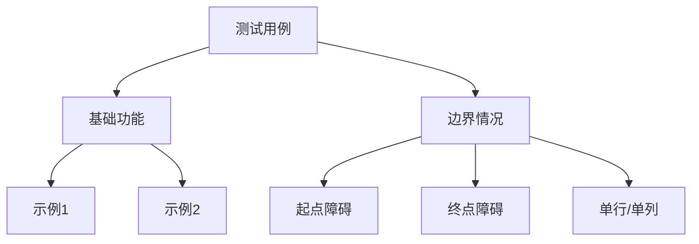

# 63. 不同路径 II

## 题目描述

给定一个 m x n 的整数数组 grid。一个机器人初始位于 左上角（即 grid[0][0]）。机器人尝试移动到 右下角（即 grid[m - 1][n - 1]）。机器人每次只能向下或者向右移动一步。

网格中的障碍物和空位置分别用 1 和 0 来表示。机器人的移动路径中不能包含 任何 有障碍物的方格。

返回机器人能够到达右下角的不同路径数量。

测试用例保证答案小于等于 2 * 109。

## 示例 1：


输入：obstacleGrid = [[0,0,0],[0,1,0],[0,0,0]]
输出：2
解释：3x3 网格的正中间有一个障碍物。
从左上角到右下角一共有 2 条不同的路径：
1. 向右 -> 向右 -> 向下 -> 向下
2. 向下 -> 向下 -> 向右 -> 向右

## 示例 2：


输入：obstacleGrid = [[0,1],[0,0]]
输出：1

## 提示：

- m == obstacleGrid.length
- n == obstacleGrid[i].length
- 1 <= m, n <= 100
- obstacleGrid[i][j] 为 0 或 1

## 解题思路

### 核心思想：动态规划（避开障碍）

与“接雨水”一样，本题也可通过多种思路来解决，但最优且主流的做法是动态规划。定义 `dp[i][j]` 为从起点 `(0,0)` 走到 `(i,j)` 的不同路径数：

- **若 `(i,j)` 为障碍（值为1）**：`dp[i][j] = 0`
- **否则**：`dp[i][j] = dp[i-1][j] + dp[i][j-1]`（只能从上方或左方到达）

初始条件：
- 若起点或终点是障碍，则答案为 `0`
- `dp[0][0] = 1`（前提：起点无障碍）

### 算法流程

```mermaid
graph TD
    A[开始] --> B[输入 obstacleGrid]
    B --> C{起点/终点是否为障碍}
    C -->|是| D[返回 0]
    C -->|否| E[初始化 dp]
    E --> F[按行填表]
    F --> G{遇到障碍?}
    G -->|是| H[置 0]
    G -->|否| I[dp[i][j]=dp[i-1][j]+dp[i][j-1]]
    H --> F
    I --> F
    F --> J[返回 dp[m-1][n-1]]
```

### 复杂度分析

- **时间复杂度**：O(m·n)
- **空间复杂度**：
  - 二维 DP：O(m·n)
  - 一维DP（空间优化）：O(n)

### 边界与细节

- 起点或终点为障碍：直接返回 `0`
- 首行/首列初始化时，若遇到障碍，其后全部为 `0`
- 一维 DP 时，遇到障碍位置要将 `dp[j]` 置 `0`

### 方法对比

```mermaid
graph TD
    A[方法对比] --> B[二维DP]
    A --> C[一维DP]
    A --> D[记忆化DFS]
    B --> E[易理解 空间O(mn)]
    C --> F[最优空间 O(n)]
    D --> G[实现直观 递归栈]
```

## 代码实现

### Go 实现（含二维DP / 一维DP / 记忆化）

```go
package main

import (
    "fmt"
)

func uniquePathsWithObstaclesDP2D(obstacleGrid [][]int) int { /* 见 main.go */ return 0 }
func uniquePathsWithObstaclesDP1D(obstacleGrid [][]int) int { /* 见 main.go */ return 0 }
func uniquePathsWithObstaclesMemo(obstacleGrid [][]int) int { /* 见 main.go */ return 0 }

func main() {
    grid := [][]int{{0,0,0},{0,1,0},{0,0,0}}
    fmt.Println(uniquePathsWithObstaclesDP1D(grid)) // 输出: 2
}
```

完整可运行代码与测试见 `main.go`。

## 测试用例设计



建议覆盖：
- 起点/终点为障碍
- 单行、单列、1x1
- 中间若干障碍导致路径阻断
- 无障碍的普通网格

## 小结

- 本题的本质是“有障碍的网格路径计数”，动态规划最稳妥
- 一维 DP 可在不影响可读性的情况下，将空间优化到 O(n)
- 记忆化搜索更贴近推导，便于理解转移关系
