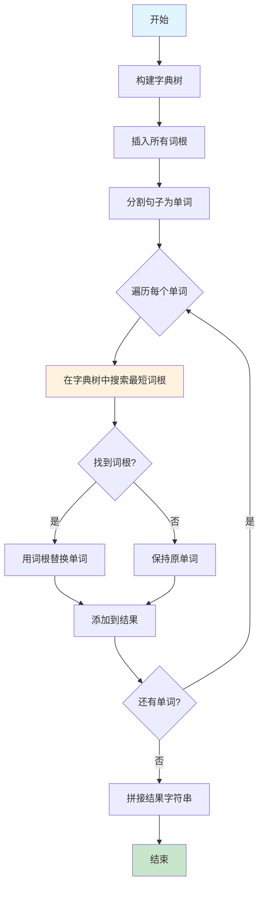
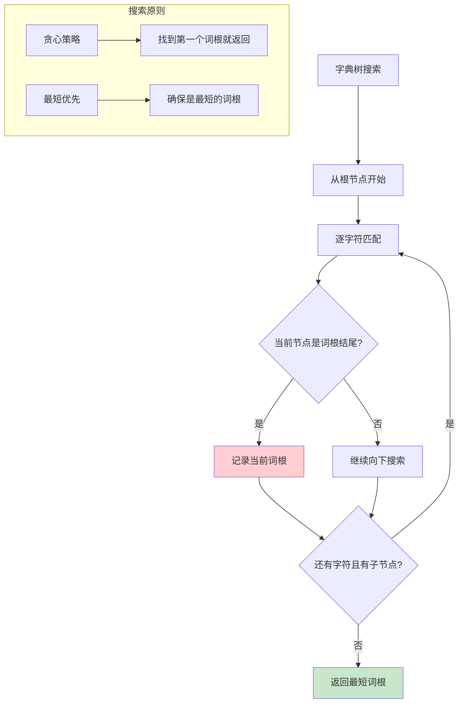

# 648. 单词替换

## 题目描述

在英语中，我们有一个叫做 词根(root) 的概念，可以词根 后面 添加其他一些词组成另一个较长的单词——我们称这个词为 衍生词 (derivative)。例如，词根 help，跟随着 继承词 "ful"，可以形成新的单词 "helpful"。

现在，给定一个由许多 词根 组成的词典 dictionary 和一个用空格分隔单词形成的句子 sentence。你需要将句子中的所有 衍生词 用 词根 替换掉。如果 衍生词 有许多可以形成它的 词根，则用 最短 的 词根 替换它。

你需要输出替换之后的句子。

## 示例 1：

输入：dictionary = ["cat","bat","rat"], sentence = "the cattle was rattled by the battery"
输出："the cat was rat by the bat"

## 示例 2：

输入：dictionary = ["a","b","c"], sentence = "aadsfasf absbs bbab cadsfafs"
输出："a a b c"

## 提示：

- 1 <= dictionary.length <= 1000
- 1 <= dictionary[i].length <= 100
- dictionary[i] 仅由小写字母组成。
- 1 <= sentence.length <= 10^6
- sentence 仅由小写字母和空格组成。
- sentence 中单词的总量在范围 [1, 1000] 内。
- sentence 中每个单词的长度在范围 [1, 1000] 内。
- sentence 中单词之间由一个空格隔开。
- sentence 没有前导或尾随空格。

## 解题思路

### 问题分析

这是一道经典的**字典树(Trie)应用**问题。需要将句子中的衍生词替换为最短的词根。关键是要找到每个单词的最短前缀匹配。

### 核心思想

1. **字典树构建**：将所有词根插入字典树
2. **前缀搜索**：对句子中每个单词，在字典树中找最短词根
3. **词根替换**：用找到的词根替换原单词，如果没找到则保持原样

### 算法流程图



### 字典树搜索策略



### 算法优化策略

```mermaid
graph LR
    A[优化方案] --> B[字典树方法]
    A --> C[哈希表方法]
    A --> D[排序+前缀匹配]
    A --> E[字典排序优化]
    
    B --> B1[时间O(N+M)]
    B --> B2[空间O(词根总长度)]
    B --> B3[最优解法]
    
    C --> C1[时间O(N×M)]
    C --> C2[空间O(词根总长度)]
    C --> C3[实现简单]
    
    D --> D1[时间O(M×logM+N×M)]
    D --> D2[空间O(M)]
    D --> D3[前缀排序]
    
    E --> E1[时间O(N+M)]
    E --> E2[空间O(词根总长度)]
    E → E3[字典序优化]
    
    style B fill:#c8e6c9
    style C fill:#fff3e0
```

### 复杂度分析对比

```mermaid
graph TD
    A[算法复杂度对比] --> B[字典树方法]
    A --> C[哈希表暴力]
    A --> D[排序前缀匹配]
    A --> E[优化字典树]
    A --> F[字符串匹配]
    
    B --> B1[时间: O(N+M)]
    B --> B2[空间: O(L)]
    B --> B3[最优解法]
    
    C --> C1[时间: O(N×M×K)]
    C --> C2[空间: O(M×K)]
    C --> C3[简单直接]
    
    D --> D1[时间: O(M×logM+N×K)]
    D --> D2[空间: O(M×K)]
    D --> D3[排序优化]
    
    E --> E1[时间: O(N+M)]
    E --> E2[空间: O(L)]
    E --> E3[提前终止]
    
    F --> F1[时间: O(N×M×K)]
    F --> F2[空间: O(1)]
    F --> F3[会超时]
    
    style B fill:#4caf50
    style F fill:#f44336
    
    subgraph "说明"
        G[N: 句子长度]
        H[M: 词根数量]
        I[K: 平均词根长度]
        J[L: 词根总长度]
    end
```

## 算法实现要点

1. **字典树构建**：将词根按字符逐个插入，标记结尾节点
2. **前缀搜索**：对每个单词逐字符搜索，遇到词根结尾立即返回
3. **贪心策略**：找到第一个匹配的词根就停止，保证是最短的
4. **边界处理**：处理空字符串、单字符词根等特殊情况
5. **性能优化**：使用数组代替哈希表提升访问速度

## 相关题目

- LeetCode 208. 实现 Trie (前缀树)
- LeetCode 211. 添加与搜索单词 - 数据结构设计
- LeetCode 720. 词典中最长的单词
- LeetCode 820. 单词的压缩编码
