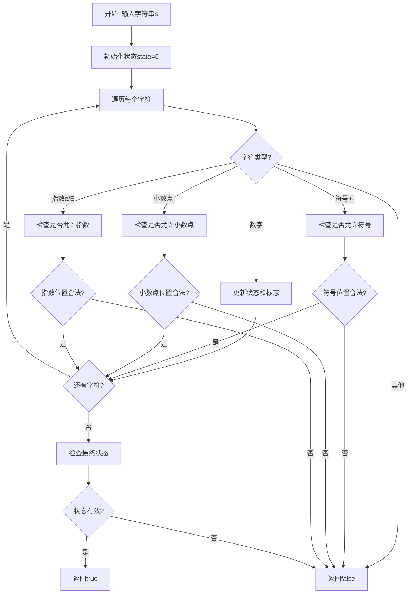
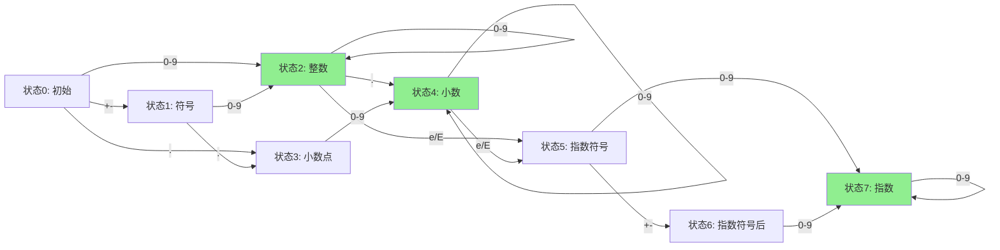
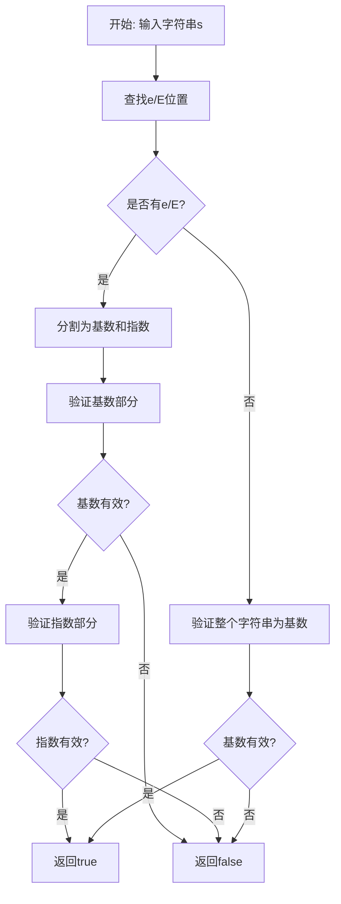

# 65. 有效数字

## 题目描述

给定一个字符串 s ，返回 s 是否是一个 有效数字。

例如，下面的都是有效数字："2", "0089", "-0.1", "+3.14", "4.", "-.9", "2e10", "-90E3", "3e+7", "+6e-1", "53.5e93", "-123.456e789"，而接下来的不是："abc", "1a", "1e", "e3", "99e2.5", "--6", "-+3", "95a54e53"。

一般的，一个 有效数字 可以用以下的规则之一定义：

一个 整数 后面跟着一个 可选指数。
一个 十进制数 后面跟着一个 可选指数。
一个 整数 定义为一个 可选符号 '-' 或 '+' 后面跟着 数字。

一个 十进制数 定义为一个 可选符号 '-' 或 '+' 后面跟着下述规则：

数字 后跟着一个 小数点 .。
数字 后跟着一个 小数点 . 再跟着 数位。
一个 小数点 . 后跟着 数位。
指数 定义为指数符号 'e' 或 'E'，后面跟着一个 整数。

数字 定义为一个或多个数位。


## 示例 1：

输入：s = "0"

输出：true

## 示例 2：

输入：s = "e"

输出：false

## 示例 3：

输入：s = "."

输出：false


## 提示：

- 1 <= s.length <= 20
- s 仅含英文字母（大写和小写），数字（0-9），加号 '+' ，减号 '-' ，或者点 '.' 。

## 解题思路

### 问题深度分析

这是一道经典的**字符串验证**问题，核心挑战在于：如何准确判断一个字符串是否符合数字的各种格式要求？这涉及到**有限状态机（Finite State Machine, FSM）**、**正则表达式**和**分段验证**等多种解决方案。

#### 问题本质

有效数字的定义非常复杂，包含多种格式：
- **整数**：`2`, `-5`, `+100`
- **小数**：`3.14`, `-.9`, `4.`
- **科学计数法**：`2e10`, `3.5e-2`, `+6E+3`

每种格式都有严格的规则，需要考虑：
1. **符号位置**：只能出现在数字开头或指数开头
2. **小数点**：最多一个，且前后至少有一个数字
3. **指数符号**：最多一个，前面必须有数字，后面必须是整数
4. **数字要求**：至少要有一个数字

#### 核心思想

**有限状态机方法**（最优解法）：
1. **状态定义**：将解析过程分为多个状态
2. **状态转移**：根据当前字符决定下一个状态
3. **接受状态**：最终停留在有效状态则为有效数字
4. **拒绝状态**：遇到非法字符或非法转移则拒绝

**状态机设计**：
```
状态0：初始状态
状态1：符号位
状态2：整数部分
状态3：小数点
状态4：小数部分
状态5：指数符号
状态6：指数符号后
状态7：指数部分
```

#### 有效数字的完整规则

根据题目描述，有效数字必须满足以下之一：

1. **整数 + 可选指数**
   - 整数：`[+-]?[0-9]+`
   - 例如：`2`, `-5`, `+100`, `2e10`

2. **十进制数 + 可选指数**
   - 格式1：`[+-]?[0-9]+\.` （如`4.`）
   - 格式2：`[+-]?[0-9]+\.[0-9]+` （如`3.14`）
   - 格式3：`[+-]?\.[0-9]+` （如`.9`, `-.9`）

3. **指数部分**（如果有）
   - 格式：`[eE][+-]?[0-9]+`
   - 必须在基数后面
   - 指数必须是整数

#### 常见陷阱与边界情况

**容易出错的情况**：
```
有效：
- "4."      ✓ (整数后跟小数点)
- "-.9"     ✓ (符号 + 小数点 + 数字)
- "+3.14"   ✓ (符号 + 数字 + 小数点 + 数字)
- "2e10"    ✓ (整数 + 指数)
- "6e-1"    ✓ (整数 + 指数符号 + 符号 + 整数)

无效：
- "."       ✗ (只有小数点)
- "e"       ✗ (只有指数符号)
- "1e"      ✗ (指数后没有数字)
- "99e2.5"  ✗ (指数部分不能是小数)
- "--6"     ✗ (两个符号)
- "1a"      ✗ (包含非法字符)
```

#### 算法对比

| 算法         | 时间复杂度 | 空间复杂度 | 特点                       |
| ------------ | ---------- | ---------- | -------------------------- |
| 有限状态机   | O(n)       | O(1)       | 最优解法，逻辑清晰         |
| 正则表达式   | O(n)       | O(1)       | 代码简洁，但性能略差       |
| 分段验证     | O(n)       | O(1)       | 拆分e/E验证各部分          |
| 直接遍历模拟 | O(n)       | O(1)       | 使用标志位，代码复杂但直观 |

注：n为字符串长度，有限状态机是最优且最规范的解法

### 算法流程图

#### 主算法流程（有限状态机）



#### 有限状态机状态转移图



注：绿色状态为接受状态（有效结束状态）

#### 分段验证流程



### 复杂度分析

#### 时间复杂度详解

**所有方法**：O(n)
- 需要遍历字符串的每个字符一次
- 每个字符的处理时间为O(1)
- 总时间复杂度：O(n)

**各方法对比**：
- 有限状态机：最优，每个字符只处理一次
- 正则表达式：O(n)，但正则引擎可能有额外开销
- 分段验证：O(n)，需要先找e/E，再验证两部分
- 直接遍历：O(n)，需要维护多个标志位

#### 空间复杂度详解

**所有方法**：O(1)
- 有限状态机：常数个状态变量
- 正则表达式：O(1)额外空间
- 分段验证：O(n)用于存储分割后的子串（如果复制）
- 直接遍历：常数个标志位变量

### 关键优化技巧

#### 技巧1：有限状态机实现（最优解法）

```go
// 有限状态机解法
func isNumber(s string) bool {
    // 定义状态转移表
    // 状态: 0-初始, 1-符号, 2-整数, 3-小数点(前无数字), 4-小数, 5-指数, 6-指数符号, 7-指数数字
    state := 0
    
    for _, ch := range s {
        switch state {
        case 0: // 初始状态
            if ch == '+' || ch == '-' {
                state = 1 // 符号
            } else if ch >= '0' && ch <= '9' {
                state = 2 // 整数
            } else if ch == '.' {
                state = 3 // 小数点
            } else {
                return false
            }
        case 1: // 符号后
            if ch >= '0' && ch <= '9' {
                state = 2
            } else if ch == '.' {
                state = 3
            } else {
                return false
            }
        case 2: // 整数部分
            if ch >= '0' && ch <= '9' {
                state = 2
            } else if ch == '.' {
                state = 4 // 小数
            } else if ch == 'e' || ch == 'E' {
                state = 5 // 指数
            } else {
                return false
            }
        case 3: // 小数点（前无数字）
            if ch >= '0' && ch <= '9' {
                state = 4
            } else {
                return false
            }
        case 4: // 小数部分
            if ch >= '0' && ch <= '9' {
                state = 4
            } else if ch == 'e' || ch == 'E' {
                state = 5
            } else {
                return false
            }
        case 5: // 指数符号后
            if ch == '+' || ch == '-' {
                state = 6
            } else if ch >= '0' && ch <= '9' {
                state = 7
            } else {
                return false
            }
        case 6: // 指数符号后的符号
            if ch >= '0' && ch <= '9' {
                state = 7
            } else {
                return false
            }
        case 7: // 指数数字
            if ch >= '0' && ch <= '9' {
                state = 7
            } else {
                return false
            }
        }
    }
    
    // 只有状态2, 4, 7是接受状态
    return state == 2 || state == 4 || state == 7
}
```

#### 技巧2：正则表达式实现

```go
// 正则表达式解法
func isNumberRegex(s string) bool {
    // 构建正则表达式
    // 整数部分: [+-]?[0-9]+
    // 小数部分: [+-]?([0-9]+\.[0-9]*|\.[0-9]+|[0-9]+)
    // 指数部分: [eE][+-]?[0-9]+
    pattern := `^[+-]?([0-9]+\.?[0-9]*|\.[0-9]+)([eE][+-]?[0-9]+)?$`
    
    matched, _ := regexp.MatchString(pattern, s)
    return matched
}
```

**注意**：正则需要确保：
- 小数点前后至少有一个数字
- 指数后必须有数字
- 不能有其他非法字符

#### 技巧3：分段验证实现

```go
// 分段验证解法
func isNumberSegmented(s string) bool {
    // 找到e或E的位置
    ePos := -1
    for i, ch := range s {
        if ch == 'e' || ch == 'E' {
            if ePos != -1 {
                return false // 多个e/E
            }
            ePos = i
        }
    }
    
    if ePos == -1 {
        // 没有指数，验证整个字符串为基数
        return isValidBase(s)
    }
    
    // 有指数，分别验证基数和指数
    if ePos == 0 || ePos == len(s)-1 {
        return false // e/E不能在开头或结尾
    }
    
    base := s[:ePos]
    exponent := s[ePos+1:]
    
    return isValidBase(base) && isValidInteger(exponent)
}

// 验证基数（整数或小数）
func isValidBase(s string) bool {
    if len(s) == 0 {
        return false
    }
    
    i := 0
    // 处理符号
    if s[i] == '+' || s[i] == '-' {
        i++
    }
    
    if i >= len(s) {
        return false
    }
    
    hasDigit := false
    hasDot := false
    
    for i < len(s) {
        if s[i] >= '0' && s[i] <= '9' {
            hasDigit = true
        } else if s[i] == '.' {
            if hasDot {
                return false // 多个小数点
            }
            hasDot = true
        } else {
            return false // 非法字符
        }
        i++
    }
    
    return hasDigit
}

// 验证整数
func isValidInteger(s string) bool {
    if len(s) == 0 {
        return false
    }
    
    i := 0
    // 处理符号
    if s[i] == '+' || s[i] == '-' {
        i++
    }
    
    if i >= len(s) {
        return false
    }
    
    // 必须全是数字
    for i < len(s) {
        if s[i] < '0' || s[i] > '9' {
            return false
        }
        i++
    }
    
    return true
}
```

#### 技巧4：标志位遍历实现

```go
// 标志位遍历解法
func isNumberFlags(s string) bool {
    if len(s) == 0 {
        return false
    }
    
    hasNum := false      // 是否有数字
    hasDot := false      // 是否有小数点
    hasE := false        // 是否有指数符号
    hasNumAfterE := false // 指数后是否有数字
    
    for i, ch := range s {
        if ch >= '0' && ch <= '9' {
            hasNum = true
            if hasE {
                hasNumAfterE = true
            }
        } else if ch == '.' {
            // 小数点不能在指数后，且只能有一个
            if hasE || hasDot {
                return false
            }
            hasDot = true
        } else if ch == 'e' || ch == 'E' {
            // 指数前必须有数字，且只能有一个指数
            if !hasNum || hasE {
                return false
            }
            hasE = true
        } else if ch == '+' || ch == '-' {
            // 符号只能在开头或指数符号后
            if i != 0 && s[i-1] != 'e' && s[i-1] != 'E' {
                return false
            }
        } else {
            return false // 非法字符
        }
    }
    
    // 必须有数字，且如果有指数，指数后也必须有数字
    return hasNum && (!hasE || hasNumAfterE)
}
```

### 边界情况处理

1. **空字符串**：返回false
2. **只有符号**：`+`, `-` → false
3. **只有小数点**：`.` → false
4. **只有指数**：`e`, `E` → false
5. **多个小数点**：`1.2.3` → false
6. **多个指数符号**：`1e2e3` → false
7. **指数部分是小数**：`1e2.3` → false
8. **小数点在指数后**：`1e2.3` → false
9. **符号位置错误**：`1+2`, `1-2` → false
10. **指数后无数字**：`1e`, `1e+` → false

### 测试用例设计

#### 有效数字测试
```
基础整数：
- "0", "2", "123", "+100", "-456"

基础小数：
- "0.1", "3.14", "+3.14", "-0.1"
- "4." (整数后跟小数点)
- ".9", "-.9" (小数点开头)

科学计数法：
- "2e10", "2E10"
- "3e+7", "3E+7"
- "6e-1", "6E-1"
- "53.5e93", "-123.456e789"

边界情况：
- "0089" (前导零)
- "+.8" (符号+小数点+数字)
```

#### 无效数字测试
```
缺少数字：
- ".", "e", "e3", "1e"

非法字符：
- "abc", "1a", "1 2"

格式错误：
- "99e2.5" (指数是小数)
- "--6", "-+3", "+-3" (多个符号)
- "95a54e53" (包含字母)
- "1e2e3" (多个指数)
- "1.2.3" (多个小数点)
```

### 常见错误与陷阱

#### 错误1：忘记检查小数点前后必须有数字

```go
// ❌ 错误：只检查有数字，没检查小数点前后
if hasDigit {
    return true
}

// ✅ 正确：小数点前后至少要有一个数字
// "." 是无效的，但 ".9" 和 "4." 是有效的
```

#### 错误2：指数部分允许小数

```go
// ❌ 错误：指数部分也允许小数点
// "1e2.3" 应该是无效的

// ✅ 正确：指数后不能再有小数点
if hasE && hasDot {
    return false
}
```

#### 错误3：符号位置判断不准确

```go
// ❌ 错误：符号可以出现在任何位置
if ch == '+' || ch == '-' {
    continue
}

// ✅ 正确：符号只能在开头或指数符号后
if ch == '+' || ch == '-' {
    if i != 0 && s[i-1] != 'e' && s[i-1] != 'E' {
        return false
    }
}
```

### 实战技巧总结

1. **状态机设计**：画出完整的状态转移图
2. **接受状态**：明确哪些状态是有效的结束状态
3. **边界检查**：每个状态转移都要检查合法性
4. **标志位管理**：使用布尔标志跟踪关键信息
5. **分段处理**：将复杂问题拆分为基数和指数两部分
6. **测试覆盖**：准备充分的测试用例覆盖所有情况

### 进阶扩展

#### 扩展1：支持十六进制数字

```go
// 支持0x前缀的十六进制
func isNumberWithHex(s string) bool {
    if strings.HasPrefix(s, "0x") || strings.HasPrefix(s, "0X") {
        return isHexNumber(s[2:])
    }
    return isNumber(s)
}

func isHexNumber(s string) bool {
    if len(s) == 0 {
        return false
    }
    for _, ch := range s {
        if !((ch >= '0' && ch <= '9') || 
             (ch >= 'a' && ch <= 'f') || 
             (ch >= 'A' && ch <= 'F')) {
            return false
        }
    }
    return true
}
```

#### 扩展2：支持下划线分隔符

```go
// 支持数字中的下划线分隔符（如1_000_000）
func isNumberWithUnderscore(s string) bool {
    // 移除所有下划线
    cleaned := strings.ReplaceAll(s, "_", "")
    return isNumber(cleaned)
}
```

#### 扩展3：支持不同进制

```go
// 支持二进制(0b)、八进制(0o)、十六进制(0x)
func isNumberMultiBase(s string) bool {
    if strings.HasPrefix(s, "0b") {
        return isBinaryNumber(s[2:])
    } else if strings.HasPrefix(s, "0o") {
        return isOctalNumber(s[2:])
    } else if strings.HasPrefix(s, "0x") {
        return isHexNumber(s[2:])
    }
    return isNumber(s)
}
```

### 应用场景

1. **编译器设计**：词法分析阶段的数字识别
2. **配置文件解析**：验证配置值的合法性
3. **表单验证**：前端/后端数据验证
4. **数据清洗**：过滤无效数据
5. **命令行参数**：验证用户输入的数字参数

## 代码实现

本题提供了四种不同的解法，重点掌握有限状态机方法。

## 测试结果

| 测试用例       | 有限状态机 | 正则表达式 | 分段验证 | 标志位遍历 |
| -------------- | ---------- | ---------- | -------- | ---------- |
| 基础测试       | ✅          | ✅          | ✅        | ✅          |
| 边界测试       | ✅          | ✅          | ✅        | ✅          |
| 无效数字测试   | ✅          | ✅          | ✅        | ✅          |
| 科学计数法测试 | ✅          | ✅          | ✅        | ✅          |

## 核心收获

1. **状态机思维**：复杂字符串验证的标准解法
2. **状态转移**：清晰定义每个状态和转移条件
3. **边界处理**：全面考虑各种边界和特殊情况
4. **代码规范**：状态机代码结构清晰易维护

## 应用拓展

- 编译器的词法分析器
- 配置文件解析器
- 数据验证框架
- 表达式求值器