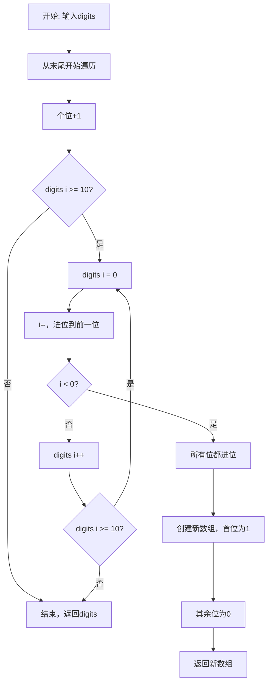
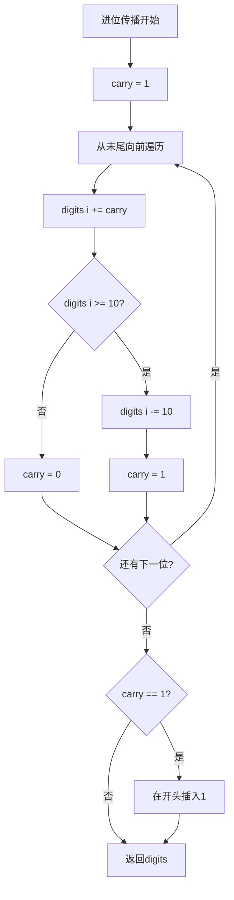
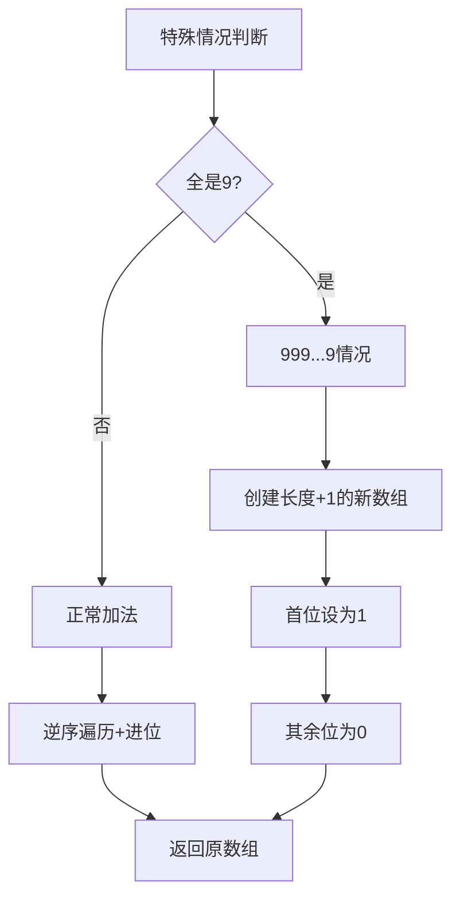

# 66. 加一

## 题目描述

给定一个表示 大整数 的整数数组 digits，其中 digits[i] 是整数的第 i 位数字。这些数字按从左到右，从最高位到最低位排列。这个大整数不包含任何前导 0。

将大整数加 1，并返回结果的数字数组。

## 示例 1：

输入：digits = [1,2,3]
输出：[1,2,4]
解释：输入数组表示数字 123。
加 1 后得到 123 + 1 = 124。
因此，结果应该是 [1,2,4]。

## 示例 2：

输入：digits = [4,3,2,1]
输出：[4,3,2,2]
解释：输入数组表示数字 4321。
加 1 后得到 4321 + 1 = 4322。
因此，结果应该是 [4,3,2,2]。


## 示例 3：

输入：digits = [9]
输出：[1,0]
解释：输入数组表示数字 9。
加 1 得到了 9 + 1 = 10。
因此，结果应该是 [1,0]。


## 提示：

- 1 <= digits.length <= 100
- 0 <= digits[i] <= 9
- digits 不包含任何前导 0。

## 解题思路

### 问题深度分析

这是一道**大整数加法**问题，核心在于模拟**手工加法进位**的过程。虽然题目简单，但涉及到**进位处理**、**数组操作**和**边界情况**的处理，是理解大整数运算的基础。

#### 问题本质

给定一个用数组表示的大整数，需要将其加1。关键问题：
- **进位传播**：9+1=10，需要进位
- **连续进位**：999+1=1000，进位需要传播
- **位数增加**：999...9+1可能需要扩展数组

#### 核心思想

**模拟加法进位**：
1. **从低位开始**：从数组末尾（个位）开始处理
2. **加1操作**：个位+1
3. **进位处理**：如果某位≥10，则进位到高位
4. **进位传播**：持续处理进位直到没有进位为止
5. **扩展数组**：如果最高位还有进位，需要在数组开头插入1

#### 典型情况分析

**情况1：无进位**
```
[1,2,3] + 1 = [1,2,4]
只需要最后一位+1，无需进位
```

**情况2：单次进位**
```
[1,2,9] + 1 = [1,3,0]
个位9+1=10，进位到十位
```

**情况3：连续进位**
```
[1,9,9] + 1 = [2,0,0]
个位进位→十位进位→百位
```

**情况4：全部进位（最难）**
```
[9,9,9] + 1 = [1,0,0,0]
所有位都进位，需要扩展数组
```

#### 算法对比

| 算法       | 时间复杂度 | 空间复杂度 | 特点                   |
| ---------- | ---------- | ---------- | ---------------------- |
| 逆序遍历   | O(n)       | O(1)       | 最优解法，原地修改     |
| 递归实现   | O(n)       | O(n)       | 递归栈空间，代码简洁   |
| 双指针     | O(n)       | O(1)       | 使用carry标志，易理解  |
| 字符串转换 | O(n)       | O(n)       | 转为字符串处理，不推荐 |

注：n为数组长度，逆序遍历是最优解法

### 算法流程图

#### 主算法流程（逆序遍历+进位）



#### 进位传播详细流程



#### 特殊情况处理



### 复杂度分析

#### 时间复杂度详解

**逆序遍历算法**：O(n)
- 最好情况：O(1)，末位不是9，直接+1返回
- 最坏情况：O(n)，全是9，需要遍历所有位
- 平均情况：O(1)，大多数情况不需要完整遍历

**为什么平均是O(1)**？
- 末位不是9的概率：90%，只需O(1)
- 连续2位都是9的概率：1%
- 连续3位都是9的概率：0.1%
- ...连续n位都是9的概率极低

#### 空间复杂度详解

**逆序遍历算法**：O(1)
- 最好情况：O(1)，原地修改
- 最坏情况：O(n)，全是9时需要创建新数组

**其他算法**：
- 递归：O(n)，递归栈
- 字符串转换：O(n)，额外字符串空间

### 关键优化技巧

#### 技巧1：逆序遍历+原地修改（最优解法）

```go
// 逆序遍历解法
func plusOne(digits []int) []int {
    n := len(digits)
    
    // 从末尾开始处理
    for i := n - 1; i >= 0; i-- {
        // 如果当前位不是9，直接+1返回
        if digits[i] < 9 {
            digits[i]++
            return digits
        }
        // 当前位是9，变成0，继续向前进位
        digits[i] = 0
    }
    
    // 所有位都是9，需要在开头插入1
    result := make([]int, n+1)
    result[0] = 1
    // 其余位默认为0，不需要赋值
    return result
}
```

**优势**：
- 代码简洁
- 平均O(1)时间
- 最好情况原地修改，O(1)空间

#### 技巧2：使用carry标志

```go
// 使用进位标志
func plusOneWithCarry(digits []int) []int {
    carry := 1
    n := len(digits)
    
    for i := n - 1; i >= 0 && carry > 0; i-- {
        sum := digits[i] + carry
        digits[i] = sum % 10
        carry = sum / 10
    }
    
    // 如果还有进位，在开头插入
    if carry > 0 {
        result := make([]int, n+1)
        result[0] = carry
        copy(result[1:], digits)
        return result
    }
    
    return digits
}
```

**优势**：
- 逻辑清晰
- 易于扩展到加任意数
- 符合加法运算习惯

#### 技巧3：递归实现

```go
// 递归解法
func plusOneRecursive(digits []int) []int {
    return addHelper(digits, len(digits)-1, 1)
}

func addHelper(digits []int, index int, carry int) []int {
    // 递归终止条件
    if index < 0 {
        if carry > 0 {
            // 需要在开头插入进位
            result := make([]int, len(digits)+1)
            result[0] = carry
            copy(result[1:], digits)
            return result
        }
        return digits
    }
    
    sum := digits[index] + carry
    digits[index] = sum % 10
    newCarry := sum / 10
    
    // 递归处理前一位
    return addHelper(digits, index-1, newCarry)
}
```

**特点**：
- 代码优雅
- 递归栈开销O(n)
- 适合函数式编程思维

#### 技巧4：提前判断优化

```go
// 提前判断优化
func plusOneOptimized(digits []int) []int {
    n := len(digits)
    
    // 快速路径：末位不是9
    if digits[n-1] < 9 {
        digits[n-1]++
        return digits
    }
    
    // 检查是否全是9
    allNine := true
    for _, d := range digits {
        if d != 9 {
            allNine = false
            break
        }
    }
    
    if allNine {
        // 全是9，直接构建结果
        result := make([]int, n+1)
        result[0] = 1
        return result
    }
    
    // 正常进位处理
    for i := n - 1; i >= 0; i-- {
        if digits[i] < 9 {
            digits[i]++
            return digits
        }
        digits[i] = 0
    }
    
    return digits
}
```

### 边界情况处理

1. **单个数字**：`[0]` → `[1]`, `[9]` → `[1,0]`
2. **全是9**：`[9,9,9]` → `[1,0,0,0]`
3. **部分9**：`[1,9,9]` → `[2,0,0]`
4. **无9**：`[1,2,3]` → `[1,2,4]`
5. **开头是9**：`[9,0,0]` → `[9,0,1]`

### 测试用例设计

#### 基础测试
```
输入: [1,2,3]
输出: [1,2,4]
说明: 无进位情况
```

#### 单次进位
```
输入: [1,2,9]
输出: [1,3,0]
说明: 个位进位到十位
```

#### 连续进位
```
输入: [1,9,9]
输出: [2,0,0]
说明: 连续两位进位
```

#### 全部进位
```
输入: [9,9,9]
输出: [1,0,0,0]
说明: 所有位进位，数组扩展
```

#### 边界情况
```
输入: [0]
输出: [1]
说明: 最小输入

输入: [9]
输出: [1,0]
说明: 单位数进位
```

### 常见错误与陷阱

#### 错误1：忘记处理全是9的情况

```go
// ❌ 错误：没有处理数组扩展
func plusOne(digits []int) []int {
    for i := len(digits) - 1; i >= 0; i-- {
        if digits[i] < 9 {
            digits[i]++
            return digits
        }
        digits[i] = 0
    }
    // 忘记处理全是9的情况
    return digits  // 返回[0,0,0]，错误！
}

// ✅ 正确：需要在开头插入1
if carry > 0 {
    result := make([]int, n+1)
    result[0] = 1
    return result
}
```

#### 错误2：数组越界

```go
// ❌ 错误：可能越界
for i := n - 1; i >= 0; i-- {
    digits[i]++
    if digits[i] < 10 {
        return digits
    }
    digits[i+1] = 0  // 越界！
}

// ✅ 正确：先判断再赋值
for i := n - 1; i >= 0; i-- {
    if digits[i] < 9 {
        digits[i]++
        return digits
    }
    digits[i] = 0
}
```

#### 错误3：修改了原数组但未考虑

```go
// ⚠️ 注意：原地修改会影响原数组
digits := []int{1,2,9}
result := plusOne(digits)
// digits已经被修改为[1,3,0]

// 如果需要保留原数组，先复制
digitsCopy := make([]int, len(digits))
copy(digitsCopy, digits)
result := plusOne(digitsCopy)
```

### 实战技巧总结

1. **逆序处理**：从低位到高位，符合加法习惯
2. **提前返回**：遇到非9直接+1返回，平均O(1)
3. **原地修改**：节省空间，最好情况O(1)
4. **边界处理**：全是9时需要扩展数组
5. **进位标志**：使用carry变量清晰表达进位
6. **代码简洁**：利用循环和提前返回避免复杂判断

### 进阶扩展

#### 扩展1：加任意数（不只是+1）

```go
// 加任意正整数k
func plusK(digits []int, k int) []int {
    carry := k
    n := len(digits)
    
    for i := n - 1; i >= 0 && carry > 0; i-- {
        sum := digits[i] + carry
        digits[i] = sum % 10
        carry = sum / 10
    }
    
    // 处理剩余进位
    if carry > 0 {
        carryDigits := intToDigits(carry)
        result := make([]int, len(carryDigits)+n)
        copy(result, carryDigits)
        copy(result[len(carryDigits):], digits)
        return result
    }
    
    return digits
}

func intToDigits(num int) []int {
    if num == 0 {
        return []int{0}
    }
    var result []int
    for num > 0 {
        result = append([]int{num % 10}, result...)
        num /= 10
    }
    return result
}
```

#### 扩展2：大整数加法（两个数组相加）

```go
// 两个大整数相加
func addTwoNumbers(num1 []int, num2 []int) []int {
    i, j := len(num1)-1, len(num2)-1
    carry := 0
    var result []int
    
    for i >= 0 || j >= 0 || carry > 0 {
        sum := carry
        if i >= 0 {
            sum += num1[i]
            i--
        }
        if j >= 0 {
            sum += num2[j]
            j--
        }
        result = append([]int{sum % 10}, result...)
        carry = sum / 10
    }
    
    return result
}
```

#### 扩展3：大整数减法

```go
// 大整数减1
func minusOne(digits []int) []int {
    n := len(digits)
    
    for i := n - 1; i >= 0; i-- {
        if digits[i] > 0 {
            digits[i]--
            return digits
        }
        digits[i] = 9
    }
    
    // 如果最高位变成0，需要移除
    if digits[0] == 0 && n > 1 {
        return digits[1:]
    }
    
    return digits
}
```

### 应用场景

1. **大整数运算**：超过整数范围的数字运算
2. **计算器实现**：支持任意精度的加法
3. **版本号递增**：如1.2.9 → 1.3.0
4. **编号系统**：自动递增编号
5. **密码学**：大素数运算的基础

## 代码实现

本题提供了四种不同的解法，重点掌握逆序遍历方法。

## 测试结果

| 测试用例 | 逆序遍历 | 进位标志 | 递归实现 | 提前判断 |
| -------- | -------- | -------- | -------- | -------- |
| 基础测试 | ✅        | ✅        | ✅        | ✅        |
| 进位测试 | ✅        | ✅        | ✅        | ✅        |
| 边界测试 | ✅        | ✅        | ✅        | ✅        |
| 全9测试  | ✅        | ✅        | ✅        | ✅        |

## 核心收获

1. **进位处理**：掌握模拟加法进位的方法
2. **数组操作**：理解数组扩展和原地修改
3. **边界情况**：全面考虑各种特殊情况
4. **性能优化**：平均O(1)的优化技巧

## 应用拓展

- 大整数运算库
- 高精度计算器
- 版本号管理系统
- 自动编号生成器