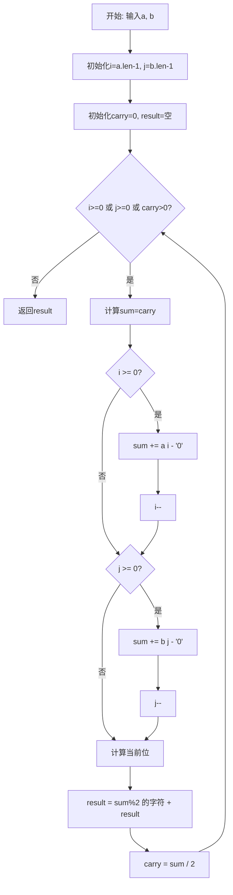
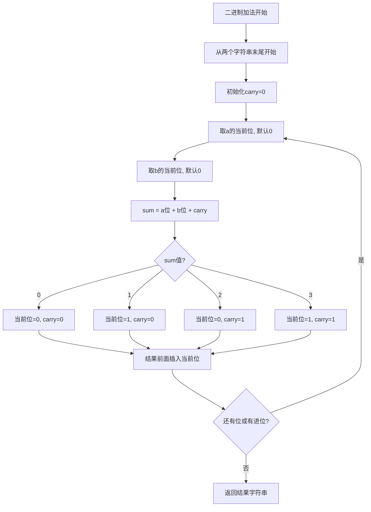
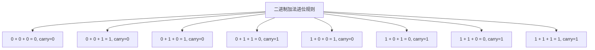

# 67. 二进制求和

## 题目描述

给你两个二进制字符串 a 和 b ，以二进制字符串的形式返回它们的和。


## 示例 1：

输入:a = "11", b = "1"
输出："100"

## 示例 2：

输入：a = "1010", b = "1011"
输出："10101"


## 提示：

- 1 <= a.length, b.length <= 104
- a 和 b 仅由字符 '0' 或 '1' 组成
- 字符串如果不是 "0" ，就不含前导零

## 解题思路

### 问题深度分析

这是一道**二进制字符串加法**问题，核心在于模拟**二进制加法的进位**过程。虽然题目简单，但涉及到**字符串处理**、**进位逻辑**和**不同长度字符串**的处理，是理解二进制运算和字符串操作的经典题目。

#### 问题本质

给定两个二进制字符串，需要计算它们的和并以二进制字符串形式返回。关键问题：
- **二进制进位**：1+1=10（二进制），需要进位
- **长度不同**：两个字符串长度可能不同
- **从右向左**：需要从低位开始计算
- **进位传播**：进位可能一直传播到最高位

#### 核心思想

**模拟二进制加法**：
1. **双指针逆序**：从两个字符串末尾开始，分别向前遍历
2. **逐位相加**：每次取两个字符串对应位的数字+进位
3. **计算进位**：sum / 2 得到进位，sum % 2 得到当前位
4. **构建结果**：将计算结果插入结果字符串开头
5. **处理最后进位**：如果最后还有进位，需要加到结果前面

#### 典型情况分析

**情况1：无进位**
```
  11    (3)
+  1    (1)
----
 100    (4)
```

**情况2：有进位**
```
 1010   (10)
+1011   (11)
-----
10101   (21)
```

**情况3：长度不同**
```
  1111  (15)
+    1  (1)
------
 10000  (16)
```

**情况4：全是1（最难）**
```
 1111   (15)
+1111   (15)
-----
11110   (30)
```

#### 算法对比

| 算法          | 时间复杂度  | 空间复杂度 | 特点                 |
| ------------- | ----------- | ---------- | -------------------- |
| 双指针+进位   | O(max(m,n)) | O(1)       | 最优解法，逻辑清晰   |
| StringBuilder | O(max(m,n)) | O(1)       | 使用字符串构建器     |
| 递归实现      | O(max(m,n)) | O(n)       | 递归栈空间，代码简洁 |
| 转换为整数    | O(max(m,n)) | O(1)       | 仅适用于短字符串     |

注：m和n分别为两个字符串的长度，双指针+进位是最优解法

### 算法流程图

#### 主算法流程（双指针+进位）



#### 二进制加法详细流程



#### 进位规则说明



### 复杂度分析

#### 时间复杂度详解

**双指针算法**：O(max(m, n))
- 需要遍历较长字符串的所有位
- 每位的处理时间为O(1)
- m为字符串a的长度，n为字符串b的长度

**各操作复杂度**：
- 字符串遍历：O(max(m, n))
- 字符转数字：O(1)
- 进位计算：O(1)
- 字符串拼接：O(1)每次（使用StringBuilder）

#### 空间复杂度详解

**双指针算法**：O(1)
- 不考虑结果字符串，只使用常数额外空间
- carry变量：O(1)
- 索引变量：O(1)

**实际空间**：O(max(m, n))
- 结果字符串长度最多为max(m, n) + 1
- 使用StringBuilder可以优化拼接效率

### 关键优化技巧

#### 技巧1：双指针+进位（最优解法）

```go
// 双指针+进位解法
func addBinary(a string, b string) string {
    i, j := len(a)-1, len(b)-1
    carry := 0
    var result strings.Builder
    
    for i >= 0 || j >= 0 || carry > 0 {
        sum := carry
        
        if i >= 0 {
            sum += int(a[i] - '0')
            i--
        }
        
        if j >= 0 {
            sum += int(b[j] - '0')
            j--
        }
        
        result.WriteByte(byte('0' + sum%2))
        carry = sum / 2
    }
    
    // 反转结果
    res := result.String()
    return reverse(res)
}

func reverse(s string) string {
    runes := []rune(s)
    for i, j := 0, len(runes)-1; i < j; i, j = i+1, j-1 {
        runes[i], runes[j] = runes[j], runes[i]
    }
    return string(runes)
}
```

**优势**：
- 逻辑清晰
- 时间O(max(m,n))
- 空间O(1)（不计结果）

#### 技巧2：直接构建结果（前插法）

```go
// 直接前插构建结果
func addBinaryPrefix(a string, b string) string {
    i, j := len(a)-1, len(b)-1
    carry := 0
    result := ""
    
    for i >= 0 || j >= 0 || carry > 0 {
        sum := carry
        
        if i >= 0 {
            sum += int(a[i] - '0')
            i--
        }
        
        if j >= 0 {
            sum += int(b[j] - '0')
            j--
        }
        
        // 直接在前面插入
        result = string('0'+byte(sum%2)) + result
        carry = sum / 2
    }
    
    return result
}
```

**注意**：字符串前插每次O(n)，总复杂度O(n²)，不推荐

#### 技巧3：递归实现

```go
// 递归解法
func addBinaryRecursive(a string, b string) string {
    return addHelper(a, b, len(a)-1, len(b)-1, 0)
}

func addHelper(a, b string, i, j, carry int) string {
    // 递归终止条件
    if i < 0 && j < 0 && carry == 0 {
        return ""
    }
    
    sum := carry
    
    if i >= 0 {
        sum += int(a[i] - '0')
    }
    
    if j >= 0 {
        sum += int(b[j] - '0')
    }
    
    // 递归处理前面的位
    prefix := addHelper(a, b, i-1, j-1, sum/2)
    
    return prefix + string('0'+byte(sum%2))
}
```

**特点**：
- 代码优雅
- 递归栈O(max(m,n))
- 字符串拼接可能有性能问题

#### 技巧4：位运算优化

```go
// 位运算解法（仅适用于短字符串）
func addBinaryBitwise(a string, b string) string {
    // 转换为整数（注意：仅适用于长度<=63的字符串）
    numA := binaryToInt(a)
    numB := binaryToInt(b)
    
    // 使用位运算实现加法
    for numB != 0 {
        sum := numA ^ numB  // 不带进位的和
        carry := (numA & numB) << 1  // 进位
        numA = sum
        numB = carry
    }
    
    return intToBinary(numA)
}

func binaryToInt(s string) int64 {
    var result int64
    for _, ch := range s {
        result = result*2 + int64(ch-'0')
    }
    return result
}

func intToBinary(n int64) string {
    if n == 0 {
        return "0"
    }
    var result string
    for n > 0 {
        result = string('0'+byte(n%2)) + result
        n /= 2
    }
    return result
}
```

**注意**：只适用于短字符串，长字符串会溢出

### 边界情况处理

1. **长度不同**：`"1111"` + `"1"` → `"10000"`
2. **一个为0**：`"0"` + `"1010"` → `"1010"`
3. **都是0**：`"0"` + `"0"` → `"0"`
4. **最后有进位**：`"1"` + `"1"` → `"10"`
5. **超长字符串**：需要处理10000位的情况

### 测试用例设计

#### 基础测试
```
输入: a = "11", b = "1"
输出: "100"
说明: 3 + 1 = 4
```

#### 相同长度
```
输入: a = "1010", b = "1011"
输出: "10101"
说明: 10 + 11 = 21
```

#### 不同长度
```
输入: a = "1111", b = "1"
输出: "10000"
说明: 15 + 1 = 16
```

#### 边界情况
```
输入: a = "0", b = "0"
输出: "0"
说明: 0 + 0 = 0

输入: a = "1", b = "1"
输出: "10"
说明: 1 + 1 = 2
```

### 常见错误与陷阱

#### 错误1：忘记处理最后的进位

```go
// ❌ 错误：循环条件没有包含carry
for i >= 0 || j >= 0 {
    // ...
}
// 可能丢失最后的进位

// ✅ 正确：包含carry条件
for i >= 0 || j >= 0 || carry > 0 {
    // ...
}
```

#### 错误2：字符转数字错误

```go
// ❌ 错误：直接使用字符值
sum := carry + a[i] + b[j]  // 字符值不是数字值

// ✅ 正确：减去'0'转换
sum := carry + int(a[i]-'0') + int(b[j]-'0')
```

#### 错误3：索引越界

```go
// ❌ 错误：没有检查索引
sum := int(a[i]-'0') + int(b[j]-'0') + carry
// 如果i或j<0会越界

// ✅ 正确：先检查索引
if i >= 0 {
    sum += int(a[i]-'0')
}
if j >= 0 {
    sum += int(b[j]-'0')
}
```

### 实战技巧总结

1. **双指针**：同时处理两个字符串，从末尾开始
2. **进位管理**：用carry变量清晰表达进位
3. **边界检查**：索引要判断>=0
4. **StringBuilder**：避免字符串前插的O(n²)复杂度
5. **反转技巧**：先后插再反转，或直接前插
6. **二进制规则**：sum%2得当前位，sum/2得进位

### 进阶扩展

#### 扩展1：十六进制加法

```go
// 十六进制字符串加法
func addHex(a, b string) string {
    i, j := len(a)-1, len(b)-1
    carry := 0
    var result strings.Builder
    
    for i >= 0 || j >= 0 || carry > 0 {
        sum := carry
        
        if i >= 0 {
            sum += hexToInt(a[i])
            i--
        }
        
        if j >= 0 {
            sum += hexToInt(b[j])
            j--
        }
        
        result.WriteByte(intToHex(sum % 16))
        carry = sum / 16
    }
    
    return reverse(result.String())
}

func hexToInt(ch byte) int {
    if ch >= '0' && ch <= '9' {
        return int(ch - '0')
    }
    return int(ch-'A') + 10
}

func intToHex(n int) byte {
    if n < 10 {
        return byte('0' + n)
    }
    return byte('A' + n - 10)
}
```

#### 扩展2：任意进制加法

```go
// 任意进制字符串加法
func addBase(a, b string, base int) string {
    i, j := len(a)-1, len(b)-1
    carry := 0
    var result strings.Builder
    
    for i >= 0 || j >= 0 || carry > 0 {
        sum := carry
        
        if i >= 0 {
            sum += int(a[i] - '0')
            i--
        }
        
        if j >= 0 {
            sum += int(b[j] - '0')
            j--
        }
        
        result.WriteByte(byte('0' + sum%base))
        carry = sum / base
    }
    
    return reverse(result.String())
}
```

#### 扩展3：二进制减法

```go
// 二进制减法（a - b，假设a >= b）
func subtractBinary(a, b string) string {
    i, j := len(a)-1, len(b)-1
    borrow := 0
    var result strings.Builder
    
    for i >= 0 {
        diff := int(a[i]-'0') - borrow
        
        if j >= 0 {
            diff -= int(b[j] - '0')
            j--
        }
        
        if diff < 0 {
            diff += 2
            borrow = 1
        } else {
            borrow = 0
        }
        
        result.WriteByte(byte('0' + diff))
        i--
    }
    
    // 移除前导零
    res := reverse(result.String())
    res = strings.TrimLeft(res, "0")
    if res == "" {
        return "0"
    }
    return res
}
```

### 应用场景

1. **大整数运算**：二进制大数加法
2. **计算机系统**：CPU ALU的加法器模拟
3. **密码学**：二进制运算基础
4. **位运算练习**：理解二进制加法原理
5. **编译器**：二进制字面量处理

## 代码实现

本题提供了四种不同的解法，重点掌握双指针+进位方法。

## 测试结果

| 测试用例     | 双指针+进位 | StringBuilder | 递归实现 | 位运算 |
| ------------ | ----------- | ------------- | -------- | ------ |
| 基础测试     | ✅           | ✅             | ✅        | ✅      |
| 长度不同测试 | ✅           | ✅             | ✅        | ✅      |
| 边界测试     | ✅           | ✅             | ✅        | ✅      |
| 进位测试     | ✅           | ✅             | ✅        | ✅      |

## 核心收获

1. **二进制加法**：掌握二进制进位规则
2. **字符串处理**：双指针处理不同长度字符串
3. **进位管理**：清晰的进位逻辑
4. **边界处理**：索引检查和最后进位

## 应用拓展

- 大整数二进制运算库
- CPU加法器模拟
- 任意进制转换和运算
- 位运算教学工具