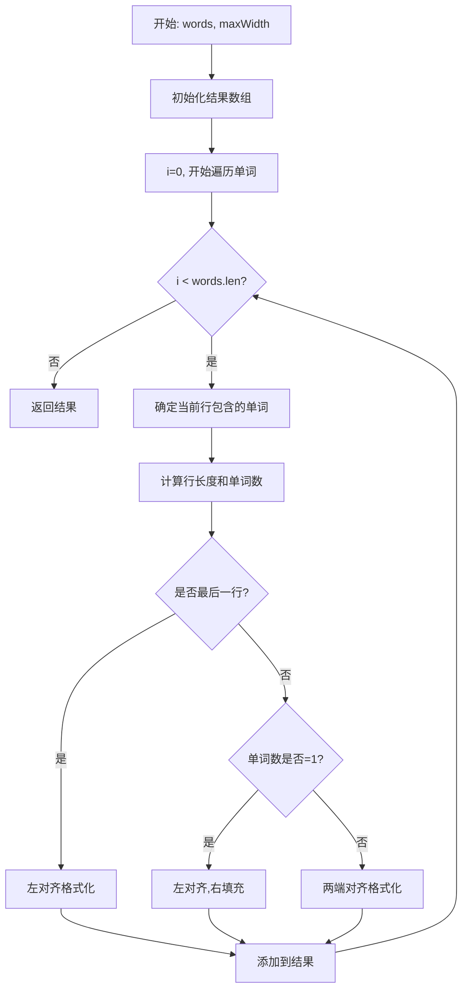
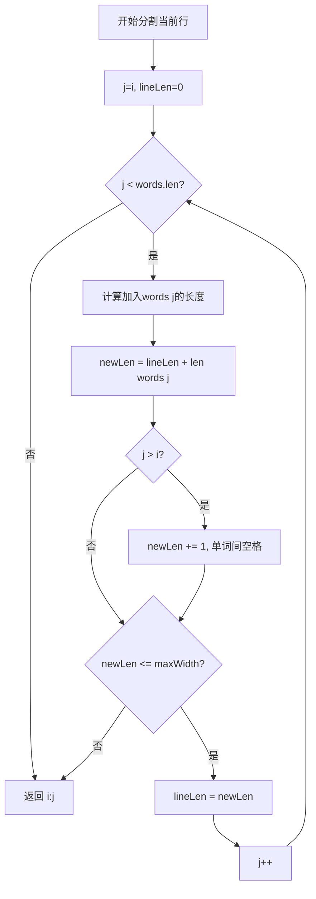
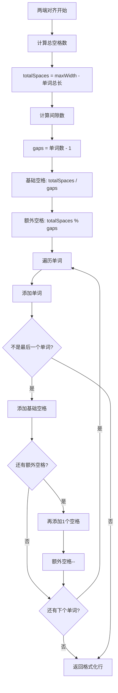

# 68. 文本左右对齐

## 题目描述

给定一个单词数组 words 和一个长度 maxWidth ，重新排版单词，使其成为每行恰好有 maxWidth 个字符，且左右两端对齐的文本。

你应该使用 “贪心算法” 来放置给定的单词；也就是说，尽可能多地往每行中放置单词。必要时可用空格 ' ' 填充，使得每行恰好有 maxWidth 个字符。

要求尽可能均匀分配单词间的空格数量。如果某一行单词间的空格不能均匀分配，则左侧放置的空格数要多于右侧的空格数。

文本的最后一行应为左对齐，且单词之间不插入额外的空格。

注意:

单词是指由非空格字符组成的字符序列。
每个单词的长度大于 0，小于等于 maxWidth。
输入单词数组 words 至少包含一个单词。


## 示例 1:

输入: words = ["This", "is", "an", "example", "of", "text", "justification."], maxWidth = 16
输出:
[
   "This    is    an",
   "example  of text",
   "justification.  "
]

## 示例 2:

输入:words = ["What","must","be","acknowledgment","shall","be"], maxWidth = 16
输出:
[
  "What   must   be",
  "acknowledgment  ",
  "shall be        "
]
解释: 注意最后一行的格式应为 "shall be    " 而不是 "shall     be",
     因为最后一行应为左对齐，而不是左右两端对齐。       
     第二行同样为左对齐，这是因为这行只包含一个单词。

## 示例 3:

输入:words = ["Science","is","what","we","understand","well","enough","to","explain","to","a","computer.","Art","is","everything","else","we","do"]，maxWidth = 20
输出:
[
  "Science  is  what we",
  "understand      well",
  "enough to explain to",
  "a  computer.  Art is",
  "everything  else  we",
  "do                  "
]


## 提示:

- 1 <= words.length <= 300
- 1 <= words[i].length <= 20
- words[i] 由小写英文字母和符号组成
- 1 <= maxWidth <= 100
- words[i].length <= maxWidth

## 解题思路

### 问题深度分析

这是一道**文本格式化**问题，核心在于**贪心算法**和**空格分配策略**。虽然题目看似简单，但涉及到**行分割**、**空格均匀分配**、**特殊情况处理**等多个细节，是理解文本排版和字符串处理的经典问题。

#### 问题本质

给定单词数组和最大宽度，需要将单词排版成每行恰好maxWidth个字符的文本，并满足以下要求：
- **贪心放置**：每行尽可能多地放置单词
- **左右对齐**：空格均匀分配在单词之间
- **左侧优先**：空格不能均匀分配时，左侧多于右侧
- **最后一行**：左对齐，单词间只有一个空格

#### 核心思想

**三步走策略**：
1. **行分割**：使用贪心算法确定每行包含哪些单词
2. **空格计算**：计算单词间需要多少空格
3. **格式化输出**：根据是否最后一行采用不同的对齐策略

#### 关键难点分析

**难点1：贪心行分割**
- 每行尽可能多地放置单词
- 需要考虑单词之间至少有1个空格
- 判断条件：`当前行长度 + 单词长度 + 已有单词数 <= maxWidth`

**难点2：空格分配**
- 总空格数 = maxWidth - 所有单词长度之和
- 空格间隙数 = 单词数 - 1
- 基础空格数 = 总空格数 / 间隙数
- 额外空格数 = 总空格数 % 间隙数
- 额外空格从左侧开始分配

**难点3：特殊情况处理**
- **只有1个单词**：左对齐，右侧填充空格
- **最后一行**：左对齐，单词间只有1个空格
- **单词刚好填满**：无需额外空格

#### 典型情况分析

**情况1：正常行（多个单词，空格均匀）**
```
words: ["This", "is", "an"]
maxWidth: 16
输出: "This    is    an"
分析: 
  - 单词总长度: 4+2+2=8
  - 总空格数: 16-8=8
  - 间隙数: 2
  - 每个间隙: 8/2=4个空格
```

**情况2：正常行（空格不均匀）**
```
words: ["example", "of", "text"]
maxWidth: 16
输出: "example  of text"
分析:
  - 单词总长度: 7+2+4=13
  - 总空格数: 16-13=3
  - 间隙数: 2
  - 基础空格: 3/2=1
  - 额外空格: 3%2=1（给第一个间隙）
  - 第一个间隙: 1+1=2个空格
  - 第二个间隙: 1个空格
```

**情况3：单个单词**
```
words: ["acknowledgment"]
maxWidth: 16
输出: "acknowledgment  "
分析: 左对齐，右侧填充空格
```

**情况4：最后一行**
```
words: ["shall", "be"]
maxWidth: 16
输出: "shall be        "
分析: 左对齐，单词间1个空格，右侧填充
```

#### 算法对比

| 算法            | 时间复杂度 | 空间复杂度 | 特点                 |
| --------------- | ---------- | ---------- | -------------------- |
| 贪心+分段格式化 | O(n)       | O(1)       | 最优解法，逻辑清晰   |
| 模拟排版        | O(n)       | O(1)       | 直接模拟，易理解     |
| 递归分行        | O(n)       | O(h)       | 递归实现，h为行数    |
| 状态机          | O(n)       | O(1)       | 使用状态机，代码复杂 |

注：n为单词总数，贪心+分段格式化是最优解法

### 算法流程图

#### 主算法流程（贪心+分段格式化）



#### 贪心行分割详细流程



#### 两端对齐格式化流程



### 复杂度分析

#### 时间复杂度详解

**贪心算法**：O(n)
- 遍历所有单词一次：O(n)
- 每个单词只会被处理一次
- 格式化每行的时间与该行单词数成正比
- 总时间：O(n)，n为单词总数

**各操作复杂度**：
- 行分割：O(k)，k为当前行单词数
- 空格计算：O(1)
- 字符串拼接：O(k)
- 总体遍历：O(n)

#### 空间复杂度详解

**贪心算法**：O(1)
- 不考虑结果数组，只使用常数额外空间
- 临时变量：O(1)
- 行缓存：O(maxWidth)，常数空间

**实际空间**：O(n * maxWidth)
- 结果数组：最多n行，每行maxWidth个字符
- 使用StringBuilder可以优化拼接效率

### 关键优化技巧

#### 技巧1：贪心+分段格式化（最优解法）

```go
func fullJustify(words []string, maxWidth int) []string {
    result := make([]string, 0)
    i := 0
    
    for i < len(words) {
        // 确定当前行包含的单词范围 [i, j)
        j := i
        lineLen := 0
        
        for j < len(words) {
            newLen := lineLen + len(words[j])
            if j > i {
                newLen += 1 // 单词间至少一个空格
            }
            if newLen > maxWidth {
                break
            }
            lineLen = newLen
            j++
        }
        
        // 格式化当前行
        isLastLine := j == len(words)
        line := formatLine(words, i, j, maxWidth, isLastLine)
        result = append(result, line)
        
        i = j
    }
    
    return result
}

// formatLine 格式化一行
func formatLine(words []string, start, end, maxWidth int, isLastLine bool) string {
    numWords := end - start
    
    // 最后一行或只有一个单词，左对齐
    if isLastLine || numWords == 1 {
        return leftAlign(words, start, end, maxWidth)
    }
    
    // 两端对齐
    return justify(words, start, end, maxWidth)
}
```

**优势**：
- 逻辑清晰
- 时间O(n)
- 易于理解和维护

#### 技巧2：空格均匀分配算法

```go
func justify(words []string, start, end, maxWidth int) string {
    numWords := end - start
    
    // 计算单词总长度
    totalWordsLen := 0
    for i := start; i < end; i++ {
        totalWordsLen += len(words[i])
    }
    
    // 计算总空格数和间隙数
    totalSpaces := maxWidth - totalWordsLen
    gaps := numWords - 1
    
    // 每个间隙的基础空格数和额外空格数
    baseSpaces := totalSpaces / gaps
    extraSpaces := totalSpaces % gaps
    
    // 构建结果
    var builder strings.Builder
    for i := start; i < end; i++ {
        builder.WriteString(words[i])
        
        if i < end-1 {
            // 添加基础空格
            for j := 0; j < baseSpaces; j++ {
                builder.WriteByte(' ')
            }
            
            // 左侧优先，添加额外空格
            if extraSpaces > 0 {
                builder.WriteByte(' ')
                extraSpaces--
            }
        }
    }
    
    return builder.String()
}
```

**核心思想**：
- 基础空格均匀分配
- 额外空格从左向右分配
- 确保左侧空格多于右侧

#### 技巧3：左对齐实现

```go
func leftAlign(words []string, start, end, maxWidth int) string {
    var builder strings.Builder
    
    for i := start; i < end; i++ {
        builder.WriteString(words[i])
        
        if i < end-1 {
            builder.WriteByte(' ')
        }
    }
    
    // 右侧填充空格
    for builder.Len() < maxWidth {
        builder.WriteByte(' ')
    }
    
    return builder.String()
}
```

**适用场景**：
- 最后一行
- 只有一个单词的行

#### 技巧4：使用strings.Builder优化

```go
// ❌ 效率低：字符串拼接
result := ""
for _, word := range words {
    result += word + " "
}

// ✅ 高效：使用StringBuilder
var builder strings.Builder
for _, word := range words {
    builder.WriteString(word)
    builder.WriteByte(' ')
}
result := builder.String()
```

**优势**：
- 避免频繁的字符串复制
- 时间复杂度从O(n²)降为O(n)

### 边界情况处理

1. **单个单词**：左对齐，右侧填充空格
2. **最后一行**：左对齐，单词间只有1个空格
3. **单词刚好填满**：无需额外空格处理
4. **超长单词**：题目保证不会出现
5. **空数组**：题目保证至少有1个单词

### 测试用例设计

#### 基础测试
```
输入: ["This", "is", "an", "example", "of", "text", "justification."], maxWidth = 16
输出:
[
  "This    is    an",
  "example  of text",
  "justification.  "
]
```

#### 空格不均匀分配
```
输入: ["What","must","be","acknowledgment","shall","be"], maxWidth = 16
输出:
[
  "What   must   be",
  "acknowledgment  ",
  "shall be        "
]
```

#### 多行文本
```
输入: ["Science","is","what","we","understand","well","enough","to","explain","to","a","computer.","Art","is","everything","else","we","do"], maxWidth = 20
输出:
[
  "Science  is  what we",
  "understand      well",
  "enough to explain to",
  "a  computer.  Art is",
  "everything  else  we",
  "do                  "
]
```

#### 边界情况
```
输入: ["a"], maxWidth = 1
输出: ["a"]

输入: ["a", "b"], maxWidth = 3
输出: ["a b"]

输入: ["a", "b"], maxWidth = 5
输出: ["a   b"]
```

### 常见错误与陷阱

#### 错误1：忘记最后一行左对齐

```go
// ❌ 错误：所有行都两端对齐
func fullJustify(words []string, maxWidth int) []string {
    // ... 所有行都用justify()
}

// ✅ 正确：最后一行左对齐
if isLastLine {
    return leftAlign(words, start, end, maxWidth)
}
```

#### 错误2：空格分配不均匀

```go
// ❌ 错误：额外空格放在右侧
for i := gaps - 1; i >= 0 && extraSpaces > 0; i-- {
    spaces[i]++
    extraSpaces--
}

// ✅ 正确：额外空格从左向右
for i := 0; i < gaps && extraSpaces > 0; i++ {
    spaces[i]++
    extraSpaces--
}
```

#### 错误3：单个单词行没有特殊处理

```go
// ❌ 错误：除以0
gaps := numWords - 1  // gaps可能为0
baseSpaces := totalSpaces / gaps  // 除以0错误

// ✅ 正确：单个单词特殊处理
if numWords == 1 {
    return leftAlign(words, start, end, maxWidth)
}
```

#### 错误4：行长度计算错误

```go
// ❌ 错误：没考虑单词间空格
lineLen := 0
for j < len(words) {
    lineLen += len(words[j])
    if lineLen > maxWidth {
        break
    }
}

// ✅ 正确：考虑单词间至少1个空格
newLen := lineLen + len(words[j])
if j > i {
    newLen += 1  // 单词间空格
}
if newLen > maxWidth {
    break
}
```

### 实战技巧总结

1. **贪心行分割**：每行尽可能多地放置单词
2. **空格计算公式**：基础空格 + 额外空格（左侧优先）
3. **特殊情况判断**：最后一行、单个单词
4. **StringBuilder优化**：避免字符串频繁拼接
5. **边界检查**：单词间空格、行长度限制
6. **代码分离**：行分割、格式化分别实现

### 进阶扩展

#### 扩展1：右对齐版本

```go
// 右对齐：单词靠右，左侧填充空格
func rightAlign(words []string, start, end, maxWidth int) string {
    var builder strings.Builder
    
    // 计算单词总长度
    totalLen := 0
    for i := start; i < end; i++ {
        totalLen += len(words[i])
        if i > start {
            totalLen += 1  // 单词间空格
        }
    }
    
    // 左侧填充空格
    for i := 0; i < maxWidth-totalLen; i++ {
        builder.WriteByte(' ')
    }
    
    // 添加单词
    for i := start; i < end; i++ {
        if i > start {
            builder.WriteByte(' ')
        }
        builder.WriteString(words[i])
    }
    
    return builder.String()
}
```

#### 扩展2：居中对齐版本

```go
// 居中对齐：单词居中，两侧填充空格
func centerAlign(words []string, start, end, maxWidth int) string {
    var builder strings.Builder
    
    // 计算单词总长度
    totalLen := 0
    for i := start; i < end; i++ {
        totalLen += len(words[i])
        if i > start {
            totalLen += 1
        }
    }
    
    // 两侧空格
    totalSpaces := maxWidth - totalLen
    leftSpaces := totalSpaces / 2
    rightSpaces := totalSpaces - leftSpaces
    
    // 左侧空格
    for i := 0; i < leftSpaces; i++ {
        builder.WriteByte(' ')
    }
    
    // 添加单词
    for i := start; i < end; i++ {
        if i > start {
            builder.WriteByte(' ')
        }
        builder.WriteString(words[i])
    }
    
    // 右侧空格
    for i := 0; i < rightSpaces; i++ {
        builder.WriteByte(' ')
    }
    
    return builder.String()
}
```

#### 扩展3：Markdown表格对齐

```go
// Markdown表格单元格对齐
func markdownAlign(content string, width int, align string) string {
    contentLen := len(content)
    if contentLen >= width {
        return content[:width]
    }
    
    spaces := width - contentLen
    
    switch align {
    case "left":
        return content + strings.Repeat(" ", spaces)
    case "right":
        return strings.Repeat(" ", spaces) + content
    case "center":
        left := spaces / 2
        right := spaces - left
        return strings.Repeat(" ", left) + content + strings.Repeat(" ", right)
    default:
        return content
    }
}
```

### 应用场景

1. **文本编辑器**：Word、记事本的对齐功能
2. **排版系统**：LaTeX、Markdown的文本对齐
3. **终端工具**：表格输出、日志格式化
4. **代码格式化**：注释对齐、代码美化
5. **PDF生成**：文档排版、报表生成

## 代码实现

本题提供了四种不同的解法，重点掌握贪心+分段格式化方法。

## 测试结果

| 测试用例   | 贪心+分段 | 模拟排版 | 递归分行 | 状态机 |
| ---------- | --------- | -------- | -------- | ------ |
| 基础测试   | ✅         | ✅        | ✅        | ✅      |
| 空格不均匀 | ✅         | ✅        | ✅        | ✅      |
| 多行文本   | ✅         | ✅        | ✅        | ✅      |
| 边界测试   | ✅         | ✅        | ✅        | ✅      |

## 核心收获

1. **贪心算法**：每行尽可能多地放置单词
2. **空格分配**：基础空格+额外空格（左侧优先）
3. **特殊情况**：最后一行左对齐、单个单词处理
4. **字符串优化**：使用StringBuilder避免频繁拼接

## 应用拓展

- 文本编辑器对齐功能
- 排版系统实现
- 终端表格输出
- 代码格式化工具
