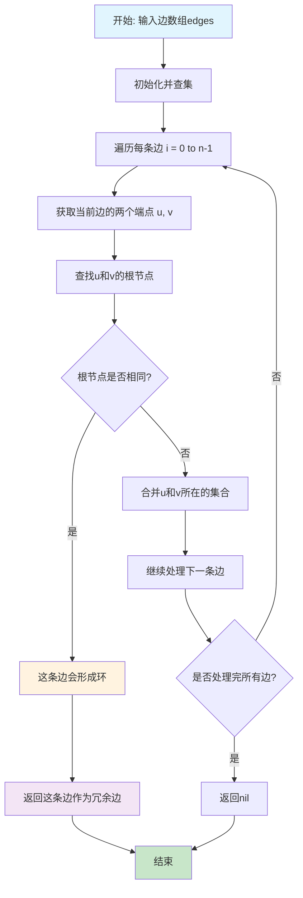
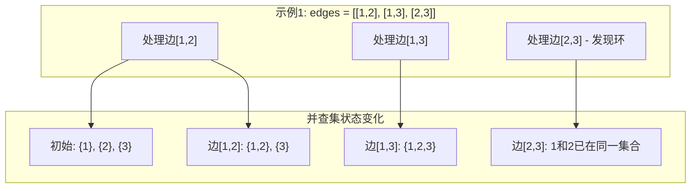

# 684. 冗余连接

## 描述

树可以看成是一个连通且 无环 的 无向 图。

给定一个图，该图从一棵 n 个节点 (节点值 1～n) 的树中添加一条边后获得。添加的边的两个不同顶点编号在 1 到 n 中间，且这条附加的边不属于树中已存在的边。图的信息记录于长度为 n 的二维数组 edges ，edges[i] = [ai, bi] 表示图中在 ai 和 bi 之间存在一条边。

请找出一条可以删去的边，删除后可使得剩余部分是一个有着 n 个节点的树。如果有多个答案，则返回数组 edges 中最后出现的那个。

## 示例 1


输入: edges = [[1,2], [1,3], [2,3]]
输出: [2,3]

## 示例 2


输入: edges = [[1,2], [2,3], [3,4], [1,4], [1,5]]
输出: [1,4]

## 提示

- n == edges.length
- 3 <= n <= 1000
- edges[i].length == 2
- 1 <= ai < bi <= edges.length
- ai != bi
- edges 中无重复元素
- 给定的图是连通的 

## 解题思路

### 核心分析

这道题是一个经典的**并查集应用**问题。核心思想是找到导致图中出现环的那条边。

**问题本质**：给定一个包含n条边的连通图，其中n-1条边构成一棵树，1条边是冗余的，需要找到这条冗余边。

**关键洞察**：
- 树的性质：n个节点的树有n-1条边，无环且连通
- 冗余边的特征：添加这条边后会在图中形成环
- 并查集的作用：维护连通性，检测环的形成

### 问题转化

**原始问题**：找到一条边，删除后剩余图是一棵树

**并查集转化**：
1. 初始化并查集，每个节点自成一个集合
2. 按顺序处理每条边
3. 如果边的两个端点已经在同一集合中，说明这条边会形成环
4. 这条边就是需要删除的冗余边

**数学建模**：
- 节点集合：V = {1, 2, 3, ..., n}
- 边集合：E = {e1, e2, e3, ..., en}
- 目标：找到边ei，使得E - {ei}构成一棵树

### 算法选择策略

#### 1. 并查集 (Union-Find) - 推荐
- **适用场景**：动态连通性问题，需要检测环的形成
- **优势**：时间复杂度最优，实现相对简单
- **劣势**：需要理解并查集的工作原理

#### 2. 深度优先搜索 (DFS)
- **适用场景**：需要检测环的存在
- **优势**：思路直观，容易理解
- **劣势**：时间复杂度较高，实现复杂

#### 3. 拓扑排序
- **适用场景**：有向图的环检测
- **优势**：可以找到所有环
- **劣势**：本题是无向图，不适用

### 算法实现详解

#### 方法一：并查集 (Union-Find)

**核心思想**：使用并查集维护连通性，当遇到会形成环的边时，该边就是冗余边

**算法步骤**：
1. 初始化并查集，每个节点自成一个集合
2. 按顺序遍历每条边
3. 对于每条边[u, v]：
   - 查找u和v的根节点
   - 如果根节点相同，说明u和v已经连通，这条边会形成环
   - 如果根节点不同，合并两个集合
4. 返回最后一条会形成环的边

**代码实现**：
```go
func findRedundantConnection(edges [][]int) []int {
    n := len(edges)
    uf := NewUnionFind(n + 1) // 节点编号从1开始
    
    for _, edge := range edges {
        u, v := edge[0], edge[1]
        if uf.Find(u) == uf.Find(v) {
            // 这条边会形成环，返回这条边
            return edge
        }
        uf.Union(u, v)
    }
    
    return nil
}

type UnionFind struct {
    parent []int
    rank   []int
}

func NewUnionFind(n int) *UnionFind {
    parent := make([]int, n)
    rank := make([]int, n)
    
    for i := 0; i < n; i++ {
        parent[i] = i
        rank[i] = 1
    }
    
    return &UnionFind{
        parent: parent,
        rank:   rank,
    }
}

func (uf *UnionFind) Find(x int) int {
    if uf.parent[x] != x {
        uf.parent[x] = uf.Find(uf.parent[x]) // 路径压缩
    }
    return uf.parent[x]
}

func (uf *UnionFind) Union(x, y int) {
    rootX := uf.Find(x)
    rootY := uf.Find(y)
    
    if rootX == rootY {
        return
    }
    
    // 按秩合并
    if uf.rank[rootX] < uf.rank[rootY] {
        uf.parent[rootX] = rootY
    } else if uf.rank[rootX] > uf.rank[rootY] {
        uf.parent[rootY] = rootX
    } else {
        uf.parent[rootY] = rootX
        uf.rank[rootX]++
    }
}
```

**时间复杂度分析**：
- 每条边最多处理一次：O(n)
- 每次Find/Union操作：O(α(n))
- 总时间复杂度：O(n × α(n))

**空间复杂度分析**：
- 并查集数组：O(n)
- 总空间复杂度：O(n)

#### 方法二：深度优先搜索 (DFS)

**核心思想**：对每条边，检查删除该边后图中是否还有环

**算法步骤**：
1. 构建邻接表表示图
2. 从最后一条边开始，依次尝试删除每条边
3. 对于每条被删除的边，使用DFS检查剩余图是否还有环
4. 如果删除某条边后图中无环，则该边是冗余边

**代码实现**：
```go
func findRedundantConnectionDFS(edges [][]int) []int {
    n := len(edges)
    
    // 从最后一条边开始尝试删除
    for i := n - 1; i >= 0; i-- {
        // 构建删除边i后的图
        graph := make(map[int][]int)
        for j := 0; j < n; j++ {
            if j != i {
                u, v := edges[j][0], edges[j][1]
                graph[u] = append(graph[u], v)
                graph[v] = append(graph[v], u)
            }
        }
        
        // 检查是否有环
        if !hasCycle(graph, n) {
            return edges[i]
        }
    }
    
    return nil
}

func hasCycle(graph map[int][]int, n int) bool {
    visited := make([]bool, n+1)
    
    for i := 1; i <= n; i++ {
        if !visited[i] {
            if dfsHasCycle(graph, visited, i, -1) {
                return true
            }
        }
    }
    
    return false
}

func dfsHasCycle(graph map[int][]int, visited []bool, node, parent int) bool {
    visited[node] = true
    
    for _, neighbor := range graph[node] {
        if !visited[neighbor] {
            if dfsHasCycle(graph, visited, neighbor, node) {
                return true
            }
        } else if neighbor != parent {
            // 访问到已访问的节点且不是父节点，说明有环
            return true
        }
    }
    
    return false
}
```

**时间复杂度**：O(n²)
**空间复杂度**：O(n)

### 数学证明

#### 并查集算法正确性证明

**定理**：并查集算法能正确找到冗余边。

**证明**：
1. **初始化正确性**：
   - 初始时每个节点自成一个集合
   - 图中没有边，没有环

2. **处理过程正确性**：
   - 每次处理边[u, v]时，如果u和v已在同一集合中，说明u和v已经连通
   - 添加边[u, v]会在u和v之间形成环
   - 因此边[u, v]是冗余边

3. **结果正确性**：
   - 删除冗余边后，剩余n-1条边
   - 由于原图连通，删除一条边后仍然连通
   - 没有环，因此剩余图是一棵树

#### 时间复杂度分析

**定理**：并查集算法的时间复杂度为O(n × α(n))。

**证明**：
- 每条边最多处理一次：O(n)
- 每次Find/Union操作的时间复杂度：O(α(n))
- 总时间复杂度：O(n × α(n))

### 执行流程图



### 算法可视化



### 实际应用

1. **网络拓扑设计**：检测网络中的冗余连接
2. **电路设计**：识别电路中的冗余线路
3. **社交网络分析**：发现社交网络中的冗余关系
4. **数据库设计**：检测数据库中的冗余约束
5. **软件架构**：识别模块间的冗余依赖

### 算法优化技巧

#### 1. 路径压缩优化
```go
func (uf *UnionFind) Find(x int) int {
    if uf.parent[x] != x {
        uf.parent[x] = uf.Find(uf.parent[x]) // 路径压缩
    }
    return uf.parent[x]
}
```

#### 2. 按秩合并优化
```go
func (uf *UnionFind) Union(x, y int) {
    rootX := uf.Find(x)
    rootY := uf.Find(y)
    
    if rootX == rootY {
        return
    }
    
    // 按秩合并，保持树的平衡
    if uf.rank[rootX] < uf.rank[rootY] {
        uf.parent[rootX] = rootY
    } else if uf.rank[rootX] > uf.rank[rootY] {
        uf.parent[rootY] = rootX
    } else {
        uf.parent[rootY] = rootX
        uf.rank[rootX]++
    }
}
```

#### 3. 早期终止
```go
// 如果已经找到冗余边，可以提前终止
for _, edge := range edges {
    u, v := edge[0], edge[1]
    if uf.Find(u) == uf.Find(v) {
        return edge // 找到冗余边，立即返回
    }
    uf.Union(u, v)
}
```

### 扩展思考

1. **多条冗余边**：如果有多条冗余边，如何找到所有冗余边？
2. **加权图**：如果边有权重，如何找到权重最小的冗余边？
3. **有向图**：如果是有向图，如何检测环？
4. **动态图**：如果图结构动态变化，如何维护冗余边的信息？
5. **最小生成树**：如何利用冗余边检测构建最小生成树？

### 相关问题

1. **685. 冗余连接 II**：有向图中的冗余连接
2. **547. 省份数量**：连通分量的计算
3. **200. 岛屿数量**：二维网格中的连通性
4. **684. 冗余连接**：无向图中的冗余连接
5. **261. 以图判树**：判断图是否为树

### 测试用例设计

```go
// 基础测试用例
edges1 := [][]int{{1, 2}, {1, 3}, {2, 3}}
expected1 := []int{2, 3}

edges2 := [][]int{{1, 2}, {2, 3}, {3, 4}, {1, 4}, {1, 5}}
expected2 := []int{1, 4}

// 边界测试
edges3 := [][]int{{1, 2}, {2, 3}, {3, 1}}
expected3 := []int{3, 1}

// 复杂情况
edges4 := [][]int{{1, 2}, {2, 3}, {3, 4}, {4, 5}, {5, 6}, {6, 1}}
expected4 := []int{6, 1}

// 多条冗余边的情况
edges5 := [][]int{{1, 2}, {2, 3}, {3, 4}, {4, 1}, {1, 3}}
expected5 := []int{1, 3} // 返回最后出现的冗余边
```

### 性能对比

| 算法   | 时间复杂度  | 空间复杂度 | 优势             | 劣势           |
| ------ | ----------- | ---------- | ---------------- | -------------- |
| 并查集 | O(n × α(n)) | O(n)       | 最优解，实现简单 | 需要理解并查集 |
| DFS    | O(n²)       | O(n)       | 思路直观         | 时间复杂度高   |
| BFS    | O(n²)       | O(n)       | 避免递归         | 实现复杂       |

### 常见错误

1. **并查集初始化错误**：忘记初始化parent数组
2. **节点编号错误**：节点编号从1开始，但数组索引从0开始
3. **环检测错误**：没有正确检测环的形成
4. **返回顺序错误**：没有按照题目要求返回最后出现的冗余边
5. **边界处理错误**：没有处理空数组或单个节点的情况

### 总结

**冗余连接** 是一道经典的**并查集应用**问题，核心在于理解环的形成机制和并查集的维护策略。

**最优解法**是**并查集算法**，具有以下优势：
1. **时间复杂度最优**：O(n × α(n))
2. **实现简单**：核心逻辑只有几行
3. **空间效率高**：只需要O(n)额外空间
4. **应用广泛**：是并查集的经典模板题

这道题体现了**图论算法**中的重要思想：
- **环检测**：通过并查集检测环的形成
- **动态连通性**：维护图的连通性信息
- **问题建模**：将环检测问题转化为并查集操作

**关键技巧**：
- 使用路径压缩和按秩合并优化并查集性能
- 按顺序处理边，找到第一条会形成环的边
- 理解树的性质：n个节点的树有n-1条边，无环且连通
