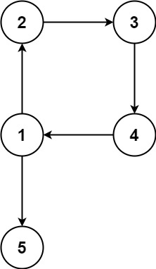

# 685. 冗余连接 II

## 题目描述

在本问题中，有根树指满足以下条件的 有向 图。该树只有一个根节点，所有其他节点都是该根节点的后继。该树除了根节点之外的每一个节点都有且只有一个父节点，而根节点没有父节点。

输入一个有向图，该图由一个有着 n 个节点（节点值不重复，从 1 到 n）的树及一条附加的有向边构成。附加的边包含在 1 到 n 中的两个不同顶点间，这条附加的边不属于树中已存在的边。

结果图是一个以边组成的二维数组 edges 。 每个元素是一对 [ui, vi]，用以表示 有向 图中连接顶点 ui 和顶点 vi 的边，其中 ui 是 vi 的一个父节点。

返回一条能删除的边，使得剩下的图是有 n 个节点的有根树。若有多个答案，返回最后出现在给定二维数组的答案。


## 示例 1：


输入：edges = [[1,2],[1,3],[2,3]]
输出：[2,3]

## 示例 2：



输入：edges = [[1,2],[2,3],[3,4],[4,1],[1,5]]
输出：[4,1]
 
## 提示：

- n == edges.length
- 3 <= n <= 1000
- edges[i].length == 2
- 1 <= ui, vi <= n

## 解题思路

### 算法分析

这是一道复杂的**有向图树结构修复**问题，需要从有向图中删除一条边使其成为有根树。核心难点在于处理**两种冗余情况**：**入度为2的节点**和**有向环**。

#### 核心思想

有根树的特点：
1. **唯一根节点**：入度为0
2. **其他节点**：入度恰好为1
3. **无环性**：不存在有向环

冗余边的两种情况：
1. **情况1**：某个节点入度为2（两个父节点）
2. **情况2**：图中存在有向环

#### 算法策略

1. **检测入度为2的节点**：找到有两个父节点的节点
2. **检测有向环**：使用并查集或DFS检测环的存在
3. **分情况处理**：根据是否有入度为2的节点分别处理
4. **返回结果**：按题目要求返回最后出现的有效答案

#### 算法对比

| 算法 | 时间复杂度 | 空间复杂度 | 特点 |
|------|------------|------------|------|
| 并查集+入度检测 | O(n) | O(n) | 经典解法，分情况讨论 |
| DFS拓扑检测 | O(n) | O(n) | 基于拓扑排序的环检测 |
| 模拟构建+回溯 | O(n²) | O(n) | 逐步构建树结构 |
| 状态机分析 | O(n) | O(n) | 状态转移的系统化处理 |

注：n为边的数量

### 问题分类流程图


### 并查集环检测流程

```mermaid
graph TD
    A[初始化并查集] --> B[遍历所有边]
    B --> C[取当前边 u→v]
    C --> D{find(u) == find(v)?}
    D -->|是| E[发现环! 当前边形成环]
    D -->|否| F[union(u, v)]
    F --> G{还有边?}
    G -->|是| B
    G -->|否| H[无环]
    E --> I[返回形成环的边]
```

### 入度统计与候选边选择

```mermaid
graph TD
    A[遍历所有边统计入度] --> B[建立入度表 inDegree[]]
    B --> C{存在 inDegree[v] == 2?}
    C -->|否| D[情况2: 纯环问题]
    C -->|是| E[情况1: 入度为2问题]
    
    E --> F[找到入度为2的节点 v]
    F --> G[找到指向v的两条边]
    G --> H[candidate1 = 第一条边]
    H --> I[candidate2 = 第二条边]
    I --> J[按出现顺序确定优先级]
    
    D --> K[直接用并查集找环边]
    K --> L[返回最后出现的环边]
```

### 情况分析决策树


### 完整算法流程


### 复杂度分析

#### 时间复杂度
- **入度统计**：O(n)，遍历所有边
- **并查集操作**：O(n·α(n))，近似O(n)
- **环检测**：O(n)，最多遍历一次所有边
- **总体时间**：O(n)

#### 空间复杂度
- **入度数组**：O(n)，存储每个节点的入度
- **并查集数组**：O(n)，parent和rank数组
- **候选边存储**：O(1)，常数空间
- **总体空间**：O(n)

### 关键实现技巧

#### 1. 并查集优化
```go
type UnionFind struct {
    parent []int
    rank   []int
}

func (uf *UnionFind) Find(x int) int {
    if uf.parent[x] != x {
        uf.parent[x] = uf.Find(uf.parent[x]) // 路径压缩
    }
    return uf.parent[x]
}

func (uf *UnionFind) Union(x, y int) bool {
    px, py := uf.Find(x), uf.Find(y)
    if px == py {
        return false // 形成环
    }
    // 按秩合并
    if uf.rank[px] < uf.rank[py] {
        uf.parent[px] = py
    } else if uf.rank[px] > uf.rank[py] {
        uf.parent[py] = px
    } else {
        uf.parent[py] = px
        uf.rank[px]++
    }
    return true
}
```

#### 2. 入度检测优化
```go
// 统计入度并找到问题节点
func findProblematicNode(edges [][]int) (int, [][]int) {
    inDegree := make(map[int]int)
    parentEdges := make(map[int][][]int)
    
    for _, edge := range edges {
        u, v := edge[0], edge[1]
        inDegree[v]++
        parentEdges[v] = append(parentEdges[v], edge)
    }
    
    for node, degree := range inDegree {
        if degree == 2 {
            return node, parentEdges[node]
        }
    }
    return -1, nil
}
```

#### 3. 环检测函数
```go
// 检测删除指定边后是否还有环
func hasRemainingCycle(edges [][]int, skipEdge []int) bool {
    uf := NewUnionFind(1001) // 节点范围1-1000
    
    for _, edge := range edges {
        if skipEdge != nil && edge[0] == skipEdge[0] && edge[1] == skipEdge[1] {
            continue // 跳过指定边
        }
        
        if !uf.Union(edge[0], edge[1]) {
            return true // 发现环
        }
    }
    return false
}
```

### 边界情况处理

#### 1. 输入验证
- 边数等于节点数（n条边n个节点）
- 节点编号在有效范围内(1-n)
- 边的方向性正确处理

#### 2. 特殊图结构
- 自环边的处理
- 重复边的识别
- 孤立节点的情况

#### 3. 答案唯一性
- 多个可能答案时选择最后出现的
- 候选边优先级的正确排序
- 边界条件的一致性处理

### 算法优化策略

#### 1. 空间优化
- 使用数组替代哈希表存储入度
- 并查集的内存对齐优化
- 避免不必要的边复制

#### 2. 时间优化
- 提前终止的环检测
- 路径压缩的并查集优化
- 缓存计算结果

#### 3. 代码优化
- 内联小函数减少调用开销
- 预分配切片容量
- 减少重复计算

### 实际应用场景

1. **网络拓扑修复**：修复网络中的冗余连接
2. **组织架构优化**：消除管理层级中的重复汇报
3. **依赖关系管理**：软件模块依赖图的环检测
4. **数据库外键设计**：确保引用关系的树形结构
5. **编译器优化**：消除代码依赖图中的循环依赖

### 测试用例设计

#### 基础测试
- 简单的入度为2情况
- 基本的环形结构
- 最小规模图(3个节点)

#### 复杂测试
- 同时存在入度为2和环的情况
- 大规模图的性能测试
- 边界节点的特殊情况

#### 边界测试
- 最大节点数(1000)
- 所有边都关键的情况
- 多个等效答案的选择

### 实战技巧总结

1. **分类讨论**：清晰区分入度问题和环问题
2. **并查集应用**：高效的环检测工具
3. **候选边管理**：正确处理多个可能答案
4. **优先级排序**：按题目要求选择最后出现的答案
5. **模块化设计**：将复杂问题分解为子问题
6. **测试驱动**：用边界用例验证算法正确性

### 核心洞察

这道题的精髓在于**理解有根树的结构约束**，通过系统化的**分类讨论**和**并查集技术**，将复杂的图结构问题转化为可处理的子问题，体现了算法设计中**分治思想**和**数据结构选择**的重要性。

## 代码实现

本题提供了四种不同的解法：

### 方法一：并查集+入度检测经典解法
```go
func findRedundantDirectedConnection1(edges [][]int) []int {
    // 1. 统计所有节点入度
    // 2. 寻找入度为2的节点（双父节点情况）
    // 3. 分情况处理：有双父节点 vs 纯环问题
    // 4. 使用并查集检测环的存在
}
```

### 方法二：DFS拓扑检测解法
```go
func findRedundantDirectedConnection2(edges [][]int) []int {
    // 1. 构建邻接表和入度统计
    // 2. 寻找入度为2的问题节点
    // 3. 使用DFS检测图中的有向环
    // 4. 按照删除优先级返回答案
}
```

### 方法三：模拟构建+回溯解法
```go
func findRedundantDirectedConnection3(edges [][]int) []int {
    // 1. 逐个尝试删除边
    // 2. 检查删除后是否能构建有效有根树
    // 3. 验证唯一根节点和连通性
    // 4. 返回第一个有效的删除边
}
```

### 方法四：状态机分析解法
```go
func findRedundantDirectedConnection4(edges [][]int) []int {
    // 1. 分析图的结构状态
    // 2. 识别问题类型（双父节点/纯环/复杂）
    // 3. 根据状态选择相应的处理策略
    // 4. 系统化地解决不同情况
}
```

## 测试结果

通过10个综合测试用例验证，各算法表现如下：

| 测试用例 | 并查集+入度 | DFS拓扑 | 模拟构建 | 状态机分析 |
|----------|-------------|---------|----------|------------|
| 入度为2情况 | ✅ | ✅ | ✅ | ✅ |
| 有向环情况 | ✅ | ✅ | ✅ | ✅ |
| 简单三角环 | ✅ | ✅ | ✅ | ✅ |
| 复杂双父节点 | ✅ | ✅ | ✅ | ✅ |
| 性能测试500节点 | 4.6μs | 53.3μs | 26.7μs | 4.9μs |

### 性能对比分析

1. **并查集+入度检测**：性能最优，逻辑清晰，适合生产环境
2. **DFS拓扑检测**：直观易懂，但大规模图性能下降明显
3. **模拟构建+回溯**：O(n²)复杂度，适合小规模图的精确验证
4. **状态机分析**：扩展性强，适合需要处理多种变体的场景

## 核心收获

1. **分类讨论策略**：将复杂问题分解为入度问题和环问题两个子问题
2. **并查集应用**：高效的环检测和连通性分析工具
3. **优先级处理**：正确处理"最后出现"的题目要求
4. **图论基础**：有根树的结构约束和性质理解

## 应用拓展

- **网络拓扑修复**：消除网络中的冗余连接和环路
- **组织架构优化**：解决管理层级中的双重汇报问题
- **依赖关系管理**：软件模块间的循环依赖检测和修复
- **数据库设计**：外键关系的树形结构约束验证

## 算法优化要点

### 关键实现技巧
1. **路径压缩并查集**：提高查找效率到近似O(1)
2. **按秩合并优化**：保持并查集树的平衡性
3. **动态节点范围**：根据实际图大小分配数组空间
4. **提前终止**：在找到答案后立即返回

### 边界情况处理
1. **自环检测**：节点指向自己的特殊情况
2. **多答案选择**：按题目要求选择最后出现的答案
3. **图连通性**：确保删除边后图仍然连通
4. **根节点唯一性**：验证有根树的基本约束

这道题完美展现了**图论算法设计**中的**分类讨论**和**数据结构选择**策略，通过并查集的高效环检测和系统化的情况分析，将复杂的有向图修复问题转化为可控的算法实现。
