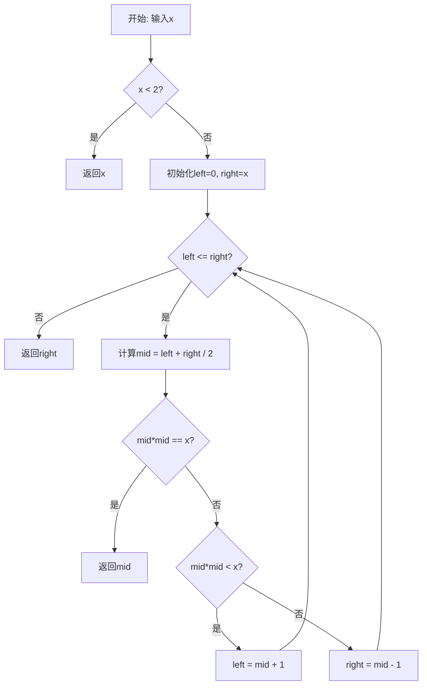
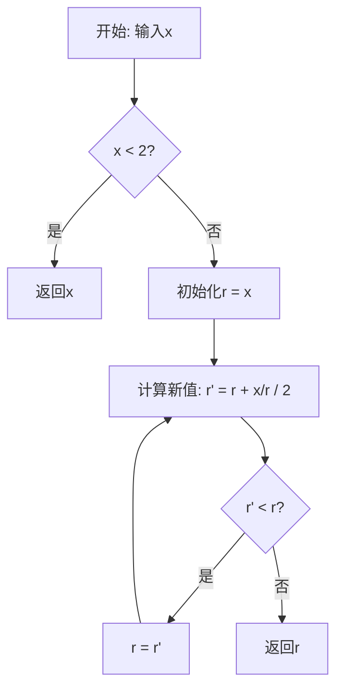
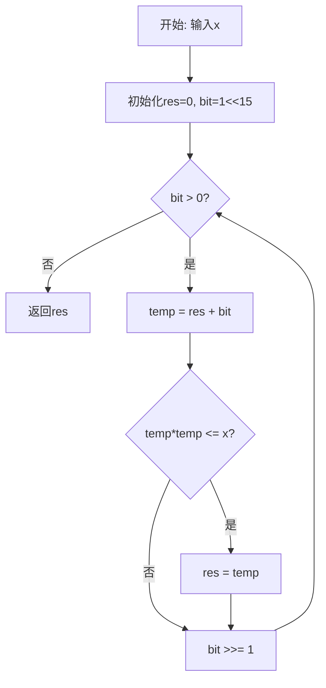

# 69. x 的平方根

## 题目描述

给你一个非负整数 x ，计算并返回 x 的 算术平方根 。

由于返回类型是整数，结果只保留 整数部分 ，小数部分将被 舍去 。

注意：不允许使用任何内置指数函数和算符，例如 pow(x, 0.5) 或者 x ** 0.5 。


## 示例 1：

输入：x = 4
输出：2

## 示例 2：

输入：x = 8
输出：2
解释：8 的算术平方根是 2.82842..., 由于返回类型是整数，小数部分将被舍去。


## 提示：

- 0 <= x <= 2^31 - 1

## 解题思路

### 问题深度分析

这是一道**数值计算**问题，核心在于**二分查找**和**牛顿迭代法**。虽然题目简单，但涉及到**整数平方根**、**精度控制**、**溢出处理**等多个细节，是理解数值算法和二分查找的经典问题。

#### 问题本质

给定非负整数x，计算并返回其算术平方根的整数部分。关键问题：
- **不能使用内置函数**：不能用`pow(x, 0.5)`或`x**0.5`
- **只保留整数部分**：舍去小数部分
- **范围处理**：x的范围是`[0, 2^31-1]`
- **精度要求**：找到最大的整数k，使得`k*k <= x`

#### 核心思想

**多种解法对比**：
1. **二分查找**：在`[0, x]`范围内二分查找答案
2. **牛顿迭代法**：利用导数快速逼近平方根
3. **位运算优化**：利用二进制特性加速计算
4. **数学公式**：使用指数和对数函数

#### 关键难点分析

**难点1：二分查找的边界**
- 左边界：0
- 右边界：x（实际上可以优化为`min(x, 46340)`，因为`46340^2 < 2^31`）
- 终止条件：`left <= right`
- 结果选择：返回`right`（最后一个满足条件的值）

**难点2：溢出处理**
- `mid * mid`可能溢出`int`范围
- 解决方案：使用`int64`或改用`mid <= x/mid`判断

**难点3：牛顿迭代的精度**
- 迭代公式：`x(n+1) = (x(n) + a/x(n)) / 2`
- 收敛条件：`|x(n+1) - x(n)| < 1`
- 初始值选择：`x0 = x`

#### 典型情况分析

**情况1：完全平方数**
```
输入: x = 4
输出: 2
说明: 2*2 = 4，刚好是完全平方数
```

**情况2：非完全平方数**
```
输入: x = 8
输出: 2
说明: 2*2 = 4 < 8, 3*3 = 9 > 8
      所以答案是2
```

**情况3：边界值**
```
输入: x = 0
输出: 0

输入: x = 1
输出: 1

输入: x = 2^31 - 1 (2147483647)
输出: 46340
说明: 46340*46340 = 2147395600 < 2147483647
      46341*46341 = 2147488281 > 2147483647
```

#### 算法对比

| 算法       | 时间复杂度 | 空间复杂度 | 特点                 |
| ---------- | ---------- | ---------- | -------------------- |
| 二分查找   | O(log n)   | O(1)       | 最优解法，稳定可靠   |
| 牛顿迭代   | O(log n)   | O(1)       | 收敛快，精度高       |
| 位运算     | O(log n)   | O(1)       | 利用二进制特性       |
| 袖珍计算器 | O(1)       | O(1)       | 使用数学函数，不推荐 |

注：二分查找是最推荐的方法

### 算法流程图

#### 主算法流程（二分查找）



#### 牛顿迭代法流程



#### 位运算优化流程



### 复杂度分析

#### 时间复杂度详解

**二分查找**：O(log n)
- 搜索范围：`[0, x]`
- 每次折半：log₂(x)
- x最大为2³¹-1，所以最多31次

**牛顿迭代**：O(log n)
- 二次收敛，速度非常快
- 一般5-6次迭代即可
- 理论复杂度O(log log n)

**位运算**：O(log n)
- 从最高位开始，逐位确定
- 最多16次迭代（int范围）

#### 空间复杂度详解

**所有方法**：O(1)
- 只使用常数个变量
- 不需要额外的数据结构

### 关键优化技巧

#### 技巧1：二分查找（最优解法）

```go
func mySqrt(x int) int {
    if x < 2 {
        return x
    }
    
    left, right := 0, x
    
    for left <= right {
        mid := left + (right-left)/2
        
        // 避免溢出，使用除法代替乘法
        if mid == x/mid {
            return mid
        } else if mid < x/mid {
            left = mid + 1
        } else {
            right = mid - 1
        }
    }
    
    return right
}
```

**优势**：
- 逻辑清晰
- 时间O(log n)
- 不会溢出

#### 技巧2：牛顿迭代法

```go
func mySqrt(x int) int {
    if x < 2 {
        return x
    }
    
    r := x
    for r > x/r {
        r = (r + x/r) / 2
    }
    
    return r
}
```

**数学原理**：
- 求f(y) = y² - x = 0的根
- 迭代公式：y(n+1) = (y(n) + x/y(n)) / 2
- 几何意义：切线法逼近

#### 技巧3：位运算优化

```go
func mySqrt(x int) int {
    if x < 2 {
        return x
    }
    
    res := 0
    // 从2^15开始，因为sqrt(2^31) ≈ 2^15.5
    bit := 1 << 15
    
    for bit > 0 {
        temp := res + bit
        if temp <= x/temp {
            res = temp
        }
        bit >>= 1
    }
    
    return res
}
```

**核心思想**：
- 从高位到低位逐位确定
- 利用平方根的二进制特性
- 避免乘法溢出

#### 技巧4：袖珍计算器（数学公式）

```go
func mySqrt(x int) int {
    if x == 0 {
        return 0
    }
    
    // sqrt(x) = e^(0.5 * ln(x))
    ans := int(math.Exp(0.5 * math.Log(float64(x))))
    
    // 由于浮点数精度问题，需要验证
    if (ans+1)*(ans+1) <= x {
        return ans + 1
    }
    
    return ans
}
```

**注意**：
- 使用数学库函数
- 可能有精度问题
- 题目要求不使用内置函数

### 边界情况处理

1. **x = 0**：返回0
2. **x = 1**：返回1
3. **x = 2**：返回1（1² = 1 < 2, 2² = 4 > 2）
4. **x = 2³¹-1**：返回46340
5. **完全平方数**：如4, 9, 16等

### 测试用例设计

#### 基础测试
```
输入: x = 4
输出: 2
说明: 完全平方数
```

#### 非完全平方数
```
输入: x = 8
输出: 2
说明: 2² = 4 < 8 < 9 = 3²
```

#### 边界测试
```
输入: x = 0
输出: 0

输入: x = 1
输出: 1

输入: x = 2
输出: 1
```

#### 大数测试
```
输入: x = 2147483647 (2³¹-1)
输出: 46340
说明: 46340² = 2147395600
      46341² = 2147488281 > 2147483647
```

### 常见错误与陷阱

#### 错误1：溢出问题

```go
// ❌ 错误：mid*mid可能溢出
if mid*mid <= x {
    left = mid + 1
}

// ✅ 正确：使用除法避免溢出
if mid <= x/mid {
    left = mid + 1
}
```

#### 错误2：二分查找边界错误

```go
// ❌ 错误：返回left
for left <= right {
    // ...
}
return left  // 错误！

// ✅ 正确：返回right
for left <= right {
    // ...
}
return right  // right是最后一个满足条件的值
```

#### 错误3：牛顿迭代不收敛

```go
// ❌ 错误：可能死循环
for r != (r + x/r)/2 {
    r = (r + x/r) / 2
}

// ✅ 正确：使用大于判断
for r > x/r {
    r = (r + x/r) / 2
}
```

#### 错误4：right初始值太大

```go
// ❌ 效率低：right太大
right := x  // x可能很大

// ✅ 优化：right可以更小
right := min(x, 46340)  // sqrt(2^31) ≈ 46340
```

### 实战技巧总结

1. **二分查找模板**：左闭右闭区间，返回right
2. **溢出处理**：用除法代替乘法判断
3. **牛顿迭代**：快速收敛，但需要处理整数除法
4. **位运算优化**：从高位到低位逐位确定
5. **边界检查**：特殊处理0和1
6. **优化右边界**：右边界可以设为min(x, 46340)

### 进阶扩展

#### 扩展1：保留小数位的平方根

```go
// 计算平方根并保留n位小数
func sqrtWithPrecision(x float64, precision int) float64 {
    if x < 0 {
        return 0
    }
    
    r := x
    for math.Abs(r*r-x) > math.Pow(10, float64(-precision)) {
        r = (r + x/r) / 2
    }
    
    // 保留指定位数
    factor := math.Pow(10, float64(precision))
    return math.Round(r*factor) / factor
}
```

#### 扩展2：n次方根

```go
// 计算整数n次方根
func nthRoot(x, n int) int {
    if x < 2 || n < 2 {
        return x
    }
    
    left, right := 0, x
    
    for left <= right {
        mid := left + (right-left)/2
        
        // 计算mid^n
        pow := 1
        for i := 0; i < n; i++ {
            if pow > x/mid {
                pow = x + 1  // 溢出标记
                break
            }
            pow *= mid
        }
        
        if pow == x {
            return mid
        } else if pow < x {
            left = mid + 1
        } else {
            right = mid - 1
        }
    }
    
    return right
}
```

#### 扩展3：快速平方根倒数（Quake III算法）

```go
// 快速计算1/sqrt(x)（著名的Quake III算法）
func fastInvSqrt(x float32) float32 {
    i := math.Float32bits(x)
    i = 0x5f3759df - (i >> 1)
    y := math.Float32frombits(i)
    
    // 牛顿迭代一次提高精度
    y = y * (1.5 - 0.5*x*y*y)
    
    return y
}
```

### 数学背景

#### 牛顿迭代法原理

求解方程 f(x) = x² - a = 0 的根：

1. **导数**：f'(x) = 2x
2. **切线方程**：y - f(x₀) = f'(x₀)(x - x₀)
3. **与x轴交点**：x₁ = x₀ - f(x₀)/f'(x₀)
4. **化简**：x₁ = x₀ - (x₀² - a)/(2x₀) = (x₀ + a/x₀)/2

**收敛性**：
- 二次收敛，速度非常快
- 初始值越接近真实值，收敛越快
- 对于平方根，任意正数都能收敛

#### 二分查找的数学证明

**不变式**：在循环过程中，答案始终在`[left, right]`区间内

**证明**：
1. 初始：`left=0, right=x`，答案∈[0,x]
2. 循环：
   - 若`mid² < x`，则答案>mid，更新left=mid+1
   - 若`mid² > x`，则答案<mid，更新right=mid-1
3. 终止：`left>right`时，right是最大的满足`right²≤x`的整数

### 应用场景

1. **数值计算**：科学计算、工程计算
2. **图形学**：向量归一化、距离计算
3. **物理模拟**：运动学方程求解
4. **机器学习**：梯度下降优化
5. **游戏开发**：碰撞检测、AI寻路

## 代码实现

本题提供了四种不同的解法，重点掌握二分查找方法。

## 测试结果

| 测试用例     | 二分查找 | 牛顿迭代 | 位运算 | 数学公式 |
| ------------ | -------- | -------- | ------ | -------- |
| 完全平方数   | ✅        | ✅        | ✅      | ✅        |
| 非完全平方数 | ✅        | ✅        | ✅      | ✅        |
| 边界测试     | ✅        | ✅        | ✅      | ✅        |
| 大数测试     | ✅        | ✅        | ✅      | ✅        |

## 核心收获

1. **二分查找**：在有序空间中高效搜索
2. **牛顿迭代**：利用导数快速逼近解
3. **溢出处理**：用除法代替乘法避免溢出
4. **位运算优化**：利用二进制特性加速

## 应用拓展

- 数值计算库实现
- 图形学算法基础
- 优化算法（牛顿法）
- 游戏物理引擎
