# 7. 整数反转

## 题目描述

给你一个 32 位的有符号整数 x ，返回将 x 中的数字部分反转后的结果。

如果反转后整数超过 32 位的有符号整数的范围 [−231,  231 − 1] ，就返回 0。

假设环境不允许存储 64 位整数（有符号或无符号）。

## 示例 1：

输入：x = 123
输出：321

## 示例 2：

输入：x = -123
输出：-321

## 示例 3：

输入：x = 120
输出：21

## 示例 4：

输入：x = 0
输出：0


## 提示：

- -2^31 <= x <= 2^31 - 1

## 解题思路

这道题要求将整数的数字部分反转，同时需要处理溢出问题。这是一个数学运算和边界处理的经典问题。

### 算法分析

这道题的核心思想是**逐位提取并重组**，主要解法包括：

1. **数学方法**：使用取模和除法逐位提取数字
2. **字符串方法**：转换为字符串后反转
3. **位运算优化**：使用位运算优化溢出检查
4. **溢出处理**：在计算过程中检查32位整数范围

### 问题本质分析

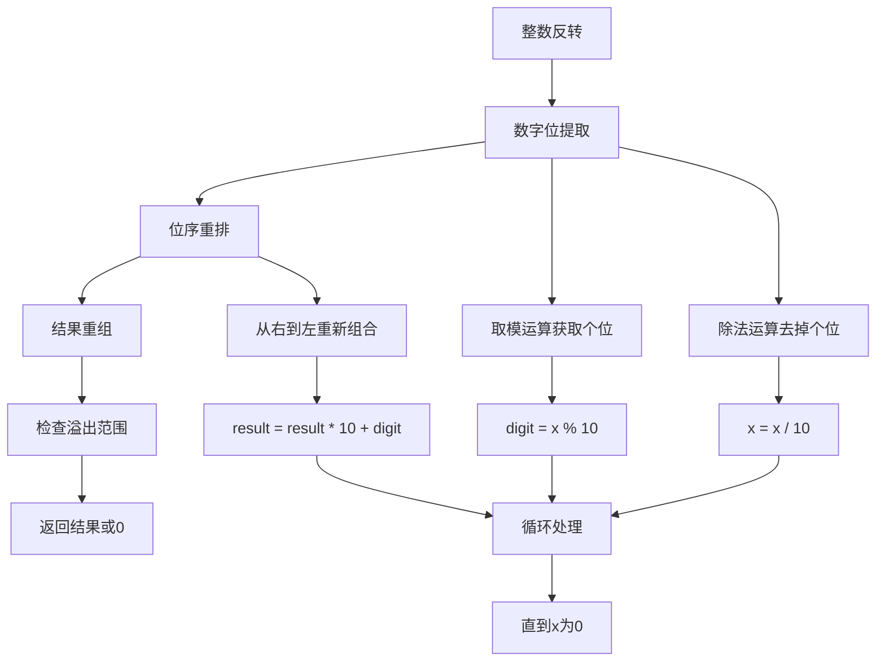

### 数学方法详解

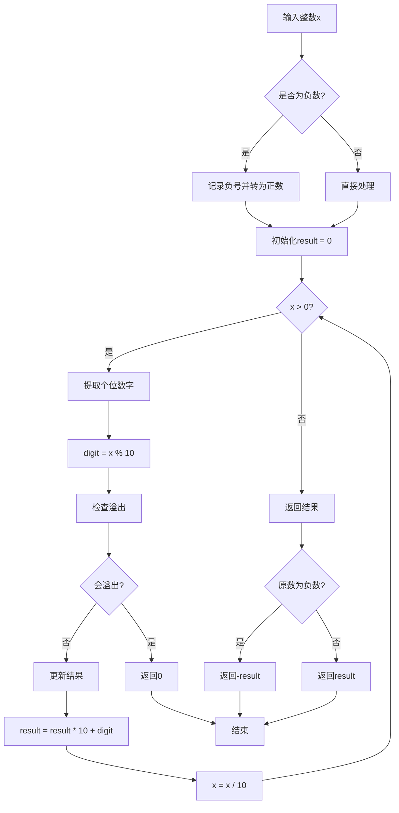

### 溢出检查策略

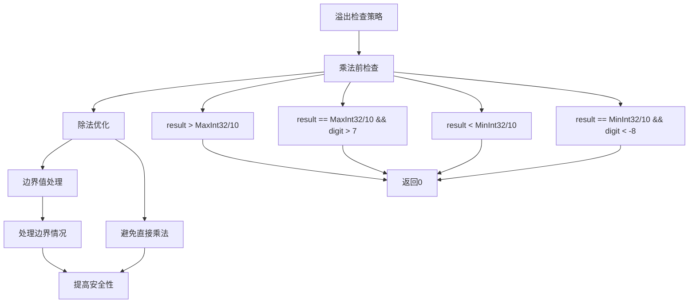

### 反转过程可视化

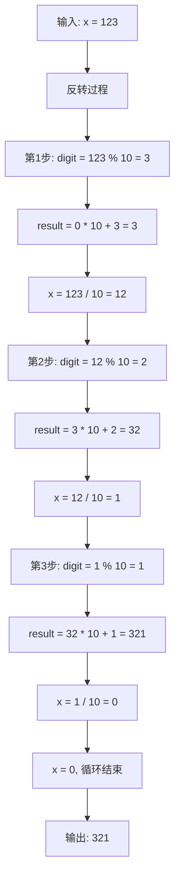

### 负数处理策略

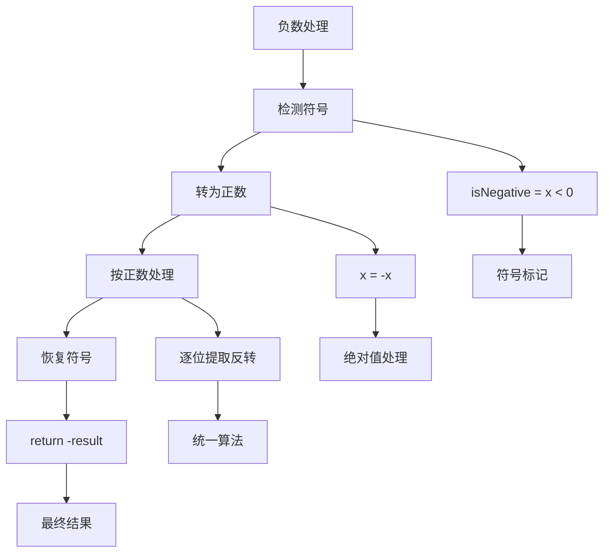

### 各种解法对比

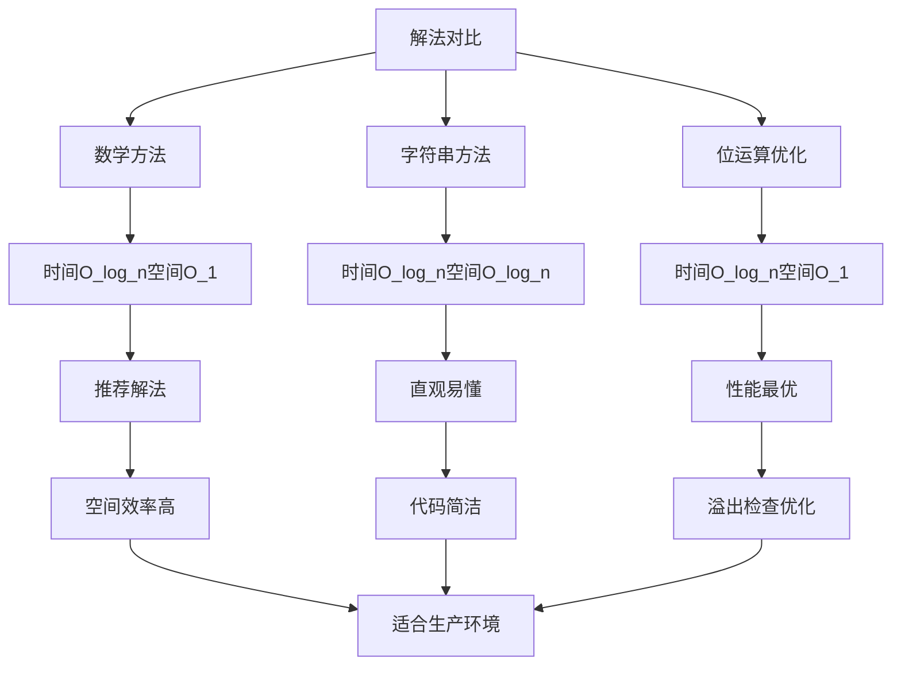

### 算法流程图

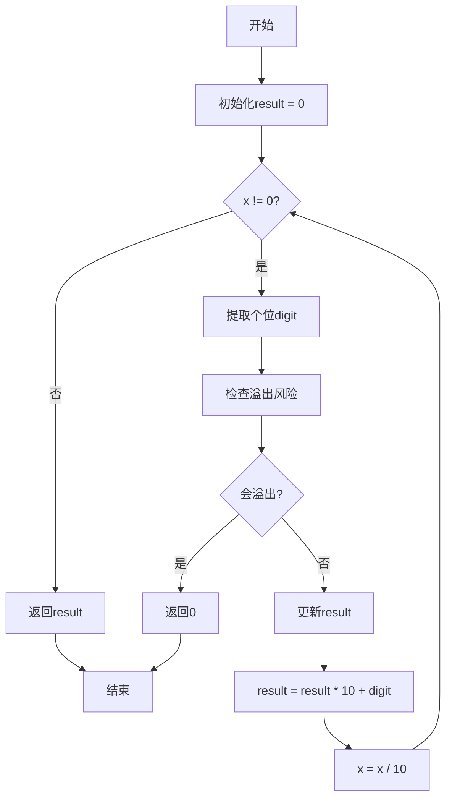

### 边界情况处理

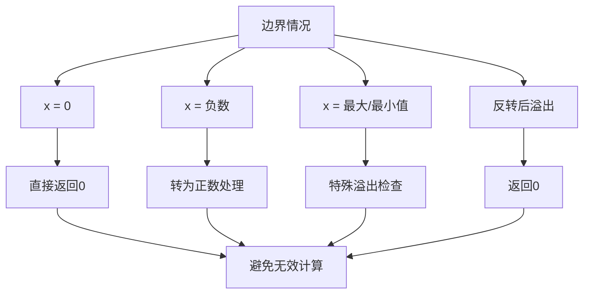

### 时间复杂度分析

```mermaid
graph TD
    A[时间复杂度分析] --> B[数字位数]
    B --> C[循环次数]
    C --> D[每次操作]
    
    B --> E[log₁₀(n)]
    C --> F[O_log_n]
    D --> G[O_1]
    
    E --> H[n是整数值]
    F --> I[总时间复杂度]
    G --> I
    
    I --> J[O_log_n]
    J --> K[最优解法]
```

### 空间复杂度分析

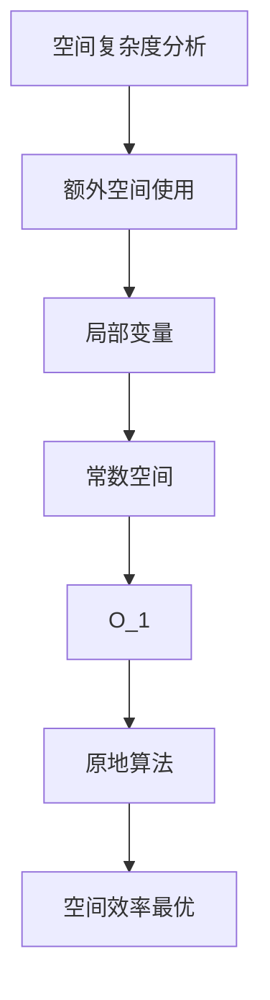

### 关键优化点

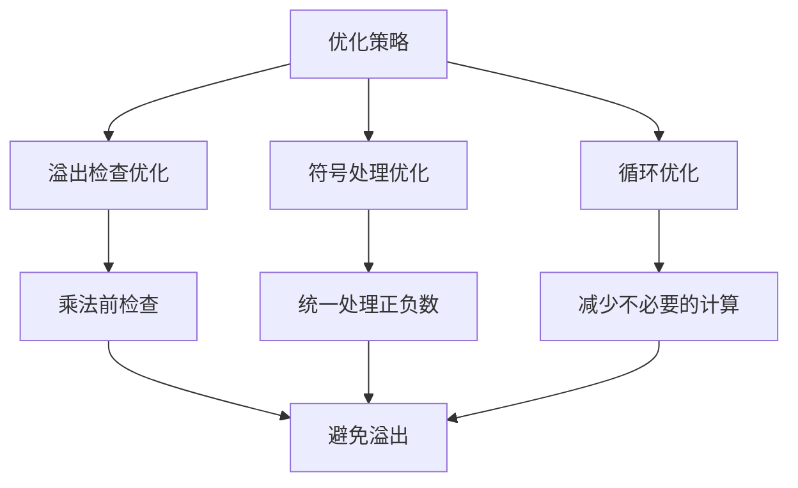

### 实际应用场景

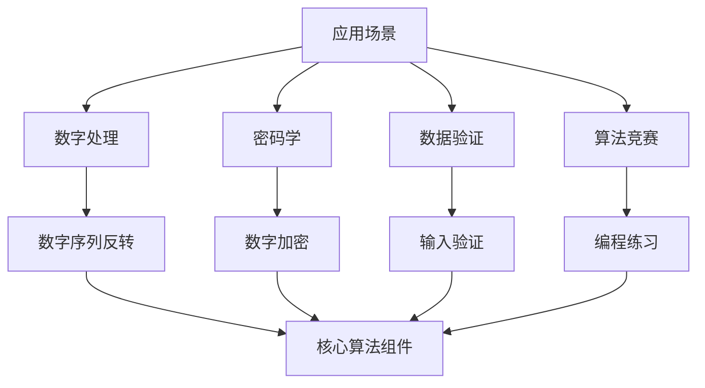

### 测试用例设计

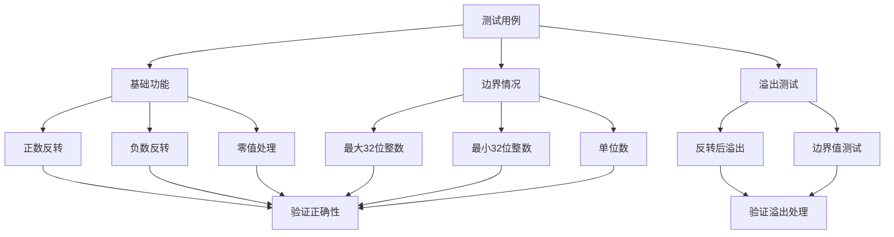

### 代码实现要点

1. **溢出检查时机**：
   - 在 `result * 10` 之前检查
   - 避免实际溢出后再检查

2. **符号处理**：
   - 先转为正数处理
   - 最后恢复符号

3. **循环终止条件**：
   - 使用 `x != 0` 而不是 `x > 0`
   - 统一处理正负数

4. **边界值处理**：
   - 特殊处理最大/最小32位整数
   - 处理反转后溢出的情况

5. **性能优化**：
   - 使用位运算优化溢出检查
   - 减少不必要的条件判断

这个问题的关键在于**掌握数字位提取技巧**和**正确处理溢出情况**，通过数学运算实现整数的位序反转，同时确保结果在32位整数范围内。
