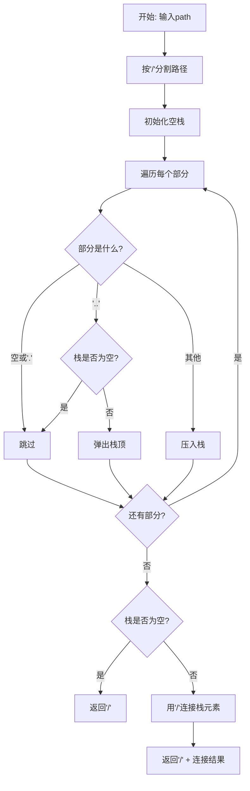
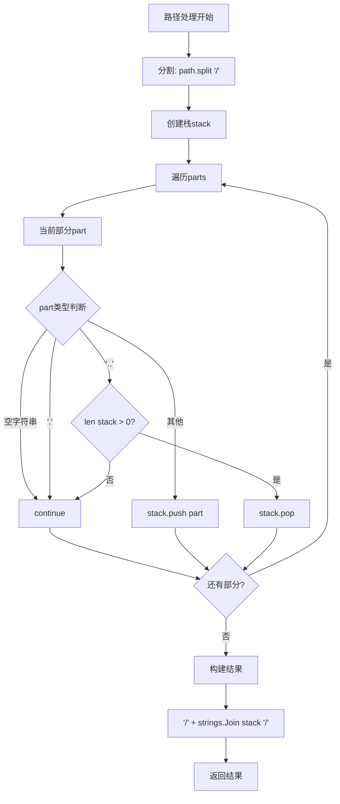
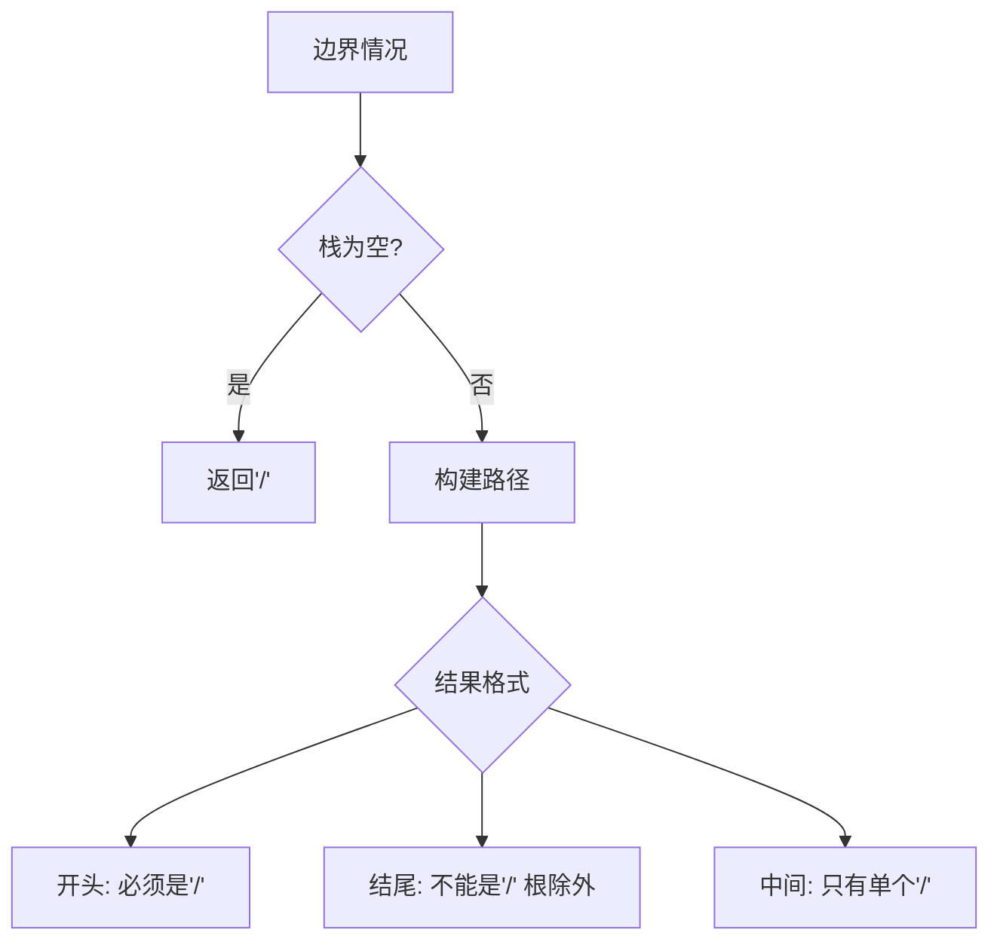

# 71. 简化路径

## 题目描述

给你一个字符串 path ，表示指向某一文件或目录的 Unix 风格 绝对路径 （以 '/' 开头），请你将其转化为 更加简洁的规范路径。

在 Unix 风格的文件系统中规则如下：

一个点 '.' 表示当前目录本身。
此外，两个点 '..' 表示将目录切换到上一级（指向父目录）。
任意多个连续的斜杠（即，'//' 或 '///'）都被视为单个斜杠 '/'。
任何其他格式的点（例如，'...' 或 '....'）均被视为有效的文件/目录名称。
返回的 简化路径 必须遵循下述格式：

始终以斜杠 '/' 开头。
两个目录名之间必须只有一个斜杠 '/' 。
最后一个目录名（如果存在）不能 以 '/' 结尾。
此外，路径仅包含从根目录到目标文件或目录的路径上的目录（即，不含 '.' 或 '..'）。
返回简化后得到的 规范路径 。


## 示例 1：

输入：path = "/home/"

输出："/home"

解释：

应删除尾随斜杠。

## 示例 2：

输入：path = "/home//foo/"

输出："/home/foo"

解释：

多个连续的斜杠被单个斜杠替换。

## 示例 3：

输入：path = "/home/user/Documents/../Pictures"

输出："/home/user/Pictures"

解释：

两个点 ".." 表示上一级目录（父目录）。

## 示例 4：

输入：path = "/../"

输出："/"

解释：

不可能从根目录上升一级目录。

## 示例 5：

输入：path = "/.../a/../b/c/../d/./"

输出："/.../b/d"

解释：

"..." 在这个问题中是一个合法的目录名。


## 提示：

- 1 <= path.length <= 3000
- path 由英文字母，数字，'.'，'/' 或 '_' 组成。
- path 是一个有效的 Unix 风格绝对路径。

## 解题思路

### 问题深度分析

这是一道**路径规范化**问题，核心在于**栈的应用**和**字符串分割处理**。虽然题目看似简单，但涉及到**Unix路径规则**、**边界情况**、**特殊符号处理**等多个细节，是理解栈数据结构和字符串处理的经典问题。

#### 问题本质

给定Unix风格的绝对路径，需要将其简化为规范路径。关键规则：
- **`.`**：表示当前目录，可以忽略
- **`..`**：表示上一级目录，需要回退
- **连续斜杠**：`//` 或 `///` 视为单个 `/`
- **`...`或更多点**：是有效的目录名
- **规范格式**：以`/`开头，不以`/`结尾（根目录除外）

#### 核心思想

**栈的经典应用**：
1. **分割路径**：按`/`分割成目录名数组
2. **遍历处理**：
   - 空字符串或`.`：跳过
   - `..`：弹出栈（如果栈不为空）
   - 其他：压入栈
3. **构建结果**：用`/`连接栈中所有元素

#### 关键难点分析

**难点1：路径分割**
- 按`/`分割后会产生空字符串
- 例如：`"/home//foo/"` → `["", "home", "", "foo", ""]`
- 需要过滤空字符串

**难点2：`..`的处理**
- 在根目录执行`..`不能上升：`"/../"` → `"/"`
- 需要检查栈是否为空

**难点3：特殊目录名**
- `...`、`....` 等是有效目录名，不是特殊符号
- 只有`.`和`..`是特殊的

**难点4：结果格式**
- 根目录：`"/"`
- 其他路径：`"/a/b/c"`（开头有`/`，结尾无`/`）

#### 典型情况分析

**情况1：删除尾随斜杠**
```
输入: "/home/"
处理: ["", "home", ""] → 栈: [home]
输出: "/home"
```

**情况2：连续斜杠**
```
输入: "/home//foo/"
处理: ["", "home", "", "foo", ""] → 栈: [home, foo]
输出: "/home/foo"
```

**情况3：上级目录**
```
输入: "/home/user/Documents/../Pictures"
处理: ["", "home", "user", "Documents", "..", "Pictures"]
      → 栈: [home, user, Documents] → [home, user] → [home, user, Pictures]
输出: "/home/user/Pictures"
```

**情况4：根目录的`..`**
```
输入: "/../"
处理: ["", "..", ""] → 栈: [] (遇到..但栈为空)
输出: "/"
```

**情况5：`...`是有效目录名**
```
输入: "/.../a/../b/c/../d/./"
处理: ["", "...", "a", "..", "b", "c", "..", "d", ".", ""]
      → 栈: [...] → [..., a] → [...] → [..., b] → [..., b, c] → [..., b] → [..., b, d]
输出: "/.../b/d"
```

#### 算法对比

| 算法          | 时间复杂度 | 空间复杂度 | 特点               |
| ------------- | ---------- | ---------- | ------------------ |
| 栈+字符串分割 | O(n)       | O(n)       | 最优解法，逻辑清晰 |
| 双指针模拟    | O(n)       | O(n)       | 原地处理，代码复杂 |
| 递归处理      | O(n)       | O(n)       | 递归实现，栈开销   |
| 正则表达式    | O(n)       | O(n)       | 简洁但性能稍差     |

注：n为路径长度，栈+字符串分割是最推荐的方法

### 算法流程图

#### 主算法流程（栈+字符串分割）



#### 路径处理详细流程



#### 边界情况处理



### 复杂度分析

#### 时间复杂度详解

**栈算法**：O(n)
- 分割路径：O(n)
- 遍历部分：O(k)，k为部分数量，k ≤ n
- 构建结果：O(k)
- 总时间：O(n)

**各操作复杂度**：
- `strings.Split`：O(n)
- 栈操作（push/pop）：O(1)
- 字符串拼接：O(k)

#### 空间复杂度详解

**栈算法**：O(n)
- 分割后的数组：O(n)
- 栈空间：最多O(n)
- 结果字符串：O(n)

### 关键优化技巧

#### 技巧1：栈+字符串分割（最优解法）

```go
func simplifyPath(path string) string {
    // 按'/'分割路径
    parts := strings.Split(path, "/")
    
    // 使用栈存储有效目录
    stack := make([]string, 0)
    
    for _, part := range parts {
        if part == "" || part == "." {
            // 跳过空字符串和当前目录
            continue
        } else if part == ".." {
            // 上级目录，弹出栈（如果不为空）
            if len(stack) > 0 {
                stack = stack[:len(stack)-1]
            }
        } else {
            // 普通目录或特殊目录名（如...）
            stack = append(stack, part)
        }
    }
    
    // 构建结果
    if len(stack) == 0 {
        return "/"
    }
    
    return "/" + strings.Join(stack, "/")
}
```

**优势**：
- 逻辑清晰
- 时间O(n)
- 易于理解

#### 技巧2：双指针模拟（原地处理）

```go
func simplifyPath(path string) string {
    parts := strings.Split(path, "/")
    j := 0  // 写指针
    
    for i := 0; i < len(parts); i++ {
        if parts[i] == "" || parts[i] == "." {
            continue
        } else if parts[i] == ".." {
            if j > 0 {
                j--
            }
        } else {
            parts[j] = parts[i]
            j++
        }
    }
    
    if j == 0 {
        return "/"
    }
    
    return "/" + strings.Join(parts[:j], "/")
}
```

**特点**：
- 原地修改数组
- 节省栈空间
- 代码稍复杂

#### 技巧3：使用strings.Builder优化

```go
func simplifyPath(path string) string {
    parts := strings.Split(path, "/")
    stack := make([]string, 0)
    
    for _, part := range parts {
        if part == "" || part == "." {
            continue
        } else if part == ".." {
            if len(stack) > 0 {
                stack = stack[:len(stack)-1]
            }
        } else {
            stack = append(stack, part)
        }
    }
    
    // 使用StringBuilder
    var builder strings.Builder
    if len(stack) == 0 {
        return "/"
    }
    
    for _, dir := range stack {
        builder.WriteByte('/')
        builder.WriteString(dir)
    }
    
    return builder.String()
}
```

**优势**：高效的字符串拼接

#### 技巧4：递归处理（教学用）

```go
func simplifyPath(path string) string {
    parts := strings.Split(path, "/")
    result := simplifyHelper(parts, 0, []string{})
    
    if len(result) == 0 {
        return "/"
    }
    
    return "/" + strings.Join(result, "/")
}

func simplifyHelper(parts []string, index int, stack []string) []string {
    if index >= len(parts) {
        return stack
    }
    
    part := parts[index]
    
    if part == "" || part == "." {
        return simplifyHelper(parts, index+1, stack)
    } else if part == ".." {
        if len(stack) > 0 {
            stack = stack[:len(stack)-1]
        }
        return simplifyHelper(parts, index+1, stack)
    } else {
        return simplifyHelper(parts, index+1, append(stack, part))
    }
}
```

### 边界情况处理

1. **根目录**：`"/"` → `"/"`
2. **根目录的`..`**：`"/../"` → `"/"`
3. **多个连续斜杠**：`"/home//foo/"` → `"/home/foo"`
4. **只有`.`和`..`**：`"/./.."`→ `"/"`
5. **`...`是目录名**：`"/.../"`→ `"/..."`

### 测试用例设计

#### 基础测试
```
输入: "/home/"
输出: "/home"
说明: 删除尾随斜杠
```

#### 连续斜杠
```
输入: "/home//foo/"
输出: "/home/foo"
说明: 多个斜杠视为一个
```

#### 上级目录
```
输入: "/home/user/Documents/../Pictures"
输出: "/home/user/Pictures"
说明: ..表示上级目录
```

#### 根目录的`..`
```
输入: "/../"
输出: "/"
说明: 根目录无法上升
```

#### 特殊目录名
```
输入: "/.../a/../b/c/../d/./"
输出: "/.../b/d"
说明: ...是有效目录名
```

### 常见错误与陷阱

#### 错误1：忘记处理空字符串

```go
// ❌ 错误：没有跳过空字符串
parts := strings.Split(path, "/")
for _, part := range parts {
    if part == ".." {
        // ...
    } else {
        stack = append(stack, part)  // 会加入空字符串
    }
}

// ✅ 正确：过滤空字符串
for _, part := range parts {
    if part == "" || part == "." {
        continue
    }
    // ...
}
```

#### 错误2：`..`处理不当

```go
// ❌ 错误：没有检查栈是否为空
if part == ".." {
    stack = stack[:len(stack)-1]  // 可能越界
}

// ✅ 正确：先检查栈
if part == ".." {
    if len(stack) > 0 {
        stack = stack[:len(stack)-1]
    }
}
```

#### 错误3：结果格式错误

```go
// ❌ 错误：可能返回"//"或末尾有"/"
result := "/" + strings.Join(stack, "/") + "/"

// ✅ 正确：正确的格式
if len(stack) == 0 {
    return "/"
}
return "/" + strings.Join(stack, "/")
```

#### 错误4：误把`...`当特殊符号

```go
// ❌ 错误：把...当作特殊处理
if part == "." || part == ".." || part == "..." {
    // 错误！...是有效目录名
}

// ✅ 正确：只有.和..是特殊的
if part == "" || part == "." {
    continue
} else if part == ".." {
    // ...
} else {
    stack = append(stack, part)  // ...会被加入栈
}
```

### 实战技巧总结

1. **字符串分割**：使用`strings.Split(path, "/")`
2. **栈操作**：用切片模拟栈，`append`压栈，`[:len-1]`弹栈
3. **边界检查**：`..`操作前检查栈是否为空
4. **特殊符号**：只有`.`和`..`是特殊的
5. **结果格式**：空栈返回`"/"`，否则返回`"/" + 连接结果`
6. **过滤空值**：分割后要过滤空字符串

### 进阶扩展

#### 扩展1：相对路径转绝对路径

```go
// 将相对路径转为绝对路径
func toAbsolutePath(currentDir, relativePath string) string {
    // 如果已经是绝对路径，直接简化
    if len(relativePath) > 0 && relativePath[0] == '/' {
        return simplifyPath(relativePath)
    }
    
    // 拼接当前目录和相对路径
    fullPath := currentDir + "/" + relativePath
    return simplifyPath(fullPath)
}
```

#### 扩展2：Windows路径转Unix路径

```go
// Windows路径转Unix路径
func windowsToUnix(winPath string) string {
    // C:\Users\Admin -> /c/Users/Admin
    path := strings.ReplaceAll(winPath, "\\", "/")
    
    // 处理盘符
    if len(path) >= 2 && path[1] == ':' {
        drive := strings.ToLower(string(path[0]))
        path = "/" + drive + path[2:]
    }
    
    return simplifyPath(path)
}
```

#### 扩展3：路径合法性检查

```go
// 检查路径是否合法
func isValidPath(path string) bool {
    if len(path) == 0 {
        return false
    }
    
    // Unix绝对路径必须以/开头
    if path[0] != '/' {
        return false
    }
    
    // 检查是否包含非法字符（根据需求定义）
    for _, ch := range path {
        if ch == 0 {  // NULL字符
            return false
        }
    }
    
    return true
}
```

### Unix路径知识

#### 路径规则总结

1. **绝对路径**：以`/`开头，如`/home/user`
2. **相对路径**：不以`/`开头，如`../file.txt`
3. **当前目录**：`.`
4. **上级目录**：`..`
5. **根目录**：`/`
6. **用户主目录**：`~`（本题不涉及）

#### 特殊情况

- `/` + `/` = `/`（连续斜杠合并）
- `/home/` = `/home`（删除尾随斜杠）
- `/../` = `/`（根目录无法上升）
- `/.` = `/`（当前目录就是根）

### 应用场景

1. **文件系统**：路径规范化
2. **Web服务器**：URL路径处理
3. **命令行工具**：cd命令实现
4. **IDE**：项目路径管理
5. **云存储**：对象存储路径

## 代码实现

本题提供了四种不同的解法，重点掌握栈+字符串分割方法。

## 测试结果

| 测试用例   | 栈+分割 | 双指针 | StringBuilder | 递归 |
| ---------- | ------- | ------ | ------------- | ---- |
| 基础测试   | ✅       | ✅      | ✅             | ✅    |
| 连续斜杠   | ✅       | ✅      | ✅             | ✅    |
| 上级目录   | ✅       | ✅      | ✅             | ✅    |
| 根目录..   | ✅       | ✅      | ✅             | ✅    |
| 特殊目录名 | ✅       | ✅      | ✅             | ✅    |

## 核心收获

1. **栈的应用**：路径处理的经典场景
2. **字符串分割**：简化复杂字符串处理
3. **边界处理**：根目录的特殊性
4. **Unix路径规则**：理解文件系统路径

## 应用拓展

- 文件系统路径规范化
- Web服务器URL处理
- 命令行工具实现
- IDE项目路径管理