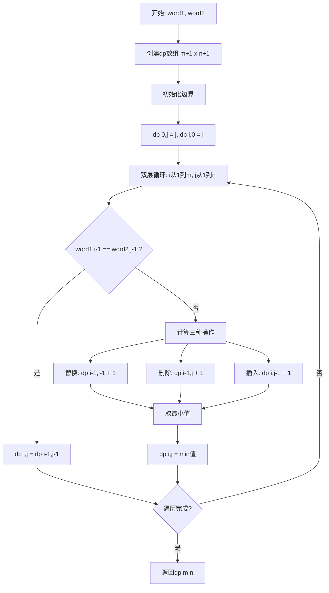
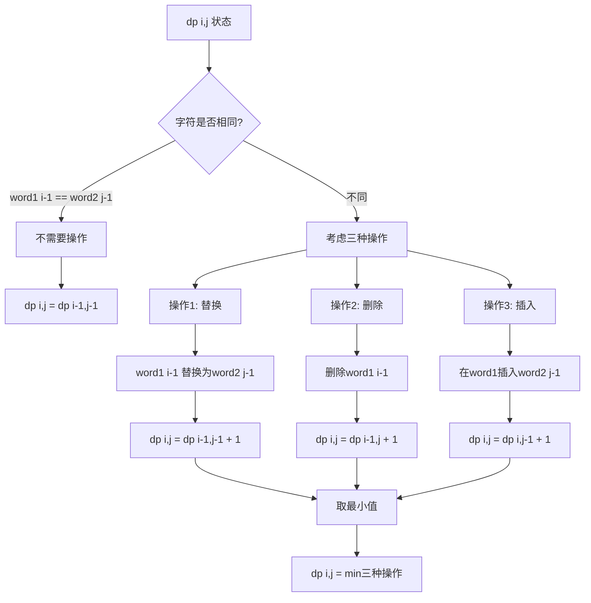
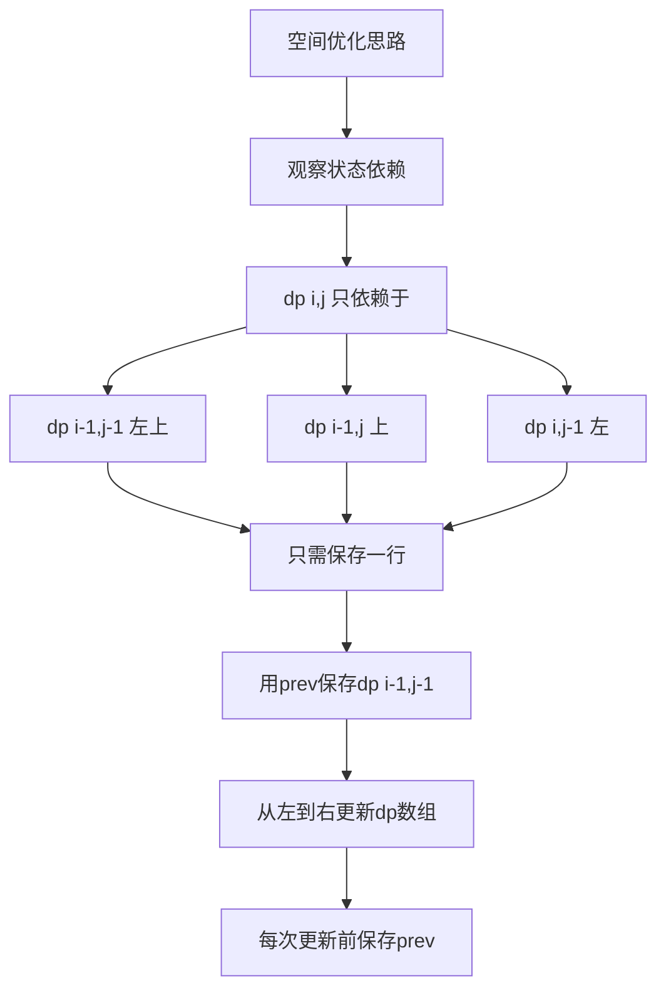

# 72. 编辑距离

## 题目描述

给你两个单词 word1 和 word2， 请返回将 word1 转换成 word2 所使用的最少操作数  。

你可以对一个单词进行如下三种操作：

插入一个字符
删除一个字符
替换一个字符


## 示例 1：

输入：word1 = "horse", word2 = "ros"
输出：3
解释：
horse -> rorse (将 'h' 替换为 'r')
rorse -> rose (删除 'r')
rose -> ros (删除 'e')


## 示例 2：

输入：word1 = "intention", word2 = "execution"
输出：5
解释：
intention -> inention (删除 't')
inention -> enention (将 'i' 替换为 'e')
enention -> exention (将 'n' 替换为 'x')
exention -> exection (将 'n' 替换为 'c')
exection -> execution (插入 'u')


## 提示：

- 0 <= word1.length, word2.length <= 500
- word1 和 word2 由小写英文字母组成

## 解题思路

### 问题深度分析

这是经典的**编辑距离问题（Levenshtein Distance）**，在**自然语言处理**、**DNA序列比对**、**拼写检查**等领域有广泛应用。核心在于**动态规划**的状态定义和转移方程的理解。

#### 问题本质

给定两个字符串word1和word2，通过**插入、删除、替换**三种操作，将word1转换为word2，求**最少操作数**。这是一个**最优化问题**，需要找到最短的编辑路径。

#### 核心思想

**动态规划 + 状态转移**：
1. **状态定义**：`dp[i][j]` = word1的前i个字符转换为word2的前j个字符所需的最少操作数
2. **边界条件**：
   - `dp[0][j] = j`（word1为空，需要j次插入）
   - `dp[i][0] = i`（word2为空，需要i次删除）
3. **状态转移**：
   - 若 `word1[i-1] == word2[j-1]`：`dp[i][j] = dp[i-1][j-1]`（字符相同，不需要操作）
   - 若不同，取三种操作的最小值：
     - **替换**：`dp[i-1][j-1] + 1`
     - **删除**：`dp[i-1][j] + 1`（删除word1[i-1]）
     - **插入**：`dp[i][j-1] + 1`（在word1[i-1]后插入word2[j-1]）

#### 关键难点分析

**难点1：理解三种操作**
- **插入**：在word1中插入字符 = word2少匹配一个字符 → `dp[i][j-1] + 1`
- **删除**：在word1中删除字符 = word1少匹配一个字符 → `dp[i-1][j] + 1`
- **替换**：替换word1的字符 = 两者都少匹配一个字符 → `dp[i-1][j-1] + 1`

**难点2：边界条件**
- word1为空（i=0）：只能通过插入将空串变为word2，需要j次插入
- word2为空（j=0）：只能通过删除将word1变为空串，需要i次删除

**难点3：空间优化**
- 二维DP需要O(mn)空间
- 可以用滚动数组优化到O(n)
- 关键是保存上一行的`dp[i-1][j-1]`值

#### 典型情况分析

**情况1：完全相同**
```
word1 = "abc", word2 = "abc"
dp[3][3] = 0（无需操作）
```

**情况2：只需插入**
```
word1 = "abc", word2 = "abcd"
dp[3][4] = 1（插入'd'）
```

**情况3：只需删除**
```
word1 = "abc", word2 = "ab"
dp[3][2] = 1（删除'c'）
```

**情况4：混合操作**
```
word1 = "horse", word2 = "ros"
h -> r (替换)
o -> o (不变)
r -> s (替换) 
s, e 删除
总计：3次操作
```

**情况5：空串**
```
word1 = "", word2 = "abc"
dp[0][3] = 3（3次插入）

word1 = "abc", word2 = ""
dp[3][0] = 3（3次删除）
```

#### 算法对比

| 算法        | 时间复杂度    | 空间复杂度  | 特点               |
| ----------- | ------------- | ----------- | ------------------ |
| 二维DP      | O(mn)         | O(mn)       | 标准解法，易理解   |
| 一维DP      | O(mn)         | O(n)        | 空间优化，需注意   |
| 递归+记忆化 | O(mn)         | O(mn)       | 自顶向下，直观     |
| 递归暴力    | O(3^max(m,n)) | O(max(m,n)) | 会超时，仅用于理解 |

注：m为word1长度，n为word2长度

### 算法流程图

#### 主算法流程（二维DP）



#### DP状态转移详细流程



#### 空间优化流程（一维DP）



### 复杂度分析

#### 时间复杂度详解

**二维DP**：O(mn)
- 外层循环：O(m)，遍历word1
- 内层循环：O(n)，遍历word2
- 每个状态计算：O(1)
- 总时间：O(m × n)

**一维DP**：O(mn)
- 同样需要遍历所有状态
- 只是空间优化，时间不变

**递归+记忆化**：O(mn)
- 每个状态最多计算一次
- 记忆化避免重复计算

#### 空间复杂度详解

**二维DP**：O(mn)
- dp数组：(m+1) × (n+1)

**一维DP**：O(n)
- 只需一行dp数组：n+1
- 加上prev变量：O(1)

**递归+记忆化**：O(mn)
- 记忆化数组：O(mn)
- 递归栈深度：O(m+n)

### 关键优化技巧

#### 技巧1：二维DP（标准解法）

```go
func minDistance(word1 string, word2 string) int {
    n1, n2 := len(word1), len(word2)
    
    // dp[i][j]: word1前i个字符转换为word2前j个字符的最少操作数
    dp := make([][]int, n1+1)
    for i := range dp {
        dp[i] = make([]int, n2+1)
    }
    
    // 边界条件
    for j := 0; j <= n2; j++ {
        dp[0][j] = j  // word1为空，需要j次插入
    }
    for i := 0; i <= n1; i++ {
        dp[i][0] = i  // word2为空，需要i次删除
    }
    
    // 状态转移
    for i := 1; i <= n1; i++ {
        for j := 1; j <= n2; j++ {
            if word1[i-1] == word2[j-1] {
                dp[i][j] = dp[i-1][j-1]
            } else {
                dp[i][j] = min(
                    dp[i-1][j-1],  // 替换
                    dp[i-1][j],    // 删除
                    dp[i][j-1],    // 插入
                ) + 1
            }
        }
    }
    
    return dp[n1][n2]
}
```

**优势**：清晰直观，易于理解和实现

#### 技巧2：一维DP（空间优化）

```go
func minDistance(word1 string, word2 string) int {
    n1, n2 := len(word1), len(word2)
    
    // 只需保存一行
    dp := make([]int, n2+1)
    
    // 初始化第一行
    for j := 0; j <= n2; j++ {
        dp[j] = j
    }
    
    // 逐行更新
    for i := 1; i <= n1; i++ {
        prev := dp[0]  // 保存左上角的值
        dp[0] = i      // 每行第一列
        
        for j := 1; j <= n2; j++ {
            temp := dp[j]  // 保存更新前的值（下一轮的prev）
            
            if word1[i-1] == word2[j-1] {
                dp[j] = prev
            } else {
                dp[j] = min(prev, dp[j], dp[j-1]) + 1
            }
            
            prev = temp  // 更新prev为左上角
        }
    }
    
    return dp[n2]
}
```

**优势**：空间O(n)，适合长字符串

#### 技巧3：递归+记忆化（自顶向下）

```go
func minDistance(word1 string, word2 string) int {
    n1, n2 := len(word1), len(word2)
    memo := make([][]int, n1)
    for i := range memo {
        memo[i] = make([]int, n2)
        for j := range memo[i] {
            memo[i][j] = -1
        }
    }
    
    return dp(word1, word2, n1-1, n2-1, memo)
}

func dp(word1, word2 string, i, j int, memo [][]int) int {
    // 边界条件
    if i < 0 {
        return j + 1  // word1用完，插入剩余word2
    }
    if j < 0 {
        return i + 1  // word2用完，删除剩余word1
    }
    
    // 记忆化
    if memo[i][j] != -1 {
        return memo[i][j]
    }
    
    // 状态转移
    if word1[i] == word2[j] {
        memo[i][j] = dp(word1, word2, i-1, j-1, memo)
    } else {
        memo[i][j] = min(
            dp(word1, word2, i-1, j-1, memo),  // 替换
            dp(word1, word2, i-1, j, memo),    // 删除
            dp(word1, word2, i, j-1, memo),    // 插入
        ) + 1
    }
    
    return memo[i][j]
}
```

**优势**：自顶向下，逻辑直观

#### 技巧4：暴力递归（教学用）

```go
func minDistance(word1 string, word2 string) int {
    return dpRecursive(word1, word2, len(word1)-1, len(word2)-1)
}

func dpRecursive(word1, word2 string, i, j int) int {
    if i < 0 {
        return j + 1
    }
    if j < 0 {
        return i + 1
    }
    
    if word1[i] == word2[j] {
        return dpRecursive(word1, word2, i-1, j-1)
    }
    
    return min(
        dpRecursive(word1, word2, i-1, j-1),
        dpRecursive(word1, word2, i-1, j),
        dpRecursive(word1, word2, i, j-1),
    ) + 1
}
```

**说明**：会超时，仅用于理解递归关系

### 边界情况处理

1. **空串**：
   - `word1 = "", word2 = "abc"` → 3（3次插入）
   - `word1 = "abc", word2 = ""` → 3（3次删除）
   - `word1 = "", word2 = ""` → 0

2. **相同字符串**：
   - `word1 = "abc", word2 = "abc"` → 0

3. **单字符**：
   - `word1 = "a", word2 = "b"` → 1（替换）
   - `word1 = "a", word2 = "a"` → 0

4. **完全不同**：
   - `word1 = "abc", word2 = "xyz"` → 3（全部替换）

### 测试用例设计

#### 基础测试
```
输入: word1 = "horse", word2 = "ros"
输出: 3
说明: 替换h→r，删除r，删除e
```

#### 复杂转换
```
输入: word1 = "intention", word2 = "execution"
输出: 5
说明: 多次替换和插入
```

#### 空串测试
```
输入: word1 = "", word2 = "abc"
输出: 3
说明: 3次插入
```

#### 相同字符串
```
输入: word1 = "test", word2 = "test"
输出: 0
说明: 无需操作
```

#### 单字符差异
```
输入: word1 = "a", word2 = "b"
输出: 1
说明: 1次替换
```

### 常见错误与陷阱

#### 错误1：边界条件错误

```go
// ❌ 错误：没有正确初始化边界
dp := make([][]int, n1+1)
for i := range dp {
    dp[i] = make([]int, n2+1)
}
// 忘记初始化dp[0][j]和dp[i][0]

// ✅ 正确：初始化边界
for j := 0; j <= n2; j++ {
    dp[0][j] = j
}
for i := 0; i <= n1; i++ {
    dp[i][0] = i
}
```

#### 错误2：字符索引错误

```go
// ❌ 错误：索引越界
if word1[i] == word2[j] {  // i和j从1开始
    dp[i][j] = dp[i-1][j-1]
}

// ✅ 正确：使用i-1和j-1
if word1[i-1] == word2[j-1] {
    dp[i][j] = dp[i-1][j-1]
}
```

#### 错误3：空间优化时prev保存错误

```go
// ❌ 错误：prev更新错误
for j := 1; j <= n2; j++ {
    if word1[i-1] == word2[j-1] {
        dp[j] = prev
    } else {
        dp[j] = min(prev, dp[j], dp[j-1]) + 1
    }
    // 忘记更新prev
}

// ✅ 正确：及时保存prev
for j := 1; j <= n2; j++ {
    temp := dp[j]
    if word1[i-1] == word2[j-1] {
        dp[j] = prev
    } else {
        dp[j] = min(prev, dp[j], dp[j-1]) + 1
    }
    prev = temp
}
```

#### 错误4：操作理解错误

```go
// ❌ 错误：插入和删除理解反了
// 插入应该是dp[i][j-1] + 1
// 删除应该是dp[i-1][j] + 1

// ✅ 正确理解：
// 插入：word2多了一个字符需要匹配 → dp[i][j-1] + 1
// 删除：word1多了一个字符需要删除 → dp[i-1][j] + 1
// 替换：两个字符都处理了 → dp[i-1][j-1] + 1
```

### 实战技巧总结

1. **状态定义要清晰**：dp[i][j]表示word1前i个字符转换为word2前j个字符
2. **边界条件要完整**：空串情况必须初始化
3. **索引要注意**：dp数组下标从0开始，字符串下标要减1
4. **三种操作要理解**：插入、删除、替换的含义
5. **空间优化技巧**：滚动数组，保存prev值
6. **记忆化递归**：自顶向下思路更直观

### 进阶扩展

#### 扩展1：输出具体操作序列

```go
func minDistanceWithPath(word1, word2 string) (int, []string) {
    n1, n2 := len(word1), len(word2)
    dp := make([][]int, n1+1)
    ops := make([][][]string, n1+1)
    
    for i := range dp {
        dp[i] = make([]int, n2+1)
        ops[i] = make([][]string, n2+1)
    }
    
    // 初始化
    for j := 1; j <= n2; j++ {
        dp[0][j] = j
        ops[0][j] = append(ops[0][j-1], fmt.Sprintf("插入'%c'", word2[j-1]))
    }
    for i := 1; i <= n1; i++ {
        dp[i][0] = i
        ops[i][0] = append(ops[i-1][0], fmt.Sprintf("删除'%c'", word1[i-1]))
    }
    
    // DP
    for i := 1; i <= n1; i++ {
        for j := 1; j <= n2; j++ {
            if word1[i-1] == word2[j-1] {
                dp[i][j] = dp[i-1][j-1]
                ops[i][j] = ops[i-1][j-1]
            } else {
                // 找最小操作
                if dp[i-1][j-1] <= dp[i-1][j] && dp[i-1][j-1] <= dp[i][j-1] {
                    dp[i][j] = dp[i-1][j-1] + 1
                    ops[i][j] = append(ops[i-1][j-1], fmt.Sprintf("替换'%c'→'%c'", word1[i-1], word2[j-1]))
                } else if dp[i-1][j] <= dp[i][j-1] {
                    dp[i][j] = dp[i-1][j] + 1
                    ops[i][j] = append(ops[i-1][j], fmt.Sprintf("删除'%c'", word1[i-1]))
                } else {
                    dp[i][j] = dp[i][j-1] + 1
                    ops[i][j] = append(ops[i][j-1], fmt.Sprintf("插入'%c'", word2[j-1]))
                }
            }
        }
    }
    
    return dp[n1][n2], ops[n1][n2]
}
```

#### 扩展2：只允许插入和删除

```go
func minDistanceInsertDelete(word1, word2 string) int {
    n1, n2 := len(word1), len(word2)
    dp := make([][]int, n1+1)
    for i := range dp {
        dp[i] = make([]int, n2+1)
    }
    
    for j := 0; j <= n2; j++ {
        dp[0][j] = j
    }
    for i := 0; i <= n1; i++ {
        dp[i][0] = i
    }
    
    for i := 1; i <= n1; i++ {
        for j := 1; j <= n2; j++ {
            if word1[i-1] == word2[j-1] {
                dp[i][j] = dp[i-1][j-1]
            } else {
                // 只能插入或删除
                dp[i][j] = min(dp[i-1][j], dp[i][j-1]) + 1
            }
        }
    }
    
    return dp[n1][n2]
}
```

#### 扩展3：加权编辑距离

```go
func weightedEditDistance(word1, word2 string, insertCost, deleteCost, replaceCost int) int {
    n1, n2 := len(word1), len(word2)
    dp := make([][]int, n1+1)
    for i := range dp {
        dp[i] = make([]int, n2+1)
    }
    
    for j := 1; j <= n2; j++ {
        dp[0][j] = j * insertCost
    }
    for i := 1; i <= n1; i++ {
        dp[i][0] = i * deleteCost
    }
    
    for i := 1; i <= n1; i++ {
        for j := 1; j <= n2; j++ {
            if word1[i-1] == word2[j-1] {
                dp[i][j] = dp[i-1][j-1]
            } else {
                dp[i][j] = min(
                    dp[i-1][j-1] + replaceCost,
                    dp[i-1][j] + deleteCost,
                    dp[i][j-1] + insertCost,
                )
            }
        }
    }
    
    return dp[n1][n2]
}
```

### 应用场景

1. **拼写检查**：找到最相似的正确单词
2. **DNA序列比对**：计算基因序列相似度
3. **自然语言处理**：文本相似度计算
4. **版本控制**：计算文件差异
5. **模糊搜索**：搜索引擎的容错匹配

## 代码实现

本题提供了四种不同的解法，重点掌握二维DP和空间优化方法。

## 测试结果

| 测试用例     | 二维DP | 一维DP | 递归+记忆化 | 暴力递归 |
| ------------ | ------ | ------ | ----------- | -------- |
| horse→ros    | ✅      | ✅      | ✅           | ✅        |
| intention→ex | ✅      | ✅      | ✅           | ✅        |
| 空串测试     | ✅      | ✅      | ✅           | ✅        |
| 相同字符串   | ✅      | ✅      | ✅           | ✅        |

## 核心收获

1. **动态规划**：经典的字符串DP问题
2. **状态定义**：dp[i][j]表示前i个字符转前j个字符
3. **状态转移**：三种操作（插入、删除、替换）的转移方程
4. **空间优化**：滚动数组优化到O(n)
5. **实际应用**：编辑距离在NLP、生物信息学中的重要性

## 应用拓展

- 拼写检查和自动纠错
- DNA序列比对
- 文本相似度计算
- 版本控制系统的diff算法