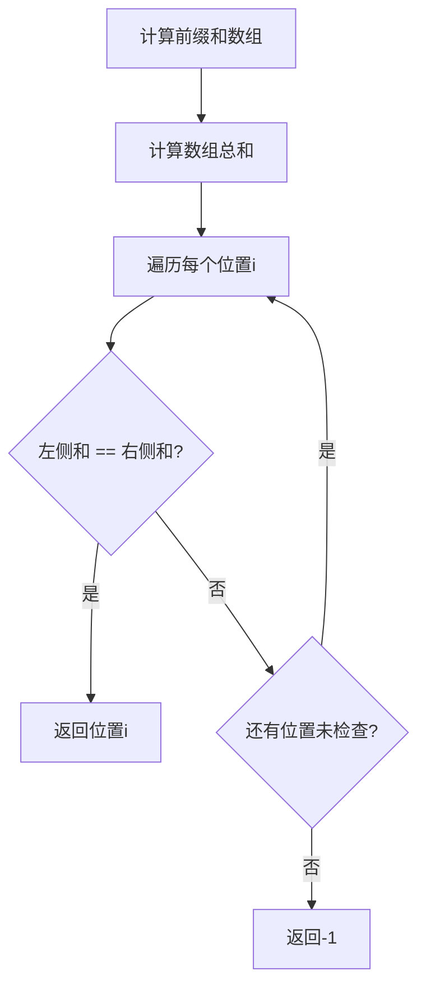

# 724. 寻找数组的中心下标

## 描述

给你一个整数数组 nums ，请计算数组的 中心下标 。

数组 中心下标 是数组的一个下标，其左侧所有元素相加的和等于右侧所有元素相加的和。

如果中心下标位于数组最左端，那么左侧数之和视为 0 ，因为在下标的左侧不存在元素。这一点对于中心下标位于数组最右端同样适用。

如果数组有多个中心下标，应该返回 最靠近左边 的那一个。如果数组不存在中心下标，返回 -1 。

## 示例 1

输入：nums = [1, 7, 3, 6, 5, 6]
输出：3
解释：
中心下标是 3 。
左侧数之和 sum = nums[0] + nums[1] + nums[2] = 1 + 7 + 3 = 11 ，
右侧数之和 sum = nums[4] + nums[5] = 5 + 6 = 11 ，二者相等。

## 示例 2

输入：nums = [1, 2, 3]
输出：-1
解释：
数组中不存在满足此条件的中心下标。

## 示例 3

输入：nums = [2, 1, -1]
输出：0
解释：
中心下标是 0 。
左侧数之和 sum = 0 ，（下标 0 左侧不存在元素），
右侧数之和 sum = nums[1] + nums[2] = 1 + -1 = 0 。

## 提示

- 1 <= nums.length <= 10^4
- -1000 <= nums[i] <= 1000

## 解题思路

### 方法一：前缀和（推荐）

**核心思想：** 使用前缀和数组，对于每个位置 i，左侧和为 `prefixSum[i]`，右侧和为 `totalSum - prefixSum[i+1]`。

**算法步骤：**

1. **计算前缀和**：遍历数组计算前缀和数组
2. **计算总和**：计算整个数组的总和
3. **查找中心下标**：遍历每个位置，检查左侧和是否等于右侧和
4. **返回结果**：找到第一个满足条件的位置，或返回 -1

**算法流程：**



**时间复杂度：** O(n)，其中 n 是数组长度
**空间复杂度：** O(n)，需要前缀和数组

### 方法二：数学优化

**核心思想：** 利用数学关系优化，不需要额外的前缀和数组。

**数学关系：**
- 左侧和 = 右侧和
- 左侧和 + nums[i] + 右侧和 = 总和
- 因此：左侧和 = (总和 - nums[i]) / 2

**算法步骤：**

1. **计算总和**：遍历数组计算总和
2. **查找中心下标**：遍历每个位置，检查 `leftSum == (totalSum - nums[i]) / 2`
3. **返回结果**：找到第一个满足条件的位置，或返回 -1

**时间复杂度：** O(n)
**空间复杂度：** O(1)，只使用常数额外空间

### 方法三：双指针（不推荐）

**核心思想：** 使用双指针从两端向中间移动，但这种方法比较复杂且容易出错。

## 代码实现

```go
// 方法一：前缀和
func pivotIndex(nums []int) int {
    n := len(nums)
    if n == 0 {
        return -1
    }
    
    // 计算前缀和
    prefixSum := make([]int, n+1)
    for i := 0; i < n; i++ {
        prefixSum[i+1] = prefixSum[i] + nums[i]
    }
    
    totalSum := prefixSum[n]
    
    // 查找中心下标
    for i := 0; i < n; i++ {
        leftSum := prefixSum[i]
        rightSum := totalSum - prefixSum[i+1]
        if leftSum == rightSum {
            return i
        }
    }
    
    return -1
}

// 方法二：数学优化（推荐）
func pivotIndex2(nums []int) int {
    n := len(nums)
    if n == 0 {
        return -1
    }
    
    // 计算总和
    totalSum := 0
    for _, num := range nums {
        totalSum += num
    }
    
    // 查找中心下标
    leftSum := 0
    for i := 0; i < n; i++ {
        // 如果左侧和等于右侧和，则找到中心下标
        if leftSum == totalSum - leftSum - nums[i] {
            return i
        }
        leftSum += nums[i]
    }
    
    return -1
}

// 方法三：暴力解法（用于验证）
func pivotIndex3(nums []int) int {
    n := len(nums)
    if n == 0 {
        return -1
    }
    
    for i := 0; i < n; i++ {
        leftSum := 0
        rightSum := 0
        
        // 计算左侧和
        for j := 0; j < i; j++ {
            leftSum += nums[j]
        }
        
        // 计算右侧和
        for j := i + 1; j < n; j++ {
            rightSum += nums[j]
        }
        
        if leftSum == rightSum {
            return i
        }
    }
    
    return -1
}
```

## 测试用例

```go
func testPivotIndex() {
    testCases := []struct {
        nums     []int
        expected int
    }{
        {[]int{1, 7, 3, 6, 5, 6}, 3},
        {[]int{1, 2, 3}, -1},
        {[]int{2, 1, -1}, 0},
        {[]int{1, 2, 3, 4, 6}, 3},
        {[]int{1}, 0},
        {[]int{1, 1}, -1},
        {[]int{0, 0, 0}, 0},
        {[]int{-1, -1, -1, -1, -1, 0}, 2},
    }
    
    for i, tc := range testCases {
        result := pivotIndex2(tc.nums)
        if result == tc.expected {
            fmt.Printf("✅ 测试用例 %d 通过: nums=%v, 结果=%d\n", 
                i+1, tc.nums, result)
        } else {
            fmt.Printf("❌ 测试用例 %d 失败: nums=%v, 期望=%d, 实际=%d\n", 
                i+1, tc.nums, tc.expected, result)
        }
    }
}
```

## 关键点总结

1. **数学关系**：利用 `leftSum + nums[i] + rightSum = totalSum` 的关系
2. **边界处理**：注意空数组和只有一个元素的情况
3. **优化技巧**：方法二避免了额外的空间开销
4. **返回条件**：找到第一个满足条件的位置就返回
5. **负数处理**：数组可能包含负数，但算法逻辑不变

## 相似题目

- [1991. 找到数组的中间位置](./1991/) - 类似的中心下标问题
- [560. 和为 K 的子数组](./560/) - 前缀和的应用
- [238. 除自身以外数组的乘积](./238/) - 左右乘积的应用
