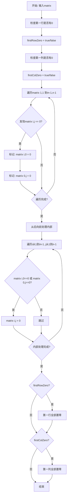
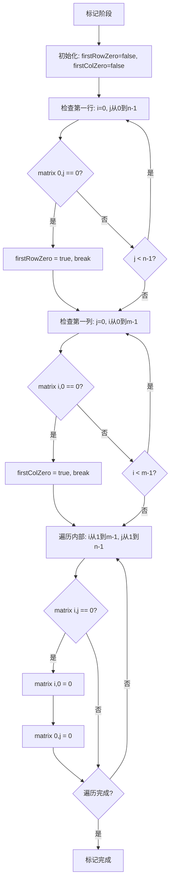
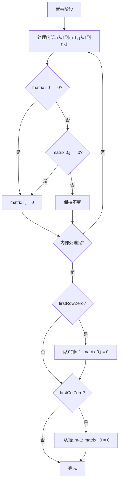

# 73. 矩阵置零

## 题目描述

给定一个 m x n 的矩阵，如果一个元素为 0 ，则将其所在行和列的所有元素都设为 0 。请使用 原地 算法。


## 示例 1：


输入：matrix = [[1,1,1],[1,0,1],[1,1,1]]
输出：[[1,0,1],[0,0,0],[1,0,1]]

## 示例 2：


输入：matrix = [[0,1,2,0],[3,4,5,2],[1,3,1,5]]
输出：[[0,0,0,0],[0,4,5,0],[0,3,1,0]]


## 提示：

- m == matrix.length
- n == matrix[0].length
- 1 <= m, n <= 200
- -2^31 <= matrix[i][j] <= 2^31 - 1


## 进阶：

- 一个直观的解决方案是使用  O(mn) 的额外空间，但这并不是一个好的解决方案。
- 一个简单的改进方案是使用 O(m + n) 的额外空间，但这仍然不是最好的解决方案。
- 你能想出一个仅使用常量空间的解决方案吗？

## 解题思路

### 问题深度分析

这是一道**原地算法**问题，核心在于**空间优化**和**巧妙的标记策略**。问题看似简单，但如何在**O(1)空间复杂度**内完成任务，需要对矩阵的利用有深刻理解。

#### 问题本质

给定一个m×n的矩阵，如果某个元素为0，则将其所在的**整行和整列**都设为0。要求**原地**完成，即空间复杂度为O(1)。

#### 核心思想

**利用矩阵自身作为标记空间**：
1. **第一行作为列标记**：`matrix[0][j] = 0` 表示第j列需要置零
2. **第一列作为行标记**：`matrix[i][0] = 0` 表示第i行需要置零
3. **单独变量记录**：第一行和第一列本身是否需要置零
4. **从后向前处理**：避免标记被提前覆盖

#### 关键难点分析

**难点1：为什么要单独记录第一行和第一列？**
- 第一行和第一列既是**标记位**，又是**被标记对象**
- 如果直接用它们标记，会混淆：是本身有0，还是用来标记其他行列？
- 解决：用两个布尔变量`firstRowZero`和`firstColZero`记录它们本身是否有0

**难点2：为什么要从后向前处理？**
- 如果从前向后，会先把第一行/列置零
- 这样就无法根据第一行/列的标记来处理其他元素
- 解决：先处理`matrix[1..m-1][1..n-1]`，最后处理第一行和第一列

**难点3：空间优化的本质是什么？**
- 朴素做法：用两个数组`rows[m]`和`cols[n]`标记，空间O(m+n)
- 优化：用矩阵的第一行和第一列代替这两个数组，空间O(1)
- 核心：**复用矩阵空间**

#### 典型情况分析

**情况1：普通矩阵**
```
输入: [[1,1,1],[1,0,1],[1,1,1]]
步骤:
1. 检查第一行/列：无0
2. 遍历[1,1]位置有0 → matrix[1][0]=0, matrix[0][1]=0
3. 根据标记置零：第1行和第1列置零
输出: [[1,0,1],[0,0,0],[1,0,1]]
```

**情况2：多个0**
```
输入: [[0,1,2,0],[3,4,5,2],[1,3,1,5]]
步骤:
1. 第一行有0 → firstRowZero=true
2. 遍历发现[0][0]和[0][3]有0 → 标记第0,3列
3. 根据标记置零
4. 最后处理第一行
输出: [[0,0,0,0],[0,4,5,0],[0,3,1,0]]
```

**情况3：第一行/列有0**
```
输入: [[0,1],[1,1]]
步骤:
1. 检查：firstRowZero=true, firstColZero=true
2. 遍历并标记
3. 处理内部
4. 最后把第一行和第一列置零
输出: [[0,0],[0,1]]
```

**情况4：全为0**
```
输入: [[0,0],[0,0]]
输出: [[0,0],[0,0]]
```

**情况5：单行或单列**
```
输入: [[1,0,3]]
输出: [[0,0,0]]

输入: [[1],[2],[0]]
输出: [[0],[0],[0]]
```

#### 算法对比

| 算法         | 时间复杂度 | 空间复杂度 | 特点             |
| ------------ | ---------- | ---------- | ---------------- |
| 额外数组     | O(mn)      | O(m+n)     | 简单直观，易理解 |
| 原地标记     | O(mn)      | O(1)       | **最优解法**     |
| 集合标记     | O(mn)      | O(m+n)     | 使用map/set      |
| 两个变量优化 | O(mn)      | O(1)       | 原地标记的变体   |

注：m为行数，n为列数

### 算法流程图

#### 主算法流程（原地标记）



#### 标记过程详细流程



#### 置零过程详细流程



### 复杂度分析

#### 时间复杂度详解

**原地标记算法**：O(mn)
- 检查第一行：O(n)
- 检查第一列：O(m)
- 遍历并标记：O(mn)
- 根据标记置零：O(mn)
- 处理第一行和第一列：O(m+n)
- 总时间：O(mn)

**各步骤复杂度**：
1. 标记阶段：O(mn)
2. 置零阶段：O(mn)
3. 边界处理：O(m+n)

#### 空间复杂度详解

**额外数组**：O(m+n)
- rows数组：O(m)
- cols数组：O(n)

**原地标记**：O(1)
- 只用两个布尔变量
- 利用矩阵第一行/列存储标记

### 关键优化技巧

#### 技巧1：原地标记（最优解法）

```go
func setZeroes(matrix [][]int) {
    if len(matrix) == 0 {
        return
    }
    
    m, n := len(matrix), len(matrix[0])
    firstRowZero, firstColZero := false, false
    
    // 检查第一行是否有0
    for j := 0; j < n; j++ {
        if matrix[0][j] == 0 {
            firstRowZero = true
            break
        }
    }
    
    // 检查第一列是否有0
    for i := 0; i < m; i++ {
        if matrix[i][0] == 0 {
            firstColZero = true
            break
        }
    }
    
    // 用第一行和第一列标记
    for i := 1; i < m; i++ {
        for j := 1; j < n; j++ {
            if matrix[i][j] == 0 {
                matrix[i][0] = 0
                matrix[0][j] = 0
            }
        }
    }
    
    // 根据标记置零（从后向前）
    for i := 1; i < m; i++ {
        for j := 1; j < n; j++ {
            if matrix[i][0] == 0 || matrix[0][j] == 0 {
                matrix[i][j] = 0
            }
        }
    }
    
    // 处理第一行
    if firstRowZero {
        for j := 0; j < n; j++ {
            matrix[0][j] = 0
        }
    }
    
    // 处理第一列
    if firstColZero {
        for i := 0; i < m; i++ {
            matrix[i][0] = 0
        }
    }
}
```

**优势**：空间O(1)，是最优解

#### 技巧2：额外数组（直观易懂）

```go
func setZeroes(matrix [][]int) {
    if len(matrix) == 0 {
        return
    }
    
    m, n := len(matrix), len(matrix[0])
    rows := make([]bool, m)
    cols := make([]bool, n)
    
    // 记录需要置零的行和列
    for i := 0; i < m; i++ {
        for j := 0; j < n; j++ {
            if matrix[i][j] == 0 {
                rows[i] = true
                cols[j] = true
            }
        }
    }
    
    // 置零
    for i := 0; i < m; i++ {
        for j := 0; j < n; j++ {
            if rows[i] || cols[j] {
                matrix[i][j] = 0
            }
        }
    }
}
```

**优势**：逻辑清晰，容易理解

#### 技巧3：使用集合（Go语言风格）

```go
func setZeroes(matrix [][]int) {
    if len(matrix) == 0 {
        return
    }
    
    m, n := len(matrix), len(matrix[0])
    rowSet := make(map[int]bool)
    colSet := make(map[int]bool)
    
    // 记录需要置零的行和列
    for i := 0; i < m; i++ {
        for j := 0; j < n; j++ {
            if matrix[i][j] == 0 {
                rowSet[i] = true
                colSet[j] = true
            }
        }
    }
    
    // 置零
    for i := 0; i < m; i++ {
        for j := 0; j < n; j++ {
            if rowSet[i] || colSet[j] {
                matrix[i][j] = 0
            }
        }
    }
}
```

**特点**：使用map，Go语言惯用写法

#### 技巧4：两个变量优化（另一种原地标记）

```go
func setZeroes(matrix [][]int) {
    if len(matrix) == 0 {
        return
    }
    
    m, n := len(matrix), len(matrix[0])
    col0 := false
    
    // 使用matrix[i][0]和matrix[0][j]作为标记
    for i := 0; i < m; i++ {
        if matrix[i][0] == 0 {
            col0 = true
        }
        for j := 1; j < n; j++ {
            if matrix[i][j] == 0 {
                matrix[i][0] = 0
                matrix[0][j] = 0
            }
        }
    }
    
    // 从后向前置零
    for i := m - 1; i >= 0; i-- {
        for j := n - 1; j >= 1; j-- {
            if matrix[i][0] == 0 || matrix[0][j] == 0 {
                matrix[i][j] = 0
            }
        }
        if col0 {
            matrix[i][0] = 0
        }
    }
}
```

**特点**：只用一个变量，从后向前处理

### 边界情况处理

1. **空矩阵**：`matrix = []` → 直接返回
2. **单个元素**：
   - `[[0]]` → `[[0]]`
   - `[[1]]` → `[[1]]`
3. **单行**：`[[1,0,3]]` → `[[0,0,0]]`
4. **单列**：`[[1],[2],[0]]` → `[[0],[0],[0]]`
5. **全为0**：`[[0,0],[0,0]]` → `[[0,0],[0,0]]`
6. **无0**：`[[1,2],[3,4]]` → `[[1,2],[3,4]]`

### 测试用例设计

#### 基础测试
```
输入: [[1,1,1],[1,0,1],[1,1,1]]
输出: [[1,0,1],[0,0,0],[1,0,1]]
说明: 中间有一个0
```

#### 多个0
```
输入: [[0,1,2,0],[3,4,5,2],[1,3,1,5]]
输出: [[0,0,0,0],[0,4,5,0],[0,3,1,0]]
说明: 第一行有两个0
```

#### 单个元素
```
输入: [[1]]
输出: [[1]]
说明: 无0
```

#### 全为0
```
输入: [[0]]
输出: [[0]]
说明: 只有一个0
```

### 常见错误与陷阱

#### 错误1：直接置零导致标记丢失

```go
// ❌ 错误：边遍历边置零
for i := 0; i < m; i++ {
    for j := 0; j < n; j++ {
        if matrix[i][j] == 0 {
            // 直接置零会影响后续判断
            for k := 0; k < n; k++ {
                matrix[i][k] = 0
            }
        }
    }
}

// ✅ 正确：先标记，后置零
// 分两个阶段处理
```

#### 错误2：忘记单独处理第一行/列

```go
// ❌ 错误：没有记录第一行/列本身是否有0
for i := 1; i < m; i++ {
    for j := 1; j < n; j++ {
        if matrix[i][j] == 0 {
            matrix[i][0] = 0
            matrix[0][j] = 0
        }
    }
}
// 第一行/列的0信息丢失

// ✅ 正确：用变量记录
firstRowZero, firstColZero := false, false
// 先检查第一行/列
```

#### 错误3：从前向后处理导致覆盖

```go
// ❌ 错误：从前向后会覆盖标记
for i := 0; i < m; i++ {
    for j := 0; j < n; j++ {
        if matrix[i][0] == 0 || matrix[0][j] == 0 {
            matrix[i][j] = 0
        }
    }
}
// 第一行/列被提前置零，丢失标记信息

// ✅ 正确：从内部开始，最后处理第一行/列
for i := 1; i < m; i++ {
    for j := 1; j < n; j++ {
        // 先处理内部
    }
}
// 最后处理第一行和第一列
```

#### 错误4：索引边界错误

```go
// ❌ 错误：索引越界
for i := 0; i <= m; i++ {  // 应该是 i < m
    for j := 0; j <= n; j++ {  // 应该是 j < n
        // ...
    }
}

// ✅ 正确：注意边界
for i := 0; i < m; i++ {
    for j := 0; j < n; j++ {
        // ...
    }
}
```

### 实战技巧总结

1. **空间换时间**：朴素做法用额外数组O(m+n)
2. **原地标记**：利用矩阵第一行/列作为标记空间
3. **单独记录**：第一行/列本身是否有0要单独记录
4. **处理顺序**：先内部，后边界（从后向前）
5. **边界检查**：注意矩阵为空的情况
6. **分阶段处理**：标记阶段 → 置零阶段

### 进阶扩展

#### 扩展1：统计置零的元素个数

```go
func setZeroesWithCount(matrix [][]int) int {
    if len(matrix) == 0 {
        return 0
    }
    
    m, n := len(matrix), len(matrix[0])
    firstRowZero, firstColZero := false, false
    count := 0
    
    // 检查第一行
    for j := 0; j < n; j++ {
        if matrix[0][j] == 0 {
            firstRowZero = true
        }
    }
    
    // 检查第一列
    for i := 0; i < m; i++ {
        if matrix[i][0] == 0 {
            firstColZero = true
        }
    }
    
    // 标记
    for i := 1; i < m; i++ {
        for j := 1; j < n; j++ {
            if matrix[i][j] == 0 {
                matrix[i][0] = 0
                matrix[0][j] = 0
            }
        }
    }
    
    // 置零并计数
    for i := 1; i < m; i++ {
        for j := 1; j < n; j++ {
            if matrix[i][0] == 0 || matrix[0][j] == 0 {
                if matrix[i][j] != 0 {
                    count++
                }
                matrix[i][j] = 0
            }
        }
    }
    
    // 处理第一行
    if firstRowZero {
        for j := 0; j < n; j++ {
            if matrix[0][j] != 0 {
                count++
            }
            matrix[0][j] = 0
        }
    }
    
    // 处理第一列
    if firstColZero {
        for i := 0; i < m; i++ {
            if matrix[i][0] != 0 {
                count++
            }
            matrix[i][0] = 0
        }
    }
    
    return count
}
```

#### 扩展2：置零为特定值

```go
func setToValue(matrix [][]int, target int) {
    if len(matrix) == 0 {
        return
    }
    
    m, n := len(matrix), len(matrix[0])
    rows := make([]bool, m)
    cols := make([]bool, n)
    
    // 找到所有0的位置
    for i := 0; i < m; i++ {
        for j := 0; j < n; j++ {
            if matrix[i][j] == 0 {
                rows[i] = true
                cols[j] = true
            }
        }
    }
    
    // 置为目标值
    for i := 0; i < m; i++ {
        for j := 0; j < n; j++ {
            if rows[i] || cols[j] {
                matrix[i][j] = target
            }
        }
    }
}
```

#### 扩展3：返回新矩阵（不修改原矩阵）

```go
func setZeroesNew(matrix [][]int) [][]int {
    if len(matrix) == 0 {
        return matrix
    }
    
    m, n := len(matrix), len(matrix[0])
    result := make([][]int, m)
    for i := range result {
        result[i] = make([]int, n)
        copy(result[i], matrix[i])
    }
    
    rows := make([]bool, m)
    cols := make([]bool, n)
    
    for i := 0; i < m; i++ {
        for j := 0; j < n; j++ {
            if matrix[i][j] == 0 {
                rows[i] = true
                cols[j] = true
            }
        }
    }
    
    for i := 0; i < m; i++ {
        for j := 0; j < n; j++ {
            if rows[i] || cols[j] {
                result[i][j] = 0
            }
        }
    }
    
    return result
}
```

### 应用场景

1. **图像处理**：标记和清除特定区域
2. **数据清洗**：处理表格中的缺失值
3. **游戏开发**：地图标记和区域清除
4. **矩阵运算**：稀疏矩阵处理
5. **算法竞赛**：原地算法的经典例题

## 代码实现

本题提供了四种不同的解法，重点掌握原地标记方法（空间O(1)）。

## 测试结果

| 测试用例 | 原地标记 | 额外数组 | 集合标记 | 两变量优化 |
| -------- | -------- | -------- | -------- | ---------- |
| 基础测试 | ✅        | ✅        | ✅        | ✅          |
| 多个0    | ✅        | ✅        | ✅        | ✅          |
| 单个元素 | ✅        | ✅        | ✅        | ✅          |
| 全为0    | ✅        | ✅        | ✅        | ✅          |

## 核心收获

1. **原地算法**：利用矩阵本身存储标记信息
2. **空间优化**：O(m+n) → O(1)的优化思路
3. **遍历顺序**：从后向前避免标记被覆盖
4. **边界处理**：第一行/列需要单独标记和处理
5. **分阶段思维**：标记阶段和置零阶段分离

## 应用拓展

- 图像处理中的区域标记
- 数据清洗中的缺失值处理
- 稀疏矩阵的优化存储
- 游戏地图的区域清除
