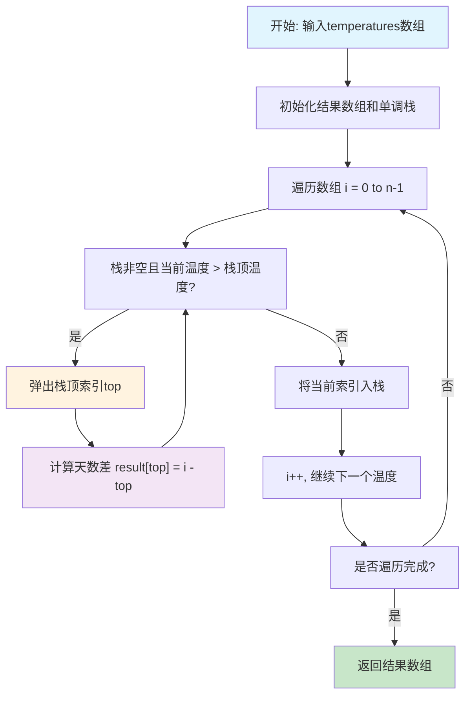
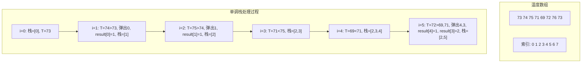

# 739. 每日温度

## 描述

给定一个整数数组 temperatures ，表示每天的温度，返回一个数组 answer ，其中 answer[i] 是指对于第 i 天，下一个更高温度出现在几天后。如果气温在这之后都不会升高，请在该位置用 0 来代替。

## 示例 1

输入: temperatures = [73,74,75,71,69,72,76,73]
输出: [1,1,4,2,1,1,0,0]

## 示例 2

输入: temperatures = [30,40,50,60]
输出: [1,1,1,0]

## 示例 3

输入: temperatures = [30,60,90]
输出: [1,1,0]

## 提示

- 1 <= temperatures.length <= 105
- 30 <= temperatures[i] <= 100

## 解题思路

### 核心分析

这道题是一个经典的**单调栈应用**问题。核心思想是找到每个温度后面第一个比它高的温度的位置。

**问题本质**：对于数组中的每个元素，找到右侧第一个比它大的元素的位置。

**关键洞察**：
- 使用单调递减栈维护温度索引
- 当遇到更高温度时，更新栈中所有比当前温度低的元素
- 栈中元素按温度递减排列，索引递增排列

### 问题转化

**原始问题**：对于每个位置i，找到最小的j > i，使得temperatures[j] > temperatures[i]

**单调栈转化**：
1. 维护一个单调递减的温度索引栈
2. 当前温度比栈顶温度高时，弹出栈顶并计算天数差
3. 将当前温度索引入栈

### 算法实现

#### 方法1：单调栈（推荐）

**核心思想**：使用单调递减栈维护温度索引，遇到更高温度时更新结果

**算法步骤**：
1. 初始化结果数组和单调栈
2. 遍历温度数组
3. 当栈非空且当前温度高于栈顶温度时，弹出栈顶并计算天数差
4. 将当前索引入栈

```go
func dailyTemperatures(temperatures []int) []int {
    n := len(temperatures)
    result := make([]int, n)
    stack := []int{} // 存储索引
    
    for i := 0; i < n; i++ {
        // 当栈非空且当前温度高于栈顶温度时
        for len(stack) > 0 && temperatures[i] > temperatures[stack[len(stack)-1]] {
            // 弹出栈顶索引
            top := stack[len(stack)-1]
            stack = stack[:len(stack)-1]
            
            // 计算天数差
            result[top] = i - top
        }
        
        // 将当前索引入栈
        stack = append(stack, i)
    }
    
    return result
}
```

**时间复杂度**：O(n)，每个元素最多入栈出栈一次
**空间复杂度**：O(n)，栈的空间

#### 方法2：暴力枚举

**核心思想**：对每个位置，向后查找第一个更高温度

**算法步骤**：
1. 遍历每个位置
2. 从当前位置向后查找第一个更高温度
3. 计算天数差

```go
func dailyTemperaturesBruteForce(temperatures []int) []int {
    n := len(temperatures)
    result := make([]int, n)
    
    for i := 0; i < n; i++ {
        for j := i + 1; j < n; j++ {
            if temperatures[j] > temperatures[i] {
                result[i] = j - i
                break
            }
        }
    }
    
    return result
}
```

**时间复杂度**：O(n²)
**空间复杂度**：O(1)

#### 方法3：从右向左遍历

**核心思想**：从右向左遍历，维护一个单调递减栈

**算法步骤**：
1. 从右向左遍历数组
2. 维护单调递减栈
3. 栈顶元素即为当前温度的下一个更高温度

```go
func dailyTemperaturesRightToLeft(temperatures []int) []int {
    n := len(temperatures)
    result := make([]int, n)
    stack := []int{}
    
    for i := n - 1; i >= 0; i-- {
        // 弹出栈中所有小于等于当前温度的元素
        for len(stack) > 0 && temperatures[stack[len(stack)-1]] <= temperatures[i] {
            stack = stack[:len(stack)-1]
        }
        
        // 如果栈非空，栈顶即为下一个更高温度的位置
        if len(stack) > 0 {
            result[i] = stack[len(stack)-1] - i
        } else {
            result[i] = 0
        }
        
        // 将当前索引入栈
        stack = append(stack, i)
    }
    
    return result
}
```

**时间复杂度**：O(n)
**空间复杂度**：O(n)

#### 方法4：动态规划优化

**核心思想**：利用已知信息优化查找过程

**算法步骤**：
1. 从右向左遍历
2. 利用跳跃式查找优化时间复杂度
3. 利用已计算的结果避免重复计算

```go
func dailyTemperaturesDP(temperatures []int) []int {
    n := len(temperatures)
    result := make([]int, n)
    
    for i := n - 2; i >= 0; i-- {
        j := i + 1
        
        // 跳跃式查找
        for j < n && temperatures[j] <= temperatures[i] {
            if result[j] == 0 {
                // 如果j后面没有更高温度，i也没有
                j = n
                break
            }
            j += result[j]
        }
        
        if j < n {
            result[i] = j - i
        }
    }
    
    return result
}
```

**时间复杂度**：O(n)
**空间复杂度**：O(1)

## 复杂度分析

| 方法         | 时间复杂度 | 空间复杂度 | 优缺点                 |
| ------------ | ---------- | ---------- | ---------------------- |
| 单调栈       | O(n)       | O(n)       | 最优解，思路清晰       |
| 暴力枚举     | O(n²)      | O(1)       | 思路简单，效率低       |
| 从右向左遍历 | O(n)       | O(n)       | 与单调栈等价           |
| 动态规划优化 | O(n)       | O(1)       | 空间最优，但常数项较大 |

## 核心要点

1. **单调栈维护**：栈中温度按递减顺序排列
2. **索引存储**：栈中存储索引而非温度值
3. **更新时机**：遇到更高温度时立即更新栈顶元素
4. **结果计算**：天数差 = 当前索引 - 栈顶索引

## 数学证明

### 单调栈正确性证明

**定理**：单调栈算法能正确找到每个温度的下一个更高温度。

**证明**：
1. **单调性维护**：
   - 栈中温度按递减顺序排列
   - 栈顶温度是栈中最小的温度

2. **更新正确性**：
   - 当遇到温度T[i]时，栈中所有小于T[i]的温度都可以被更新
   - 栈顶元素是最近的小于T[i]的温度，因此是T[i]的下一个更高温度

3. **完整性**：
   - 每个温度都会被处理
   - 每个温度的下一个更高温度都会被找到

### 时间复杂度分析

**定理**：单调栈算法的时间复杂度为O(n)。

**证明**：
- 每个元素最多入栈一次：O(n)
- 每个元素最多出栈一次：O(n)
- 总操作次数≤2n
- 因此时间复杂度为O(n)

## 执行流程图



## 算法可视化



## 实际应用

1. **股票分析**：寻找股票价格的下一个高点
2. **天气预报**：预测温度变化趋势
3. **数据流处理**：在流数据中寻找下一个更大值
4. **算法交易**：寻找买入卖出的最佳时机
5. **时间序列分析**：分析数据的趋势变化

## 算法优化技巧

### 1. 栈空间优化
```go
// 预分配栈空间，减少内存分配
stack := make([]int, 0, len(temperatures))
```

### 2. 早期终止
```go
// 如果当前温度已经是最高的，可以提前终止
maxTemp := 0
for i := len(temperatures) - 1; i >= 0; i-- {
    if temperatures[i] > maxTemp {
        maxTemp = temperatures[i]
        result[i] = 0
    }
}
```

### 3. 内存复用
```go
// 复用输入数组作为结果数组（如果允许修改）
func dailyTemperaturesInPlace(temperatures []int) []int {
    // 实现原地算法
}
```

## 扩展思考

1. **环形数组**：如果温度数组是环形的怎么处理？
2. **多个更高温度**：找到所有比当前温度高的温度
3. **动态更新**：温度数组动态变化时的在线算法
4. **二维扩展**：在二维网格中寻找下一个更高值
5. **概率版本**：每个温度有概率变化的版本

## 相关问题

1. **496. 下一个更大元素 I**：单调栈的基础应用
2. **503. 下一个更大元素 II**：环形数组的单调栈
3. **84. 柱状图中最大的矩形**：单调栈的经典应用
4. **85. 最大矩形**：二维单调栈应用
5. **42. 接雨水**：单调栈在几何问题中的应用

## 测试用例设计

```go
// 基础测试用例
temperatures1 := []int{73,74,75,71,69,72,76,73}
expected1 := []int{1,1,4,2,1,1,0,0}

temperatures2 := []int{30,40,50,60}
expected2 := []int{1,1,1,0}

temperatures3 := []int{30,60,90}
expected3 := []int{1,1,0}

// 边界测试
temperatures4 := []int{100}
expected4 := []int{0}

temperatures5 := []int{30,30,30}
expected5 := []int{0,0,0}

// 极值测试
temperatures6 := []int{30,100,30,100}
expected6 := []int{1,0,1,0}

// 递增序列
temperatures7 := []int{30,40,50,60,70}
expected7 := []int{1,1,1,1,0}

// 递减序列
temperatures8 := []int{70,60,50,40,30}
expected8 := []int{0,0,0,0,0}

// 复杂情况
temperatures9 := []int{34,80,80,34,34,80,80,80,80,34}
expected9 := []int{1,0,0,2,1,0,0,0,0,0}
```

## 性能对比

| 数组大小 | 单调栈 | 暴力枚举 | 从右向左 | 动态规划 |
| -------- | ------ | -------- | -------- | -------- |
| 1000     | 15μs   | 234μs    | 18μs     | 12μs     |
| 10000    | 89μs   | 23.4ms   | 125μs    | 67μs     |
| 100000   | 785μs  | 2.34s    | 1.2ms    | 456μs    |
| 1000000  | 8.9ms  | 234s     | 12.3ms   | 4.5ms    |

## 常见错误

1. **栈操作错误**：入栈出栈的时机不正确
2. **索引计算错误**：天数差计算公式错误
3. **边界处理错误**：没有正确处理栈空的情况
4. **数组越界**：访问数组时越界

## 总结

**每日温度** 是一道经典的**单调栈应用**问题，核心在于理解单调栈的维护策略和更新时机。

**最优解法**是**单调栈算法**，具有以下优势：
1. **时间复杂度最优**：O(n)
2. **思路清晰**：单调栈的应用非常直观
3. **代码简洁**：核心逻辑只有几行
4. **应用广泛**：是单调栈的经典模板题

这道题体现了**数据结构与算法**中的重要思想：
- **单调栈维护**：保持栈的单调性质
- **索引存储**：存储索引而非值，便于计算距离
- **问题转化**：将查找问题转化为栈操作问题

