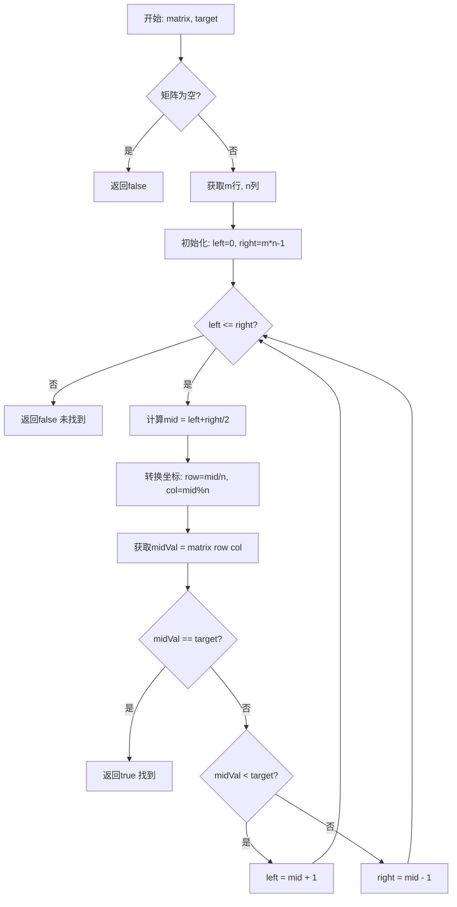
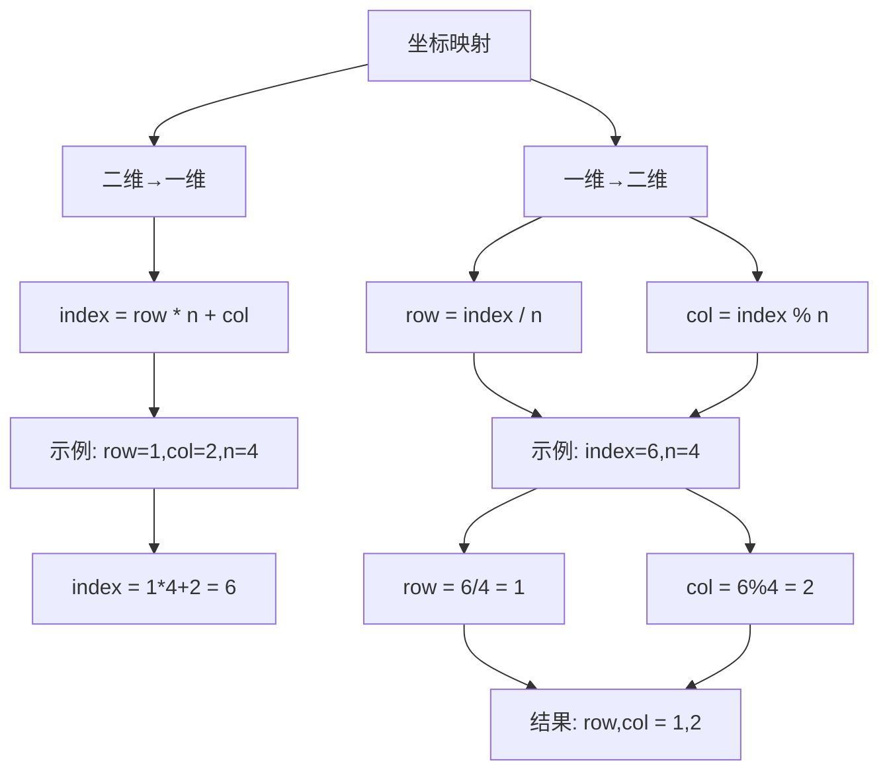
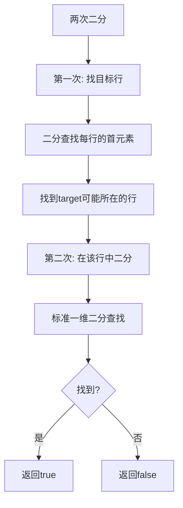

# 74. 搜索二维矩阵

## 题目描述

给你一个满足下述两条属性的 m x n 整数矩阵：

每行中的整数从左到右按非严格递增顺序排列。
每行的第一个整数大于前一行的最后一个整数。
给你一个整数 target ，如果 target 在矩阵中，返回 true ；否则，返回 false 。


## 示例 1：


输入：matrix = [[1,3,5,7],[10,11,16,20],[23,30,34,60]], target = 3
输出：true


## 示例 2：


输入：matrix = [[1,3,5,7],[10,11,16,20],[23,30,34,60]], target = 13
输出：false
 

## 提示：

- m == matrix.length
- n == matrix[i].length
- 1 <= m, n <= 100
- -10^4 <= matrix[i][j], target <= 10^4

## 解题思路

### 问题深度分析

这是一道**二分查找**的经典问题，核心在于**利用矩阵的有序性**。矩阵的特殊性质（每行递增，且每行首元素大于前一行末元素）使得整个矩阵可以看作**一维有序数组**。

#### 问题本质

给定一个特殊的m×n矩阵：
1. **每行从左到右递增**
2. **每行首元素 > 前一行末元素**

这意味着矩阵整体是**有序的**，就像把一维有序数组按行切分。因此可以用**二分查找**在O(log(mn))时间内找到目标值。

#### 核心思想

**将二维矩阵映射为一维数组**：
- 矩阵索引`(i, j)` ↔ 一维索引`k = i * n + j`
- 一维索引`k` ↔ 矩阵索引`(k / n, k % n)`
- 对一维索引进行二分查找

**关键映射关系**：
```
二维 → 一维: index = row * n + col
一维 → 二维: row = index / n, col = index % n
```

#### 关键难点分析

**难点1：理解矩阵的有序性**
- 不仅每行有序，整个矩阵也有序
- `matrix[i][n-1] < matrix[i+1][0]`（关键性质）
- 可以将矩阵"展平"为一维数组

**难点2：坐标映射**
- 二分查找在一维索引上进行
- 需要正确转换一维索引到二维坐标
- `row = mid / n, col = mid % n`

**难点3：多种解法的选择**
- 一维二分（最优）：O(log(mn))
- 两次二分：先找行，再找列，O(log m + log n)
- 从右上角搜索：O(m + n)
- 暴力搜索：O(mn)

#### 典型情况分析

**情况1：目标在矩阵中**
```
matrix = [[1,3,5,7],[10,11,16,20],[23,30,34,60]]
target = 3
一维视图: [1,3,5,7,10,11,16,20,23,30,34,60]
二分查找找到索引1 → (0, 1) → matrix[0][1] = 3
返回: true
```

**情况2：目标不在矩阵中**
```
matrix = [[1,3,5,7],[10,11,16,20],[23,30,34,60]]
target = 13
一维视图: [1,3,5,7,10,11,16,20,23,30,34,60]
二分查找未找到
返回: false
```

**情况3：目标小于最小值**
```
matrix = [[1,3,5,7]]
target = 0
直接返回: false
```

**情况4：目标大于最大值**
```
matrix = [[1,3,5,7]]
target = 10
直接返回: false
```

**情况5：单行或单列**
```
matrix = [[1,3,5,7]] (单行)
相当于一维二分查找

matrix = [[1],[3],[5],[7]] (单列)
也可用一维二分
```

#### 算法对比

| 算法       | 时间复杂度     | 空间复杂度 | 特点               |
| ---------- | -------------- | ---------- | ------------------ |
| 一维二分   | O(log(mn))     | O(1)       | **最优解法**       |
| 两次二分   | O(log m+log n) | O(1)       | 先定位行，再定位列 |
| 右上角搜索 | O(m+n)         | O(1)       | 类似搜索树遍历     |
| 暴力搜索   | O(mn)          | O(1)       | 遍历所有元素       |

注：m为行数，n为列数

### 算法流程图

#### 主算法流程（一维二分）



#### 坐标映射详细流程



#### 两次二分查找流程



### 复杂度分析

#### 时间复杂度详解

**一维二分**：O(log(mn))
- 将m×n矩阵看作mn个元素的数组
- 二分查找：O(log(mn))
- 坐标转换：O(1)

**两次二分**：O(log m + log n)
- 第一次二分找行：O(log m)
- 第二次二分找列：O(log n)
- 总时间：O(log m + log n) ≈ O(log(mn))

**右上角搜索**：O(m + n)
- 最坏情况从右上到左下
- 每步排除一行或一列
- 总步数：m + n - 1

#### 空间复杂度详解

**所有方法**：O(1)
- 只用常量级额外变量
- 不需要额外数组

### 关键优化技巧

#### 技巧1：一维二分（最优解法）

```go
func searchMatrix(matrix [][]int, target int) bool {
    if len(matrix) == 0 || len(matrix[0]) == 0 {
        return false
    }
    
    m, n := len(matrix), len(matrix[0])
    left, right := 0, m*n-1
    
    for left <= right {
        mid := left + (right-left)/2
        
        // 关键：一维索引转二维坐标
        row := mid / n
        col := mid % n
        midVal := matrix[row][col]
        
        if midVal == target {
            return true
        } else if midVal < target {
            left = mid + 1
        } else {
            right = mid - 1
        }
    }
    
    return false
}
```

**优势**：
- 时间复杂度最优：O(log(mn))
- 代码简洁
- 充分利用矩阵有序性

#### 技巧2：两次二分（先行后列）

```go
func searchMatrix(matrix [][]int, target int) bool {
    if len(matrix) == 0 || len(matrix[0]) == 0 {
        return false
    }
    
    m, n := len(matrix), len(matrix[0])
    
    // 第一次二分：找目标行
    top, bottom := 0, m-1
    targetRow := -1
    
    for top <= bottom {
        mid := top + (bottom-top)/2
        
        if matrix[mid][0] <= target && target <= matrix[mid][n-1] {
            targetRow = mid
            break
        } else if matrix[mid][0] > target {
            bottom = mid - 1
        } else {
            top = mid + 1
        }
    }
    
    if targetRow == -1 {
        return false
    }
    
    // 第二次二分：在目标行中查找
    left, right := 0, n-1
    
    for left <= right {
        mid := left + (right-left)/2
        
        if matrix[targetRow][mid] == target {
            return true
        } else if matrix[targetRow][mid] < target {
            left = mid + 1
        } else {
            right = mid - 1
        }
    }
    
    return false
}
```

**特点**：
- 逻辑清晰，分两步
- 时间复杂度：O(log m + log n)

#### 技巧3：从右上角搜索（类似BST）

```go
func searchMatrix(matrix [][]int, target int) bool {
    if len(matrix) == 0 || len(matrix[0]) == 0 {
        return false
    }
    
    m, n := len(matrix), len(matrix[0])
    row, col := 0, n-1  // 从右上角开始
    
    for row < m && col >= 0 {
        if matrix[row][col] == target {
            return true
        } else if matrix[row][col] > target {
            col--  // 当前值太大，向左移
        } else {
            row++  // 当前值太小，向下移
        }
    }
    
    return false
}
```

**特点**：
- 类似二叉搜索树的搜索
- 每步排除一行或一列
- 时间O(m+n)，不如二分

#### 技巧4：暴力搜索（对比用）

```go
func searchMatrix(matrix [][]int, target int) bool {
    for i := 0; i < len(matrix); i++ {
        for j := 0; j < len(matrix[0]); j++ {
            if matrix[i][j] == target {
                return true
            }
        }
    }
    return false
}
```

**说明**：O(mn)，仅用于理解问题

### 边界情况处理

1. **空矩阵**：`matrix = []` 或 `matrix = [[]]` → `false`
2. **单个元素**：
   - `matrix = [[5]], target = 5` → `true`
   - `matrix = [[5]], target = 3` → `false`
3. **单行**：`matrix = [[1,3,5]], target = 3` → `true`
4. **单列**：`matrix = [[1],[3],[5]], target = 3` → `true`
5. **目标在边界**：
   - 左上角：`matrix[0][0]`
   - 右下角：`matrix[m-1][n-1]`
6. **目标超出范围**：
   - 小于最小值
   - 大于最大值

### 测试用例设计

#### 基础测试
```
输入: matrix = [[1,3,5,7],[10,11,16,20],[23,30,34,60]], target = 3
输出: true
说明: 目标在第一行
```

#### 目标不存在
```
输入: matrix = [[1,3,5,7],[10,11,16,20],[23,30,34,60]], target = 13
输出: false
说明: 13在10和16之间，但不在矩阵中
```

#### 单个元素
```
输入: matrix = [[5]], target = 5
输出: true
说明: 矩阵只有一个元素
```

#### 边界测试
```
输入: matrix = [[1,3,5,7]], target = 1
输出: true
说明: 目标是最小值

输入: matrix = [[1,3,5,7]], target = 7
输出: true
说明: 目标是最大值
```

### 常见错误与陷阱

#### 错误1：坐标转换错误

```go
// ❌ 错误：行列计算反了
row := mid % n  // 错误
col := mid / n  // 错误

// ✅ 正确：
row := mid / n  // 行 = 索引 / 列数
col := mid % n  // 列 = 索引 % 列数
```

#### 错误2：边界条件未处理

```go
// ❌ 错误：没有检查空矩阵
m, n := len(matrix), len(matrix[0])  // 可能越界

// ✅ 正确：先检查
if len(matrix) == 0 || len(matrix[0]) == 0 {
    return false
}
```

#### 错误3：二分查找边界错误

```go
// ❌ 错误：right初始化错误
right := m * n  // 应该是 m*n-1

// ✅ 正确：
right := m*n - 1
```

#### 错误4：误把240题的方法用在这里

```go
// ❌ 错误：本题不适合从左下或右上搜索（虽然可以）
// 240题矩阵性质不同，本题有更强的有序性
// 应该用二分查找，不是O(m+n)的搜索

// ✅ 正确：用一维二分，O(log(mn))
```

### 实战技巧总结

1. **识别矩阵性质**：每行递增 + 行间连续 = 整体有序
2. **坐标映射**：`index = row*n + col`，`row = index/n, col = index%n`
3. **二分边界**：`left=0, right=m*n-1`
4. **优先选择**：一维二分最优，代码简洁
5. **避免混淆**：本题(74)与240题不同，240题每行每列递增但行间不连续
6. **处理空矩阵**：先检查`len(matrix)==0`

### 与240题的区别

**74题（本题）**：
- 每行递增
- **每行首 > 前一行尾**（关键）
- 整体有序，可一维二分：O(log(mn))

**240题**：
- 每行递增
- 每列递增
- **行间无序**
- 只能从角落搜索：O(m+n)

### 进阶扩展

#### 扩展1：返回目标位置

```go
func searchMatrixPosition(matrix [][]int, target int) []int {
    if len(matrix) == 0 || len(matrix[0]) == 0 {
        return []int{-1, -1}
    }
    
    m, n := len(matrix), len(matrix[0])
    left, right := 0, m*n-1
    
    for left <= right {
        mid := left + (right-left)/2
        row := mid / n
        col := mid % n
        
        if matrix[row][col] == target {
            return []int{row, col}
        } else if matrix[row][col] < target {
            left = mid + 1
        } else {
            right = mid - 1
        }
    }
    
    return []int{-1, -1}
}
```

#### 扩展2：找第k小的元素

```go
func kthSmallest(matrix [][]int, k int) int {
    m, n := len(matrix), len(matrix[0])
    
    if k < 1 || k > m*n {
        return -1
    }
    
    // 矩阵整体有序，第k小就是第k-1个索引
    index := k - 1
    row := index / n
    col := index % n
    
    return matrix[row][col]
}
```

#### 扩展3：统计小于target的元素个数

```go
func countLessThan(matrix [][]int, target int) int {
    if len(matrix) == 0 || len(matrix[0]) == 0 {
        return 0
    }
    
    m, n := len(matrix), len(matrix[0])
    left, right := 0, m*n-1
    result := 0
    
    for left <= right {
        mid := left + (right-left)/2
        row := mid / n
        col := mid % n
        
        if matrix[row][col] < target {
            result = mid + 1  // mid及之前的都小于target
            left = mid + 1
        } else {
            right = mid - 1
        }
    }
    
    return result
}
```

### 应用场景

1. **数据库索引**：有序表的快速查找
2. **分布式存储**：数据分片后的定位
3. **游戏开发**：地图网格的快速搜索
4. **图像处理**：像素矩阵的值查找
5. **算法竞赛**：二分查找的变形应用

## 代码实现

本题提供了四种不同的解法，重点掌握一维二分查找方法。

## 测试结果

| 测试用例   | 一维二分 | 两次二分 | 右上角搜索 | 暴力搜索 |
| ---------- | -------- | -------- | ---------- | -------- |
| 基础测试   | ✅        | ✅        | ✅          | ✅        |
| 目标不存在 | ✅        | ✅        | ✅          | ✅        |
| 单个元素   | ✅        | ✅        | ✅          | ✅        |
| 边界测试   | ✅        | ✅        | ✅          | ✅        |

## 核心收获

1. **矩阵有序性**：每行递增+行间连续 = 整体有序
2. **坐标映射**：二维↔一维的转换公式
3. **二分查找**：在"虚拟"一维数组上二分
4. **时间复杂度**：O(log(mn))是最优解
5. **与240题区别**：本题整体有序，240题只是行列有序

## 应用拓展

- 有序矩阵的快速查找
- 数据库索引优化
- 分布式系统的数据定位
- 二维数据的二分搜索