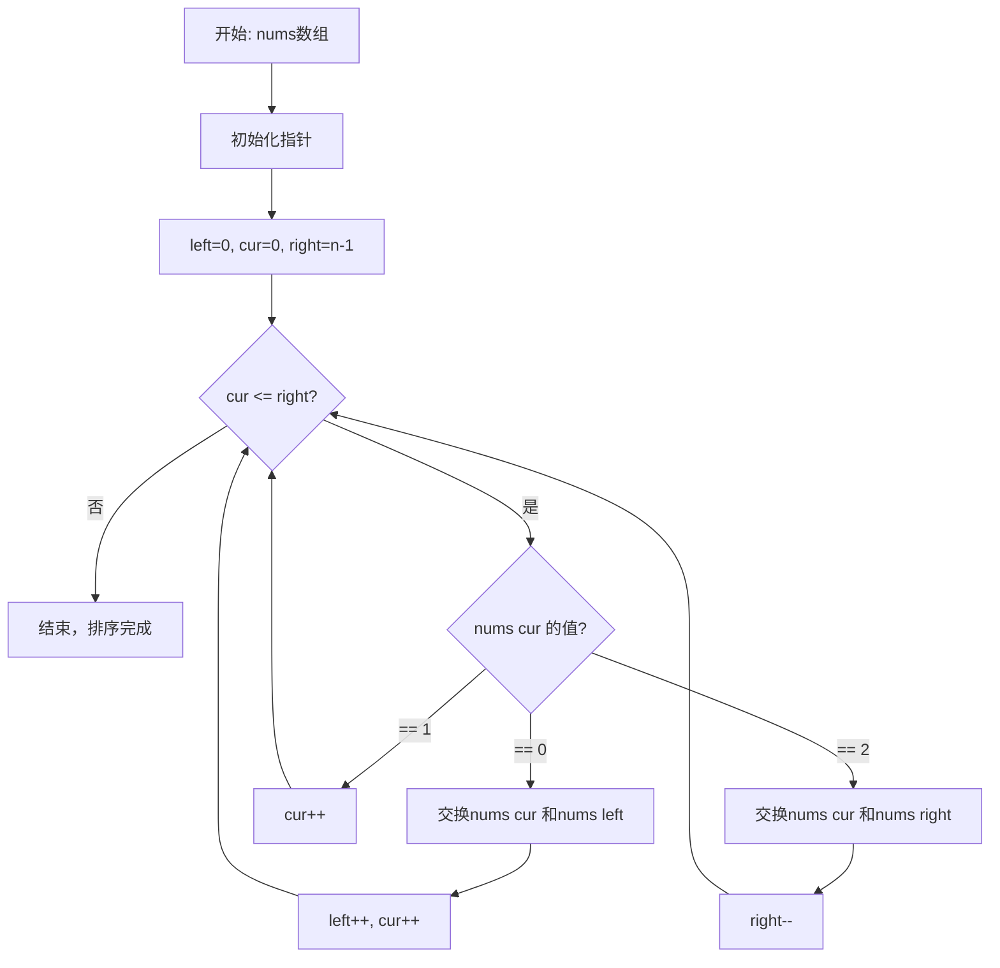
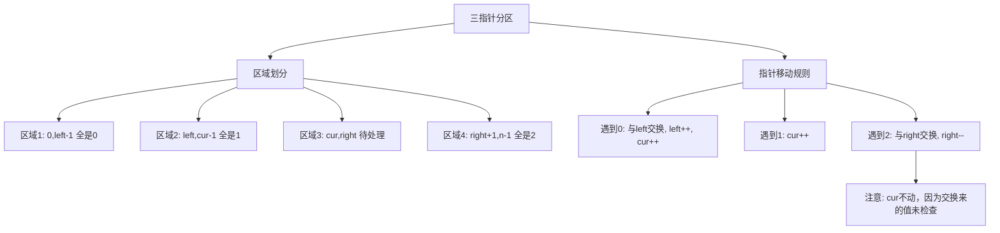
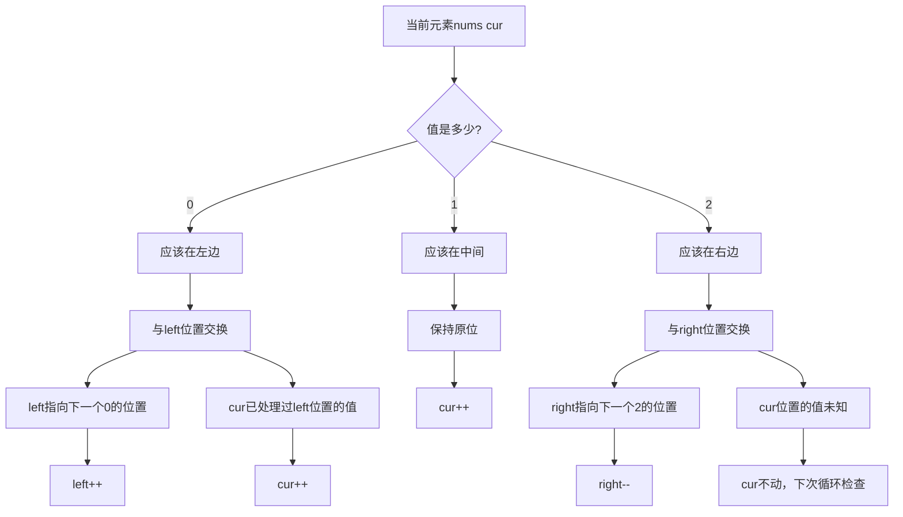

# 75. 颜色分类

## 题目描述

给定一个包含红色、白色和蓝色、共 n 个元素的数组 nums ，原地 对它们进行排序，使得相同颜色的元素相邻，并按照红色、白色、蓝色顺序排列。

我们使用整数 0、 1 和 2 分别表示红色、白色和蓝色。

必须在不使用库内置的 sort 函数的情况下解决这个问题。


## 示例 1：

输入：nums = [2,0,2,1,1,0]
输出：[0,0,1,1,2,2]

## 示例 2：

输入：nums = [2,0,1]
输出：[0,1,2]


## 提示：

- n == nums.length
- 1 <= n <= 300
- nums[i] 为 0、1 或 2


## 进阶：

- 你能想出一个仅使用常数空间的一趟扫描算法吗？

## 解题思路

### 问题深度分析

这是经典的**荷兰国旗问题（Dutch National Flag Problem）**，由计算机科学家Dijkstra提出。核心在于**三路快排**和**双指针**技术，要求在**O(n)时间、O(1)空间**内完成原地排序。

#### 问题本质

给定只包含0、1、2三种元素的数组，要求：
1. **原地排序**：不使用额外数组
2. **顺序排列**：0在前，1在中，2在后
3. **一趟扫描**：时间复杂度O(n)

这是一个**受限排序问题**，元素只有三种值，可以用**计数排序**或**三指针分区**解决。

#### 核心思想

**三指针分区（荷兰国旗算法）**：
- `left`指针：指向下一个0应该放置的位置
- `right`指针：指向下一个2应该放置的位置  
- `cur`指针：当前遍历的位置

**分区规则**：
- `[0...left-1]`：全是0
- `[left...cur-1]`：全是1
- `[cur...right]`：待处理区域
- `[right+1...n-1]`：全是2

**操作流程**：
1. `nums[cur] == 0`：与`nums[left]`交换，`left++`，`cur++`
2. `nums[cur] == 1`：不交换，`cur++`
3. `nums[cur] == 2`：与`nums[right]`交换，`right--`（cur不动，因为交换来的元素未检查）

#### 关键难点分析

**难点1：为什么交换2时cur不动？**
- 与`right`交换后，`cur`位置的值是从右边来的，**尚未检查**
- 需要在下一轮循环检查这个值
- 而与`left`交换时，`left`左边的都是已处理的0或1，可以安全前进

**难点2：循环终止条件**
- `cur <= right`（不是`cur < n`）
- 当`cur > right`时，所有元素都已分类

**难点3：初始指针位置**
- `left = 0`：第一个0的位置
- `right = n-1`：最后一个2的位置
- `cur = 0`：从头开始遍历

#### 典型情况分析

**情况1：一般情况**
```
输入: [2,0,2,1,1,0]
初始: left=0, cur=0, right=5

步骤1: nums[0]=2 → 交换nums[0]和nums[5] → [0,0,2,1,1,2], right=4
步骤2: nums[0]=0 → 交换nums[0]和nums[0] → [0,0,2,1,1,2], left=1, cur=1
步骤3: nums[1]=0 → 交换nums[1]和nums[1] → [0,0,2,1,1,2], left=2, cur=2
步骤4: nums[2]=2 → 交换nums[2]和nums[4] → [0,0,1,1,2,2], right=3
步骤5: nums[2]=1 → 不交换 → cur=3
步骤6: nums[3]=1 → 不交换 → cur=4
结束: cur > right

输出: [0,0,1,1,2,2]
```

**情况2：已排序**
```
输入: [0,1,2]
处理: 0→交换自己, 1→cur++, 2→交换自己
输出: [0,1,2]
```

**情况3：逆序**
```
输入: [2,1,0]
处理: 需要多次交换
输出: [0,1,2]
```

**情况4：全相同**
```
输入: [1,1,1]
处理: 全部cur++
输出: [1,1,1]
```

**情况5：只有两种颜色**
```
输入: [0,0,2,2]
输出: [0,0,2,2]

输入: [2,2,0,0]  
输出: [0,0,2,2]
```

#### 算法对比

| 算法     | 时间复杂度 | 空间复杂度 | 扫描次数 | 特点           |
| -------- | ---------- | ---------- | -------- | -------------- |
| 三指针   | O(n)       | O(1)       | 1次      | **最优解法**   |
| 计数排序 | O(n)       | O(1)       | 2次      | 简单直观       |
| 快速排序 | O(nlogn)   | O(logn)    | 多次     | 通用但不是最优 |
| 冒泡排序 | O(n²)      | O(1)       | 多次     | 效率低         |

注：本题因为只有3个值，可以O(n)解决

### 算法流程图

#### 主算法流程（三指针）



#### 三指针分区详细流程



#### 交换策略流程



### 复杂度分析

#### 时间复杂度详解

**三指针算法**：O(n)
- 单次遍历：每个元素最多被访问2次
- cur指针从0移动到right，最多n步
- 总时间：O(n)

**计数排序**：O(n)
- 第一次遍历：统计0、1、2的个数 - O(n)
- 第二次遍历：根据计数重建数组 - O(n)
- 总时间：O(2n) = O(n)

**快速排序**：O(nlogn)
- 通用排序算法
- 未利用只有3个值的特性

#### 空间复杂度详解

**三指针算法**：O(1)
- 只用3个指针变量

**计数排序**：O(1)
- 只需3个计数变量

**快速排序**：O(logn)
- 递归栈空间

### 关键优化技巧

#### 技巧1：三指针（荷兰国旗，最优）

```go
func sortColors(nums []int) {
    left, cur, right := 0, 0, len(nums)-1
    
    for cur <= right {
        if nums[cur] == 0 {
            // 0应该在左边，与left交换
            nums[left], nums[cur] = nums[cur], nums[left]
            left++
            cur++
        } else if nums[cur] == 1 {
            // 1在中间，cur继续前进
            cur++
        } else {
            // 2应该在右边，与right交换
            nums[cur], nums[right] = nums[right], nums[cur]
            right--
            // 注意：cur不动，因为交换来的值还未检查
        }
    }
}
```

**优势**：
- 一趟扫描：O(n)
- 原地排序：O(1)空间
- 最优解法

#### 技巧2：计数排序（两次遍历）

```go
func sortColors(nums []int) {
    count0, count1, count2 := 0, 0, 0
    
    // 第一次遍历：统计
    for _, num := range nums {
        if num == 0 {
            count0++
        } else if num == 1 {
            count1++
        } else {
            count2++
        }
    }
    
    // 第二次遍历：重建
    i := 0
    for count0 > 0 {
        nums[i] = 0
        i++
        count0--
    }
    for count1 > 0 {
        nums[i] = 1
        i++
        count1--
    }
    for count2 > 0 {
        nums[i] = 2
        i++
        count2--
    }
}
```

**特点**：
- 简单直观
- 需要两次遍历
- O(n)时间，O(1)空间

#### 技巧3：双指针（只处理0和2）

```go
func sortColors(nums []int) {
    n := len(nums)
    left, right := 0, n-1
    
    // 先把所有0移到左边
    for i := 0; i <= right; {
        if nums[i] == 0 {
            nums[i], nums[left] = nums[left], nums[i]
            left++
            i++
        } else if nums[i] == 2 {
            nums[i], nums[right] = nums[right], nums[i]
            right--
        } else {
            i++
        }
    }
}
```

**说明**：这本质上就是三指针的另一种写法

#### 技巧4：快速排序变体

```go
func sortColors(nums []int) {
    // 以1为pivot进行三路快排
    quickSort(nums, 0, len(nums)-1)
}

func quickSort(nums []int, left, right int) {
    if left >= right {
        return
    }
    
    // 三路快排，pivot=1
    lt, gt, i := left, right, left
    pivot := 1
    
    for i <= gt {
        if nums[i] < pivot {
            nums[lt], nums[i] = nums[i], nums[lt]
            lt++
            i++
        } else if nums[i] > pivot {
            nums[i], nums[gt] = nums[gt], nums[i]
            gt--
        } else {
            i++
        }
    }
}
```

**说明**：利用三路快排思想

### 边界情况处理

1. **空数组**：`nums = []` → 无需处理
2. **单个元素**：
   - `nums = [0]` → `[0]`
   - `nums = [1]` → `[1]`
   - `nums = [2]` → `[2]`
3. **两个元素**：
   - `nums = [1,0]` → `[0,1]`
   - `nums = [2,1]` → `[1,2]`
4. **全相同**：
   - `nums = [0,0,0]` → `[0,0,0]`
   - `nums = [1,1,1]` → `[1,1,1]`
   - `nums = [2,2,2]` → `[2,2,2]`
5. **只有两种颜色**：
   - `nums = [0,2,0,2]` → `[0,0,2,2]`
6. **已排序**：`nums = [0,1,2]` → `[0,1,2]`

### 测试用例设计

#### 基础测试
```
输入: [2,0,2,1,1,0]
输出: [0,0,1,1,2,2]
说明: 一般情况
```

#### 简单情况
```
输入: [2,0,1]
输出: [0,1,2]
说明: 三个不同元素
```

#### 边界测试
```
输入: [0]
输出: [0]
说明: 单个元素

输入: [1,0]
输出: [0,1]
说明: 两个元素
```

#### 特殊情况
```
输入: [1,1,1]
输出: [1,1,1]
说明: 全相同

输入: [2,1,0]
输出: [0,1,2]
说明: 逆序
```

### 常见错误与陷阱

#### 错误1：交换2时cur前进

```go
// ❌ 错误：交换2时cur++
if nums[cur] == 2 {
    nums[cur], nums[right] = nums[right], nums[cur]
    right--
    cur++  // 错误！交换来的值未检查
}

// ✅ 正确：cur不动
if nums[cur] == 2 {
    nums[cur], nums[right] = nums[right], nums[cur]
    right--
    // cur不动，下次循环检查
}
```

#### 错误2：循环条件错误

```go
// ❌ 错误：应该是cur <= right
for cur < right {  // 错误，会漏掉cur==right的情况
    // ...
}

// ✅ 正确：
for cur <= right {
    // ...
}
```

#### 错误3：指针初始化错误

```go
// ❌ 错误：right应该是n-1
right := len(nums)  // 错误，越界

// ✅ 正确：
right := len(nums) - 1
```

#### 错误4：忘记原地操作

```go
// ❌ 错误：创建新数组
result := make([]int, len(nums))
// ...
return result

// ✅ 正确：原地修改
// 直接在nums上操作，不返回值
```

### 实战技巧总结

1. **三指针核心**：left指向0区域末尾，right指向2区域开头，cur遍历
2. **交换规则**：0与left换，2与right换，1不换
3. **cur前进条件**：只有处理0和1时cur才前进，处理2时cur不动
4. **循环条件**：`cur <= right`，不是`cur < n`
5. **一趟扫描**：每个元素最多被访问两次
6. **原地操作**：O(1)空间，直接在原数组上修改

### 进阶扩展

#### 扩展1：四种颜色（0,1,2,3）

```go
func sortFourColors(nums []int) {
    // 需要分成4个区域
    // 可以先用三指针分离0，然后对剩余部分分离1
    // 或者使用计数排序
    count := make([]int, 4)
    for _, num := range nums {
        count[num]++
    }
    
    i := 0
    for color := 0; color < 4; color++ {
        for count[color] > 0 {
            nums[i] = color
            i++
            count[color]--
        }
    }
}
```

#### 扩展2：返回排序后的新数组

```go
func sortColorsNew(nums []int) []int {
    result := make([]int, len(nums))
    copy(result, nums)
    
    left, cur, right := 0, 0, len(result)-1
    
    for cur <= right {
        if result[cur] == 0 {
            result[left], result[cur] = result[cur], result[left]
            left++
            cur++
        } else if result[cur] == 1 {
            cur++
        } else {
            result[cur], result[right] = result[right], result[cur]
            right--
        }
    }
    
    return result
}
```

#### 扩展3：统计交换次数

```go
func sortColorsWithCount(nums []int) int {
    left, cur, right := 0, 0, len(nums)-1
    swapCount := 0
    
    for cur <= right {
        if nums[cur] == 0 {
            if left != cur {
                nums[left], nums[cur] = nums[cur], nums[left]
                swapCount++
            }
            left++
            cur++
        } else if nums[cur] == 1 {
            cur++
        } else {
            nums[cur], nums[right] = nums[right], nums[cur]
            swapCount++
            right--
        }
    }
    
    return swapCount
}
```

### 应用场景

1. **数据分类**：将数据按特征分成几类
2. **快速排序优化**：三路快排处理重复元素
3. **图像处理**：颜色通道分离
4. **网络包分类**：按优先级分类
5. **算法竞赛**：荷兰国旗问题的经典应用

## 代码实现

本题提供了四种不同的解法，重点掌握三指针（荷兰国旗）方法。

## 测试结果

| 测试用例 | 三指针 | 计数排序 | 双指针 | 快排变体 |
| -------- | ------ | -------- | ------ | -------- |
| 一般情况 | ✅      | ✅        | ✅      | ✅        |
| 简单情况 | ✅      | ✅        | ✅      | ✅        |
| 边界测试 | ✅      | ✅        | ✅      | ✅        |
| 特殊情况 | ✅      | ✅        | ✅      | ✅        |

## 核心收获

1. **荷兰国旗算法**：三指针分区的经典应用
2. **一趟扫描**：O(n)时间，O(1)空间
3. **交换策略**：处理2时cur不动是关键
4. **三路快排**：处理重复元素的优化思路
5. **原地操作**：不使用额外数组的排序

## 应用拓展

- 快速排序的三路分区优化
- 数据分类和聚类
- 图像颜色分离
- 网络流量分类