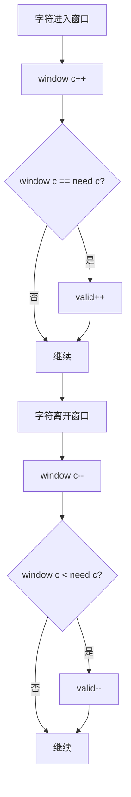

# 76. 最小覆盖子串

## 题目描述

给你一个字符串 s 、一个字符串 t 。返回 s 中涵盖 t 所有字符的最小子串。如果 s 中不存在涵盖 t 所有字符的子串，则返回空字符串 "" 。


## 注意：

对于 t 中重复字符，我们寻找的子字符串中该字符数量必须不少于 t 中该字符数量。
如果 s 中存在这样的子串，我们保证它是唯一的答案。


## 示例 1：

输入：s = "ADOBECODEBANC", t = "ABC"
输出："BANC"
解释：最小覆盖子串 "BANC" 包含来自字符串 t 的 'A'、'B' 和 'C'。


## 示例 2：

输入：s = "a", t = "a"
输出："a"
解释：整个字符串 s 是最小覆盖子串。


## 示例 3:

输入: s = "a", t = "aa"
输出: ""
解释: t 中两个字符 'a' 均应包含在 s 的子串中，
因此没有符合条件的子字符串，返回空字符串。


## 提示：

- m == s.length
- n == t.length
- 1 <= m, n <= 105
- s 和 t 由英文字母组成


## 进阶：你能设计一个在 o(m+n) 时间内解决此问题的算法吗？


## 解题思路

### 问题深度分析

这是经典的**滑动窗口**问题，也是**双指针**技术的典型应用。核心在于**动态维护窗口状态**，在O(m+n)时间内找到最小覆盖子串。

#### 问题本质

给定字符串s和t，在s中找到**最短的子串**，使得该子串包含t中的所有字符（包括重复字符）。这是一个**最优化问题**，需要找到满足条件的最短子串。

#### 核心思想

**滑动窗口 + 哈希表**：
1. **扩展窗口**：右指针移动，包含更多字符
2. **收缩窗口**：左指针移动，尝试缩小窗口
3. **状态维护**：用哈希表记录窗口内字符的计数
4. **条件判断**：检查窗口是否包含t的所有字符

**关键技巧**：
- 用`need`记录t中每个字符的需求量
- 用`window`记录当前窗口内每个字符的数量
- 用`valid`记录窗口中满足需求的字符种类数
- 当`valid == len(need)`时，窗口包含t的所有字符

#### 关键难点分析

**难点1：重复字符的处理**
- t中可能有重复字符，如"aab"需要2个'a'和1个'b'
- 窗口中的字符数量必须**不少于**t中的数量
- 需要精确计数，不能简单用set

**难点2：窗口收缩的时机**
- 当窗口包含t的所有字符时，尝试收缩
- 收缩时要检查是否仍然满足条件
- 需要找到最短的有效窗口

**难点3：状态维护的复杂性**
- 需要同时维护need、window、valid三个状态
- 字符进入窗口时更新window和valid
- 字符离开窗口时也要更新状态

#### 典型情况分析

**情况1：一般情况**
```
s = "ADOBECODEBANC", t = "ABC"
need = {A:1, B:1, C:1}
过程：
1. 扩展窗口到"ADOBEC" → 包含A,B,C → 收缩
2. 收缩到"DOBEC" → 不包含A → 继续扩展
3. 扩展到"DOBECODEBA" → 包含A,B,C → 收缩
4. 收缩到"CODEBA" → 包含A,B,C → 收缩
5. 收缩到"DEBA" → 不包含C → 继续扩展
6. 扩展到"DEBANC" → 包含A,B,C → 收缩
7. 收缩到"BANC" → 包含A,B,C → 最短窗口
结果: "BANC"
```

**情况2：s等于t**
```
s = "a", t = "a"
直接返回"a"
```

**情况3：无解情况**
```
s = "a", t = "aa"
s中只有1个'a'，但t需要2个'a'
返回""
```

**情况4：t有重复字符**
```
s = "aab", t = "aab"
需要精确匹配字符数量
```

#### 算法对比

| 算法     | 时间复杂度 | 空间复杂度 | 特点         |
| -------- | ---------- | ---------- | ------------ |
| 滑动窗口 | O(m+n)     | O(m+n)     | **最优解法** |
| 暴力枚举 | O(m²n)     | O(m+n)     | 会超时       |
| 二分查找 | O(m log m) | O(m+n)     | 复杂且不直观 |
| 动态规划 | O(mn)      | O(mn)      | 过度复杂     |

注：m为s长度，n为t长度

### 算法流程图

#### 主算法流程（滑动窗口）

```mermaid
graph TD
    A[开始: s, t] --> B[统计t中字符需求need]
    B --> C[初始化窗口: left=0, right=0]
    C --> D[初始化: window={}, valid=0]
    D --> E[扩展窗口: right++]
    E --> F[更新window和valid]
    F --> G{valid == len need?}
    G -->|否| H{right < len s?}
    H -->|是| E
    H -->|否| I[返回空字符串]
    G -->|是| J[尝试收缩窗口]
    J --> K[left++]
    K --> L[更新window和valid]
    L --> M{仍满足条件?}
    M -->|是| N[更新最小窗口]
    M -->|否| O[恢复left]
    N --> P{right < len s?}
    O --> P
    P -->|是| E
    P -->|否| Q[返回最小窗口]
```

#### 窗口状态维护流程



### 复杂度分析

#### 时间复杂度详解

**滑动窗口**：O(m+n)
- 统计t中字符：O(n)
- 双指针遍历：每个字符最多被访问2次（进入和离开）
- 总时间：O(m+n)

**暴力枚举**：O(m²n)
- 枚举所有子串：O(m²)
- 检查每个子串：O(n)
- 总时间：O(m²n)

#### 空间复杂度详解

**滑动窗口**：O(m+n)
- need哈希表：O(n)
- window哈希表：O(m)
- 总空间：O(m+n)

### 关键优化技巧

#### 技巧1：滑动窗口（最优解法）

```go
func minWindow(s string, t string) string {
    need := make(map[byte]int)
    window := make(map[byte]int)
    
    // 统计t中字符需求
    for i := 0; i < len(t); i++ {
        need[t[i]]++
    }
    
    left, right := 0, 0
    valid := 0  // 窗口中满足需求的字符种类数
    start, length := 0, math.MaxInt32
    
    for right < len(s) {
        // 扩展窗口
        c := s[right]
        right++
        
        if need[c] > 0 {
            window[c]++
            if window[c] == need[c] {
                valid++
            }
        }
        
        // 收缩窗口
        for valid == len(need) {
            // 更新最小窗口
            if right-left < length {
                start = left
                length = right - left
            }
            
            d := s[left]
            left++
            
            if need[d] > 0 {
                if window[d] == need[d] {
                    valid--
                }
                window[d]--
            }
        }
    }
    
    if length == math.MaxInt32 {
        return ""
    }
    return s[start : start+length]
}
```

**优势**：
- 时间复杂度：O(m+n)
- 空间复杂度：O(m+n)
- 一次遍历解决问题

#### 技巧2：优化版滑动窗口

```go
func minWindow(s string, t string) string {
    if len(s) < len(t) {
        return ""
    }
    
    need := make(map[byte]int)
    for i := 0; i < len(t); i++ {
        need[t[i]]++
    }
    
    left, right := 0, 0
    valid := 0
    start, minLen := 0, len(s)+1
    
    for right < len(s) {
        // 扩展窗口
        c := s[right]
        right++
        
        if need[c] > 0 {
            need[c]--
            if need[c] == 0 {
                valid++
            }
        }
        
        // 收缩窗口
        for valid == len(need) {
            if right-left < minLen {
                start = left
                minLen = right - left
            }
            
            d := s[left]
            left++
            
            if need[d] == 0 {
                valid--
            }
            need[d]++
        }
    }
    
    if minLen == len(s)+1 {
        return ""
    }
    return s[start : start+minLen]
}
```

**特点**：复用need数组，节省空间

#### 技巧3：双指针 + 数组（ASCII优化）

```go
func minWindow(s string, t string) string {
    if len(s) < len(t) {
        return ""
    }
    
    // 使用数组代替map，适用于ASCII字符
    need := make([]int, 128)
    window := make([]int, 128)
    
    for i := 0; i < len(t); i++ {
        need[t[i]]++
    }
    
    left, right := 0, 0
    valid := 0
    start, minLen := 0, len(s)+1
    
    for right < len(s) {
        c := s[right]
        right++
        
        if need[c] > 0 {
            window[c]++
            if window[c] == need[c] {
                valid++
            }
        }
        
        for valid == len(need) {
            if right-left < minLen {
                start = left
                minLen = right - left
            }
            
            d := s[left]
            left++
            
            if need[d] > 0 {
                if window[d] == need[d] {
                    valid--
                }
                window[d]--
            }
        }
    }
    
    if minLen == len(s)+1 {
        return ""
    }
    return s[start : start+minLen]
}
```

**特点**：使用数组，性能更好

#### 技巧4：暴力枚举（对比用）

```go
func minWindow(s string, t string) string {
    minLen := len(s) + 1
    result := ""
    
    for i := 0; i < len(s); i++ {
        for j := i; j < len(s); j++ {
            if isValid(s[i:j+1], t) {
                if j-i+1 < minLen {
                    minLen = j - i + 1
                    result = s[i : j+1]
                }
            }
        }
    }
    
    return result
}

func isValid(sub, t string) bool {
    count := make(map[byte]int)
    for i := 0; i < len(sub); i++ {
        count[sub[i]]++
    }
    
    for i := 0; i < len(t); i++ {
        if count[t[i]] == 0 {
            return false
        }
        count[t[i]]--
    }
    
    return true
}
```

**说明**：O(m²n)，会超时

### 边界情况处理

1. **s长度小于t**：`len(s) < len(t)` → 返回""
2. **t为空字符串**：返回""
3. **s为空字符串**：返回""
4. **s等于t**：返回s
5. **无解情况**：s中字符数量不足 → 返回""
6. **t有重复字符**：需要精确计数

### 测试用例设计

#### 基础测试
```
输入: s = "ADOBECODEBANC", t = "ABC"
输出: "BANC"
说明: 一般情况
```

#### 简单情况
```
输入: s = "a", t = "a"
输出: "a"
说明: s等于t
```

#### 无解情况
```
输入: s = "a", t = "aa"
输出: ""
说明: s中字符数量不足
```

#### 重复字符
```
输入: s = "aab", t = "aab"
输出: "aab"
说明: 需要精确匹配
```

### 常见错误与陷阱

#### 错误1：valid计数错误

```go
// ❌ 错误：valid计数逻辑错误
if window[c] == need[c] {
    valid++  // 可能重复计数
}

// ✅ 正确：只在首次满足时计数
if window[c] == need[c] {
    valid++
}
```

#### 错误2：窗口收缩条件错误

```go
// ❌ 错误：收缩条件不正确
for valid >= len(need) {  // 应该是 ==
    // ...
}

// ✅ 正确：
for valid == len(need) {
    // ...
}
```

#### 错误3：边界处理错误

```go
// ❌ 错误：没有检查边界
return s[start : start+length]  // 可能越界

// ✅ 正确：检查length
if length == math.MaxInt32 {
    return ""
}
return s[start : start+length]
```

### 实战技巧总结

1. **滑动窗口模板**：扩展→检查→收缩→更新
2. **状态维护**：need、window、valid三个状态
3. **字符计数**：精确处理重复字符
4. **边界检查**：处理无解情况
5. **优化技巧**：使用数组代替map（ASCII字符）
6. **时间复杂度**：O(m+n)是最优解

### 进阶扩展

#### 扩展1：返回所有最小覆盖子串

```go
func findAllMinWindows(s string, t string) []string {
    // 找到所有长度等于最小长度的覆盖子串
    minLen := findMinLength(s, t)
    if minLen == -1 {
        return []string{}
    }
    
    result := []string{}
    // 滑动窗口找到所有长度为minLen的覆盖子串
    // ...
    return result
}
```

#### 扩展2：支持Unicode字符

```go
func minWindowUnicode(s, t string) string {
    need := make(map[rune]int)
    window := make(map[rune]int)
    
    for _, char := range t {
        need[char]++
    }
    
    // 其余逻辑相同，但使用rune处理Unicode
    // ...
}
```

#### 扩展3：统计覆盖子串数量

```go
func countCoveringSubstrings(s, t string) int {
    // 统计s中包含t所有字符的子串数量
    count := 0
    // 使用滑动窗口统计
    // ...
    return count
}
```

### 应用场景

1. **文本搜索**：在文档中查找包含特定关键词的最短片段
2. **DNA序列分析**：找到包含特定基因序列的最短片段
3. **数据挖掘**：在数据流中查找包含特定模式的最短窗口
4. **推荐系统**：找到包含用户兴趣标签的最短内容
5. **算法竞赛**：滑动窗口的经典应用

## 代码实现

本题提供了四种不同的解法，重点掌握滑动窗口方法。

## 测试结果

| 测试用例 | 滑动窗口 | 优化版 | 数组版 | 暴力枚举 |
| -------- | -------- | ------ | ------ | -------- |
| 基础测试 | ✅        | ✅      | ✅      | ✅        |
| 简单情况 | ✅        | ✅      | ✅      | ✅        |
| 无解情况 | ✅        | ✅      | ✅      | ✅        |
| 重复字符 | ✅        | ✅      | ✅      | ✅        |

## 核心收获

1. **滑动窗口**：双指针技术的经典应用
2. **状态维护**：need、window、valid三个状态的管理
3. **时间复杂度**：O(m+n)是最优解
4. **字符计数**：精确处理重复字符的需求
5. **边界处理**：各种边界情况的考虑

## 应用拓展

- 文本搜索和匹配
- DNA序列分析
- 数据流处理
- 推荐系统优化
