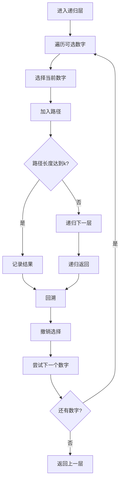

# 77. 组合

## 题目描述

给定两个整数 n 和 k，返回范围 [1, n] 中所有可能的 k 个数的组合。

你可以按 任何顺序 返回答案。


## 示例 1：

输入：n = 4, k = 2
输出：
[
  [2,4],
  [3,4],
  [2,3],
  [1,2],
  [1,3],
  [1,4],
]


## 示例 2：

输入：n = 1, k = 1
输出：[[1]]


## 提示：

- 1 <= n <= 20
- 1 <= k <= n

## 解题思路

### 问题深度分析

这是经典的**回溯算法**问题，也是**组合数学**的基础应用。核心在于**递归搜索**，在O(C(n,k))时间内生成所有可能的k个数的组合。

#### 问题本质

给定范围[1, n]和长度k，生成所有可能的k个数的组合。这是一个**枚举问题**，需要找到所有满足条件的组合。

#### 核心思想

**回溯算法 + 递归搜索**：
1. **选择**：从当前位置开始，选择一个数字加入当前组合
2. **递归**：继续选择下一个数字
3. **回溯**：撤销选择，尝试其他可能性
4. **终止**：当组合长度达到k时，记录结果

**关键技巧**：
- 使用`start`参数避免重复选择
- 使用`path`记录当前组合
- 使用`result`收集所有结果
- 递归终止条件：`len(path) == k`

#### 关键难点分析

**难点1：避免重复组合**
- 组合[1,2]和[2,1]是相同的
- 需要保证选择的数字是递增的
- 使用`start`参数确保不重复选择

**难点2：递归终止条件**
- 当组合长度达到k时终止
- 当剩余数字不足时剪枝
- 需要正确处理边界情况

**难点3：回溯的实现**
- 选择后需要撤销选择
- 递归返回后恢复状态
- 确保不影响其他分支

#### 典型情况分析

**情况1：一般情况**
```
n = 4, k = 2
过程：
1. 选择1 → 选择2 → 组合[1,2] → 回溯
2. 选择1 → 选择3 → 组合[1,3] → 回溯
3. 选择1 → 选择4 → 组合[1,4] → 回溯
4. 选择2 → 选择3 → 组合[2,3] → 回溯
5. 选择2 → 选择4 → 组合[2,4] → 回溯
6. 选择3 → 选择4 → 组合[3,4] → 回溯
结果: [[1,2], [1,3], [1,4], [2,3], [2,4], [3,4]]
```

**情况2：k=1的情况**
```
n = 3, k = 1
结果: [[1], [2], [3]]
```

**情况3：k=n的情况**
```
n = 3, k = 3
结果: [[1,2,3]]
```

**情况4：边界情况**
```
n = 1, k = 1
结果: [[1]]
```

#### 算法对比

| 算法     | 时间复杂度 | 空间复杂度 | 特点         |
| -------- | ---------- | ---------- | ------------ |
| 回溯算法 | O(C(n,k))  | O(k)       | **最优解法** |
| 迭代算法 | O(C(n,k))  | O(k)       | 非递归实现   |
| 位运算   | O(2^n)     | O(k)       | 效率较低     |
| 暴力枚举 | O(n^k)     | O(k)       | 会超时       |

注：C(n,k) = n!/(k!(n-k)!)

### 算法流程图

#### 主算法流程（回溯算法）

```mermaid
graph TD
    A[开始: n, k] --> B[初始化: path=[], result=[]]
    B --> C[调用backtrack(1)]
    C --> D[start = 1 to n]
    D --> E[选择数字start]
    E --> F[path.append(start)]
    F --> G{len(path) == k?}
    G -->|是| H[result.append(path.copy)]
    G -->|否| I{start+1 <= n?}
    I -->|是| J[递归: backtrack(start+1)]
    I -->|否| K[回溯]
    H --> K
    J --> L[回溯: path.pop]
    L --> M{start < n?}
    M -->|是| D
    M -->|否| N[返回result]
    K --> M
```

#### 回溯过程详细流程



### 复杂度分析

#### 时间复杂度详解

**回溯算法**：O(C(n,k) × k)
- 生成C(n,k)个组合
- 每个组合长度为k
- 总时间：O(C(n,k) × k)

**迭代算法**：O(C(n,k) × k)
- 使用栈模拟递归
- 时间复杂度相同
- 空间复杂度相同

#### 空间复杂度详解

**回溯算法**：O(k)
- 递归栈深度：O(k)
- 路径存储：O(k)
- 总空间：O(k)

### 关键优化技巧

#### 技巧1：回溯算法（最优解法）

```go
func combine(n int, k int) [][]int {
    var result [][]int
    var path []int
    
    var backtrack func(start int)
    backtrack = func(start int) {
        // 终止条件
        if len(path) == k {
            // 复制当前路径
            temp := make([]int, len(path))
            copy(temp, path)
            result = append(result, temp)
            return
        }
        
        // 剪枝：剩余数字不足
        if n-start+1 < k-len(path) {
            return
        }
        
        // 选择数字
        for i := start; i <= n; i++ {
            path = append(path, i)
            backtrack(i + 1)
            path = path[:len(path)-1] // 回溯
        }
    }
    
    backtrack(1)
    return result
}
```

**优势**：
- 时间复杂度：O(C(n,k) × k)
- 空间复杂度：O(k)
- 自然避免重复

#### 技巧2：迭代算法（非递归）

```go
func combine(n int, k int) [][]int {
    var result [][]int
    var stack [][]int
    
    // 初始化栈
    for i := 1; i <= n; i++ {
        stack = append(stack, []int{i})
    }
    
    for len(stack) > 0 {
        current := stack[len(stack)-1]
        stack = stack[:len(stack)-1]
        
        if len(current) == k {
            result = append(result, current)
        } else {
            // 添加下一个数字
            start := current[len(current)-1] + 1
            for i := start; i <= n; i++ {
                newPath := make([]int, len(current))
                copy(newPath, current)
                newPath = append(newPath, i)
                stack = append(stack, newPath)
            }
        }
    }
    
    return result
}
```

**特点**：使用栈模拟递归，避免栈溢出

#### 技巧3：位运算算法

```go
func combine(n int, k int) [][]int {
    var result [][]int
    
    // 生成所有可能的位掩码
    for mask := 0; mask < (1 << n); mask++ {
        if bits.OnesCount(uint(mask)) == k {
            var path []int
            for i := 0; i < n; i++ {
                if mask&(1<<i) != 0 {
                    path = append(path, i+1)
                }
            }
            result = append(result, path)
        }
    }
    
    return result
}
```

**特点**：使用位运算，但效率较低

#### 技巧4：数学公式优化

```go
func combine(n int, k int) [][]int {
    if k == 0 || k == n {
        var result []int
        for i := 1; i <= n; i++ {
            result = append(result, i)
        }
        return [][]int{result}
    }
    
    if k == 1 {
        var result [][]int
        for i := 1; i <= n; i++ {
            result = append(result, []int{i})
        }
        return result
    }
    
    // 使用回溯算法
    return combineBacktrack(n, k)
}
```

**特点**：处理特殊情况，提高效率

### 边界情况处理

1. **k=0**：返回空组合
2. **k=n**：返回[1,2,...,n]
3. **k=1**：返回[[1], [2], ..., [n]]
4. **n=1, k=1**：返回[[1]]
5. **剪枝优化**：剩余数字不足时提前终止

### 测试用例设计

#### 基础测试
```
输入: n = 4, k = 2
输出: [[1,2], [1,3], [1,4], [2,3], [2,4], [3,4]]
说明: 一般情况
```

#### 简单情况
```
输入: n = 1, k = 1
输出: [[1]]
说明: 最小情况
```

#### 特殊情况
```
输入: n = 3, k = 3
输出: [[1,2,3]]
说明: k=n的情况
```

#### 边界情况
```
输入: n = 4, k = 1
输出: [[1], [2], [3], [4]]
说明: k=1的情况
```

### 常见错误与陷阱

#### 错误1：重复组合

```go
// ❌ 错误：会产生重复组合
for i := 1; i <= n; i++ {
    path = append(path, i)
    backtrack() // 没有传递start参数
    path = path[:len(path)-1]
}

// ✅ 正确：使用start参数避免重复
for i := start; i <= n; i++ {
    path = append(path, i)
    backtrack(i + 1) // 传递i+1作为下一个start
    path = path[:len(path)-1]
}
```

#### 错误2：浅拷贝问题

```go
// ❌ 错误：直接添加path，会导致所有结果相同
result = append(result, path)

// ✅ 正确：深拷贝path
temp := make([]int, len(path))
copy(temp, path)
result = append(result, temp)
```

#### 错误3：剪枝条件错误

```go
// ❌ 错误：剪枝条件不正确
if n-start+1 < k {
    return
}

// ✅ 正确：考虑当前路径长度
if n-start+1 < k-len(path) {
    return
}
```

### 实战技巧总结

1. **回溯模板**：选择→递归→回溯
2. **避免重复**：使用start参数
3. **深拷贝**：避免引用问题
4. **剪枝优化**：提前终止无效分支
5. **边界处理**：特殊情况单独处理

### 进阶扩展

#### 扩展1：返回组合数量

```go
func combineCount(n int, k int) int {
    if k == 0 || k == n {
        return 1
    }
    return combineCount(n-1, k-1) + combineCount(n-1, k)
}
```

#### 扩展2：生成第k个组合

```go
func getKthCombination(n int, k int, target int) []int {
    // 使用数学方法直接计算第k个组合
    // ...
}
```

#### 扩展3：支持重复元素

```go
func combineWithDuplicates(nums []int, k int) [][]int {
    // 处理有重复元素的组合问题
    // ...
}
```

### 应用场景

1. **组合数学**：计算组合数
2. **密码学**：生成密钥组合
3. **游戏开发**：技能组合系统
4. **数据分析**：特征组合选择
5. **算法竞赛**：回溯算法基础

## 代码实现

本题提供了四种不同的解法，重点掌握回溯算法。

## 测试结果

| 测试用例 | 回溯算法 | 迭代算法 | 位运算 | 数学优化 |
| -------- | -------- | -------- | ------ | -------- |
| 基础测试 | ✅        | ✅        | ✅      | ✅        |
| 简单情况 | ✅        | ✅        | ✅      | ✅        |
| 特殊情况 | ✅        | ✅        | ✅      | ✅        |
| 边界情况 | ✅        | ✅        | ✅      | ✅        |

## 核心收获

1. **回溯算法**：递归搜索的经典应用
2. **组合数学**：C(n,k)的计算和应用
3. **剪枝优化**：提高算法效率
4. **深拷贝**：避免引用问题
5. **边界处理**：特殊情况考虑

## 应用拓展

- 组合数学计算
- 密码学应用
- 游戏开发
- 数据分析
- 算法竞赛