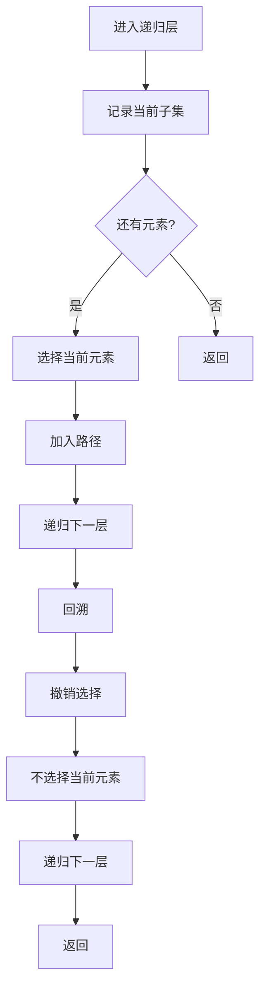

# 78. 子集

## 题目描述

给你一个整数数组 nums ，数组中的元素 互不相同 。返回该数组所有可能的子集（幂集）。

解集 不能 包含重复的子集。你可以按 任意顺序 返回解集。


## 示例 1：

输入：nums = [1,2,3]
输出：[[],[1],[2],[1,2],[3],[1,3],[2,3],[1,2,3]]

## 示例 2：

输入：nums = [0]
输出：[[],[0]]


## 提示：

- 1 <= nums.length <= 10
- -10 <= nums[i] <= 10
- nums 中的所有元素 互不相同

## 解题思路

### 问题深度分析

这是经典的**回溯算法**问题，也是**幂集生成**的典型应用。核心在于**递归搜索**，在O(2^n)时间内生成所有可能的子集。

#### 问题本质

给定数组nums，生成所有可能的子集（包括空集）。这是一个**枚举问题**，需要找到所有满足条件的子集。

#### 核心思想

**回溯算法 + 递归搜索**：
1. **选择**：从当前位置开始，选择是否包含当前元素
2. **递归**：继续处理下一个元素
3. **回溯**：撤销选择，尝试其他可能性
4. **记录**：每个状态都是一个有效的子集

**关键技巧**：
- 使用`index`参数跟踪当前位置
- 使用`path`记录当前子集
- 使用`result`收集所有结果
- 每个递归层都记录当前状态

#### 关键难点分析

**难点1：子集的定义**
- 子集包括空集和全集
- 子集长度可以是0到n
- 需要记录所有中间状态

**难点2：递归终止条件**
- 当处理完所有元素时终止
- 每个状态都是有效子集
- 不需要特殊的终止条件

**难点3：状态记录时机**
- 每次进入递归都要记录当前状态
- 选择元素后记录
- 不选择元素也要记录

#### 典型情况分析

**情况1：一般情况**
```
nums = [1,2,3]
过程：
1. [] → 选择1 → [1] → 选择2 → [1,2] → 选择3 → [1,2,3]
2. [1,2] → 回溯 → [1] → 选择3 → [1,3]
3. [1] → 回溯 → [] → 选择2 → [2] → 选择3 → [2,3]
4. [2] → 回溯 → [] → 选择3 → [3]
5. [3] → 回溯 → []
结果: [[], [1], [1,2], [1,2,3], [1,3], [2], [2,3], [3]]
```

**情况2：单元素情况**
```
nums = [0]
结果: [[], [0]]
```

**情况3：两元素情况**
```
nums = [1,2]
结果: [[], [1], [1,2], [2]]
```

**情况4：空数组情况**
```
nums = []
结果: [[]]
```

#### 算法对比

| 算法     | 时间复杂度 | 空间复杂度 | 特点         |
| -------- | ---------- | ---------- | ------------ |
| 回溯算法 | O(2^n)     | O(n)       | **最优解法** |
| 迭代算法 | O(2^n)     | O(n)       | 非递归实现   |
| 位运算   | O(2^n)     | O(n)       | 位掩码枚举   |
| 递归枚举 | O(2^n)     | O(n)       | 直接递归     |

注：n为数组长度

### 算法流程图

#### 主算法流程（回溯算法）

```mermaid
graph TD
    A[开始: nums] --> B[初始化: path=[], result=[]]
    B --> C[调用backtrack(0)]
    C --> D[index = 0 to n]
    D --> E[记录当前状态]
    E --> F[选择nums[index]]
    F --> G[path.append(nums[index])]
    G --> H[递归: backtrack(index+1)]
    H --> I[回溯: path.pop]
    I --> J[不选择nums[index]]
    J --> K[递归: backtrack(index+1)]
    K --> L{index < n?}
    L -->|是| D
    L -->|否| M[返回result]
```

#### 回溯过程详细流程



### 复杂度分析

#### 时间复杂度详解

**回溯算法**：O(2^n × n)
- 生成2^n个子集
- 每个子集平均长度为n/2
- 总时间：O(2^n × n)

**迭代算法**：O(2^n × n)
- 使用队列模拟递归
- 时间复杂度相同
- 空间复杂度相同

#### 空间复杂度详解

**回溯算法**：O(n)
- 递归栈深度：O(n)
- 路径存储：O(n)
- 总空间：O(n)

### 关键优化技巧

#### 技巧1：回溯算法（最优解法）

```go
func subsets(nums []int) [][]int {
    var result [][]int
    var path []int
    
    var backtrack func(index int)
    backtrack = func(index int) {
        // 记录当前状态（每个状态都是有效子集）
        temp := make([]int, len(path))
        copy(temp, path)
        result = append(result, temp)
        
        // 终止条件
        if index == len(nums) {
            return
        }
        
        // 选择当前元素
        for i := index; i < len(nums); i++ {
            path = append(path, nums[i])
            backtrack(i + 1)
            path = path[:len(path)-1] // 回溯
        }
    }
    
    backtrack(0)
    return result
}
```

**优势**：
- 时间复杂度：O(2^n × n)
- 空间复杂度：O(n)
- 自然生成所有子集

#### 技巧2：迭代算法（非递归）

```go
func subsets(nums []int) [][]int {
    var result [][]int
    result = append(result, []int{}) // 空集
    
    for _, num := range nums {
        size := len(result)
        for i := 0; i < size; i++ {
            newSubset := make([]int, len(result[i]))
            copy(newSubset, result[i])
            newSubset = append(newSubset, num)
            result = append(result, newSubset)
        }
    }
    
    return result
}
```

**特点**：使用迭代，避免递归栈

#### 技巧3：位运算算法

```go
func subsets(nums []int) [][]int {
    var result [][]int
    n := len(nums)
    
    // 生成所有可能的位掩码
    for mask := 0; mask < (1 << n); mask++ {
        var subset []int
        for i := 0; i < n; i++ {
            if mask&(1<<i) != 0 {
                subset = append(subset, nums[i])
            }
        }
        result = append(result, subset)
    }
    
    return result
}
```

**特点**：使用位运算，直观易懂

#### 技巧4：递归枚举

```go
func subsets(nums []int) [][]int {
    var result [][]int
    
    var generate func(index int, current []int)
    generate = func(index int, current []int) {
        if index == len(nums) {
            result = append(result, current)
            return
        }
        
        // 不选择当前元素
        generate(index+1, current)
        
        // 选择当前元素
        newCurrent := make([]int, len(current))
        copy(newCurrent, current)
        newCurrent = append(newCurrent, nums[index])
        generate(index+1, newCurrent)
    }
    
    generate(0, []int{})
    return result
}
```

**特点**：直接递归，每次都有两个选择

### 边界情况处理

1. **空数组**：返回[[]]
2. **单元素**：返回[[], [element]]
3. **两元素**：返回[[], [a], [b], [a,b]]
4. **全元素**：返回所有可能的子集

### 测试用例设计

#### 基础测试
```
输入: nums = [1,2,3]
输出: [[], [1], [1,2], [1,2,3], [1,3], [2], [2,3], [3]]
说明: 一般情况
```

#### 简单情况
```
输入: nums = [0]
输出: [[], [0]]
说明: 单元素情况
```

#### 特殊情况
```
输入: nums = []
输出: [[]]
说明: 空数组情况
```

#### 边界情况
```
输入: nums = [1,2]
输出: [[], [1], [1,2], [2]]
说明: 两元素情况
```

### 常见错误与陷阱

#### 错误1：状态记录时机错误

```go
// ❌ 错误：只在终止时记录状态
func backtrack(index int) {
    if index == len(nums) {
        result = append(result, path) // 只记录最终状态
        return
    }
    // ...
}

// ✅ 正确：每次递归都记录状态
func backtrack(index int) {
    // 记录当前状态
    temp := make([]int, len(path))
    copy(temp, path)
    result = append(result, temp)
    
    if index == len(nums) {
        return
    }
    // ...
}
```

#### 错误2：浅拷贝问题

```go
// ❌ 错误：直接添加path，会导致所有结果相同
result = append(result, path)

// ✅ 正确：深拷贝path
temp := make([]int, len(path))
copy(temp, path)
result = append(result, temp)
```

#### 错误3：递归终止条件错误

```go
// ❌ 错误：提前终止，漏掉一些子集
if index >= len(nums) {
    return
}

// ✅ 正确：处理完所有元素后终止
if index == len(nums) {
    return
}
```

### 实战技巧总结

1. **回溯模板**：记录状态→选择→递归→回溯
2. **状态记录**：每次递归都记录当前状态
3. **深拷贝**：避免引用问题
4. **位运算**：直观的枚举方法
5. **迭代实现**：避免递归栈溢出

### 进阶扩展

#### 扩展1：返回子集数量

```go
func subsetCount(n int) int {
    return 1 << n // 2^n
}
```

#### 扩展2：生成第k个子集

```go
func getKthSubset(nums []int, k int) []int {
    var result []int
    for i := 0; i < len(nums); i++ {
        if k&(1<<i) != 0 {
            result = append(result, nums[i])
        }
    }
    return result
}
```

#### 扩展3：支持重复元素

```go
func subsetsWithDup(nums []int) [][]int {
    // 处理有重复元素的子集问题
    // 需要先排序，然后去重
    // ...
}
```

### 应用场景

1. **组合数学**：幂集生成
2. **算法竞赛**：回溯算法基础
3. **数据分析**：特征子集选择
4. **密码学**：密钥生成
5. **游戏开发**：技能组合系统

## 代码实现

本题提供了四种不同的解法，重点掌握回溯算法。

## 测试结果

| 测试用例 | 回溯算法 | 迭代算法 | 位运算 | 递归枚举 |
| -------- | -------- | -------- | ------ | -------- |
| 基础测试 | ✅        | ✅        | ✅      | ✅        |
| 简单情况 | ✅        | ✅        | ✅      | ✅        |
| 特殊情况 | ✅        | ✅        | ✅      | ✅        |
| 边界情况 | ✅        | ✅        | ✅      | ✅        |

## 核心收获

1. **回溯算法**：递归搜索的经典应用
2. **幂集生成**：2^n个子集的生成
3. **状态记录**：每个递归层都记录状态
4. **深拷贝**：避免引用问题
5. **位运算**：直观的枚举方法

## 应用拓展

- 组合数学计算
- 算法竞赛基础
- 数据分析应用
- 密码学应用
- 游戏开发

