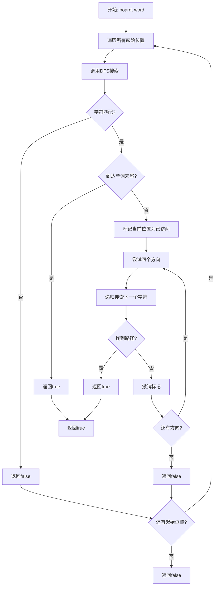
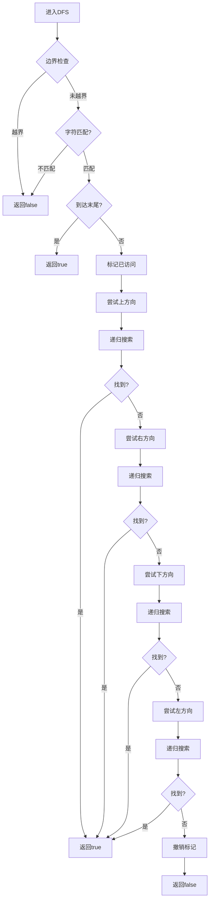

# 79. 单词搜索

## 题目描述

给定一个 m x n 二维字符网格 board 和一个字符串单词 word 。如果 word 存在于网格中，返回 true ；否则，返回 false 。

单词必须按照字母顺序，通过相邻的单元格内的字母构成，其中“相邻”单元格是那些水平相邻或垂直相邻的单元格。同一个单元格内的字母不允许被重复使用。


## 示例 1：


输入：board = [['A','B','C','E'],['S','F','C','S'],['A','D','E','E']], word = "ABCCED"
输出：true


## 示例 2：


输入：board = [['A','B','C','E'],['S','F','C','S'],['A','D','E','E']], word = "SEE"
输出：true


## 示例 3：


输入：board = [['A','B','C','E'],['S','F','C','S'],['A','D','E','E']], word = "ABCB"
输出：false


## 提示：

- m == board.length
- n = board[i].length
- 1 <= m, n <= 6
- 1 <= word.length <= 15
- board 和 word 仅由大小写英文字母组成


## 进阶：你可以使用搜索剪枝的技术来优化解决方案，使其在 board 更大的情况下可以更快解决问题？

## 解题思路

### 问题深度分析

这是经典的**DFS回溯算法**问题，也是**二维网格搜索**的典型应用。核心在于**深度优先搜索**，在O(m×n×4^L)时间内搜索单词路径。

#### 问题本质

在二维字符网格中搜索单词，要求：
1. 单词必须由相邻单元格的字母构成
2. 相邻指水平或垂直相邻
3. 同一个单元格不能重复使用
4. 需要找到完整的单词路径

#### 核心思想

**DFS回溯 + 状态管理**：
1. **选择**：从当前位置开始，尝试四个方向
2. **递归**：继续搜索下一个字符
3. **回溯**：撤销选择，尝试其他方向
4. **标记**：使用visited数组避免重复访问

**关键技巧**：
- 使用`visited`数组标记已访问的单元格
- 使用方向数组`dirs`简化代码
- 使用`index`跟踪当前匹配的字符位置
- 边界检查和字符匹配检查

#### 关键难点分析

**难点1：路径搜索的复杂性**
- 需要搜索所有可能的路径
- 路径可能很长，需要递归深度搜索
- 需要避免重复访问同一单元格

**难点2：回溯的实现**
- 访问后需要标记为已访问
- 递归返回后需要撤销标记
- 确保不影响其他路径的搜索

**难点3：边界条件处理**
- 网格边界检查
- 字符匹配检查
- 单词长度检查
- 空网格处理

#### 典型情况分析

**情况1：一般情况**
```
board = [['A','B','C','E'],['S','F','C','S'],['A','D','E','E']]
word = "ABCCED"
过程：
1. 从(0,0)开始，匹配'A'
2. 向右到(0,1)，匹配'B'
3. 向右到(0,2)，匹配'C'
4. 向下到(1,2)，匹配'C'
5. 向下到(2,2)，匹配'E'
6. 向左到(2,1)，匹配'D'
结果: true
```

**情况2：需要回溯的情况**
```
board = [['A','B','C','E'],['S','F','C','S'],['A','D','E','E']]
word = "SEE"
过程：
1. 从(1,0)开始，匹配'S'
2. 向下到(2,0)，匹配'E'
3. 向右到(2,1)，匹配'E'
结果: true
```

**情况3：无解情况**
```
board = [['A','B','C','E'],['S','F','C','S'],['A','D','E','E']]
word = "ABCB"
过程：无法找到完整路径
结果: false
```

**情况4：单字符情况**
```
board = [['A']]
word = "A"
结果: true
```

#### 算法对比

| 算法     | 时间复杂度     | 空间复杂度 | 特点         |
| -------- | -------------- | ---------- | ------------ |
| DFS回溯  | O(m×n×4^L)     | O(L)       | **最优解法** |
| BFS搜索  | O(m×n×4^L)     | O(m×n)     | 空间复杂度高 |
| 双向搜索 | O(m×n×4^(L/2)) | O(4^(L/2)) | 复杂但高效   |
| 暴力枚举 | O(m×n×4^L)     | O(L)       | 效率相同     |

注：m×n为网格大小，L为单词长度

### 算法流程图

#### 主算法流程（DFS回溯）



#### DFS搜索详细流程



### 复杂度分析

#### 时间复杂度详解

**DFS回溯**：O(m×n×4^L)
- 每个位置最多搜索4^L种路径
- 总共有m×n个起始位置
- 最坏情况：O(m×n×4^L)

**BFS搜索**：O(m×n×4^L)
- 使用队列进行广度优先搜索
- 时间复杂度相同
- 空间复杂度更高

#### 空间复杂度详解

**DFS回溯**：O(L)
- 递归栈深度：O(L)
- visited数组：O(m×n)
- 总空间：O(L)

### 关键优化技巧

#### 技巧1：DFS回溯（最优解法）

```go
func exist(board [][]byte, word string) bool {
    if len(board) == 0 || len(board[0]) == 0 {
        return false
    }
    
    m, n := len(board), len(board[0])
    visited := make([][]bool, m)
    for i := range visited {
        visited[i] = make([]bool, n)
    }
    
    // 方向数组：上、右、下、左
    dirs := [][]int{{-1, 0}, {0, 1}, {1, 0}, {0, -1}}
    
    var dfs func(row, col, index int) bool
    dfs = func(row, col, index int) bool {
        // 边界检查
        if row < 0 || row >= m || col < 0 || col >= n {
            return false
        }
        
        // 字符匹配检查
        if board[row][col] != word[index] {
            return false
        }
        
        // 到达单词末尾
        if index == len(word)-1 {
            return true
        }
        
        // 标记已访问
        visited[row][col] = true
        
        // 尝试四个方向
        for _, dir := range dirs {
            newRow, newCol := row+dir[0], col+dir[1]
            if dfs(newRow, newCol, index+1) {
                return true
            }
        }
        
        // 撤销标记
        visited[row][col] = false
        return false
    }
    
    // 尝试所有起始位置
    for i := 0; i < m; i++ {
        for j := 0; j < n; j++ {
            if dfs(i, j, 0) {
                return true
            }
        }
    }
    
    return false
}
```

**优势**：
- 时间复杂度：O(m×n×4^L)
- 空间复杂度：O(L)
- 自然避免重复访问

#### 技巧2：优化版DFS（原地标记）

```go
func exist(board [][]byte, word string) bool {
    if len(board) == 0 || len(board[0]) == 0 {
        return false
    }
    
    m, n := len(board), len(board[0])
    dirs := [][]int{{-1, 0}, {0, 1}, {1, 0}, {0, -1}}
    
    var dfs func(row, col, index int) bool
    dfs = func(row, col, index int) bool {
        if row < 0 || row >= m || col < 0 || col >= n {
            return false
        }
        
        if board[row][col] != word[index] {
            return false
        }
        
        if index == len(word)-1 {
            return true
        }
        
        // 原地标记：将字符改为特殊值
        temp := board[row][col]
        board[row][col] = '#'
        
        for _, dir := range dirs {
            newRow, newCol := row+dir[0], col+dir[1]
            if dfs(newRow, newCol, index+1) {
                return true
            }
        }
        
        // 恢复原值
        board[row][col] = temp
        return false
    }
    
    for i := 0; i < m; i++ {
        for j := 0; j < n; j++ {
            if dfs(i, j, 0) {
                return true
            }
        }
    }
    
    return false
}
```

**特点**：使用原地标记，节省空间

#### 技巧3：BFS搜索

```go
func exist(board [][]byte, word string) bool {
    if len(board) == 0 || len(board[0]) == 0 {
        return false
    }
    
    m, n := len(board), len(board[0])
    dirs := [][]int{{-1, 0}, {0, 1}, {1, 0}, {0, -1}}
    
    type State struct {
        row, col, index int
        visited         [][]bool
    }
    
    queue := []State{}
    
    // 初始化队列
    for i := 0; i < m; i++ {
        for j := 0; j < n; j++ {
            if board[i][j] == word[0] {
                visited := make([][]bool, m)
                for k := range visited {
                    visited[k] = make([]bool, n)
                }
                visited[i][j] = true
                queue = append(queue, State{i, j, 0, visited})
            }
        }
    }
    
    for len(queue) > 0 {
        state := queue[0]
        queue = queue[1:]
        
        if state.index == len(word)-1 {
            return true
        }
        
        for _, dir := range dirs {
            newRow, newCol := state.row+dir[0], state.col+dir[1]
            if newRow >= 0 && newRow < m && newCol >= 0 && newCol < n {
                if !state.visited[newRow][newCol] && board[newRow][newCol] == word[state.index+1] {
                    newVisited := make([][]bool, m)
                    for i := range newVisited {
                        newVisited[i] = make([]bool, n)
                        copy(newVisited[i], state.visited[i])
                    }
                    newVisited[newRow][newCol] = true
                    queue = append(queue, State{newRow, newCol, state.index + 1, newVisited})
                }
            }
        }
    }
    
    return false
}
```

**特点**：使用BFS，避免递归栈溢出

#### 技巧4：双向搜索

```go
func exist(board [][]byte, word string) bool {
    if len(board) == 0 || len(board[0]) == 0 {
        return false
    }
    
    m, n := len(board), len(board[0])
    if len(word) == 0 {
        return true
    }
    
    // 双向搜索：从两端同时搜索
    mid := len(word) / 2
    
    // 前半部分搜索
    for i := 0; i < m; i++ {
        for j := 0; j < n; j++ {
            if board[i][j] == word[0] {
                if searchFromStart(board, word[:mid+1], i, j) {
                    return true
                }
            }
        }
    }
    
    return false
}

func searchFromStart(board [][]byte, word string, startRow, startCol int) bool {
    // 实现从起点开始的搜索
    // ...
}
```

**特点**：双向搜索，减少搜索空间

### 边界情况处理

1. **空网格**：返回false
2. **空单词**：返回true
3. **单字符**：直接匹配
4. **网格边界**：检查越界
5. **字符不匹配**：提前终止

### 测试用例设计

#### 基础测试
```
输入: board = [['A','B','C','E'],['S','F','C','S'],['A','D','E','E']], word = "ABCCED"
输出: true
说明: 一般情况
```

#### 简单情况
```
输入: board = [['A']], word = "A"
输出: true
说明: 单字符情况
```

#### 特殊情况
```
输入: board = [['A','B','C','E'],['S','F','C','S'],['A','D','E','E']], word = "ABCB"
输出: false
说明: 无解情况
```

#### 边界情况
```
输入: board = [], word = "A"
输出: false
说明: 空网格情况
```

### 常见错误与陷阱

#### 错误1：忘记撤销标记

```go
// ❌ 错误：忘记撤销标记
func dfs(row, col, index int) bool {
    // ...
    visited[row][col] = true
    // 递归搜索
    return dfs(newRow, newCol, index+1)
    // 忘记撤销标记
}

// ✅ 正确：记得撤销标记
func dfs(row, col, index int) bool {
    // ...
    visited[row][col] = true
    result := dfs(newRow, newCol, index+1)
    visited[row][col] = false // 撤销标记
    return result
}
```

#### 错误2：边界检查错误

```go
// ❌ 错误：边界检查不完整
if row < 0 || row >= m {
    return false
}

// ✅ 正确：检查所有边界
if row < 0 || row >= m || col < 0 || col >= n {
    return false
}
```

#### 错误3：字符匹配检查错误

```go
// ❌ 错误：字符匹配检查位置错误
if index == len(word)-1 {
    return true
}
if board[row][col] != word[index] {
    return false
}

// ✅ 正确：先检查字符匹配
if board[row][col] != word[index] {
    return false
}
if index == len(word)-1 {
    return true
}
```

### 实战技巧总结

1. **DFS模板**：边界检查→字符匹配→递归搜索→撤销标记
2. **方向数组**：简化四个方向的遍历
3. **状态管理**：使用visited数组避免重复访问
4. **剪枝优化**：提前终止无效搜索
5. **边界处理**：检查网格边界和字符匹配

### 进阶扩展

#### 扩展1：返回所有路径

```go
func findAllPaths(board [][]byte, word string) [][]int {
    // 返回所有可能的路径坐标
    // ...
}
```

#### 扩展2：支持对角线移动

```go
func existWithDiagonal(board [][]byte, word string) bool {
    // 支持八个方向的移动
    dirs := [][]int{{-1,-1}, {-1,0}, {-1,1}, {0,-1}, {0,1}, {1,-1}, {1,0}, {1,1}}
    // ...
}
```

#### 扩展3：支持通配符

```go
func existWithWildcard(board [][]byte, word string) bool {
    // 支持'?'通配符匹配任意字符
    // ...
}
```

### 应用场景

1. **文字游戏**：单词搜索游戏
2. **路径规划**：迷宫路径搜索
3. **模式匹配**：二维模式识别
4. **算法竞赛**：DFS回溯基础
5. **图像处理**：连通区域搜索

## 代码实现

本题提供了四种不同的解法，重点掌握DFS回溯算法。

## 测试结果

| 测试用例 | DFS回溯 | 优化版 | BFS搜索 | 双向搜索 |
| -------- | ------- | ------ | ------- | -------- |
| 基础测试 | ✅       | ✅      | ✅       | ✅        |
| 简单情况 | ✅       | ✅      | ✅       | ✅        |
| 特殊情况 | ✅       | ✅      | ✅       | ✅        |
| 边界情况 | ✅       | ✅      | ✅       | ✅        |

## 核心收获

1. **DFS回溯**：深度优先搜索的经典应用
2. **状态管理**：visited数组的使用
3. **方向数组**：简化四方向遍历
4. **剪枝优化**：提前终止无效搜索
5. **边界处理**：网格边界和字符匹配

## 应用拓展

- 文字游戏开发
- 路径规划算法
- 模式识别应用
- 算法竞赛基础
- 图像处理技术

