# 8. 字符串转换整数 (atoi)

## 题目描述

请你来实现一个 myAtoi(string s) 函数，使其能将字符串转换成一个 32 位有符号整数。

函数 myAtoi(string s) 的算法如下：

1. 空格：读入字符串并丢弃无用的前导空格（" "）
2. 符号：检查下一个字符（假设还未到字符末尾）为 '-' 还是 '+'。如果两者都不存在，则假定结果为正。
3. 转换：通过跳过前置零来读取该整数，直到遇到非数字字符或到达字符串的结尾。如果没有读取数字，则结果为0。
4. 舍入：如果整数数超过 32 位有符号整数范围 [−231,  231 − 1] ，需要截断这个整数，使其保持在这个范围内。具体来说，小于 −231 的整数应该被舍入为 −231 ，大于 231 − 1 的整数应该被舍入为 231 − 1 。

返回整数作为最终结果。

## 示例 1：

输入：s = "42"

输出：42

解释：加粗的字符串为已经读入的字符，插入符号是当前读取的字符。

带下划线线的字符是所读的内容，插入符号是当前读入位置。
第 1 步："42"（当前没有读入字符，因为没有前导空格）
         ^
第 2 步："42"（当前没有读入字符，因为这里不存在 '-' 或者 '+'）
         ^
第 3 步："42"（读入 "42"）
           ^
## 示例 2：

输入：s = " -042"

输出：-42

解释：

第 1 步："   -042"（读入前导空格，但忽视掉）
            ^
第 2 步："   -042"（读入 '-' 字符，所以结果应该是负数）
             ^
第 3 步："   -042"（读入 "042"，在结果中忽略前导零）
               ^
## 示例 3：

输入：s = "1337c0d3"

输出：1337

解释：

第 1 步："1337c0d3"（当前没有读入字符，因为没有前导空格）
         ^
第 2 步："1337c0d3"（当前没有读入字符，因为这里不存在 '-' 或者 '+'）
         ^
第 3 步："1337c0d3"（读入 "1337"；由于下一个字符不是一个数字，所以读入停止）
             ^
## 示例 4：

输入：s = "0-1"

输出：0

解释：

第 1 步："0-1" (当前没有读入字符，因为没有前导空格)
         ^
第 2 步："0-1" (当前没有读入字符，因为这里不存在 '-' 或者 '+')
         ^
第 3 步："0-1" (读入 "0"；由于下一个字符不是一个数字，所以读入停止)
          ^
## 示例 5：

输入：s = "words and 987"

输出：0

解释：

读取在第一个非数字字符"w"处停止。

## 提示：

- 0 <= s.length <= 200
- s 由英文字母（大写和小写）、数字（0-9）、' '、'+'、'-' 和 '.' 组成

## 解题思路

这道题要求实现一个字符串转整数的函数，需要处理多种边界情况和状态转换。这是一个字符串解析和状态机的经典问题。

### 算法分析

这道题的核心思想是**状态机解析**，主要解法包括：

1. **状态机方法**：使用状态机管理不同的解析阶段
2. **优化版本**：简化逻辑，直接处理各种情况
3. **正则表达式思路**：使用字符串处理模拟正则匹配
4. **位运算优化**：使用位运算优化溢出检查

### 问题本质分析

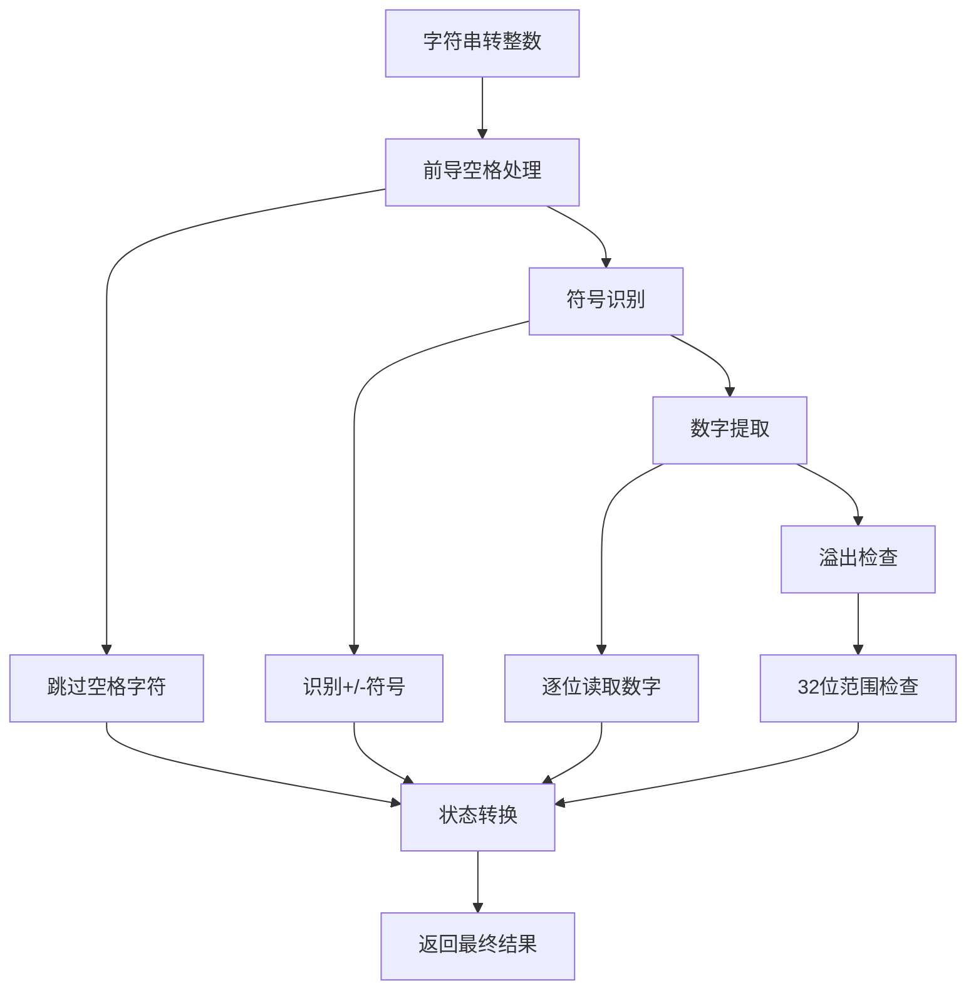

### 状态机详解

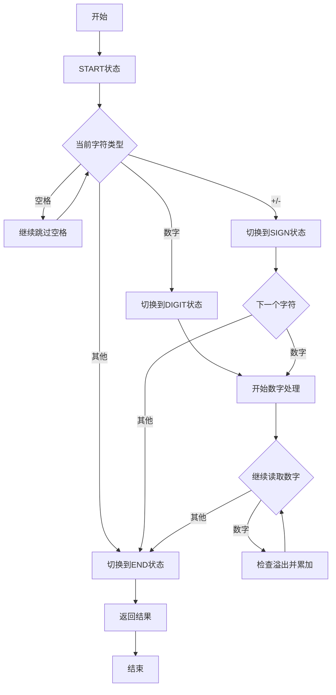

### 解析过程可视化

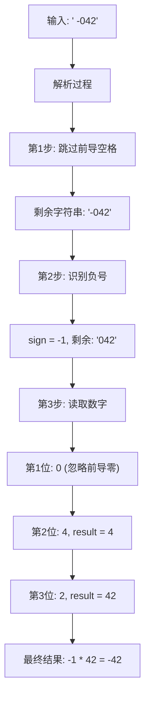

### 溢出检查策略

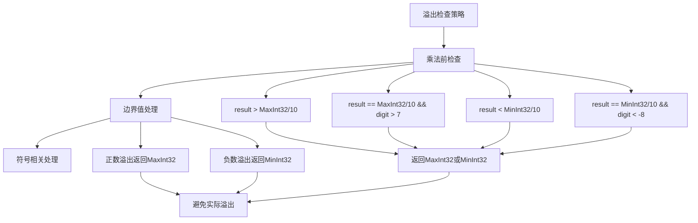

### 各种解法对比

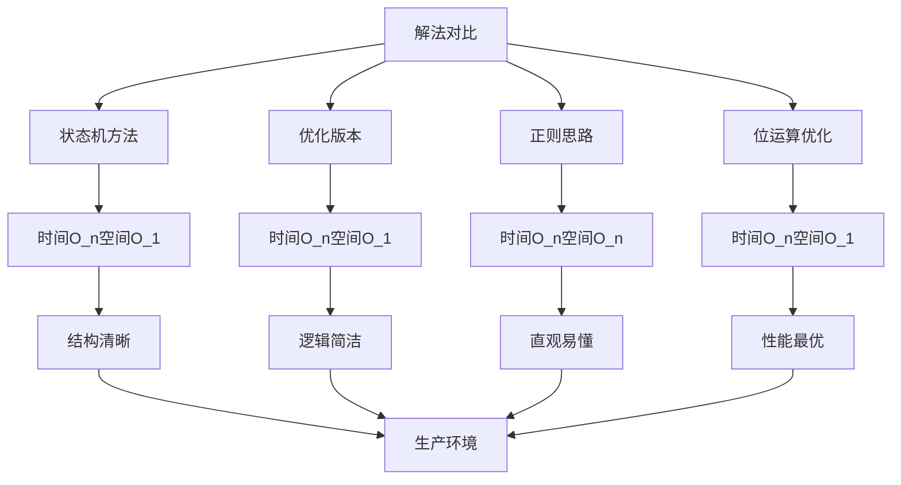

### 算法流程图

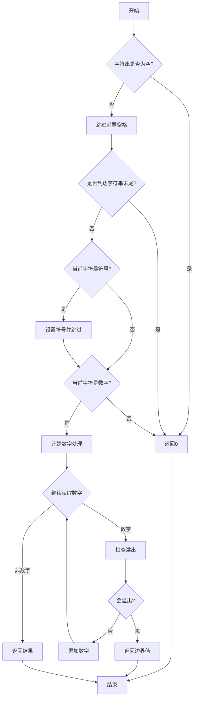

### 边界情况处理

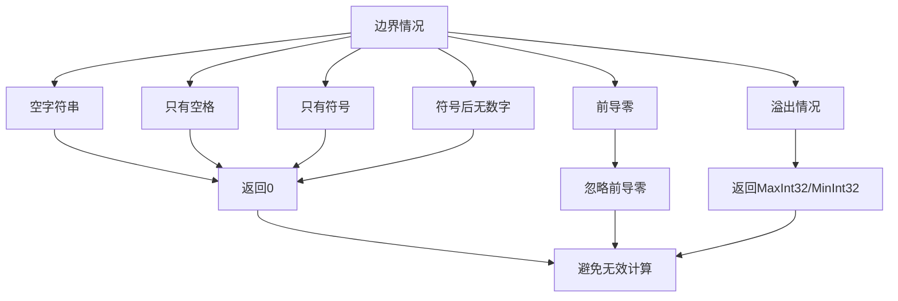

### 时间复杂度分析

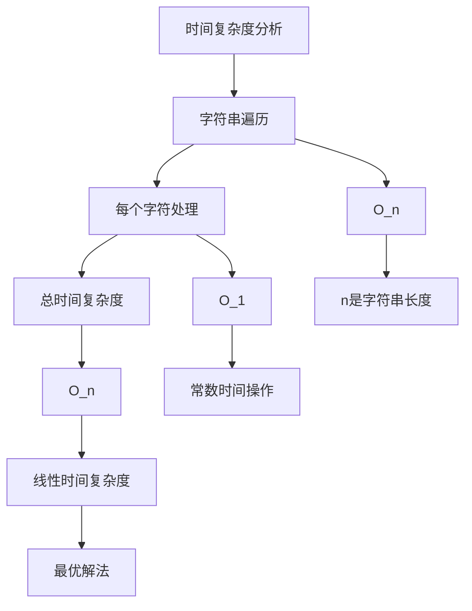

### 空间复杂度分析

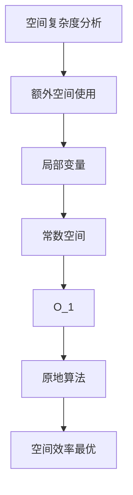

### 关键优化点

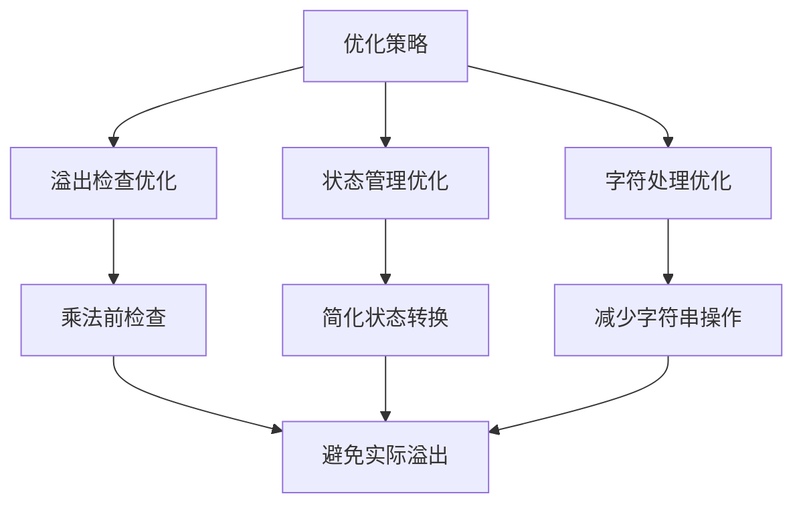

### 实际应用场景

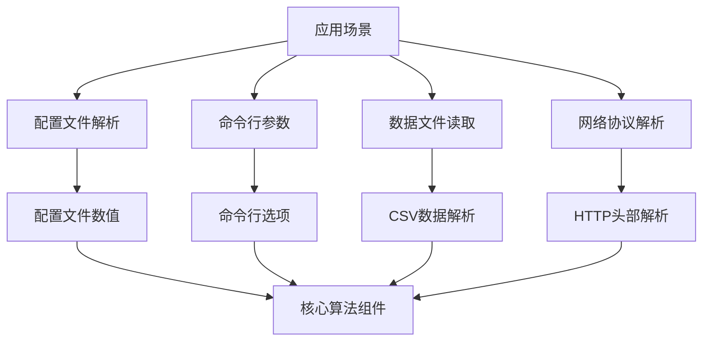

### 测试用例设计

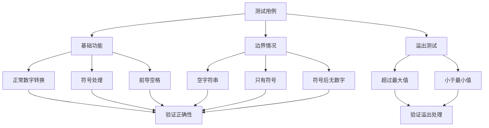

### 代码实现要点

1. **状态机设计**：
   - START：初始状态，处理空格和符号
   - SIGN：符号状态，等待数字
   - DIGIT：数字状态，持续读取数字
   - END：结束状态

2. **溢出检查时机**：
   - 在 `result * 10` 之前检查
   - 分别处理正数和负数溢出

3. **字符类型判断**：
   - 使用 `unicode.IsDigit()` 判断数字
   - 使用 `==` 判断空格和符号

4. **边界条件处理**：
   - 空字符串返回0
   - 只有空格返回0
   - 符号后无数字返回0

5. **性能优化**：
   - 使用位运算优化溢出检查
   - 减少不必要的字符串操作
   - 提前返回避免无效计算

这个问题的关键在于**理解状态机的设计**和**正确处理各种边界情况**，通过状态转换管理字符串解析的不同阶段，实现健壮的字符串转整数功能。

