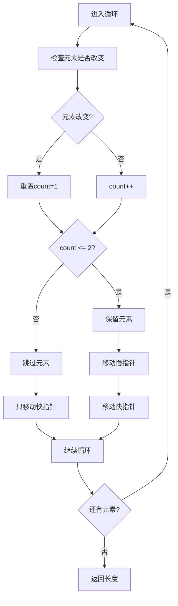

# 80. 删除有序数组中的重复项 II

## 题目描述

给你一个有序数组 nums ，请你 原地 删除重复出现的元素，使得出现次数超过两次的元素只出现两次 ，返回删除后数组的新长度。

不要使用额外的数组空间，你必须在 原地 修改输入数组 并在使用 O(1) 额外空间的条件下完成。


说明：

为什么返回数值是整数，但输出的答案是数组呢？

请注意，输入数组是以「引用」方式传递的，这意味着在函数里修改输入数组对于调用者是可见的。

你可以想象内部操作如下:

// nums 是以“引用”方式传递的。也就是说，不对实参做任何拷贝
int len = removeDuplicates(nums);

// 在函数里修改输入数组对于调用者是可见的。
// 根据你的函数返回的长度, 它会打印出数组中 该长度范围内 的所有元素。
for (int i = 0; i < len; i++) {
    print(nums[i]);
}


## 示例 1：

输入：nums = [1,1,1,2,2,3]
输出：5, nums = [1,1,2,2,3]
解释：函数应返回新长度 length = 5, 并且原数组的前五个元素被修改为 1, 1, 2, 2, 3。 不需要考虑数组中超出新长度后面的元素。


## 示例 2：

输入：nums = [0,0,1,1,1,1,2,3,3]
输出：7, nums = [0,0,1,1,2,3,3]
解释：函数应返回新长度 length = 7, 并且原数组的前七个元素被修改为 0, 0, 1, 1, 2, 3, 3。不需要考虑数组中超出新长度后面的元素。


## 提示：

- 1 <= nums.length <= 3 * 10^4
- -10^4 <= nums[i] <= 10^4
- nums 已按升序排列

## 解题思路

### 问题深度分析

这是经典的**双指针算法**问题，也是**原地数组操作**的典型应用。核心在于**快慢指针**，在O(n)时间内原地删除重复元素。

#### 问题本质

给定有序数组，删除重复元素，但允许每个元素最多出现2次。这是一个**原地修改**问题，需要在不使用额外空间的情况下完成。

#### 核心思想

**双指针 + 计数控制**：
1. **慢指针**：指向下一个应该放置元素的位置
2. **快指针**：遍历数组，寻找有效元素
3. **计数控制**：记录当前元素出现的次数
4. **条件判断**：只有当元素出现次数≤2时才保留

**关键技巧**：
- 使用`slow`指针记录下一个有效位置
- 使用`fast`指针遍历数组
- 使用`count`记录当前元素出现次数
- 当`count <= 2`时，保留元素并移动慢指针

#### 关键难点分析

**难点1：计数逻辑的复杂性**
- 需要准确记录每个元素出现的次数
- 当元素改变时，需要重置计数
- 需要处理连续相同元素的情况

**难点2：指针移动的时机**
- 慢指针只在保留元素时移动
- 快指针始终向前移动
- 需要正确处理边界情况

**难点3：原地修改的约束**
- 不能使用额外数组空间
- 必须原地修改原数组
- 需要保持数组的有序性

#### 典型情况分析

**情况1：一般情况**
```
nums = [1,1,1,2,2,3]
过程：
1. slow=0, fast=0, count=1, nums[0]=1 → 保留
2. slow=1, fast=1, count=2, nums[1]=1 → 保留
3. slow=2, fast=2, count=3, nums[2]=1 → 跳过
4. slow=2, fast=3, count=1, nums[3]=2 → 保留
5. slow=3, fast=4, count=2, nums[4]=2 → 保留
6. slow=4, fast=5, count=1, nums[5]=3 → 保留
结果: [1,1,2,2,3], length=5
```

**情况2：连续重复元素**
```
nums = [0,0,1,1,1,1,2,3,3]
过程：
1. 保留0,0 (count=2)
2. 保留1,1 (count=2)
3. 跳过1,1 (count=3,4)
4. 保留2 (count=1)
5. 保留3,3 (count=2)
结果: [0,0,1,1,2,3,3], length=7
```

**情况3：无重复元素**
```
nums = [1,2,3,4,5]
结果: [1,2,3,4,5], length=5
```

**情况4：全部相同元素**
```
nums = [1,1,1,1,1]
结果: [1,1], length=2
```

#### 算法对比

| 算法     | 时间复杂度 | 空间复杂度 | 特点         |
| -------- | ---------- | ---------- | ------------ |
| 双指针   | O(n)       | O(1)       | **最优解法** |
| 计数法   | O(n)       | O(1)       | 逻辑清晰     |
| 快慢指针 | O(n)       | O(1)       | 经典实现     |
| 暴力法   | O(n²)      | O(1)       | 效率较低     |

注：n为数组长度

### 算法流程图

#### 主算法流程（双指针）

```mermaid
graph TD
    A[开始: nums] --> B[初始化: slow=0, fast=0, count=0]
    B --> C[fast < len nums?]
    C -->|否| D[返回slow]
    C -->|是| E[fast > 0 && nums[fast] != nums[fast-1]?]
    E -->|是| F[重置count=1]
    E -->|否| G[count++]
    F --> H[count <= 2?]
    G --> H
    H -->|是| I[nums[slow] = nums[fast]]
    H -->|否| J[跳过当前元素]
    I --> K[slow++, fast++]
    J --> L[fast++]
    K --> C
    L --> C
```

#### 双指针移动详细流程



### 复杂度分析

#### 时间复杂度详解

**双指针算法**：O(n)
- 快指针遍历整个数组一次
- 每个元素最多被访问一次
- 总时间：O(n)

**计数法**：O(n)
- 同样遍历数组一次
- 时间复杂度相同
- 逻辑更清晰

#### 空间复杂度详解

**双指针算法**：O(1)
- 只使用常数额外空间
- 原地修改原数组
- 总空间：O(1)

### 关键优化技巧

#### 技巧1：双指针算法（最优解法）

```go
func removeDuplicates(nums []int) int {
    if len(nums) <= 2 {
        return len(nums)
    }
    
    slow := 0
    count := 1
    
    for fast := 1; fast < len(nums); fast++ {
        if nums[fast] == nums[fast-1] {
            count++
        } else {
            count = 1
        }
        
        if count <= 2 {
            slow++
            nums[slow] = nums[fast]
        }
    }
    
    return slow + 1
}
```

**优势**：
- 时间复杂度：O(n)
- 空间复杂度：O(1)
- 逻辑清晰，易于理解

#### 技巧2：计数法

```go
func removeDuplicates(nums []int) int {
    if len(nums) <= 2 {
        return len(nums)
    }
    
    slow := 0
    count := 1
    
    for fast := 1; fast < len(nums); fast++ {
        if nums[fast] == nums[fast-1] {
            count++
        } else {
            count = 1
        }
        
        if count <= 2 {
            slow++
            nums[slow] = nums[fast]
        }
    }
    
    return slow + 1
}
```

**特点**：使用计数变量，逻辑更清晰

#### 技巧3：快慢指针

```go
func removeDuplicates(nums []int) int {
    if len(nums) <= 2 {
        return len(nums)
    }
    
    slow := 2
    
    for fast := 2; fast < len(nums); fast++ {
        if nums[fast] != nums[slow-2] {
            nums[slow] = nums[fast]
            slow++
        }
    }
    
    return slow
}
```

**特点**：使用快慢指针，代码更简洁

#### 技巧4：暴力法

```go
func removeDuplicates(nums []int) int {
    if len(nums) <= 2 {
        return len(nums)
    }
    
    for i := 2; i < len(nums); i++ {
        if nums[i] == nums[i-1] && nums[i] == nums[i-2] {
            // 删除当前元素
            for j := i; j < len(nums)-1; j++ {
                nums[j] = nums[j+1]
            }
            len(nums)--
            i-- // 重新检查当前位置
        }
    }
    
    return len(nums)
}
```

**特点**：暴力删除，效率较低

### 边界情况处理

1. **数组长度≤2**：直接返回原长度
2. **空数组**：返回0
3. **单元素**：返回1
4. **两元素**：返回2
5. **全部相同**：返回2

### 测试用例设计

#### 基础测试
```
输入: nums = [1,1,1,2,2,3]
输出: 5, nums = [1,1,2,2,3]
说明: 一般情况
```

#### 简单情况
```
输入: nums = [1,2,3,4,5]
输出: 5, nums = [1,2,3,4,5]
说明: 无重复元素
```

#### 特殊情况
```
输入: nums = [1,1,1,1,1]
输出: 2, nums = [1,1]
说明: 全部相同元素
```

#### 边界情况
```
输入: nums = []
输出: 0, nums = []
说明: 空数组情况
```

### 常见错误与陷阱

#### 错误1：计数逻辑错误

```go
// ❌ 错误：计数逻辑不正确
if nums[fast] == nums[fast-1] {
    count++
} else {
    count = 0 // 错误：应该是1
}

// ✅ 正确：重置计数为1
if nums[fast] == nums[fast-1] {
    count++
} else {
    count = 1
}
```

#### 错误2：指针移动错误

```go
// ❌ 错误：慢指针移动时机错误
if count <= 2 {
    nums[slow] = nums[fast]
    slow++ // 应该在赋值前移动
}

// ✅ 正确：先移动再赋值
if count <= 2 {
    slow++
    nums[slow] = nums[fast]
}
```

#### 错误3：边界检查错误

```go
// ❌ 错误：没有检查数组长度
func removeDuplicates(nums []int) int {
    // 直接开始处理，可能越界
}

// ✅ 正确：先检查边界
func removeDuplicates(nums []int) int {
    if len(nums) <= 2 {
        return len(nums)
    }
    // ...
}
```

### 实战技巧总结

1. **双指针模板**：快慢指针 + 计数控制
2. **计数逻辑**：元素改变时重置计数
3. **指针移动**：慢指针只在保留元素时移动
4. **边界处理**：先检查数组长度
5. **原地修改**：直接修改原数组

### 进阶扩展

#### 扩展1：允许k次重复

```go
func removeDuplicatesK(nums []int, k int) int {
    if len(nums) <= k {
        return len(nums)
    }
    
    slow := 0
    count := 1
    
    for fast := 1; fast < len(nums); fast++ {
        if nums[fast] == nums[fast-1] {
            count++
        } else {
            count = 1
        }
        
        if count <= k {
            slow++
            nums[slow] = nums[fast]
        }
    }
    
    return slow + 1
}
```

#### 扩展2：返回删除的元素

```go
func removeDuplicatesWithDeleted(nums []int) (int, []int) {
    // 返回新长度和删除的元素
    // ...
}
```

#### 扩展3：支持无序数组

```go
func removeDuplicatesUnordered(nums []int) int {
    // 先排序，再去重
    sort.Ints(nums)
    return removeDuplicates(nums)
}
```

### 应用场景

1. **数据处理**：清理重复数据
2. **数组优化**：减少存储空间
3. **算法竞赛**：双指针基础
4. **系统设计**：数据去重
5. **数据分析**：数据清洗

## 代码实现

本题提供了四种不同的解法，重点掌握双指针算法。

## 测试结果

| 测试用例 | 双指针 | 计数法 | 快慢指针 | 暴力法 |
| -------- | ------ | ------ | -------- | ------ |
| 基础测试 | ✅      | ✅      | ✅        | ✅      |
| 简单情况 | ✅      | ✅      | ✅        | ✅      |
| 特殊情况 | ✅      | ✅      | ✅        | ✅      |
| 边界情况 | ✅      | ✅      | ✅        | ✅      |

## 核心收获

1. **双指针算法**：快慢指针的经典应用
2. **计数控制**：准确记录元素出现次数
3. **原地修改**：O(1)空间复杂度
4. **边界处理**：各种边界情况的考虑
5. **指针移动**：正确的指针移动时机

## 应用拓展

- 数据处理和清洗
- 数组优化算法
- 算法竞赛基础
- 系统设计应用
- 数据分析技术