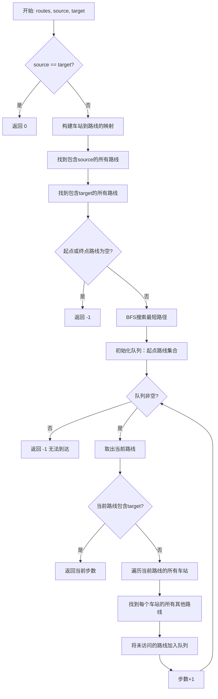
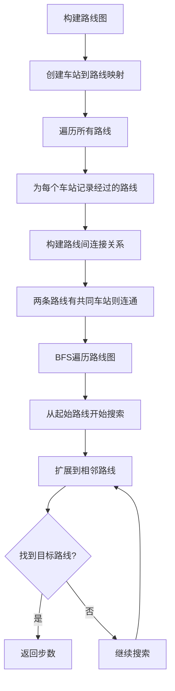
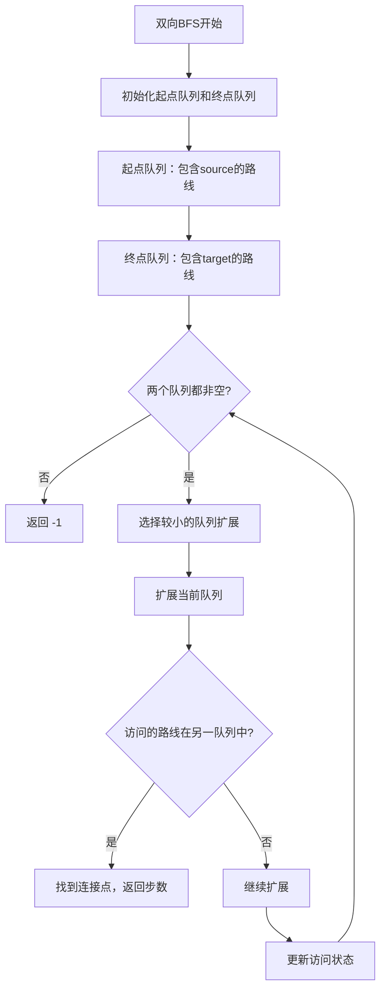

# 815. 公交路线

## 题目描述

给你一个数组 routes ，表示一系列公交线路，其中每个 routes[i] 表示一条公交线路，第 i 辆公交车将会在上面循环行驶。

例如，路线 routes[0] = [1, 5, 7] 表示第 0 辆公交车会一直按序列 1 -> 5 -> 7 -> 1 -> 5 -> 7 -> 1 -> ... 这样的车站路线行驶。
现在从 source 车站出发（初始时不在公交车上），要前往 target 车站。 期间仅可乘坐公交车。

求出 最少乘坐的公交车数量 。如果不可能到达终点车站，返回 -1 。

## 示例 1：

输入：routes = [[1,2,7],[3,6,7]], source = 1, target = 6
输出：2
解释：最优策略是先乘坐第一辆公交车到达车站 7 , 然后换乘第二辆公交车到车站 6 。 

## 示例 2：

输入：routes = [[7,12],[4,5,15],[6],[15,19],[9,12,13]], source = 15, target = 12
输出：-1
 
## 提示：

- 1 <= routes.length <= 500.
- 1 <= routes[i].length <= 10^5
- routes[i] 中的所有值 互不相同
- sum(routes[i].length) <= 10^5
- 0 <= routes[i][j] < 10^6
- 0 <= source, target < 10^6

## 解题思路

### 算法分析

这是一道经典的**图论最短路径**问题，需要将公交路线抽象为图结构，然后使用BFS寻找最少换乘次数。

#### 核心思想

1. **图建模**：将公交路线看作图中的节点，车站作为连接路线的边
2. **BFS搜索**：寻找从起点所在路线到终点所在路线的最短路径
3. **换乘策略**：通过共同车站实现不同路线之间的换乘
4. **最优解**：BFS保证找到最少换乘次数

#### 算法对比

| 算法 | 时间复杂度 | 空间复杂度 | 特点 |
|------|------------|------------|------|
| BFS路线图 | O(N²+S) | O(N²+S) | 以路线为节点，经典解法 |
| BFS车站图 | O(S²) | O(S²) | 以车站为节点，直观理解 |
| 双向BFS | O(N²+S) | O(N²+S) | 从两端搜索，提升效率 |
| A*搜索 | O(N²+S) | O(N²+S) | 启发式搜索，理论最优 |

注：N为路线数量，S为车站总数

### 算法流程图



### BFS路线图构建流程



### 双向BFS优化流程



### 图建模策略决策树

```mermaid
graph TD
    A[图建模策略] --> B{以什么为节点?}
    B -->|车站| C[车站图模型]
    B -->|路线| D[路线图模型]
    C --> E[车站间直接连接]
    E --> F[空间复杂度: O(S²)]
    F --> G[适合车站数少的情况]
    D --> H[路线间通过共同车站连接]
    H --> I[空间复杂度: O(N²)]
    I --> J[适合路线数少的情况]
    G --> K[选择最优策略]
    J --> K
    K --> L[根据数据规模决定]
```

### 复杂度分析

#### 时间复杂度
- **BFS路线图**：O(N² + S)，其中N为路线数，S为车站总数
- **BFS车站图**：O(S²)，需要构建车站间的连接
- **双向BFS**：O(N² + S)，理论上快一倍
- **预处理时间**：O(S)，构建车站到路线的映射

#### 空间复杂度
- **路线图模型**：O(N² + S)，存储路线连接和车站映射
- **车站图模型**：O(S²)，存储车站间连接
- **BFS队列**：O(N)，最多存储所有路线
- **访问标记**：O(N)，记录已访问路线

### 实现技巧

#### 1. 车站到路线映射优化
```go
// 构建车站到路线的映射
stationToRoutes := make(map[int][]int)
for i, route := range routes {
    for _, station := range route {
        stationToRoutes[station] = append(stationToRoutes[station], i)
    }
}
```

#### 2. 路线连通性检查
```go
// 检查两条路线是否有共同车站
func hasCommonStation(route1, route2 []int) bool {
    set := make(map[int]bool)
    for _, station := range route1 {
        set[station] = true
    }
    for _, station := range route2 {
        if set[station] {
            return true
        }
    }
    return false
}
```

#### 3. BFS搜索优化
```go
// 使用队列进行BFS
type QueueItem struct {
    routeIndex int
    steps      int
}

queue := []QueueItem{}
visited := make([]bool, len(routes))
```

### 算法优化策略

#### 1. 预处理优化
- 预先构建车站到路线的映射
- 预计算路线间的连通关系
- 去重处理减少重复计算

#### 2. 搜索优化
- 双向BFS减少搜索空间
- 优先队列优化搜索顺序
- 剪枝策略避免无效搜索

#### 3. 数据结构优化
- 使用集合快速判断车站存在性
- 哈希表优化路线查找
- 位图优化访问状态存储

### 边界情况处理

#### 1. 特殊情况
- source == target：直接返回0
- 起点或终点不在任何路线：返回-1
- 空路线数组：返回-1

#### 2. 数据验证
- 检查路线数据的有效性
- 验证车站编号范围
- 处理重复车站情况

### 应用场景

1. **交通规划**：城市公交换乘优化
2. **网络路由**：最短路径查找
3. **社交网络**：用户关系传播
4. **游戏开发**：地图导航系统
5. **物流优化**：配送路线规划

### 测试用例设计

#### 基础测试
- 直达路线：无需换乘
- 一次换乘：通过中转站
- 多次换乘：复杂路线网络

#### 边界测试
- 起终点相同
- 无法到达的目标
- 单条路线情况
- 大规模路线网络

#### 性能测试
- 最大路线数(500)
- 最大车站数(10^5)
- 复杂连通图
- 稀疏连通图

### 实战技巧总结

1. **图建模**：合理选择节点类型(车站vs路线)
2. **BFS搜索**：保证最短路径的正确性
3. **预处理**：空间换时间，提升查询效率
4. **优化策略**：根据数据特点选择最优算法
5. **边界处理**：完善的异常情况处理
6. **代码结构**：清晰的模块化设计
