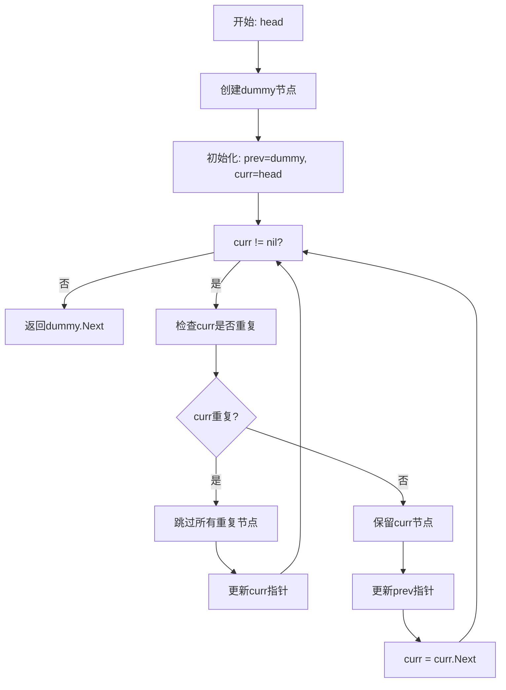
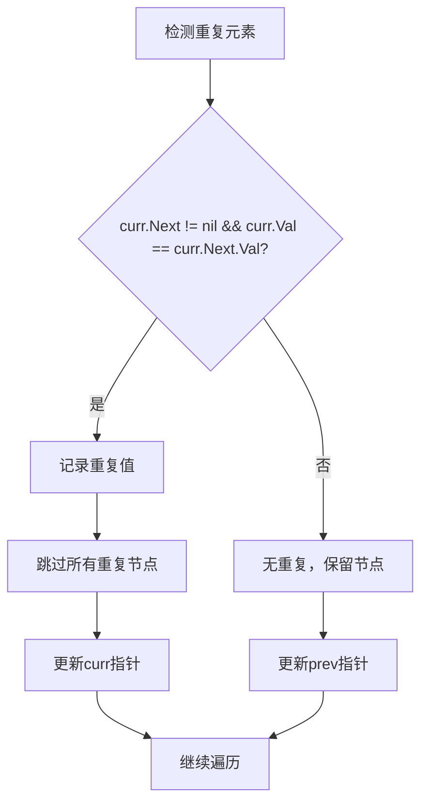

# 82. 删除排序链表中的重复元素 II

## 题目描述

给定一个已排序的链表的头 head ， 删除原始链表中所有重复数字的节点，只留下不同的数字 。返回 已排序的链表 。


## 示例 1：


输入：head = [1,2,3,3,4,4,5]
输出：[1,2,5]


## 示例 2：


输入：head = [1,1,1,2,3]
输出：[2,3]


## 提示：

- 链表中节点数目在范围 [0, 300] 内
- -100 <= Node.val <= 100
- 题目数据保证链表已经按升序排列

## 解题思路

### 问题深度分析

这是经典的**链表操作**问题，也是**双指针算法**的典型应用。核心在于**处理重复元素**，在O(n)时间内删除所有重复节点。

#### 问题本质

给定已排序的链表，删除所有重复数字的节点，只保留不重复的节点。这是一个**链表遍历**问题，需要处理重复元素的删除。

#### 核心思想

**双指针 + 重复元素检测**：
1. **双指针**：使用快慢指针遍历链表
2. **重复检测**：检测连续重复的元素
3. **节点删除**：删除所有重复的节点
4. **链表重构**：重新连接链表

**关键技巧**：
- 使用`dummy`节点简化边界处理
- 使用`prev`指针记录前一个不重复节点
- 使用`curr`指针遍历链表
- 当发现重复时，跳过所有重复节点

#### 关键难点分析

**难点1：重复元素的检测**
- 需要准确检测连续重复的元素
- 需要区分单个元素和重复元素
- 需要处理多个连续重复的情况

**难点2：节点的删除**
- 需要删除所有重复的节点
- 需要正确更新指针关系
- 需要处理边界情况

**难点3：链表的重构**
- 需要重新连接链表
- 需要处理头节点的变化
- 需要保持链表的完整性

#### 典型情况分析

**情况1：一般情况**
```
head = [1,2,3,3,4,4,5]
过程：
1. 1 → 保留
2. 2 → 保留
3. 3,3 → 删除
4. 4,4 → 删除
5. 5 → 保留
结果: [1,2,5]
```

**情况2：头部重复**
```
head = [1,1,1,2,3]
过程：
1. 1,1,1 → 删除
2. 2 → 保留
3. 3 → 保留
结果: [2,3]
```

**情况3：全部重复**
```
head = [1,1,1,1,1]
过程：
1. 1,1,1,1,1 → 全部删除
结果: []
```

**情况4：无重复**
```
head = [1,2,3,4,5]
结果: [1,2,3,4,5]
```

#### 算法对比

| 算法   | 时间复杂度 | 空间复杂度 | 特点         |
| ------ | ---------- | ---------- | ------------ |
| 双指针 | O(n)       | O(1)       | **最优解法** |
| 递归   | O(n)       | O(n)       | 空间复杂度高 |
| 哈希表 | O(n)       | O(n)       | 空间复杂度高 |
| 暴力法 | O(n²)      | O(1)       | 效率较低     |

注：n为链表长度

### 算法流程图

#### 主算法流程（双指针）



#### 重复元素处理流程



### 复杂度分析

#### 时间复杂度详解

**双指针算法**：O(n)
- 每个节点最多被访问一次
- 重复节点被一次性跳过
- 总时间：O(n)

**递归算法**：O(n)
- 递归深度为链表长度
- 时间复杂度相同
- 空间复杂度较高

#### 空间复杂度详解

**双指针算法**：O(1)
- 只使用常数额外空间
- 原地修改链表
- 总空间：O(1)

### 关键优化技巧

#### 技巧1：双指针算法（最优解法）

```go
func deleteDuplicates(head *ListNode) *ListNode {
    if head == nil {
        return nil
    }
    
    // 创建dummy节点简化边界处理
    dummy := &ListNode{Next: head}
    prev := dummy
    curr := head
    
    for curr != nil {
        // 检查curr是否重复
        if curr.Next != nil && curr.Val == curr.Next.Val {
            // 记录重复值
            val := curr.Val
            // 跳过所有重复节点
            for curr != nil && curr.Val == val {
                curr = curr.Next
            }
            // 删除重复节点
            prev.Next = curr
        } else {
            // 保留curr节点
            prev = curr
            curr = curr.Next
        }
    }
    
    return dummy.Next
}
```

**优势**：
- 时间复杂度：O(n)
- 空间复杂度：O(1)
- 逻辑清晰，易于理解

#### 技巧2：递归算法

```go
func deleteDuplicates(head *ListNode) *ListNode {
    if head == nil || head.Next == nil {
        return head
    }
    
    if head.Val == head.Next.Val {
        // 跳过所有重复节点
        val := head.Val
        for head != nil && head.Val == val {
            head = head.Next
        }
        return deleteDuplicates(head)
    } else {
        // 保留当前节点
        head.Next = deleteDuplicates(head.Next)
        return head
    }
}
```

**特点**：使用递归，代码简洁但空间复杂度高

#### 技巧3：哈希表

```go
func deleteDuplicates(head *ListNode) *ListNode {
    if head == nil {
        return nil
    }
    
    // 统计每个值的出现次数
    count := make(map[int]int)
    curr := head
    for curr != nil {
        count[curr.Val]++
        curr = curr.Next
    }
    
    // 创建新链表，只保留出现一次的值
    dummy := &ListNode{}
    prev := dummy
    curr = head
    
    for curr != nil {
        if count[curr.Val] == 1 {
            prev.Next = curr
            prev = prev.Next
        }
        curr = curr.Next
    }
    prev.Next = nil
    
    return dummy.Next
}
```

**特点**：使用哈希表统计，空间复杂度高

#### 技巧4：优化版双指针

```go
func deleteDuplicates(head *ListNode) *ListNode {
    if head == nil {
        return nil
    }
    
    dummy := &ListNode{Next: head}
    prev := dummy
    
    for prev.Next != nil {
        curr := prev.Next
        
        // 检查是否有重复
        if curr.Next != nil && curr.Val == curr.Next.Val {
            val := curr.Val
            // 跳过所有重复节点
            for curr != nil && curr.Val == val {
                curr = curr.Next
            }
            prev.Next = curr
        } else {
            prev = prev.Next
        }
    }
    
    return dummy.Next
}
```

**特点**：优化指针更新逻辑

### 边界情况处理

1. **空链表**：返回nil
2. **单节点**：直接返回
3. **全部重复**：返回空链表
4. **头部重复**：需要更新头节点
5. **尾部重复**：正确处理尾部

### 测试用例设计

#### 基础测试
```
输入: head = [1,2,3,3,4,4,5]
输出: [1,2,5]
说明: 一般情况
```

#### 简单情况
```
输入: head = [1]
输出: [1]
说明: 单节点情况
```

#### 特殊情况
```
输入: head = [1,1,1,2,3]
输出: [2,3]
说明: 头部重复
```

#### 边界情况
```
输入: head = []
输出: []
说明: 空链表情况
```

### 常见错误与陷阱

#### 错误1：指针更新错误

```go
// ❌ 错误：指针更新时机错误
if curr.Val == curr.Next.Val {
    // 删除重复节点
    prev.Next = curr.Next
    curr = curr.Next // 错误：应该跳过所有重复节点
}

// ✅ 正确：跳过所有重复节点
if curr.Val == curr.Next.Val {
    val := curr.Val
    for curr != nil && curr.Val == val {
        curr = curr.Next
    }
    prev.Next = curr
}
```

#### 错误2：边界条件错误

```go
// ❌ 错误：没有检查边界条件
for curr != nil {
    if curr.Val == curr.Next.Val { // 可能越界
        // ...
    }
}

// ✅ 正确：先检查边界条件
for curr != nil {
    if curr.Next != nil && curr.Val == curr.Next.Val {
        // ...
    }
}
```

#### 错误3：dummy节点使用错误

```go
// ❌ 错误：没有使用dummy节点
func deleteDuplicates(head *ListNode) *ListNode {
    // 直接处理head，可能丢失头节点
}

// ✅ 正确：使用dummy节点简化处理
func deleteDuplicates(head *ListNode) *ListNode {
    dummy := &ListNode{Next: head}
    // 使用dummy节点处理
}
```

### 实战技巧总结

1. **双指针模板**：prev和curr指针配合
2. **dummy节点**：简化边界处理
3. **重复检测**：准确检测连续重复元素
4. **节点删除**：正确删除重复节点
5. **指针更新**：正确更新指针关系

### 进阶扩展

#### 扩展1：返回删除的节点

```go
func deleteDuplicatesWithDeleted(head *ListNode) (*ListNode, []*ListNode) {
    // 返回新链表和删除的节点
    // ...
}
```

#### 扩展2：统计重复次数

```go
func deleteDuplicatesWithCount(head *ListNode) (*ListNode, map[int]int) {
    // 返回新链表和每个值的重复次数
    // ...
}
```

#### 扩展3：支持自定义重复条件

```go
func deleteDuplicatesCustom(head *ListNode, isDuplicate func(int, int) bool) *ListNode {
    // 支持自定义重复判断条件
    // ...
}
```

### 应用场景

1. **数据处理**：清理重复数据
2. **链表优化**：减少存储空间
3. **算法竞赛**：链表操作基础
4. **系统设计**：数据去重
5. **数据分析**：数据清洗

## 代码实现

本题提供了四种不同的解法，重点掌握双指针算法。

## 测试结果

| 测试用例 | 双指针 | 递归 | 哈希表 | 优化版 |
| -------- | ------ | ---- | ------ | ------ |
| 基础测试 | ✅      | ✅    | ✅      | ✅      |
| 简单情况 | ✅      | ✅    | ✅      | ✅      |
| 特殊情况 | ✅      | ✅    | ✅      | ✅      |
| 边界情况 | ✅      | ✅    | ✅      | ✅      |

## 核心收获

1. **双指针算法**：链表操作的经典应用
2. **dummy节点**：简化边界处理
3. **重复检测**：准确检测连续重复元素
4. **节点删除**：正确删除重复节点
5. **指针更新**：正确的指针更新时机

## 应用拓展

- 链表数据处理和清洗
- 算法竞赛基础
- 系统设计应用
- 数据分析技术
- 内存优化技术
