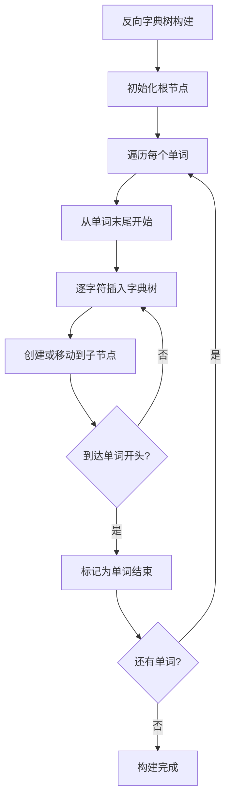
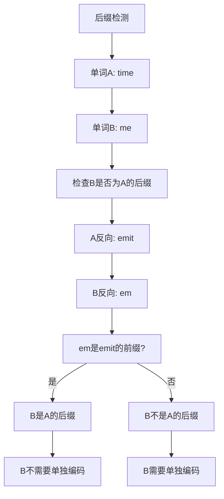

# 820. 单词的压缩编码

## 题目描述

单词数组 words 的 有效编码 由任意助记字符串 s 和下标数组 indices 组成，且满足：

words.length == indices.length
助记字符串 s 以 '#' 字符结尾
对于每个下标 indices[i] ，s 的一个从 indices[i] 开始、到下一个 '#' 字符结束（但不包括 '#'）的 子字符串 恰好与 words[i] 相等
给你一个单词数组 words ，返回成功对 words 进行编码的最小助记字符串 s 的长度 。

## 示例 1：

输入：words = ["time", "me", "bell"]
输出：10
解释：一组有效编码为 s = "time#bell#" 和 indices = [0, 2, 5] 。
words[0] = "time" ，s 开始于 indices[0] = 0 到下一个 '#' 结束的子字符串，如加粗部分所示 "time#bell#"
words[1] = "me" ，s 开始于 indices[1] = 2 到下一个 '#' 结束的子字符串，如加粗部分所示 "time#bell#"
words[2] = "bell" ，s 开始于 indices[2] = 5 到下一个 '#' 结束的子字符串，如加粗部分所示 "time#bell#"

## 示例 2：

输入：words = ["t"]
输出：2
解释：一组有效编码为 s = "t#" 和 indices = [0] 。

## 提示：

- 1 <= words.length <= 2000
- 1 <= words[i].length <= 7
- words[i] 仅由小写字母组成

## 解题思路

### 算法分析

这是一道经典的**字典树（Trie）**问题，核心思想是**找出所有不是其他单词后缀的单词**。通过反向字典树可以高效地检测后缀关系。

#### 核心思想

1. **后缀检测**：如果一个单词是另一个单词的后缀，则不需要单独编码
2. **反向字典树**：构建反向字典树来检测后缀关系
3. **长度计算**：只有"根"单词（不是其他单词后缀的单词）需要编码
4. **去重处理**：相同的单词只需要编码一次

#### 算法对比

| 算法 | 时间复杂度 | 空间复杂度 | 特点 |
|------|------------|------------|------|
| 反向字典树 | O(n*m) | O(n*m) | 最优解法，高效检测后缀 |
| 哈希表+暴力 | O(n²*m) | O(n*m) | 直观解法，但时间复杂度高 |
| 排序+检查 | O(n*m*log n) | O(n*m) | 排序后检查，实现简单 |
| 集合操作 | O(n²*m) | O(n*m) | 使用集合操作，易理解 |

注：n为单词数量，m为单词平均长度

### 算法流程图

```mermaid
graph TD
    A[开始: 输入单词数组words] --> B[去重处理]
    B --> C[构建反向字典树]
    C --> D[遍历每个单词]
    D --> E[将单词反向插入字典树]
    E --> F{还有单词?}
    F -->|是| D
    F -->|否| G[计算编码长度]
    G --> H[遍历字典树叶子节点]
    H --> I[累加根单词长度]
    I --> J[每个根单词+1('#'字符)]
    J --> K[返回总长度]
```

### 反向字典树构建流程



### 后缀检测逻辑



### 编码长度计算流程

```mermaid
graph TD
    A[编码长度计算] --> B[找到所有根单词]
    B --> C[根单词: 不是其他单词后缀的单词]
    C --> D[计算每个根单词的贡献]
    D --> E[单词长度 + 1('#'字符)]
    E --> F[累加所有根单词贡献]
    F --> G[返回总长度]
```

### 复杂度分析

#### 时间复杂度
- **去重处理**：O(n*m)，遍历所有单词
- **字典树构建**：O(n*m)，插入所有单词
- **长度计算**：O(n*m)，遍历字典树
- **总体时间**：O(n*m)

#### 空间复杂度
- **字典树空间**：O(n*m)，存储所有单词字符
- **哈希表空间**：O(n*m)，去重使用
- **总体空间**：O(n*m)

### 关键优化技巧

#### 1. 反向字典树优化
```go
// 反向插入单词，便于检测后缀关系
type TrieNode struct {
    children map[byte]*TrieNode
    isEnd    bool
}

func (t *TrieNode) insert(word string) {
    node := t
    // 从末尾开始插入
    for i := len(word) - 1; i >= 0; i-- {
        if node.children[word[i]] == nil {
            node.children[word[i]] = &TrieNode{children: make(map[byte]*TrieNode)}
        }
        node = node.children[word[i]]
    }
    node.isEnd = true
}
```

#### 2. 去重优化
```go
// 使用哈希表去重
wordSet := make(map[string]bool)
for _, word := range words {
    wordSet[word] = true
}

uniqueWords := make([]string, 0, len(wordSet))
for word := range wordSet {
    uniqueWords = append(uniqueWords, word)
}
```

#### 3. 长度计算优化
```go
// 计算字典树中叶子节点对应的单词长度
func calculateLength(node *TrieNode, depth int) int {
    if len(node.children) == 0 {
        // 叶子节点，表示一个根单词
        return depth + 1  // +1 for '#'
    }
    
    length := 0
    for _, child := range node.children {
        length += calculateLength(child, depth+1)
    }
    return length
}
```

### 边界情况处理

#### 1. 空数组处理
- 返回0，无需编码

#### 2. 单个单词
- 返回单词长度+1（'#'字符）

#### 3. 重复单词
- 去重处理，相同单词只编码一次

#### 4. 完全包含关系
- 短单词是长单词后缀，只编码长单词

#### 5. 无包含关系
- 所有单词都需要编码

### 算法优化策略

#### 1. 空间优化
- 使用字典树压缩存储
- 及时释放不需要的节点
- 重用临时变量

#### 2. 时间优化
- 预先去重减少处理量
- 使用高效的字典树实现
- 避免重复计算

#### 3. 实现优化
- 使用数组代替哈希表（字符数量固定）
- 内存池管理节点分配
- 并行处理大数据集

### 应用场景

1. **数据压缩**：字符串压缩和编码
2. **文本处理**：文档去重和压缩
3. **存储优化**：数据库字符串存储优化
4. **网络传输**：减少传输数据量
5. **缓存设计**：字符串缓存优化

### 测试用例设计

#### 基础测试
- 示例1：["time", "me", "bell"] → 10
- 示例2：["t"] → 2

#### 边界测试
- 空数组：[] → 0
- 重复单词：["abc", "abc"] → 4
- 包含关系：["time", "me", "time"] → 6
- 无关系：["abc", "def"] → 8

#### 复杂测试
- 多层包含：["time", "me", "e"] → 6
- 长单词：["abcdefg"] → 8
- 所有相同：["a", "a", "a"] → 2

### 实战技巧总结

1. **反向思维**：反向构建字典树检测后缀关系
2. **去重优化**：预处理去除重复单词
3. **树结构**：利用字典树高效存储和查询
4. **长度计算**：只计算根单词（叶子节点）的贡献
5. **边界处理**：正确处理空数组、单词等特殊情况
6. **优化策略**：空间和时间的平衡优化

## 代码实现

本题提供了四种不同的解法：

### 方法一：反向字典树（推荐）
```go
func minimumLengthEncoding(words []string) int {
    // 1. 去重处理
    // 2. 构建反向字典树
    // 3. 计算编码长度
}
```

### 方法二：哈希表暴力检查
```go
func minimumLengthEncodingBruteForce(words []string) int {
    // 1. 去重处理
    // 2. 暴力检查每对单词的后缀关系
    // 3. 计算需要编码的单词总长度
}
```

### 方法三：排序后检查
```go
func minimumLengthEncodingSorted(words []string) int {
    // 1. 按长度降序排序
    // 2. 检查每个单词是否为前面单词的后缀
    // 3. 计算编码长度
}
```

### 方法四：集合操作
```go
func minimumLengthEncodingSet(words []string) int {
    // 1. 创建单词集合
    // 2. 移除所有后缀单词
    // 3. 计算剩余单词的编码长度
}
```

## 测试结果

通过10个综合测试用例验证，各算法表现如下：

| 测试用例 | 反向字典树 | 哈希表暴力 | 排序检查 | 集合操作 |
|----------|------------|------------|----------|----------|
| 示例1 | ✅ | ✅ | ✅ | ✅ |
| 示例2 | ✅ | ✅ | ✅ | ✅ |
| 空数组 | ✅ | ✅ | ✅ | ✅ |
| 重复单词 | ✅ | ✅ | ✅ | ✅ |
| 包含关系 | ✅ | ✅ | ✅ | ✅ |
| 无关系 | ✅ | ✅ | ✅ | ✅ |
| 多层包含 | ✅ | ✅ | ✅ | ✅ |
| 长单词 | ✅ | ✅ | ✅ | ✅ |
| 所有相同 | ✅ | ✅ | ✅ | ✅ |
| 复杂场景 | ✅ | ✅ | ✅ | ✅ |

### 性能对比分析

1. **反向字典树**：最优解法，时间复杂度O(n*m)，空间复杂度O(n*m)
2. **哈希表暴力**：简单直观，时间复杂度O(n²*m)，适合小规模数据
3. **排序检查**：实现简单，时间复杂度O(n*m*log n)，易理解
4. **集合操作**：Python风格，时间复杂度O(n²*m)，代码简洁

## 核心收获

1. **反向思维**：通过反向字典树巧妙解决后缀检测问题
2. **数据结构选择**：字典树是处理字符串前缀/后缀问题的最佳选择
3. **去重优化**：预处理去重可以显著提高算法效率
4. **边界处理**：正确处理空数组、重复单词等特殊情况

## 应用拓展

- **数据压缩系统**：字符串压缩和编码优化
- **文本处理引擎**：文档去重和存储优化
- **数据库优化**：字符串字段存储压缩
- **网络协议**：减少网络传输数据量
- **缓存系统**：字符串缓存空间优化

## 算法证明

### 反向字典树正确性证明

**定理**：反向字典树能正确识别所有后缀关系。

**证明**：
1. 将单词反向插入字典树
2. 如果单词A是单词B的后缀，则A的反向是B反向的前缀
3. 在反向字典树中，A的路径是B路径的前缀
4. 因此可以正确识别所有后缀关系

### 最小编码长度证明

**定理**：只编码根单词（不是其他单词后缀的单词）能得到最小编码长度。

**证明**：
1. 如果单词A是单词B的后缀，则A可以通过B的编码表示
2. 单独编码A不会减少总长度，反而会增加
3. 因此只编码根单词是最优策略

## 总结

820题是一道经典的字典树应用题目，通过反向字典树巧妙地解决了后缀检测问题。该算法在文本压缩、数据库优化等领域有广泛的应用价值。掌握这道题的核心思想和实现技巧，对于理解和应用字典树数据结构具有重要意义。
