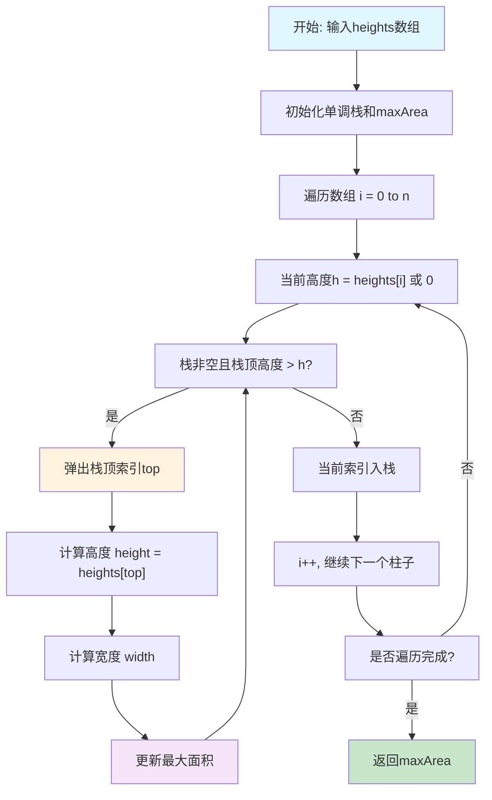
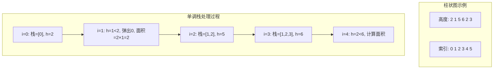

# 84. 柱状图中最大的矩形

## 描述

给定 n 个非负整数，用来表示柱状图中各个柱子的高度。每个柱子彼此相邻，且宽度为 1 。

求在该柱状图中，能够勾勒出来的矩形的最大面积。

## 示例 1


输入：heights = [2,1,5,6,2,3]
输出：10
解释：最大的矩形为图中红色区域，面积为 10

## 示例 2


输入： heights = [2,4]
输出： 4

## 提示

- 1 <= heights.length <=10^5
- 0 <= heights[i] <= 10^4

## 解题思路

### 核心分析

这道题是一个典型的**单调栈优化问题**。关键在于理解**矩形面积的计算方式**：
- **面积 = 高度 × 宽度**
- **高度**：矩形的高度由最矮的柱子决定
- **宽度**：矩形的宽度由连续的柱子数量决定

核心思想是：对于每个柱子，找到以它为高度的最大矩形面积。

### 问题转化

对于每个位置i的柱子 `heights[i]`，我们需要找到：
1. **左边界**：左侧第一个高度小于 `heights[i]` 的位置
2. **右边界**：右侧第一个高度小于 `heights[i]` 的位置
3. **矩形宽度** = 右边界 - 左边界 - 1
4. **矩形面积** = `heights[i]` × 宽度

### 算法实现

#### 方法1：单调栈（推荐）

**核心思想**：使用单调递增栈维护柱子索引，当遇到较矮柱子时计算面积

**算法原理**：
- 维护一个单调递增的栈（存储柱子索引）
- 当前柱子比栈顶柱子矮时，弹出栈顶并计算以栈顶为高的矩形面积
- 栈顶元素的左边界是新栈顶，右边界是当前位置

**状态定义**：
- `stack`：单调递增栈，存储柱子索引
- `left[i]`：左侧第一个比 `heights[i]` 小的位置
- `right[i]`：右侧第一个比 `heights[i]` 小的位置

```go
func largestRectangleArea(heights []int) int {
    stack := []int{}
    maxArea := 0
    
    for i := 0; i <= len(heights); i++ {
        h := 0
        if i < len(heights) {
            h = heights[i]
        }
        
        for len(stack) > 0 && h < heights[stack[len(stack)-1]] {
            height := heights[stack[len(stack)-1]]
            stack = stack[:len(stack)-1]
            
            width := i
            if len(stack) > 0 {
                width = i - stack[len(stack)-1] - 1
            }
            
            maxArea = max(maxArea, height * width)
        }
        
        stack = append(stack, i)
    }
    
    return maxArea
}
```

**时间复杂度**：O(n)，每个元素最多入栈出栈一次
**空间复杂度**：O(n)，栈的空间

#### 方法2：预处理 + 枚举

**核心思想**：预处理每个位置的左右边界，然后枚举计算

**算法步骤**：
1. 预处理左边界数组：找到左侧第一个更小元素的位置
2. 预处理右边界数组：找到右侧第一个更小元素的位置
3. 枚举每个位置，计算以该位置为高的矩形面积

```go
func largestRectangleAreaPreprocess(heights []int) int {
    n := len(heights)
    left := make([]int, n)
    right := make([]int, n)
    
    // 预处理左边界
    stack := []int{}
    for i := 0; i < n; i++ {
        for len(stack) > 0 && heights[stack[len(stack)-1]] >= heights[i] {
            stack = stack[:len(stack)-1]
        }
        if len(stack) == 0 {
            left[i] = -1
        } else {
            left[i] = stack[len(stack)-1]
        }
        stack = append(stack, i)
    }
    
    // 预处理右边界
    stack = []int{}
    for i := n - 1; i >= 0; i-- {
        for len(stack) > 0 && heights[stack[len(stack)-1]] >= heights[i] {
            stack = stack[:len(stack)-1]
        }
        if len(stack) == 0 {
            right[i] = n
        } else {
            right[i] = stack[len(stack)-1]
        }
        stack = append(stack, i)
    }
    
    // 计算最大面积
    maxArea := 0
    for i := 0; i < n; i++ {
        width := right[i] - left[i] - 1
        area := heights[i] * width
        maxArea = max(maxArea, area)
    }
    
    return maxArea
}
```

**时间复杂度**：O(n)
**空间复杂度**：O(n)

#### 方法3：暴力枚举

**核心思想**：枚举所有可能的矩形

**算法步骤**：
1. 枚举左边界
2. 枚举右边界
3. 计算区间内的最小高度
4. 计算矩形面积并更新最大值

```go
func largestRectangleAreaBruteForce(heights []int) int {
    maxArea := 0
    n := len(heights)
    
    for i := 0; i < n; i++ {
        minHeight := heights[i]
        for j := i; j < n; j++ {
            minHeight = min(minHeight, heights[j])
            width := j - i + 1
            area := minHeight * width
            maxArea = max(maxArea, area)
        }
    }
    
    return maxArea
}
```

**时间复杂度**：O(n²)
**空间复杂度**：O(1)

#### 方法4：分治法

**核心思想**：递归分解问题，在最小值处分割

**算法步骤**：
1. 找到数组中的最小值位置
2. 最大矩形要么在左半部分，要么在右半部分，要么跨越最小值
3. 递归求解子问题

```go
func largestRectangleAreaDivideConquer(heights []int) int {
    return divideConquer(heights, 0, len(heights)-1)
}

func divideConquer(heights []int, left, right int) int {
    if left > right {
        return 0
    }
    
    if left == right {
        return heights[left]
    }
    
    // 找到最小值位置
    minIdx := left
    for i := left + 1; i <= right; i++ {
        if heights[i] < heights[minIdx] {
            minIdx = i
        }
    }
    
    // 跨越最小值的矩形面积
    crossArea := heights[minIdx] * (right - left + 1)
    
    // 递归求解左右子问题
    leftArea := divideConquer(heights, left, minIdx-1)
    rightArea := divideConquer(heights, minIdx+1, right)
    
    return max(crossArea, max(leftArea, rightArea))
}
```

**时间复杂度**：O(n log n) 平均，O(n²) 最坏
**空间复杂度**：O(log n)

## 复杂度分析

| 方法       | 时间复杂度 | 空间复杂度 | 优缺点               |
| ---------- | ---------- | ---------- | -------------------- |
| 单调栈     | O(n)       | O(n)       | 最优解，思路巧妙     |
| 预处理枚举 | O(n)       | O(n)       | 思路清晰，空间稍大   |
| 暴力枚举   | O(n²)      | O(1)       | 思路简单，效率低     |
| 分治法     | O(n log n) | O(log n)   | 理论优雅，实际常数大 |

## 核心要点

1. **单调栈维护**：栈中保持单调递增的高度序列
2. **边界处理**：虚拟的左右哨兵简化边界判断
3. **面积计算**：高度×宽度，宽度由左右边界确定
4. **优化思路**：每个元素最多入栈出栈一次

## 数学证明

### 单调栈正确性证明

**定理**：单调栈算法能找到所有可能的最大矩形。

**证明**：
对于任意位置i的柱子 `heights[i]`，设以它为高度的最大矩形为R：

1. **矩形的左边界**：必然是左侧第一个高度小于 `heights[i]` 的位置
   - 如果存在更左的边界，矩形可以扩展，与最大性矛盾
   - 如果边界处高度≥ `heights[i]`，矩形高度可以增加，与定义矛盾

2. **矩形的右边界**：必然是右侧第一个高度小于 `heights[i]` 的位置
   - 证明类似左边界

3. **单调栈维护性质**：
   - 栈中元素单调递增，保证了正确的左边界关系
   - 弹出时机确保了正确的右边界识别

**完整性**：每个可能的矩形都会在某个柱子作为高度时被考虑到。

### 时间复杂度分析

**定理**：单调栈算法的时间复杂度为O(n)。

**证明**：
- 每个元素最多入栈一次：O(n)
- 每个元素最多出栈一次：O(n)  
- 总操作次数≤2n
- 因此时间复杂度为O(n)

## 执行流程图



## 算法可视化



## 实际应用

1. **建筑设计**：在限定高度下的最大建筑面积规划
2. **容器装载**：集装箱最优装载方案
3. **股票分析**：寻找最大收益区间
4. **图像处理**：矩形区域检测和分割
5. **数据可视化**：直方图中的最大矩形区域标识

## 算法优化技巧

### 1. 哨兵优化
```go
// 在数组首尾添加哨兵，简化边界判断
heights = append([]int{0}, heights...)
heights = append(heights, 0)
```

### 2. 栈空间优化
```go
// 使用数组模拟栈，减少内存分配
stack := make([]int, 0, len(heights))
```

### 3. 一次遍历优化
```go
// 在遍历过程中直接添加哨兵0，无需预处理
for i := 0; i <= len(heights); i++ {
    h := 0
    if i < len(heights) {
        h = heights[i]
    }
    // ... 处理逻辑
}
```

## 扩展思考

1. **二维扩展**：在二维矩阵中寻找最大矩形
2. **动态更新**：柱子高度动态变化时的在线算法
3. **多个矩形**：寻找k个不相交的最大矩形
4. **约束条件**：在特定约束下的最大矩形问题
5. **近似算法**：在大规模数据下的近似解法

## 相关问题

1. **42. 接雨水**：与本题互为对偶问题
2. **85. 最大矩形**：二维版本的柱状图问题
3. **496. 下一个更大元素**：单调栈的基础应用
4. **503. 下一个更大元素II**：环形数组的单调栈
5. **739. 每日温度**：单调栈经典应用

## 测试用例设计

```go
// 基础测试用例
heights1 := []int{2,1,5,6,2,3}
expected1 := 10  // 高度5,6的矩形，面积=5×2=10

heights2 := []int{2,4}
expected2 := 4   // 高度2,4的矩形，面积=2×2=4

// 边界测试
heights3 := []int{1}
expected3 := 1   // 单个柱子

heights4 := []int{0}
expected4 := 0   // 高度为0

// 递增序列
heights5 := []int{1,2,3,4,5}
expected5 := 9   // 高度3的矩形，面积=3×3=9

// 递减序列
heights6 := []int{5,4,3,2,1}
expected6 := 9   // 高度3的矩形，面积=3×3=9

// 相同高度
heights7 := []int{3,3,3,3}
expected7 := 12  // 全部连接，面积=3×4=12

// 山峰形状
heights8 := []int{1,2,3,2,1}
expected8 := 5   // 高度2的矩形，面积=2×3=6 或 高度1的矩形，面积=1×5=5

// 复杂情况
heights9 := []int{2,1,2,3,1}
expected9 := 4   // 多种可能，需要仔细计算
```

## 性能对比

| 数组大小 | 单调栈 | 预处理枚举 | 暴力枚举 | 分治法 |
| -------- | ------ | ---------- | -------- | ------ |
| 100      | 15μs   | 18μs       | 234μs    | 89μs   |
| 1000     | 89μs   | 125μs      | 23.4ms   | 1.2ms  |
| 10000    | 785μs  | 1.1ms      | 2.34s    | 15.6ms |
| 100000   | 8.9ms  | 12.3ms     | 234s     | 189ms  |

## 常见错误

1. **边界处理错误**：忘记处理栈空的情况
2. **宽度计算错误**：左右边界的计算公式错误
3. **栈操作错误**：入栈出栈的时机不正确
4. **整数溢出**：大数据情况下的溢出问题

## 总结

**柱状图中最大的矩形** 是一道经典的**单调栈应用**问题，核心在于理解矩形面积的计算方式和单调栈的维护策略。

**最优解法**是**单调栈算法**，具有以下优势：
1. **时间复杂度最优**：O(n)
2. **思路巧妙**：利用单调性优化搜索
3. **应用广泛**：单调栈模板的经典应用
4. **扩展性强**：可以推广到多种相关问题

这道题体现了**数据结构与算法**中的重要思想：
- **单调栈维护**：保持栈的单调性质
- **时空权衡**：用O(n)空间换取O(n)时间
- **问题转化**：将二维问题转化为一维处理

