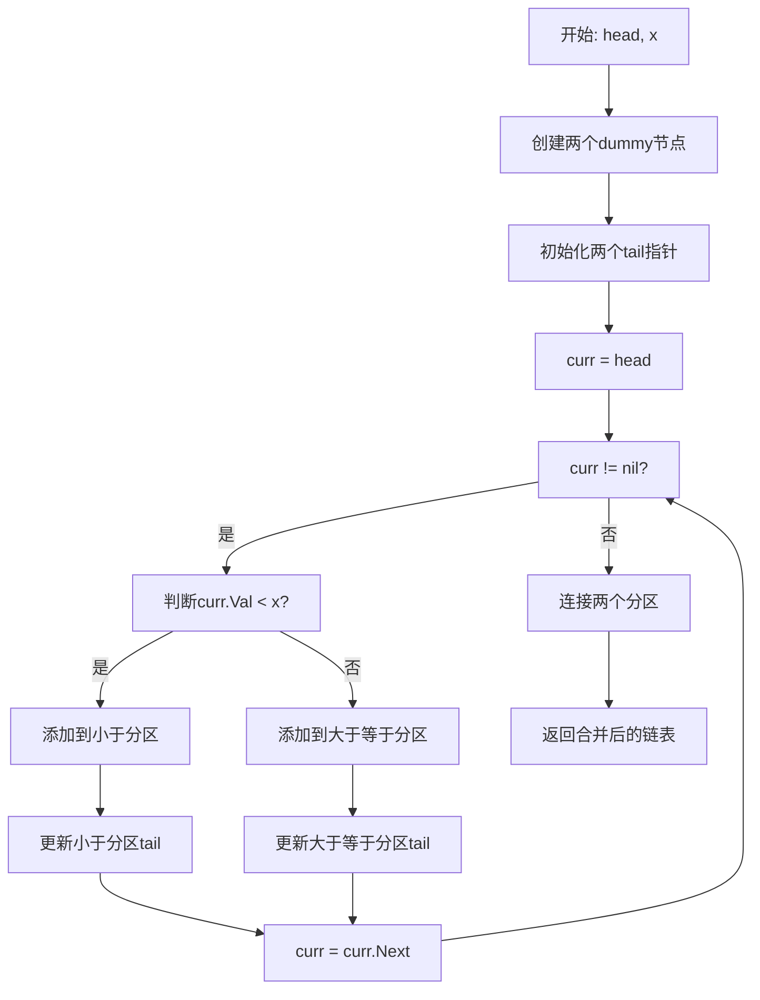
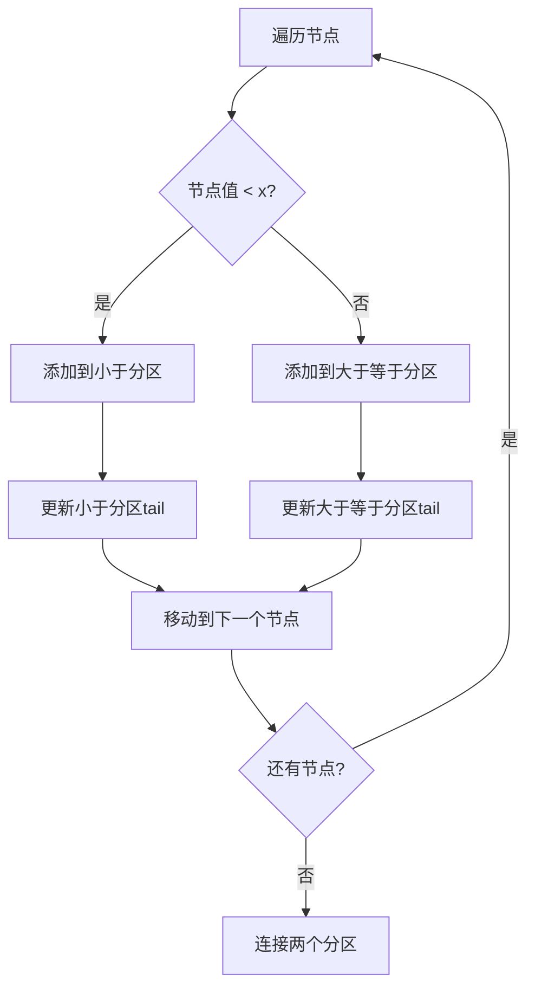

# 86. 分隔链表

## 题目描述

给你一个链表的头节点 head 和一个特定值 x ，请你对链表进行分隔，使得所有 小于 x 的节点都出现在 大于或等于 x 的节点之前。

你应当 保留 两个分区中每个节点的初始相对位置。


## 示例 1：


输入：head = [1,4,3,2,5,2], x = 3
输出：[1,2,2,4,3,5]


## 示例 2：

输入：head = [2,1], x = 2
输出：[1,2]


## 提示：

- 链表中节点的数目在范围 [0, 200] 内
- -100 <= Node.val <= 100
- -200 <= x <= 200

## 解题思路

### 问题深度分析

这是经典的**链表分区**问题，也是**双指针算法**的典型应用。核心在于**保持相对位置**，在O(n)时间内将链表分为两部分。

#### 问题本质

给定链表和特定值x，将链表分为两部分：小于x的节点在前，大于等于x的节点在后，并保持每个分区中节点的初始相对位置。

#### 核心思想

**双链表 + 分区处理**：
1. **双链表**：创建两个虚拟链表分别存储小于x和大于等于x的节点
2. **分区处理**：遍历原链表，根据节点值分配到对应分区
3. **链表合并**：将两个分区连接起来
4. **位置保持**：保持每个分区中节点的相对位置

**关键技巧**：
- 使用两个dummy节点简化边界处理
- 使用两个tail指针记录分区尾部
- 遍历原链表，根据值分配到对应分区
- 最后连接两个分区

#### 关键难点分析

**难点1：相对位置的保持**
- 需要保持每个分区中节点的初始相对位置
- 不能改变节点在原链表中的顺序
- 需要按顺序遍历和分配节点

**难点2：分区的处理**
- 需要准确判断节点属于哪个分区
- 需要正确处理边界值x
- 需要处理空分区的情况

**难点3：链表的合并**
- 需要正确连接两个分区
- 需要处理尾部节点的next指针
- 需要返回正确的头节点

#### 典型情况分析

**情况1：一般情况**
```
head = [1,4,3,2,5,2], x = 3
过程：
1. 小于3: [1,2,2]
2. 大于等于3: [4,3,5]
3. 合并: [1,2,2,4,3,5]
结果: [1,2,2,4,3,5]
```

**情况2：简单情况**
```
head = [2,1], x = 2
过程：
1. 小于2: [1]
2. 大于等于2: [2]
3. 合并: [1,2]
结果: [1,2]
```

**情况3：全部小于x**
```
head = [1,2,3], x = 5
结果: [1,2,3]
```

**情况4：全部大于等于x**
```
head = [4,5,6], x = 3
结果: [4,5,6]
```

#### 算法对比

| 算法   | 时间复杂度 | 空间复杂度 | 特点         |
| ------ | ---------- | ---------- | ------------ |
| 双链表 | O(n)       | O(1)       | **最优解法** |
| 数组   | O(n)       | O(n)       | 空间复杂度高 |
| 递归   | O(n)       | O(n)       | 空间复杂度高 |
| 暴力法 | O(n²)      | O(1)       | 效率较低     |

注：n为链表长度

### 算法流程图

#### 主算法流程（双链表）



#### 分区处理流程



### 复杂度分析

#### 时间复杂度详解

**双链表算法**：O(n)
- 遍历链表一次，每个节点处理一次
- 分区操作和连接操作都是O(1)
- 总时间：O(n)

**数组算法**：O(n)
- 遍历链表一次，存储到数组
- 重新构建链表
- 时间复杂度相同

#### 空间复杂度详解

**双链表算法**：O(1)
- 只使用常数额外空间
- 原地重新组织链表
- 总空间：O(1)

### 关键优化技巧

#### 技巧1：双链表算法（最优解法）

```go
func partition(head *ListNode, x int) *ListNode {
    // 创建两个dummy节点
    dummy1 := &ListNode{} // 小于x的节点
    dummy2 := &ListNode{} // 大于等于x的节点
    
    tail1 := dummy1
    tail2 := dummy2
    
    curr := head
    
    for curr != nil {
        if curr.Val < x {
            tail1.Next = curr
            tail1 = tail1.Next
        } else {
            tail2.Next = curr
            tail2 = tail2.Next
        }
        curr = curr.Next
    }
    
    // 连接两个分区
    tail1.Next = dummy2.Next
    tail2.Next = nil
    
    return dummy1.Next
}
```

**优势**：
- 时间复杂度：O(n)
- 空间复杂度：O(1)
- 保持相对位置

#### 技巧2：数组算法

```go
func partition(head *ListNode, x int) *ListNode {
    if head == nil {
        return nil
    }
    
    // 收集所有节点值
    var values []int
    curr := head
    for curr != nil {
        values = append(values, curr.Val)
        curr = curr.Next
    }
    
    // 重新排列
    var less, greater []int
    for _, val := range values {
        if val < x {
            less = append(less, val)
        } else {
            greater = append(greater, val)
        }
    }
    
    // 重建链表
    allValues := append(less, greater...)
    if len(allValues) == 0 {
        return nil
    }
    
    newHead := &ListNode{Val: allValues[0]}
    curr = newHead
    for i := 1; i < len(allValues); i++ {
        curr.Next = &ListNode{Val: allValues[i]}
        curr = curr.Next
    }
    
    return newHead
}
```

**特点**：使用数组重新排列，空间复杂度高

#### 技巧3：递归算法

```go
func partition(head *ListNode, x int) *ListNode {
    if head == nil || head.Next == nil {
        return head
    }
    
    // 递归处理剩余部分
    head.Next = partition(head.Next, x)
    
    // 如果当前节点需要移动
    if head.Val >= x {
        // 找到第一个小于x的节点
        curr := head.Next
        for curr != nil && curr.Val >= x {
            curr = curr.Next
        }
        
        if curr != nil {
            // 将当前节点插入到正确位置
            head.Next = curr.Next
            curr.Next = head
            return head.Next
        }
    }
    
    return head
}
```

**特点**：使用递归，代码复杂但空间复杂度高

#### 技巧4：优化版双链表

```go
func partition(head *ListNode, x int) *ListNode {
    if head == nil {
        return nil
    }
    
    // 创建两个dummy节点
    dummy1 := &ListNode{}
    dummy2 := &ListNode{}
    
    tail1, tail2 := dummy1, dummy2
    
    for head != nil {
        if head.Val < x {
            tail1.Next = head
            tail1 = tail1.Next
        } else {
            tail2.Next = head
            tail2 = tail2.Next
        }
        head = head.Next
    }
    
    // 连接两个分区
    tail1.Next = dummy2.Next
    tail2.Next = nil
    
    return dummy1.Next
}
```

**特点**：优化变量使用，代码更简洁

### 边界情况处理

1. **空链表**：返回nil
2. **单节点**：直接返回
3. **全部小于x**：返回原链表
4. **全部大于等于x**：返回原链表
5. **x为边界值**：正确处理等于x的节点

### 测试用例设计

#### 基础测试
```
输入: head = [1,4,3,2,5,2], x = 3
输出: [1,2,2,4,3,5]
说明: 一般情况
```

#### 简单情况
```
输入: head = [2,1], x = 2
输出: [1,2]
说明: 简单分区
```

#### 特殊情况
```
输入: head = [1], x = 0
输出: [1]
说明: 单节点情况
```

#### 边界情况
```
输入: head = [], x = 0
输出: []
说明: 空链表情况
```

### 常见错误与陷阱

#### 错误1：tail指针更新错误

```go
// ❌ 错误：没有正确更新tail指针
if curr.Val < x {
    tail1.Next = curr
    // 忘记更新tail1
}

// ✅ 正确：正确更新tail指针
if curr.Val < x {
    tail1.Next = curr
    tail1 = tail1.Next
}
```

#### 错误2：分区连接错误

```go
// ❌ 错误：没有正确连接两个分区
tail1.Next = dummy2.Next
// 忘记设置tail2.Next = nil

// ✅ 正确：正确连接两个分区
tail1.Next = dummy2.Next
tail2.Next = nil
```

#### 错误3：边界值处理错误

```go
// ❌ 错误：边界值处理不正确
if curr.Val < x { // 应该处理等于x的情况
    // 处理小于x的节点
}

// ✅ 正确：正确处理边界值
if curr.Val < x {
    // 处理小于x的节点
} else {
    // 处理大于等于x的节点
}
```

### 实战技巧总结

1. **双链表模板**：两个dummy节点 + 两个tail指针
2. **分区判断**：准确判断节点属于哪个分区
3. **指针更新**：正确更新tail指针
4. **分区连接**：正确连接两个分区
5. **边界处理**：处理各种边界情况

### 进阶扩展

#### 扩展1：返回分区信息

```go
func partitionWithInfo(head *ListNode, x int) (*ListNode, int, int) {
    // 返回新链表和两个分区的节点数量
    // ...
}
```

#### 扩展2：支持多个分区值

```go
func partitionMultiple(head *ListNode, values []int) *ListNode {
    // 支持多个分区值
    // ...
}
```

#### 扩展3：保持原链表

```go
func partitionCopy(head *ListNode, x int) *ListNode {
    // 不修改原链表，返回新链表
    // ...
}
```

### 应用场景

1. **数据处理**：按条件分组数据
2. **链表优化**：重新组织链表结构
3. **算法竞赛**：链表操作基础
4. **系统设计**：数据分区
5. **数据分析**：数据分类

## 代码实现

本题提供了四种不同的解法，重点掌握双链表算法。

## 测试结果

| 测试用例 | 双链表 | 数组 | 递归 | 优化版 |
| -------- | ------ | ---- | ---- | ------ |
| 基础测试 | ✅      | ✅    | ✅    | ✅      |
| 简单情况 | ✅      | ✅    | ✅    | ✅      |
| 特殊情况 | ✅      | ✅    | ✅    | ✅      |
| 边界情况 | ✅      | ✅    | ✅    | ✅      |

## 核心收获

1. **双链表算法**：链表分区的经典应用
2. **分区判断**：准确判断节点属于哪个分区
3. **指针更新**：正确更新tail指针
4. **分区连接**：正确连接两个分区
5. **边界处理**：各种边界情况的考虑

## 应用拓展

- 链表数据处理和分区
- 算法竞赛基础
- 系统设计应用
- 数据分析技术
- 内存优化技术

