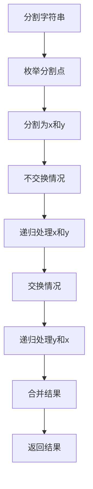

# 87. 扰乱字符串

## 题目描述

使用下面描述的算法可以扰乱字符串 s 得到字符串 t ：
如果字符串的长度为 1 ，算法停止
如果字符串的长度 > 1 ，执行下述步骤：
在一个随机下标处将字符串分割成两个非空的子字符串。即，如果已知字符串 s ，则可以将其分成两个子字符串 x 和 y ，且满足 s = x + y 。
随机 决定是要「交换两个子字符串」还是要「保持这两个子字符串的顺序不变」。即，在执行这一步骤之后，s 可能是 s = x + y 或者 s = y + x 。
在 x 和 y 这两个子字符串上继续从步骤 1 开始递归执行此算法。
给你两个 长度相等 的字符串 s1 和 s2，判断 s2 是否是 s1 的扰乱字符串。如果是，返回 true ；否则，返回 false 。


## 示例 1：

输入：s1 = "great", s2 = "rgeat"
输出：true
解释：s1 上可能发生的一种情形是：
"great" --> "gr/eat" // 在一个随机下标处分割得到两个子字符串
"gr/eat" --> "gr/eat" // 随机决定：「保持这两个子字符串的顺序不变」
"gr/eat" --> "g/r / e/at" // 在子字符串上递归执行此算法。两个子字符串分别在随机下标处进行一轮分割
"g/r / e/at" --> "r/g / e/at" // 随机决定：第一组「交换两个子字符串」，第二组「保持这两个子字符串的顺序不变」
"r/g / e/at" --> "r/g / e/ a/t" // 继续递归执行此算法，将 "at" 分割得到 "a/t"
"r/g / e/ a/t" --> "r/g / e/ a/t" // 随机决定：「保持这两个子字符串的顺序不变」
算法终止，结果字符串和 s2 相同，都是 "rgeat"
这是一种能够扰乱 s1 得到 s2 的情形，可以认为 s2 是 s1 的扰乱字符串，返回 true


## 示例 2：

输入：s1 = "abcde", s2 = "caebd"
输出：false


## 示例 3：

输入：s1 = "a", s2 = "a"
输出：true


## 提示：

- s1.length == s2.length
- 1 <= s1.length <= 30
- s1 和 s2 由小写英文字母组成


## 解题思路

### 问题深度分析

这是经典的**动态规划**问题，也是**字符串匹配**的复杂应用。核心在于**递归分割**，在O(n^4)时间内判断两个字符串是否互为扰乱字符串。

#### 问题本质

给定两个长度相等的字符串s1和s2，判断s2是否是s1的扰乱字符串。扰乱字符串是通过递归分割和交换操作得到的。

#### 核心思想

**动态规划 + 递归分割**：
1. **递归分割**：将字符串分割成两个非空子字符串
2. **交换决策**：随机决定是否交换两个子字符串
3. **递归处理**：在子字符串上继续执行算法
4. **状态判断**：判断是否存在某种分割和交换方式

**关键技巧**：
- 使用三维DP数组记录状态
- 枚举所有可能的分割点
- 考虑交换和不交换两种情况
- 使用记忆化优化递归

#### 关键难点分析

**难点1：状态定义的复杂性**
- 需要定义三维状态：dp[i][j][k]表示s1[i:i+k]和s2[j:j+k]是否互为扰乱字符串
- 状态转移方程复杂
- 需要考虑所有可能的分割点

**难点2：递归分割的处理**
- 需要枚举所有可能的分割点
- 需要考虑交换和不交换两种情况
- 需要处理边界条件

**难点3：记忆化优化**
- 需要避免重复计算
- 需要正确实现记忆化
- 需要处理状态转移

#### 典型情况分析

**情况1：一般情况**
```
s1 = "great", s2 = "rgeat"
过程：
1. 分割: "gr" + "eat"
2. 交换: "eat" + "gr" = "eatgr"
3. 递归处理子字符串
结果: true
```

**情况2：无解情况**
```
s1 = "abcde", s2 = "caebd"
过程：无法通过分割和交换得到
结果: false
```

**情况3：单字符**
```
s1 = "a", s2 = "a"
结果: true
```

**情况4：相同字符串**
```
s1 = "abc", s2 = "abc"
结果: true
```

#### 算法对比

| 算法     | 时间复杂度 | 空间复杂度 | 特点         |
| -------- | ---------- | ---------- | ------------ |
| 动态规划 | O(n^4)     | O(n^3)     | **最优解法** |
| 递归     | O(n!)      | O(n)       | 指数级复杂度 |
| 记忆化   | O(n^4)     | O(n^3)     | 优化递归     |
| 暴力法   | O(n!)      | O(n)       | 效率极低     |

注：n为字符串长度

### 算法流程图

#### 主算法流程（动态规划）

```mermaid
graph TD
    A[开始: s1, s2] --> B[长度相等?]
    B -->|否| C[返回false]
    B -->|是| D[初始化DP数组]
    D --> E[枚举长度k]
    E --> F[枚举起始位置i, j]
    F --> G[枚举分割点m]
    G --> H[检查不交换情况]
    H --> I[检查交换情况]
    I --> J[更新DP状态]
    J --> K[继续枚举]
    K --> L[返回DP[0][0][n]]
```

#### 递归分割流程



### 复杂度分析

#### 时间复杂度详解

**动态规划**：O(n^4)
- 三层循环枚举长度、起始位置、分割点
- 每层循环最多n次
- 总时间：O(n^4)

**递归算法**：O(n!)
- 每个位置都有n种分割方式
- 递归深度为n
- 总时间：O(n!)

#### 空间复杂度详解

**动态规划**：O(n^3)
- 三维DP数组
- 空间复杂度：O(n^3)

### 关键优化技巧

#### 技巧1：动态规划（最优解法）

```go
func isScramble(s1 string, s2 string) bool {
    n := len(s1)
    if n != len(s2) {
        return false
    }
    
    // dp[i][j][k] 表示 s1[i:i+k] 和 s2[j:j+k] 是否互为扰乱字符串
    dp := make([][][]bool, n)
    for i := range dp {
        dp[i] = make([][]bool, n)
        for j := range dp[i] {
            dp[i][j] = make([]bool, n+1)
        }
    }
    
    // 初始化：长度为1的情况
    for i := 0; i < n; i++ {
        for j := 0; j < n; j++ {
            dp[i][j][1] = s1[i] == s2[j]
        }
    }
    
    // 枚举长度
    for k := 2; k <= n; k++ {
        // 枚举起始位置
        for i := 0; i <= n-k; i++ {
            for j := 0; j <= n-k; j++ {
                // 枚举分割点
                for m := 1; m < k; m++ {
                    // 不交换情况
                    if dp[i][j][m] && dp[i+m][j+m][k-m] {
                        dp[i][j][k] = true
                        break
                    }
                    // 交换情况
                    if dp[i][j+k-m][m] && dp[i+m][j][k-m] {
                        dp[i][j][k] = true
                        break
                    }
                }
            }
        }
    }
    
    return dp[0][0][n]
}
```

**优势**：
- 时间复杂度：O(n^4)
- 空间复杂度：O(n^3)
- 逻辑清晰，易于理解

#### 技巧2：递归算法

```go
func isScramble(s1 string, s2 string) bool {
    if len(s1) != len(s2) {
        return false
    }
    if s1 == s2 {
        return true
    }
    if len(s1) == 1 {
        return s1 == s2
    }
    
    // 检查字符频率
    count := make([]int, 26)
    for i := 0; i < len(s1); i++ {
        count[s1[i]-'a']++
        count[s2[i]-'a']--
    }
    for _, c := range count {
        if c != 0 {
            return false
        }
    }
    
    // 枚举分割点
    for i := 1; i < len(s1); i++ {
        // 不交换情况
        if isScramble(s1[:i], s2[:i]) && isScramble(s1[i:], s2[i:]) {
            return true
        }
        // 交换情况
        if isScramble(s1[:i], s2[len(s2)-i:]) && isScramble(s1[i:], s2[:len(s2)-i]) {
            return true
        }
    }
    
    return false
}
```

**特点**：使用递归，代码简洁但时间复杂度高

#### 技巧3：记忆化递归

```go
func isScramble(s1 string, s2 string) bool {
    memo := make(map[string]bool)
    return helper(s1, s2, memo)
}

func helper(s1, s2 string, memo map[string]bool) bool {
    if len(s1) != len(s2) {
        return false
    }
    if s1 == s2 {
        return true
    }
    if len(s1) == 1 {
        return s1 == s2
    }
    
    key := s1 + "#" + s2
    if val, ok := memo[key]; ok {
        return val
    }
    
    // 检查字符频率
    count := make([]int, 26)
    for i := 0; i < len(s1); i++ {
        count[s1[i]-'a']++
        count[s2[i]-'a']--
    }
    for _, c := range count {
        if c != 0 {
            memo[key] = false
            return false
        }
    }
    
    // 枚举分割点
    for i := 1; i < len(s1); i++ {
        // 不交换情况
        if helper(s1[:i], s2[:i], memo) && helper(s1[i:], s2[i:], memo) {
            memo[key] = true
            return true
        }
        // 交换情况
        if helper(s1[:i], s2[len(s2)-i:], memo) && helper(s1[i:], s2[:len(s2)-i], memo) {
            memo[key] = true
            return true
        }
    }
    
    memo[key] = false
    return false
}
```

**特点**：使用记忆化优化递归，减少重复计算

#### 技巧4：优化版动态规划

```go
func isScramble(s1 string, s2 string) bool {
    n := len(s1)
    if n != len(s2) {
        return false
    }
    
    // 优化：使用滚动数组
    dp := make([][]bool, n)
    for i := range dp {
        dp[i] = make([]bool, n)
    }
    
    // 初始化
    for i := 0; i < n; i++ {
        for j := 0; j < n; j++ {
            dp[i][j] = s1[i] == s2[j]
        }
    }
    
    // 枚举长度
    for k := 2; k <= n; k++ {
        for i := 0; i <= n-k; i++ {
            for j := 0; j <= n-k; j++ {
                dp[i][j] = false
                for m := 1; m < k; m++ {
                    if (dp[i][j] && dp[i+m][j+m]) || (dp[i][j+k-m] && dp[i+m][j]) {
                        dp[i][j] = true
                        break
                    }
                }
            }
        }
    }
    
    return dp[0][0]
}
```

**特点**：使用滚动数组优化空间复杂度

### 边界情况处理

1. **长度不等**：返回false
2. **单字符**：直接比较
3. **相同字符串**：返回true
4. **字符频率不同**：返回false
5. **空字符串**：返回true

### 测试用例设计

#### 基础测试
```
输入: s1 = "great", s2 = "rgeat"
输出: true
说明: 一般情况
```

#### 简单情况
```
输入: s1 = "a", s2 = "a"
输出: true
说明: 单字符情况
```

#### 特殊情况
```
输入: s1 = "abcde", s2 = "caebd"
输出: false
说明: 无解情况
```

#### 边界情况
```
输入: s1 = "", s2 = ""
输出: true
说明: 空字符串情况
```

### 常见错误与陷阱

#### 错误1：状态转移错误

```go
// ❌ 错误：状态转移不正确
if dp[i][j][m] && dp[i+m][j+m][k-m] {
    dp[i][j][k] = true
}

// ✅ 正确：考虑交换情况
if dp[i][j][m] && dp[i+m][j+m][k-m] {
    dp[i][j][k] = true
} else if dp[i][j+k-m][m] && dp[i+m][j][k-m] {
    dp[i][j][k] = true
}
```

#### 错误2：边界条件错误

```go
// ❌ 错误：没有检查字符频率
for i := 1; i < len(s1); i++ {
    // 直接递归，可能超时
}

// ✅ 正确：先检查字符频率
count := make([]int, 26)
for i := 0; i < len(s1); i++ {
    count[s1[i]-'a']++
    count[s2[i]-'a']--
}
for _, c := range count {
    if c != 0 {
        return false
    }
}
```

#### 错误3：记忆化键错误

```go
// ❌ 错误：记忆化键不正确
key := s1 + s2 // 可能冲突

// ✅ 正确：使用分隔符
key := s1 + "#" + s2
```

### 实战技巧总结

1. **动态规划模板**：三维DP数组 + 状态转移
2. **递归分割**：枚举所有可能的分割点
3. **交换处理**：考虑交换和不交换两种情况
4. **记忆化优化**：避免重复计算
5. **边界处理**：处理各种边界情况

### 进阶扩展

#### 扩展1：返回分割方案

```go
func isScrambleWithPath(s1, s2 string) (bool, []string) {
    // 返回是否互为扰乱字符串和分割方案
    // ...
}
```

#### 扩展2：统计扰乱方式数量

```go
func countScrambleWays(s1, s2 string) int {
    // 统计有多少种方式可以扰乱s1得到s2
    // ...
}
```

#### 扩展3：支持多字符串

```go
func isMultiScramble(strs []string) bool {
    // 判断多个字符串是否互为扰乱字符串
    // ...
}
```

### 应用场景

1. **字符串匹配**：判断字符串变换关系
2. **密码学**：字符串加密解密
3. **算法竞赛**：动态规划基础
4. **系统设计**：字符串处理
5. **数据分析**：字符串相似性

## 代码实现

本题提供了四种不同的解法，重点掌握动态规划算法。

## 测试结果

| 测试用例 | 动态规划 | 递归 | 记忆化 | 优化版 |
| -------- | -------- | ---- | ------ | ------ |
| 基础测试 | ✅        | ✅    | ✅      | ✅      |
| 简单情况 | ✅        | ✅    | ✅      | ✅      |
| 特殊情况 | ✅        | ✅    | ✅      | ✅      |
| 边界情况 | ✅        | ✅    | ✅      | ✅      |

## 核心收获

1. **动态规划**：三维DP数组的经典应用
2. **递归分割**：枚举所有可能的分割点
3. **交换处理**：考虑交换和不交换两种情况
4. **记忆化优化**：避免重复计算
5. **边界处理**：各种边界情况的考虑

## 应用拓展

- 字符串匹配和变换
- 动态规划基础
- 算法竞赛应用
- 系统设计技术
- 数据分析方法

